# Database_W2_Database Modeling

+ What is Big Data?
  - 빅데이터는, "스몰 데이터" 와 비슷해 보이지만, 데이터 양이 훨씬 많다 . 
  - 너무 데이터가 큰 나머지, 스몰 데이터와는 다른 방식으로 접근해야 한다. 
  - 새로운 문제를 해결하기 위해서나, 이미 있는 문제를 더 나은 방식

## Characteristics of Big Data

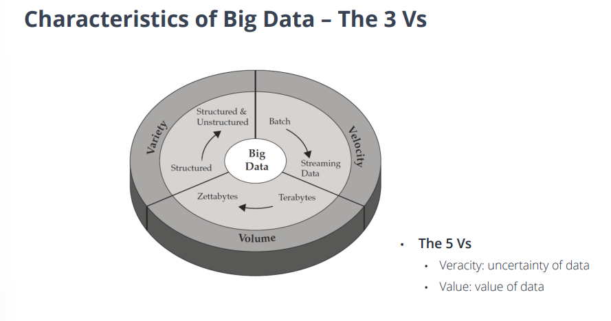

+ Variety , Velocity , Volume 이 유기적으로 빅데이터를 이룬다고 생각하면 된다고 한다. 

+ Volume
  - Data 크기가 기하급수적으로 커지고 있음(하루에 쌓이는 양이 수십 TB)

+ Velocity
  - 데이터가 쌓이는 속도 자체도 되게 빨라지고 있음. 
  - 쓸만한(Useful) 정보들은 그때그때 추출해야 함. 그렇지 않으면 그 정보들의 의미가 사라질 수 있다. 
  
+ Variety
  - 단 하나의 어플만 하더라도, 많은 타입의 데이터를 만들어내고 저장할 수 있다. 
  - 문제들은 그냥 단순히 저장되고 효율적으로 관리될 뿐만 아니라, 데이터 분석, 데이터 마이닝에도 많이 사용된다. 
  - 이런 타입의 데이터들이 다 링크되어 있으면, 정보를 추출하는데 훨씬 더 많은 도움이 된다. 
  
+ Veracity(진실성)
  - 데이터는 분석하기에 의미있는 데이터여야 한다. 
  - 가장 크게 신경써야 할 부분은, "데이터를 깨끗하게 관리" 하는 것이다. 
  - "더 큰 데이터는 언제나 더 좋은가?"
  - 노이즈, 이상 있어 보이는 데이터에서도 의미 있는 데이터를 찾을 수 있다.

## Data Science & Database

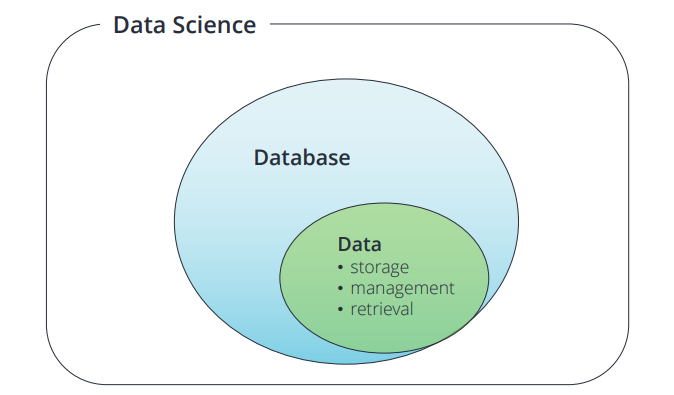

+ Data Science
  - 과학적인 방법이나 프로세스, 알고리즘 및 시스템을 사용하여, 많은 구조형 데이터 혹은 비정형 데이터에서 지식을 추출하는 학제 간(inter-disciplinary) 분야이다.
  - 데이터 과학은, 데이터 마이닝, 머신러닝, 빅데이터 에 연관되어 있다. 
  - 데이터 사이언스나 데이터 베이스는 데이터 없이는 존재할 수 없기 때문에, raw data 에서부터 시작해야 한다.
  - 이벤트(발생) / 데이터 수집, 전처리 / 분석 / 정보 순으로 일이 이루어진다. 
    - 데이터 수집, 전처리 에는 각각 웹크롤링, 데이터베이스가 활용된다
    - 분석에는 통계,머신러닝,시각화가 활용된다. 

## Database System 

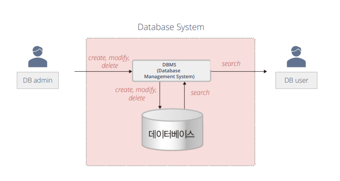

+ 기본 정의 
  - Data : 기록되고, 의미를 지닐 수 있는 Fact.
  - Mini-world : 데이터가 DB에 저장되는 실제 "환경" 의 일부
    - ex) 대학의 학생 성적, 성적 증명서
    
  - DBMS(Database Management System) : 전산화 된 데이터베이스의 생성 및 유지보수를 용이하게 하는 소프트웨어 패키지/시스템
  - Database System : 데이터와 DBMS 소프트웨어가 함께 있는 System. Application 이 포함되기도 한다. 

+ DB Technology 에서 Database 의 영향력이 닿는 곳
  - Business : 뱅킹,보험,리테일,운송,헬스케어,생산 등
  - Service Industries :  금융, 부동산, 법률, 전자상거래, 작은 비즈니스 등
  - Education : 컨텐츠 자원
  - 최근에는 SNS, 환경이나 과학 관련 프로그램, 약물, 유전 등 에 사용되기도 한다.
  - 개인 프로그램 : 스마트 기기에 많이 활용된다. 
  
+ Database 의 정의
  - __컴퓨터에 저장된, 구조화된 데이터들의 집합.__
  - 특히 다양한 방법으로 접근할 수 있는 데이터들의 집합이기도 하다.
  - 다른 타입들의 데이터셋 사이에서의 관계로 나타내지기도 한다.
  
+ Data
  - Raw Data
    - 수정 없는 원본 소스에서 수집된 데이터
    - 직접적으로 분석해서 데이터를 추출하기는 힘들다. 
  
  - Processed Data
    - 구조화되고 정규화 되어, 계산에 사용할 수 있다.
    - 그러나 분류되어 있지는 않다. (저장에 비효율적이다)
    
  - Dataset
    - 데이터가 서로 다른 view로 정렬되거나, 카탈로그화 되어 있다.
    - (다른 측면들의)View 에서, 여러가지 다른 계산을 수행할 수 있다.
    
  - Database
    - 데이터 관리 효율성을 극대화하기 위해, 분류화되어 있는 데이터가 서로 어떻게 관련되어 있는지 정보를 제공한다. 
    - Computation cost가 최적화되어 있다 
    - Bore data , Meta data 를 관리
    
## Database | Data Models

+ Database model 
  - 여러 종류의 데이터셋을 연결하고, 표현하는 방법에 대한 DB의 논리 체계
  - Heterogeneous data model
    - 다른 종류의 데이터셋을 한 테이블에 표현
  - Relational Data Model
    - 다른 종류의 데이터셋을, 다른 테이블로 각각 분해하고 ID 값으로 연결하여 표현
    
## Database | Heterogeneous Data Model

+ 다른 종류의 데이터셋을 같이 표현하는 데이터 모델

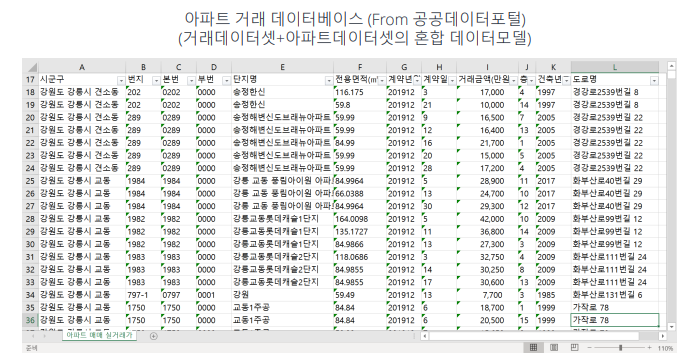

## Database | Relational Data Model

+ 다른 종류의 데이터셋을 각각 분해하고, ID로 연결하는 데이터 모델

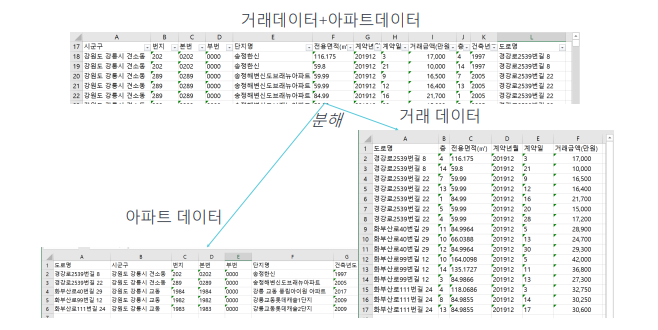

+ Database | Example-Transactional DB(거래내역)

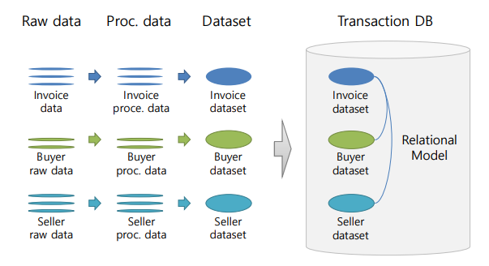

## Databases System

+ About Using General Software
  - 작은 데이터를 관리할 때는, 엑셀이나 텍스트 에디터 같은 것들을 사용할 수 있다.
  - 하지만, 데이터베이스 급을 관리할 때 일반적인 SW로 관리하면,
    - 데이터가 유효한 형식인지 체크하기 어렵다. 
    - Data Integrity(데이터 통합성,통합 잘되는지) / Data Consistency(데이터 공유성)
    - ex) Data Integrity Check : 날짜 데이터는 모두 동일한 형식으로 표기돼야 한다.
    - ex) Consistency of Data : 회원가입 데이터에서 회원 아이디는 고유해야 한다.
    
  - 데이터베이스는 여러 명의 유저가 사용해야 유용하게 사용할 수 있다.
    - About Managing Multiple Users
      - 데이터베이스에 대한 여러 사람이 접속해 작업할 수 있어야 하는 문제
      - ex) 구글 스프레드시트는, 사용자가 수동적으로 다른 사람이 글 쓴것을 확인해야 함.
    
    - Security Issues
      - 역할에 다라 사용자의 권한을 다르게 부여해야 하는 문제
      - ex) 온라인 쇼핑에서, 일반 회원이 다른 회원의 가입정보에 접근 할 수 없도록 제한해야 함.
      
+ DB System | Database Management System(DBMS)
  - DBMS 는, DB의 데이터를 저장,검색,정의 및 관리하기 위해 설계된 소프트웨어이다.
  - DBMS 를 통해서만 관리자/사용자가 데이터에 접근하거나 수정할 수 있다.
  - DBMS 는 기본적으로 DB 와 최종 유저, 혹은 유저 프로그램 간의 인터페이스 역할을 한다. 
  - 그래서 데이터가 일관되게 구성되고 쉽게 접근할 수 있도록 한다.
  
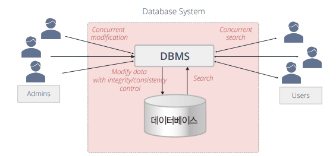

+ Simplified Database System Environment

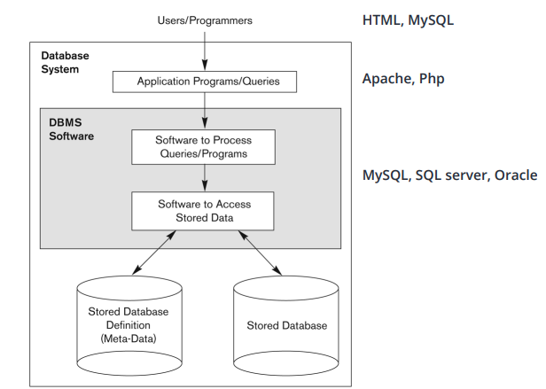

+ Typical DBMS Functionality(일반적인 DBMS 기능)
  - 데이터 유형, 구조 및 제약조건에 따라 특정 DB 정의
  - 보조 저장매체(Secondary Storage Medium) 에 초기 DB 내용 만들거나 로딩하기
  - DB 조작
    - 검색 : 쿼리문 입력, report 생성 등
    - 수정 : 내용에 대한 삽입, 삭제 및 업데이트
    - 웹앱을 통한 DB 접근
    - 동시에 사용자나 프로그램들의 요청이나 공유를 처리하며, 모든 데이터를 일관되게 유지해 준다.

## DB에 대한 앱(프로그램) 작업

+ 앱은 데이터베이스와 상호작용할 수 있다
  - 쿼리문 날리기 : 데이터의 다른 부분에 접근하고, 요청의 결과를 다시 띄운다.
  - Transaction(상호작용) : 일부 데이터를 읽고, 특정 값을 업데이트 하거나, 새 데이터를 생성하여 DB에 저장할 수 있다. 
  
+ 어플리케이션은, 권한이 없는 사용자가 데이터에 접근하는 것을 허용하지 않는다. 
+ 어플리케이션은, DB에 대한 사용자 요구사항 변화에 대응해야 할 필요가 있다. 

## 추가적인 DBMS 기능

+ 무단 액세스를 방지하지 위한 보호 및 보안조치
+ 데이터 내부작업을 수행하는 "Active" 프로세싱
+ 데이터 보여주기/시각화
+ DB 와 관련 프로그램 실행 동안 DB 및 관련 프로그램 유지관리
  - DB, 소프트웨어 및 시스템 유지관리라고 부른다. 

## DB Example(Conceptual(개념) 데이터 모델 사용)

+ 예시 :  Mini-world
  - 대학 환경의 일부
  
+ Mini-world Entities :  
  - STUDENTs
  - COURSEs
  - SECTIONs
  - DEPARTMENTs
  - INSTRUCTORs
  
+ Mini-world 에서의 관계(Relationships)
  - SECTION(수업) 은 COURSE 중 일부이다.
  - STUDENT 는 SECTION 을 수강해야 한다
  - COURSE 중에는 "필수" COURSE 가 존재한다. 
  - INSTRUCTOR 는 SECTION 을 가르쳐야 한다.
  - COURSE 는 DEPARTMENT(학부) 에서 제공된다
  - STUDENT 는 DEPARTMENT(학과,학부) 를 전공한다.
  
+ 만들어진 DB 예시

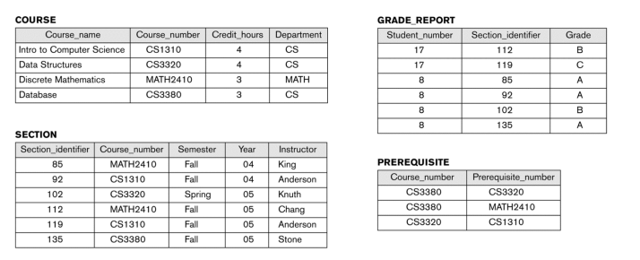

## Main Characteristics of the Database Approach(데이터 베이스 접근에 있어서 주요한 특성)

+ DB 시스템의 자체 기술(self-describing) 특성
  - DBMS Catalog는 특정 DB에 대한 설명(메타데이터)을 저장한다
    - DB 구조, 유형 및 제약조건 같은것들
    - 메타데이터가 있으면 DBMS Software 가 다른 DB 응용프로그램과 함께 작동할 수 있다. 

+ 프로그램과 데이터 사이에서의 보호 작용
  - 프로그램과 데이터의 독립(program-data independence) 이라고 부르기도 한다
  - DBMS 액세스 프로그램을 변경하지 않고도, 데이터 구조와 어떻게 저장되어 있는지의 구성을 변경할 수 있다. (프로그램과 데이터가 서로 종속적이지 않다. 따로따로 컨트롤 가능하다. )
  
+ Database Catalog 예시

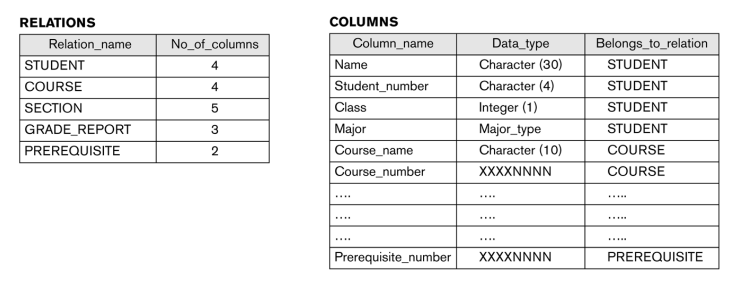

## ER Model Concepts

+ Entity : DB에서의 특정 사물 또는 객체
  - 특정 Entity 는 각 속성에 대한 값을 가진다.
  - ex) EMPLOYEE John Smith , the Research DEPARTMENT, the ProductX PROJECT
  - 독립된 존재로써, 실제적인 것을 표현하기 좋다. 
    - 물리적으로 존재하는것(사람, 차, 집 등등)
    - 개념적으로 존재하는것(직업, 항공편 등)
  - __다른 것과 구별하기 위해, 대문자로 모두 쓴다.__
  
+ Attributes(속성) : Entity를 설명하기 위해 쓰이는 값
  - 각 Attribute 는 그것을 나타내는 value set(혹은 data type) 이 있다. 
    - integer,string,date,enum 등
    
  - ex) EMPLOYEE Entity 는 Name, SSN, Address, Sex, Birthdate 등의 Attribute를 가진다. 
  - Entity의 특정 값들을 표현하기 좋다
    - Single-valued
    - Multi-valued
    - Stored-Derived
    - Simple(세부 부분으로 나눌 수 없는) attribute
    - Composite(세부 부분으로 나눌 수 있는) attribute
  
## Types of Attributes
  
+ Simple
  - 각 entity 가 더이상 나눌 수 없는 value들을 Attribute로 가지고 있는 경우
  - ex) SSN, Sex
    
+ Composite
  - Attribute가 여러 개의 component로 이루어 질 수 있는 경우
    - ex) Address : 아파트/집/~길/도시/~도/code/나라) 
    - ex2) Name : 성/이름
  
  - Composition 은 일부 Component 자체가 복합적으로 계층을 형성할 수 있다. 
  
+ Multi-Valued
  - Entity 는 해당 속성에 대해 여러 개의 값을 가질 수 있다. 
    - ex) 차의 색상, 특정 학생의 이전 성적
    - {Color} 나 {PreviousDegrees} 와 같이 표현할 수도 있다. 
    
+ Stored Attributes VS Derived Attributes 
  - Stored Attributes : 값이 처음부터 기록되어 있는 Attribute
  - Derived Attributes : 기록된 Attribute 에서부터, 값이 도출될 수 있는 Attribute
  - ex1) Birth_date(Stored) vs Age(Derived)
  - ex2) DEPARTMENT entity 의 직원숫자(Derived)
  
+ Complex Attributes
  - Composite(복합) Attribute 와 Multivalued(다중 값) Attribute 가 섞인 것.
  - ex) Address_Phone
  
## Entity Types, Entity Sets & Keys

+ Entity 타입 : 같은 속성들을 가진 Entity 들의 collection

+ __Key Attribute__
  - 단 하나만 있는 value를 가져야 함.(다른 tuple과 중복된 값을 가질 수 없음)
  - 하나의 값만 있는 Attribute 도 되고, 여러 개의 Attribute 도 되지만, 반드시 그 중 최소한으로 값을 가져야 한다. (하지만, 그래도 하나 이상의 값은 되어야 한다)
  
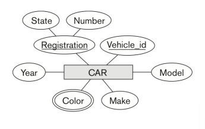

+ 키 속성은 복합적일 수도 있다
  - Registration 은, Number 와 State 를 가지는 CAR entity type의 Key Attribute 이다.

+ Entity Type 은 하나보다 더 많은 Key 를 가질 수도 있다.
  - CAR Entity 타입은 두개의 Key를 가지고 있다. 
    - Vehicle_id
    - Registration(Number, State)
    
+ 각 Key Attribute 는 밑줄 그어져 있다. (하나의 "Primary Key" 만 밑줄 그어져 있는 Relational Schema 하고는 다른 부분이다.)

## Entity Set

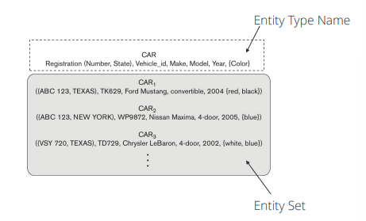

+ 각 Entity 타입은, DB 에 저장된 Entity Collection 이 있다
  - 여기서 말하는 Entity 타입은, Table을 의미하는 것이다. 
  - Entity Collection 은, 각 tuple을의 Collection 을 의미하는 것이다. 
  - Entity Collection 은 Entity Set 이라고도 불린다.
  
+ CAR 는 Entity Type으로도, Entity Set 으로도 쓰이기도 한다.(그림)
  - 하지만, Entity Type과 Entity Set 은 다른 이름으로 사용해야 한다.
  - Entity Set 은 Entity 들의 현재 저장된 tuple 들을 말한다. 

## Value Sets(Domains) of Attributes

+ Domains
  - 각 simple Attribute 들은, value set(값이 모여 있는 집합)과 연결되어 저장된다. 
  - ex) Last Name 은, 15자 이내의 string 값을 가진다 
  - ex2) Date 는 MM-DD-YYYY 식으로 저장되며, 각 letter 는 정수 값을 가진다. 
  
+ Value Set은, 그 Attribute 와 연결되는 값들의 집합들에 맞아 떨어지게 지정되어 저장된다. 

+ Value Set 은, 대부분의 프로그래밍 언어에서 지정되는 data type 과 유사하다. 

+ 수학적으로, Value Set V 를 가지는 Entity E 의 Attribute A 는
  - A : E -> P(V) 로 정의할 수 있다. 
  - P(V) 는 V의 Power Set(모든 가능한 부분집합의 집합) 이다. 
  - entity e 의 Attribute A 를 A(e) 로 표현할 수 있다. 
  
## Displaying an Entity Type

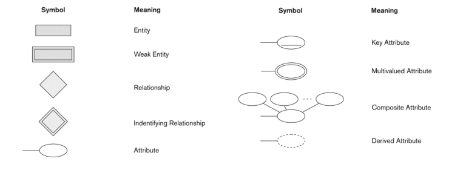

+ ER 다이어그램에서, Entity Type은 정사각형 박스로 보인다
+ Attribute 는 타원형으로 보인다 
  - 각 Attribute 는 해당 Entity Type 과 연결되어 있다. 
  - Composite(복합) Attribute 의 구성요소는, Composite Attribute 를 나타내는 타원형에 연결된어 표기된다. 
  - 각 Key Attribute 들은 밑줄 그어져 있다. 
  - Multivalued Attribute 는 이중 타원으로 표시되어 있다. 

## Relationship and Relationship Types

+ Relationship 은, 두개나 그 이상의 entity 를, 특정한 의미를 가지고 연결짓는 것이다.
  - EMPLOYEE John Smith 는, PROJECT ProductX 를 하고 있다.
  - EMPLOYEE Franklin Wong 은 Research DEPARTMENT 의 관리자이다. 
  
+ Relationship 은 ㄷㄱ     
