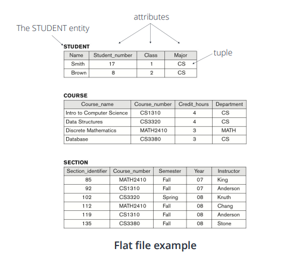
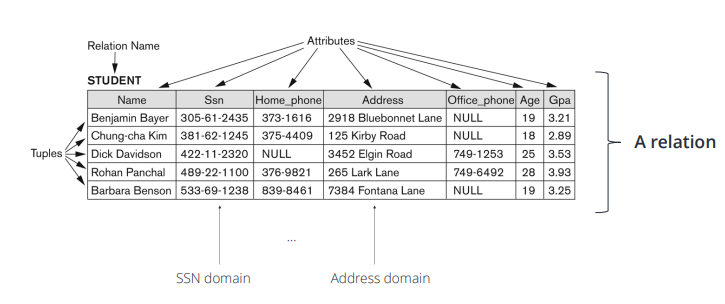
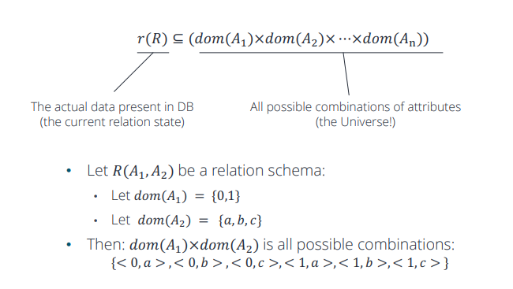
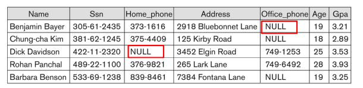

# Database_W3. The Relational Data Model and Relationaal Database Contraints

+ 관계형 데이터모델과 관계형 DB의 제약사항

## About Definition

+ __Relational Model__ : Database 는 Relation 의 모음으로 나타낼 수 있다.

+ __Flat File__
  - 행렬로 만들어지는 simple text file
  - 각 행은, Entity Type __Tuple__ 객체 하나를 나타낸다
  - 각 열은, 그 Entity를 설명하는 Attribute 하나를 나타낸다 
  - 각 Attribute (Column) 의 각 값은, 특정 __Domain__ 에서 가져온다.

+ __Domain__
  - 하나의 Domain D는, 원자 값(분해할 수 없는 값 또는 복합적이지 않는 값) 의 집합이다.
  - 각 도메인에는 고유한 Type 또는 Pool 이 있다.
  - __Entity 의 Attribute 이 가질 수 있는 값들의 집합이다.__
  - __두 속성의 도메인이 같다는 것은, 두 속성의 데이터 타입과 길이가 같다는 것을 의미한다__
  - Domain 에서의 데이터 타입은 정해져 있다
    - Home_Phone(Domain) 의 format 이 ddd-dddd 로 정해져 있다.

  - 실질적으로, C언어의 typedef 으로 선언할 수 있는 변수이름이라고 생각해도 좋다.
  
#### Domain 은 데이터 타입으로써의 정의라고 받아들여야 한다!

+ __Tuple__
  - Tuple 은, __순서가 있는__ 데이터들의 집합이다. 
  - 각 value는, 각각의 Domain(어떤 Attribute 값인지) 다 매칭되어서 들어간다. 
  - ex)
    - <632895,"John Smith","101 Main St. Atlanta, GA 30332"> 
    - 각각 번호, 이름, 주소를 나타낸다.
  - Relation 이라고 하는 것은, 이런 Tuple 들의 집합으로 나타날 수도 있다.

+ Relation 의 Key
  - 각 Tuple 하나하나는, 그 tuple 하나가 가질 수 있는, 각각이 가지는 고유한 ID를 가질 수 있다.
    - 이것을 보고 Key 라고 한다.
    - STUDENT Table 에서, Key는 SSN 이 될 수 있다
  
  - 한 tuple 이 생성될때마다, 연속적인 숫자가 자동할당되어서 Key로 동작할 수도 있다
    - 이런 것을 보고 Artificial Key, Surrogate Key 라고 부른다. 

+ __Relation Schema__
  - 여기서 말하는 Relation :  Attribute 와 Entity 가지는 관계(종속적)
  - Schema : DB나 Relation 에서, 자료의 구조나 표현방법, 자료 간의 관계를 "형식 언어" 로 정의한 "구조"
  - Relation Schema : Attribute 와 Entity 사이의 관계 에서의 Schema(자료 간의 관계를 정의한 구조)
  - 여기서, 다른 Attribute 가 같은 Domain 을 가질 수는 있다
    - 나이와 사람 숫자는 똑같은 Domain(데이터 타입) 을 가질 수 있다.

+ Relation Scheme R 표기법
  - R(A1,A2,...,An)
  - ex) : STUDENT(Name,SSN,Home_Phone,Address,Office_Phone,Age,GPA)
  - R 은 이렇게 Table 이름으로 나타낼 수 있다. 
  - 각 A1부터 An 까지는 Attribute 각각으로 나타낼 수 있다
  - 각 Attribute Ai 는, Relation(Table) R 에서, Domain D(데이터 타입) 을 가지고 한 객체 안에서 값을 표기할 수 있는 값이다.
  - D 는 Ai(Attribute) 의 Domain 이며, dom(Ai) 로 표기되기도 한다. 
  - R 은 Relation 의 이름이다(STUDENT 같은)
  - Relation 의 Degree 는, 속성의 갯수로 나타낼 수 있다. 

+ 실질적인 표기 : 순서대로 쭉 나타낸다(index 같은 애들은, 다 같은 Attribute로 매칭)

+ Relation State r (소문자) 
  - Relation(혹은 Table) R 에서의 Tuple 들의 Set(집합) 을 small 'r' 로 나타냄.
  - 전체 집합이 아닐수도 있다. 특정 조건을 만족하는 부분집합일수도 있다. 
  - 각 튜플 t는, v1,v2,...,vn 을 순서에 맞게 값을 가지는 tuple 이다. 
  - 각 value(값) v1,v2...,vn 은, dom(Ai) 의 요소이며, NULL 값이 들어갈 수도 있다
    - 그냥 쉽게 말하면, 그 Domain(Column) 안에 있는 값 중에 하나라는 말이 된다.
    - 그냥 진짜 테이블 안의 '값'

  - t[Ai] = 하나의 튜플 객체 안의 i번째 value. Attritube Ai 에 대응되는 '값'(value)

  - Domain n 개를 가지는 'relation' (tuple) 의 집합이다.

## Characteristics of Relations

+ Tuple 들은, 각 객체 중에 뭐가 먼저오든 크게 상관없다. 
  - 그냥 집합에서 {1,2,3} = {2,3,1} 이 같은것과 같은 이치다. 

+ 하지만, 파일은 디스크에 순서를 가지고 저장된다. 
  - 이게 file과 relation 의 차이.

+ 하지만 튜플 내에서는 순서대로 나타내야함.
  - 각 튜플 내에서의 값은, atomic(복합 값이나 여러 값을 가질 수 있는것이 아닌) value 여야 한다.
  - Multivalue 일 수 있는 Attribute 은, relation 을 분리해서 나타내야 한다. 
  - 복합(Composite) Attribute 은, 간단한 form 으로 새로 나타낼 수 있다. 
  - NULL 값은, 그 튜플에는 적용할 수 없는 값이거나, 알지 못하는 값일 때 준다. 
    - 알수없음/값이 존재하지만 표기할 수 없음/해당 attribute 가 거기에 적용될 수 없을때/정의되지 않은 값일때
    - 위의 경우에 NULL을 사용한다

+ NULL Example
  - 어떤 student 는 Office 가 없으니, Office_Phone Attribute 가 NULL 일 수 있다.
  - 어떤 Student 는 집이 있지만, 그 집에 전화기를 안둬서 Home_Phone 이 NULL 일 수 있다.
    - 혹은 그냥 안적어놓을 수도 있다.

## Relational Model Notation

+ Relation Schema 표기 : R(A1,A2,...,An)
+ Relation(Table) 이름 : 대문자 Q,R,S
+ Relation States : 소문자 q,r,s
  - 그 Relation(Table) 에서의 tuple 객체의 집합!(혹은 부분집합)
+ Tuples : t,u,v 로 표기
+ Attributes : R.A(ex : STUDENT.name) 으로 표기
+ n-tuple t의 내용물 표기 : t = <v1,v2,...,vn>, v 는 A 값.

## Relational Model Constraints(제약조건)

+ Implicit Constraints(암묵적인 제약조건)
  - 개발자가 따로 설정해주지 않아도 무조건 있는 제약조건.
  - Model 에 내재된 제약조건
  - ex) Table 은 중복된 Tuple 을 가질 수 없다.

+ Explicit Constraints(명시적 제약조건)
  - Schema 에 직접 표현되는 제약조건
  - ex) max 와 Cardinality Ratio 는 ER Model 에 직접적으로 명시될 수 있는 제약조건이다. 
  
+ Semantic Constraints(혹은 강한 선언(Assertions))
  - Schema 로, 명시적으로 표현될 수 없는 제약조건
  - Application 에 의해 표현되어야 한다. 

+ Data Dependencies
  - 함수나 multivalue 값의 종속성 - RDB 설계의 "적합성" 을 테스트하고, 정규화(normalization) 에 사용된다.
  
## Relational Integrity Constraints
 
+ Relation(Table) 에서 "무결성"(Integrity) 제약조건
  - 제약 조건은, 모든 유효한(valid) Relational State(Tuple 집합) 이 유지해야 하는 조건이다.
 
+ 제약조건의 Type
  - Key Constraints(Key 제약조건)
  - Entity Integrity Constraints(Entity 무결성 제약조건)
  - Referential Integrity Constraints(참조 무결성 제약조건)
  - 다른 schema-based 제약조건은 __domain 제약조건(Domain Constraint)__이다
    - ex) Tuple 안에 있는 모든 값은, 해당 attribute 의 domain 안에서의 값이어야 한다
    - 허용된 경우라면 NULL 값은 들어갈 수 있다.
    
    
## Key Constraints(Key 제약조건)

+ 중복성을 피하기 위해, Database 는 두개의 튜플이 완전히 같은 value들을 갖는 것을 혀용하지 않는다. 
+ 이러한 제약조건은, SuperKey(SK) 값의 특정 부분집합에 대해서도 지정할 수 있다. 
  - Table 안에 있는 모든 Tuple 은, 각각 고유한 Superkey Combination 을 가질 수 있고, 서로 중복된 SuperKey를 가질 수 없다. 
    
+ Superkey 는 
