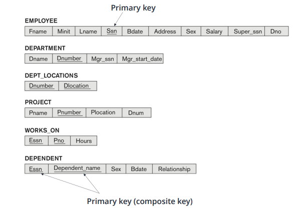

# Database_W3. The Relational Data Model and Relationaal Database Contraints

+ 관계형 데이터모델과 관계형 DB의 제약사항

## About Definition

+ __Relational Model__ : Database 는 Relation 의 모음으로 나타낼 수 있다.

+ __Flat File__
  - 행렬로 만들어지는 simple text file
  - 각 행은, Entity Type __Tuple__ 객체 하나를 나타낸다
  - 각 열은, 그 Entity를 설명하는 Attribute 하나를 나타낸다 
  - 각 Attribute (Column) 의 각 값은, 특정 __Domain__ 에서 가져온다.

+ __Domain__
  - 하나의 Domain D는, 원자 값(분해할 수 없는 값 또는 복합적이지 않는 값) 의 집합이다.
  - 각 도메인에는 고유한 Type 또는 Pool 이 있다.
  - __Entity 의 Attribute 이 가질 수 있는 값들의 집합이다.__
  - __두 속성의 도메인이 같다는 것은, 두 속성의 데이터 타입과 길이가 같다는 것을 의미한다__
  - Domain 에서의 데이터 타입은 정해져 있다
    - Home_Phone(Domain) 의 format 이 ddd-dddd 로 정해져 있다.

  - 실질적으로, C언어의 typedef 으로 선언할 수 있는 변수이름이라고 생각해도 좋다.
  
#### Domain 은 데이터 타입으로써의 정의라고 받아들여야 한다!

+ __Tuple__
  - Tuple 은, __순서가 있는__ 데이터들의 집합이다. 
  - 각 value는, 각각의 Domain(어떤 Attribute 값인지) 다 매칭되어서 들어간다. 
  - ex)
    - <632895,"John Smith","101 Main St. Atlanta, GA 30332"> 
    - 각각 번호, 이름, 주소를 나타낸다.
  - Relation 이라고 하는 것은, 이런 Tuple 들의 집합으로 나타날 수도 있다.

+ Relation 의 Key
  - 각 Tuple 하나하나는, 그 tuple 하나가 가질 수 있는, 각각이 가지는 고유한 ID를 가질 수 있다.
    - 이것을 보고 Key 라고 한다.
    - STUDENT Table 에서, Key는 SSN 이 될 수 있다
  
  - 한 tuple 이 생성될때마다, 연속적인 숫자가 자동할당되어서 Key로 동작할 수도 있다
    - 이런 것을 보고 Artificial Key, Surrogate Key 라고 부른다. 

+ __Relation Schema__
  - 여기서 말하는 Relation :  Attribute 와 Entity 가지는 관계(종속적)
  - Schema : DB나 Relation 에서, 자료의 구조나 표현방법, 자료 간의 관계를 "형식 언어" 로 정의한 "구조"
  - Relation Schema : Attribute 와 Entity 사이의 관계 에서의 Schema(자료 간의 관계를 정의한 구조)
  - 여기서, 다른 Attribute 가 같은 Domain 을 가질 수는 있다
    - 나이와 사람 숫자는 똑같은 Domain(데이터 타입) 을 가질 수 있다.

+ Relation Scheme R 표기법
  - R(A1,A2,...,An)
  - ex) : STUDENT(Name,SSN,Home_Phone,Address,Office_Phone,Age,GPA)
  - R 은 이렇게 Table 이름으로 나타낼 수 있다. 
  - 각 A1부터 An 까지는 Attribute 각각으로 나타낼 수 있다
  - 각 Attribute Ai 는, Relation(Table) R 에서, Domain D(데이터 타입) 을 가지고 한 객체 안에서 값을 표기할 수 있는 값이다.
  - D 는 Ai(Attribute) 의 Domain 이며, dom(Ai) 로 표기되기도 한다. 
  - R 은 Relation 의 이름이다(STUDENT 같은)
  - Relation 의 Degree 는, 속성의 갯수로 나타낼 수 있다. 

+ 실질적인 표기 : 순서대로 쭉 나타낸다(index 같은 애들은, 다 같은 Attribute로 매칭)

+ Relation State r (소문자) 
  - Relation(혹은 Table) R 에서의 Tuple 들의 Set(집합) 을 small 'r' 로 나타냄.
  - 전체 집합이 아닐수도 있다. 특정 조건을 만족하는 부분집합일수도 있다. 
  - 각 튜플 t는, v1,v2,...,vn 을 순서에 맞게 값을 가지는 tuple 이다. 
  - 각 value(값) v1,v2...,vn 은, dom(Ai) 의 요소이며, NULL 값이 들어갈 수도 있다
    - 그냥 쉽게 말하면, 그 Domain(Column) 안에 있는 값 중에 하나라는 말이 된다.
    - 그냥 진짜 테이블 안의 '값'

  - t[Ai] = 하나의 튜플 객체 안의 i번째 value. Attritube Ai 에 대응되는 '값'(value)

  - Domain n 개를 가지는 'relation' (tuple) 의 집합이다.

## Characteristics of Relations

+ Tuple 들은, 각 객체 중에 뭐가 먼저오든 크게 상관없다. 
  - 그냥 집합에서 {1,2,3} = {2,3,1} 이 같은것과 같은 이치다. 

+ 하지만, 파일은 디스크에 순서를 가지고 저장된다. 
  - 이게 file과 relation 의 차이.

+ 하지만 튜플 내에서는 순서대로 나타내야함.
  - 각 튜플 내에서의 값은, atomic(복합 값이나 여러 값을 가질 수 있는것이 아닌) value 여야 한다.
  - Multivalue 일 수 있는 Attribute 은, relation 을 분리해서 나타내야 한다. 
  - 복합(Composite) Attribute 은, 간단한 form 으로 새로 나타낼 수 있다. 
  - NULL 값은, 그 튜플에는 적용할 수 없는 값이거나, 알지 못하는 값일 때 준다. 
    - 알수없음/값이 존재하지만 표기할 수 없음/해당 attribute 가 거기에 적용될 수 없을때/정의되지 않은 값일때
    - 위의 경우에 NULL을 사용한다

+ NULL Example
  - 어떤 student 는 Office 가 없으니, Office_Phone Attribute 가 NULL 일 수 있다.
  - 어떤 Student 는 집이 있지만, 그 집에 전화기를 안둬서 Home_Phone 이 NULL 일 수 있다.
    - 혹은 그냥 안적어놓을 수도 있다.

## Relational Model Notation

+ Relation Schema 표기 : R(A1,A2,...,An)
+ Relation(Table) 이름 : 대문자 Q,R,S
+ Relation States : 소문자 q,r,s
  - 그 Relation(Table) 에서의 tuple 객체의 집합!(혹은 부분집합)
+ Tuples : t,u,v 로 표기
+ Attributes : R.A(ex : STUDENT.name) 으로 표기
+ n-tuple t의 내용물 표기 : t = <v1,v2,...,vn>, v 는 A 값.

## Relational Model Constraints(제약조건)

+ Implicit Constraints(암묵적인 제약조건)
  - 개발자가 따로 설정해주지 않아도 무조건 있는 제약조건.
  - Model 에 내재된 제약조건
  - ex) Table 은 중복된 Tuple 을 가질 수 없다.

+ Explicit Constraints(명시적 제약조건)
  - Schema 에 직접 표현되는 제약조건
  - ex) max 와 Cardinality Ratio 는 ER Model 에 직접적으로 명시될 수 있는 제약조건이다. 
  
+ Semantic Constraints(혹은 강한 선언(Assertions))
  - Schema 로, 명시적으로 표현될 수 없는 제약조건
  - Application 에 의해 표현되어야 한다. 

+ Data Dependencies
  - 함수나 multivalue 값의 종속성 - RDB 설계의 "적합성" 을 테스트하고, 정규화(normalization) 에 사용된다.
  
## Relational Integrity Constraints
 
+ Relation(Table) 에서 "무결성"(Integrity) 제약조건
  - 제약 조건은, 모든 유효한(valid) Relational State(Tuple 집합) 이 유지해야 하는 조건이다.
 
+ 제약조건의 Type
  - Key Constraints(Key 제약조건)
  - Entity Integrity Constraints(Entity 무결성 제약조건)
  - Referential Integrity Constraints(참조 무결성 제약조건)
  - 다른 schema-based 제약조건은 __domain 제약조건(Domain Constraint)__이다
    - ex) Tuple 안에 있는 모든 값은, 해당 attribute 의 domain 안에서의 값이어야 한다
    - 허용된 경우라면 NULL 값은 들어갈 수 있다.
    
    
## Key Constraints(Key 제약조건)

+ 중복성을 피하기 위해, Database 는 두개의 튜플이 완전히 같은 value들을 갖는 것을 혀용하지 않는다. 
+ 이러한 제약조건은, SuperKey(SK) 값의 특정 부분집합에 대해서도 지정할 수 있다. 
  - Table 안에 있는 모든 Tuple 은, 각각 고유한 Superkey Combination 을 가질 수 있고, 서로 중복된 SuperKey를 가질 수 없다. 

+ Superkey
  - 각 튜플이 가지고 있는 Superkey SK는 서로 고유하여, 두 튜플이 완전히 같은 SK 내용물을 가질 수 없다. 
  - 모든 relation(tuple) 은 최소한 하나의 superkey 를 가진다.
  - Superkey 는 2개 이상의 Attriburte 를 가질 수 있다.
    
+ Superkey 는 Attribute 를 여러개 가질 수 있기 때문에, 서로 중복되지 않는 Key를 갖는 것이 더 유용하다. 

+ Key 의 두 특성
  - 두 다른 튜플은, key에서 서로 같은 값을 가질 수 없다. 
  - Minimal superkey - Superkey 내의 Attribute 를 제거할 수 없는 상태이고, 고유성(Key 로써 튜플을 구별할 수 있는) 제약조건이 유지되어야 함. 
    - 그냥 Key 는, 최소한의 Attribute 를 유지하면서, ID의 역할도 할 수 있어야 한다.
  
  - 그럼 Key 는 Superkey 인가? : Yes(고유하기만 하면 된다~)
  - Superkey 는 Key 인가? : NOT Always True(불필요하게 Attribute 가 많으면, key 라고 할 수 없다.)
  
+ Key 와 Supekey 예시
  - Key : STUDENT.Ssn 이 될수있다. 어떤 두 STUDENT 라도 같은 Ssn 을 가지지는 않는다
  - Superkey : STUDENT.{Ssn, Name, Age}, STUDENT.{Ssn, Address}, STUDENT.{Ssn, Name}
  - 차이점 ? : Minimal 조건이 없다. 
  
+ Relation Schema 는 여러 Key를 가질 수 있다.
  - 여러 Key 들이 있을 때, 이것들을 보고 후보 키(Candidate Key) 라고 부른다
  - ex) CAR(License_number, Engine_serial_number, Make, Model, Year)
    - Key1 : {License_number}
    - Key2 : {Engine_serial_number}
    - 두 개 다 CAR 의 superkey 이면서, 모든 CAR tuple 에서 그 튜플의 고유한 값이다.
  
  - 편리함을 위해서, 하나만 Primary Key 로 지정한다 
    - 하나의 Primary Key 에만 밑줄 그어 관리한다 
    - 가장 simple 하면서도, 정보를 확실하게 관리할 수 있는 key를 Primary Key 로 지정한다. 
    
## Relational Database Schema

+ Relation(Table) 의 Schema 의 집합 S 는, 그냥 그 DB에 들어 있는 것이다.
+ 전체 DB Schema 의 이름이 S가 될 것이다.
+ S = {R1,R2...,Rn} 과 무결성 제약조건의 집합이 RDB의 Schema 이다.

+ COMPANY RDB Schema 설명
  - Ssn 과 Super_Ssn 은 같은 데이터 타입을 가지지만, 다른 이름을 가지고 있음
    - Attribute 이름이, 해당 Attribute 가 어떤 역할을 하는지 알려준다
    
  - 같은 Concept 의 Attribute는, 각 Relation 에서 서로 다른 이름을 가질 수 있다.
    - Dnumber = Dno = Dnum
    
+ RDB State
  - RDB State 는, RDB Snapshot 이라고 불리기도 한다.
  - DB State(내용물들) 이 제약조건을 다 만족하고 있으면 Valid State 이고, 아니면 Invalid State 이다.

## Integrity Constraints(IC)

+ Integrity Constraints(무결성 제약조건)
  - 무결성 제약조건은 DB Schema도 만족해야 하며, 모든 유효현 Database State(내용물) 들이 다 만족해야 함.
  - 무결성 제약조건에는 두가지 Main Type 이 있다.
    - Entity Integrity(Entity 무결) : 각 Entity 들이 다 무결성 제약조건을 만족해야 함
    - Referential Integrity(참조 무결성) : Entity 사이의 Relation 사이에서의 무결성 제약조건

+ Entity Integrity 
  - DB Schema S 내의 각 Relation Schema R 에서, Primary Key Attribute PK 는 그 어떤 Tuple 에서도 NULL 값을 가져서는 안된다.
    - 왜냐면 PK 값으로 각 개별 Tuple 들을 구별하기 때문이다.
    - PK 가 만약에 여러 Attribute를 가지고 있는 상태라면, 해당 Attribute 값 중 어느 하나라도 NULL 값을 가질 수 없다. 
    
+ Referential Integrity(참조 무결성)
  - 두 Relation(Table) 사이에서의 제약조건이다 
  - 두 Relation(Table) 에서 Tuple 간의 Consistency 을 유지하기 위해 사용된다고 한다.
    - Consistency : 일관성, 일치성, 양립함, 조화
  
  - 이렇게 참조하는 키를 보고 Foreign Key 라고 부른다 

+ Foreign Key 의 공식적인 정의
  - Relation R1,R2 에서, R1 에서의 FK Attribute 들의 집합은, R2의 Foreign Key 이다.
  - 이때 아래 조건들을 모두 만족해야 함
    - FK Attribute 는, R2 에서의 Primary Key Attribute 와 같은 Domain 조건을 가져야 함.
    - 튜플 t1에서의 FK 값은, R2 에서의 t2 안에도 존재해야 함. 아니면 아예 t1에서의 FK 값이 NULL 값이어야 함.(t1[FK] = t2[PK])
      
  - R1을 보고 Referencing(참조하는) Relation 이라고 함
  - R2를 보고 Referenced(참조받는) Relation 이라고 함.
  
+ Referential Integriry(참조 무결성) 제약조건 예시

+ 이런 참조무결성, Entity 무결성 제약조건은 SQL 과 같은 DDL(Data Definition Language) 에서 지정될 수 있다.
  
## Other Types of Constraints(다른 타입의 제약조건들)

+ Semantic Integrity Constraints(DDL 에 속하지 않음)
  - ex) EMPLOYEE 의 최대 일할 수 있는 시간은 주당 52시간이다.
  - 이런건 따로 설정해 줘야 한다.

+ Constraint Specification(제약조건 명시) 언어는 이런 것들을 설정하는데 사용된다.
  - CREATE TRIGGER 나 CREATE ASSERTION 으로, 이런 "semantic" 제약조건을 설정할 수 있다.
  - Key, NULL 허용, 후보키, 외래키, 참조무결성 등은 CREATE TABLE 로 표현 가능하다.

+ Transition Constraints(DDL 에 속하지 않음)
  - DB의 상태(state) 를 바꾸는 제약조건
  - EMPLOYEE 봉급(salary) 는 오로지 오르기만 할 수 있다. (내려갈 수 없다)
  
## DB Operations

+ 검색 (SELECT) 
  - DB 내의 정보는, 검색해서 알아낼 수 있다.
  - 검색해도 내부정보는 안바뀐다

+ 업데이트 (INSERT, DELETE, MODIFY)
  - DB 내의 정보가 처리되어 바뀔 수 있다.
  - 한쪽에 업데이트 하는것이, 다른 테이블의 정보를 자동으로 바꿀 수도 있다(외래키 걸린 경우)
  - Update 처리는 무결성을 만족할 수 있게 체크되면서 해야한다.
  
+ INSERT 에서의 가능한 위반사항
  - Domain constraints : Attribute 값을 넣을 때, 도메인 범위 밖의 값을 넣어서는 안된다. 
  - Key Constraints :  Attribute 값을 넣을 때, 그 Relation 에서 고유하지 못할 Key 값을 넣어서는 안된다.
  - Entity Integrity : 새로운 Primary Key 값은 NULL 이 될 수 없다. 
  - Referential Integrity : Insert 하는 Attribute 값이 외래키인데, 참조할 Relation 에서의 그에 상응하는 Tuple 이 존재하지 않아서는 안 된다.
  
  - 만약에 이런 Insert violation 에 걸리면, 해당 insert 명령어를 거부하고 왜 reject 되었는지 알려준다.

+ DELETE 에서 가능한 위반사항
  - Referential Integrity 하나만 걸려있다
    - 만약에 지우는 tuple 에서, 다른 tuple 이 참조하고 있는 foreign key 가 걸려있으면 안된다.
  
  - DELETE Violation 이 일어나면
    - 해당 명령어를 거부하고
    - DB에서 참조하고 있는 Tuple을 같이 삭제해, 삭제 작업이 연쇄적으로 이루어질 수 있다.
    - Set NULL : 그냥 참조하고 있는 외래키 의 값을 NULL 로 지정하거나, 기존에 약속된 default value로 바꿀 수 있다.
    
+ Update 에서 가능한 위반사항(Violation)
  - Attribute 를 업데이트할 때, Primary Key 나 Foreign Key를 건드리지만 않으면 문제가 발생하지 않는다. 
  - Primary Key 를 업데이트 하는 것은, 그 튜플 자체를 지우고 새로 그자리에 다른 튜플을 넣는 것과 같은 것이라고 생각해도된다. 
    - 모든 Entity 와 참조무결성을 새로 다 체크해야 한다.
  
  - Foreign Key를 업데이트 할 때는, 참조하는 테이블의 어떤 튜플에 그 값이 존재하는지를 봐야 한다.
  
+ Transcation Concept
  - Transaction : 그냥 DB 명령어 포함하는 프로그램을 실행시키는것. 그냥 DB조작이다
    - SELECT, INSERT, DELELE, UPDATE 등등
  
  - 끝에는, 반드시 DB를 Valid State로 만들어 놓고 끝내야 한다.
  - 하나의 Transaction(실행) 이라도, 그 안에는 검색이나 업데이트 명령어가 여러 개 섞여있을 수 있다.
  - "Tom Smith" 는 100달러를 자기 은행계좌에서 빼고 싶을때
    - transaction 은 한번, DB 명령어는 검색한번, 수정한번. 2번.
    
## ER-to-Relational Mapping

+ ER Model 을 토대로, Relational Model 을 만들어 매핑하는 과정

+ 해야 할 일
  - 모든 정보를 저장(Attribute 포함)
  - 최대한 제약조건을 유지하기
    - ex) Relational Model : Relational Model 은 ER Model 에서의 모든 제약조건을 모두 보존해서 진행할 수는 없다.
    - 1 : 10 과 같은 Max Cardinality Ratio 의 경우, Relational Model 에서는 보존해서 진행하기 힘들다. 
    - 하위 유형을 철저하게 분리해서 진행한다
    - ex) STUDENT 는 국내 학생 및 외국 학생으로 분리할 수 있다.
    
  - NULL 값을 최소화해 보기.
  

+ Step 1 :  Regular Entity Type 매핑하기
  - ER Schema 의 각 Strong Entity Type E 에서, 모든 E 의 Attribute를 포함하는 Relation(Table Attribute) 을 만든다
  - E 의 Key Attribute 중에 Primary Key 를 설정한다.
  - 만약 E의 키 중 선택한 것이 복합(Composite) Key 이면, R 에서는 Attribute 2개 이상을 묶어서 Primary Key 로 만들어야 한다. 
  
+ Step 2 : Weak Entity Type 매핑하기
  - Owner Entity Type E 에 종속되는 각 Weak Entity Type W 각각을, Relation R로 만들고 그 안에 W의 Attribute 를 다 집어넣는다. 
  - Owner Entity Type 의 외래키와, Weak Entity Type 의 Primary Key 를 다 매칭되게 만들어 둔다.

+ Step 3 : Relation Type 
