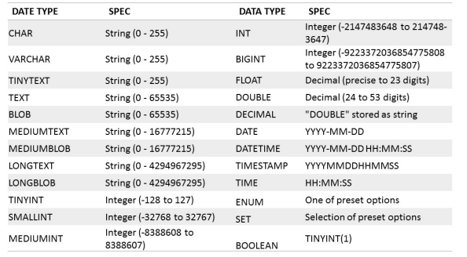
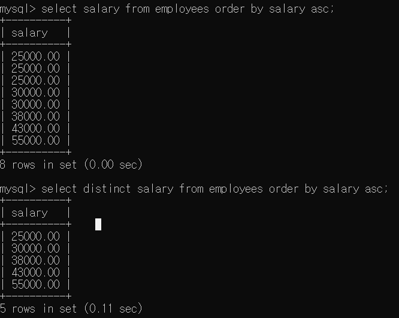

# Database_W4. Basic SQL

+ Structued Query Language(SQL)
  - Declarative(서술문처럼 쓴다)
  - DDL(Data Definition Language) 과 DML(Data Manipulation Language) 를 포함한다.
  - 거의 표준이다.

## Implementing the Design Process using DML, DDL, DCL, TCL

|Type|Commands|Description|
|-------|-----|----------|
|DML(Data Manipulation Language)|SELECT|정보검색|
||INSERT,UPDATE,DELETE|Data를 DB에서 수정한다|
|DDL(Data Definition Language)|CREATE,ALTER,DROP,RENAME,TRUNCATE|schama 나 제약조건을 만들거나 수정함.|
|DCL(Data Control Language)|GRANT, REVOKE|DB 접근권할을 유저에게서? 유저에게로? 바꾼다|
|TCL(Transaction Control Language|COMMIT,ROLLBACK,SAVEPOINT|데이터 수정의 logical flow를 컨트롤한다|

# MySQL | The CREATE Statement

+ Data 정의를 위해 사용하는 기본적인 SQL 명령어
  - Database, schema, table, view, assertion, trigger 등을 다 만들수 있다.

+ MySQL 에서는 DB 나 Schema(table) 를 CREATE 를 사용해서 만들 수 있다

+ 이럴 때 쓴다
  - 이름과, Attribute(속성) 과, 데이터 타입을 줄때
  - 제약조건 명시 : Attribute, 튜플, 키, 참조무결성(외래키)

+ Syntax 
```
CREATE TABLE [IF NOT EXISTS] table_name (
  (create_definition,....)
  [table_options]
  [partition_options]);
```

+ Example
```
CREATE TABLE EMPLOYESS(
    Fname VARCHAR(100) NOT NULL,
    Minit VARCHAR(100),
    Lname VARCHAR(100) NOT NULL,
    SSN CHAR(9) NOT NULL,
    Bdate DATE,
    Address VARCHAR(255),
    Sex CHAR,
    Salary DECIMAL(10,2),
    Super_ssn CHAR(9),
    Dno INT,
    PRIMARY KEY (SSN)
  );
```

+ CREATE TABLE Command
  - 기본적인 Table 만들때
    - Relation(테이블) 과 튜플이 실제적으로 만들어져서 DBMS 에 저장된다.
  - 가상 Relation(View)
    - CREATE VIEW 문을 통해서 만들어진다. 물리적으로 어떤 파일이 만들어지는게 아니다.

## Specifying Domains or UDTs(User Data Types)

+ 몇몇 DBMS 프로그램에서는, 유저가 자기만의 Domain 과 User Defined Types(UDT) 정의할 수도 있다.
+ 하지만, MySQL은 그런거없다

+ Domain
  -  이름을 Attribute 사항과 함께 쓴다
  -  여러 Attribute 에 사용되는 Domain 의 데이터 타입을 쉽게 바꿀 수 있다.
    - 그냥 그 Domain 을 (ex) VARCHAR 대신에 써놓고, 나중에 Domain 쪽 하나만 바꿔 놓으면 한방에 변경가능하다는 의미.
  
  - 그 Schema 의 가독성을 높여준다
  - EX) CREATE DOMAIN __SSN_TYPE__ AS CHAR(9)

+ TYPE
  - User Defined Types(UDTs) 는 객체지향 Application 에서 지원된다.
  ```
  CREATE TYPE PERSON AS OBJECT (
    Name  VARCHAR(30),
    Ssn   VARCHAR(9)
    );
  ```
  
### MySQL Built-in Data Types



## Specifying Constraints in SQL

+ SQL 에서 제약조건 설정하기

+ Basic Constraints(기본 제약조건)
  - Key Constraint : primary key는 고유해야 한다 
  - Entity Integrity Constraint : Primary Key는 NULL 일수 없다
  - Referential Integrity Constraints : 외래 키는 반드시 기존에 있는 다른쪽의 Primary Key를 참조해야 한다.

+ Attribute 의 Default 값
  - DEFAULT <value>
  - 특정 Attribute 에는 NOT NULL 과 같이, NULL을 허용하지 않을 수도 있다.
  
+ CHECK 문
  - Table을 만들 때 제약조건을 더해서 넣을 수 있다.
  - ex ) Dnumber INT NOT NULL CHECK (Dnumber > 0 AND Dnumber < 21)
                                                              
## Specifying Keys

+ Key 설정하기

+ PRIMARY KEY 절
  - 하나 혹은 더 많은 Attribute 를, 해당 Relation 에서 Primary Key로 설정할 수 있다.
  - ex ) Dnumber INT PRIMARY KEY;

+ UNIQUE 절
  - 대체할 수 있는 secondary key를 설정한다.
    - Relational Model 에서 후보키인 것들을 설정한다 
                                                                  
  - ex ) Dname VARCHAR(15) UNIQUE;
                                                                                                                                   
+ FOREIGN KEY 절
  - 기본적으로 세팅된 Operation : 위반조건을 어겼을 때 업데이트를 막는 것
  - 참조 Triggered Action 절 붙이기
    - SET NULL, CASCADE, SET DEFAULT 중 하나 쓸수 있다
    - SET NULL 과 SET DEFAULT 는 DBMS 에서 DELETE와 ON UPDATE 할 때 처리된다.
    - CASCADE 옵션은 "Relationship" Relation 에 맞는 옵션이다.
    
## Table 만들고, 세팅하기

#### 선언하기
```
CREATE TABLE DEPARTMENT(
  Dname VARCHAR(15) NOT NULL,
  Dnumber INT NOT NULL,
  Mgr_ssn CHAR(9) DEFAULT '888665555',
  Mgr_start_date DATE,
  PRIMARY KEY (Dnumber),
  UNIQUE (Dname)
  );
```

#### Foreign Key 넣기

```
ALTER TABLE DEPARTMENT ADD FOREIGN KEY (Mgr_ssn) REFERENCES EMPLOYEE (Ssn) 
ON DELETE SET NULL ON UPDATE CASCADE
```

+ constraint(제약조건) 에 이름을 안붙여주면, MySQL은 자동으로 여기에 이름을 붙인다
  - 제약조건에 이름붙여서 더 가독성 좋게 하자
  
```
ALTER TABLE DEPARTMENT ADD CONSTRAINT 'fk_mgr_ssn_employee_ssn' FOREIGN KEY (Mgr_ssn)
REFERENCES EMPLOYEE (Ssn) ON DELETE SET NULL ON UPDATE CASCADE
```

## Validating Attribute Values of Tuples

+ 각 tuple 의 제약조건을 거는 것은, CHECK 구문을 사용하는 것으로도 가능하다
  - CHECK 는 CREATE TABLE 문의 맨 끝에 넣으면 된다
  - ex) CHECK(Dept_create_date <= Mgr_start_date);
  
+ MySQL 에서는 TRIGGER 를 사용한다 

```
CREATE TRIGGER Check_salary BEFORE(or AFTER) INSERT(or UPDATE,DELETE) ON EMPLOYEE
  FOR EACH ROW
  BEGIN
    IF NEW.Salary < 100 THEN
    SIGNAL SQLSTATE '45000'
    SET MESSAGE_TEXT = 'ERROR : Salary must be aboew 100!';
  END IF;
END
```

## The INSERT, DELETE and UPDATE Statements

#### INSERT : relation(table) 에 일반적으로 tuple(row) 를 넣을 때 사용함
  - __튜플을 insert 하거나 update 할 때 모든 제약조건이 맞아야 함.__
  - 결과는 desc (TABLENAME) 으로 확인할 수 있다.
  
``` 
INSERT INTO DEPARTMENT VALUES('Headquarters',1,'888665555','1981-06-19');
```

#### UPDATE, DELETE : relation(table) 에서, 조건에 부합하는 tuple 들을 업데이트할 때 사용함

+ DELETE 는 relation 에서 tuple 을 지우는 것임.
  - 참조무결성이 반드시 성립해야함.
    - PK 가 지워지면, 그것을 참조하고있던 다른 쪽의 FK가 반드시 업데이트되어야 함.
    
  - WHERE 문이 빠지면, 그 relation 에서 모든 tuple 이 삭제된다.

```
DELETE FROM EMPLOYEE WHERE lname = 'Smith';
```

+ UPDATE 는 하나나 그 이상의 tuple 의 attribute 값을 업데이트하는데 사용한다 
  - Arithmetic(계산관련) 명령어도 사용가능하다 
  
```
UPDATE PROJECT SET Plocation = 'Bellarie' , dnum = 5 WHERE Pnumber = 10;

UPDATE EMPLOYEE SET Salary = Salary * 1.2 WHERE Dno = 4;

UPDATE EMPLOYEE SET Salary = Salary * 1.5 WHERE Dno IN (SELECT Dnumber FROM DEPARTMENT WHERE Dname = 'Research');

```

### Basic Retrieval Queries in SQL 

+ SQL 에서의 기본 검색 쿼리

+ SELECT STATEMENT
  - DB에서 정보검색을 위한 기본적인 구문
  - Table 로 결과가 나온다
  - SQL 에서는 기본적으로 SELECT 문에 중복을 허용한다 
    - Tupid-id 가 key로써 동작할 수 있음
    - Relational Model 이 아니기 때문(그냥 검색임. Relational Model은 완전히 집합(set) 이라서, 중복이 허용되지 않는다)
    - Multiset or bag behavior
    
    
```
SELECT <attributes> FROM <tables> WHERE <conditions>;

SELECT Essn from WORKS_ON where Hours >= 30;

SELECT Fname,Lname from WORKS_ON, EMPLOYEE where Ssn = Essn and Pno = 2;

SELECT * from EMPLOYEE where Dno = 5;
```

## Ambiguous Attribute Names

+ 모호한(다른 테이블쪽이랑 구별이 되지 않는) Attribute 이름들
  - 서로 다른 2개의 테이블에서, Attribute 이름이 같은 경우가 있다.
  - 그러므로 SELECT 문을 두 테이블을 참조한다고 했을 때 이런 모호성이 발생한다
  - relation name 으로 확실히 구별해서 지정할 수 있다.
  
```
select EMPLOYEE.Fname , address from EMPLOYEE, DEPARTMENT 
where DEPARTMENT.Dname = 'Research' and DEPARTMENT.Dnumber = EMPLOYEE.Dno
```

## Aliasing and Renaming(별칭 지정 및 이름 새로 짓기)

+ 별칭 혹은 튜플 변수
  - Alternative relation 이름을 E 나 S로 만들어서, EMPLOYEE relation 을 각각 이중으로 돌게 만들수 있다.
  - 커서를 두개 만든다고 생각하면 편하다. 
  - 이중 for 문 처럼 동작한다. 
  
```
select E.Fname, E.Lname from EMPLOYEE E, EMPLOYEE S where E.Super_ssn = S.ssn;
```

+ Attribute 이름도 새로 지정할 수 있다.
  - 아래에서는, EMPLOYEE 가 이제 변수명 E를 가지고, 그에 상응하는 Tuple 변수들을 가진 것을 볼 수 있다.
  
```
EMPLOYEE AS E(Fn,Mi,Ln,Bd,Addr,Sex,Sal,Sssn,Dno)
```

## The WHERE Clause

+ WHERE 문은 특정 원하는 튜플에 있어서는 true 가 나올 수 있는 boolean 함수처럼 만들어야 한다.
+ WHERE 문에서의 조건은 복잡한 식으로 만들 수 있다.
  - 비교 연산자 : =,>,>=,<,<=, <>
  - 논리 연산자 : AND,OR,NOT
  - 특수 연산자
    - IN
    - BETWEEN
    - LIKE
    - IS NULL
    
+ Where 절이 빠지면, 그 relation 전체를 다 출력한다. 
  - 두번째 SQL 문에서는 cross product 전체를 출력한다.
  - 

```
select Ssn from EMPLOYEE;
select Ssn, Dname from EMPLOYEE, DEPARTMENT;
```

## Tables as Sets in SQL

+ SQL 문에서 테이블을 하나의 "집합"으로 만들기

+ SQL 은 자동으로 쿼리 결과에서 중복 tuple 을 자동으로 제거해 주지는 않는다
  - 다 체크하기에는 너무 비용적인 측면에서 많이 든다. 
+ 하지만, DISTINCT 키워드를 SELECT 문에 같이 사용하면 해결할 수 있다.
  - 오직 중복값 없는 결과들만 남게된다.
  
```
select all salary from employee order by salary asc;
select distinct salary from employee order by salary asc;
```



+ Set(집합) 관련 연산자
  - UNION, EXCEPT(defference), INTERSECT
  - Multiset 연산자 : UNION ALL, EXCEPT ALL, INTERSECT ALL
  - 이러한 명령어가 유효한 결과를 낼려면, Type 호환을 맞추는 것이 필요하다.
  - UNION 문 :
    - 부득이하게 여러 개의 쿼리문을 사용하여 하나의 데이터로 출력해야 하는 경우가 존재한다. 
    - 이럴 때 사용하는 방법이 UNION 연산자이다.
    - 단순히 두 데이터를 하나로 붙일 때 사용함.
   - UNION 과 UNION ALL 의 차이
    - UNION ALL 문을 사용하면, 두 데이터가 중복되더라도 둘다 띄워준다.
    - UNION 문을 사용하면, 만약 데이터 중복이 일어났을 때 그 두개를 하나로만 띄워서 보여준다.
    - UNION ALL 문과 다르게 UNION 문은, 각 쿼리의 Column 갯수 및 명칭을 맞춰줘야 하며, 그렇지 않았을 경우 오류가 발생한다.
    

## Ordering of Query Results

+ ORDER BY 문
  - DESC는 내림차순으로 값을 정렬해 보여주는 것이다 
  - ASC는 오름차순으로 값을 정렬해 보여주는 것이다
  - 주로 쿼리문 맨 끝에다가 넣는다. 

## Substring Pattern Matching and Arithmetric Operators

+ Substring Pattern 매칭과 숫자 연산

+ LIKE 비교연산자
  - 문자열 패턴매칭할 때 사용함
  - % 가 문자열 자리를 대체해서 들어가게 함.(Wildcard 같은 느낌)
  - 밑줄(_) 하나는 그냥 문자 하나를 대체하게 해서 검색 가능하다. 

```
SELECT ssn,Fname,Lname FROM EMPLOYEE WHERE Fname LIKE 'b%';
SELECT fname FROM EMPLOYEE WHERE fname LIKE 'J___';
```

+ BETWEEN 비교 연산자

```
SELECT * from EMPLOYEE where salary BETWEEN 40000 and 50000 and Dno = 5;
```

### IN 연산자

+ IN 연산자를 사용하면, 지정된 Attribute 값이 지정된 set 안에 들어있는지를 판단하거나, 하위 쿼리에 의해 반환된 set 안에 들어있는지 확인한다
  - 들어가 있기만 하면, 결과 값에 포함된다. 
  
```
SELECT E.Fname, Lname FROM EMPLOYEE E, DEPARTMENT D WHERE E.Dno=D.Dnumber
and Dname IN ('Administration');
```

### Arithmetic Operations

+ 더하기, 빼기, 곱하기, 나누기 부분이 SELECT 문 안에 들어갈 수 있다.

```
SELECT E.Fname, E.Lname, 1.1*E.Salary AS Increased_sal FROM EMPLOYEE AS E, WORKS_ON AS W,
PROJECT AS P WHERE E.Ssn = W.Essn AND W.Pno = P.Pnumber AND P.Pname = 'ProductX';
```

### What to Project

+ Aggregate Functions
  - SUM(<attr>)
  - MIN(<attr>)
  - MAX(<attr>)
  - AVG(<attr>)
  - COUNT(*)
  - COUNT(DISTINCT <attr>)
  - 일반적으로 GROUP BY 문과 같이 쓴다.
  
``` 
SELECT AVG(salary) FROM EMPLOYEE;
```

### GROUP BY & HAVING Clause

+ GROUP BY 문
  - 특정 필드 값의 하위 집합을 정의하고, 하위 집합에 aggregate(집계) 함수를 적용할 수 있다.
  - GROUP BY 는 이런 aggregate function을 각 subset에 독립적으로 적용할 수 있다.

```
SELECT pno, MAX(hours) FROM WORKS_ON GROUP BY pno;
```

+ HAVING 문
  - GROUP BY 문 뒤에 오며, 그룹이 특정 조건을 만족하는 것만을 띄워 준다.

```
SELECT pno, MAX(Hours) FROM WORKS_ON GROUP BY Pno HAVING MAX(hours) > 21;
```
