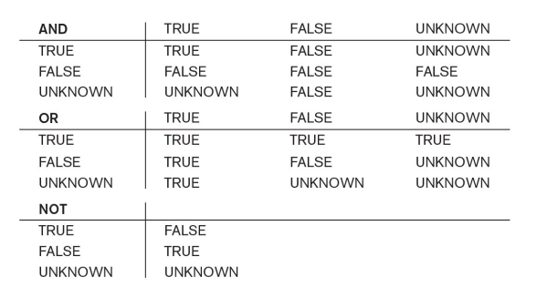
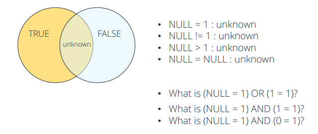

# Database_W5. SQL 2

## 비교를 위한 NULL 값



+ SQL 은 Attribute 값이 NULL 인지 아닌지 체크한다 
  - IS or IS NOT NULL
  - WHERE Super_Ssn = NULL 하면 안된다!
  
```
SELECT Fname,Lname FROM EMPLOYEE WHERE Super_Ssn IS NULL;
```

+ SQL 에서, NULL 은 어떤것과도 같지 않다. 심지어 다른 NULL 과도 equal 관계가 아니다.
+ True, False, unknown(NULL 을 support 하기 위함) 이렇게 3개가 있다.



```
SELECT Fname, Lname FROM EMPLOYEE WHERE Super_Ssn = NULL;
```

+ 위 Query 문에 대한 설명
  - WHERE 문에 대한 결과가 항상 unknown 이다. 그래서 모든 row를 다 reject 하는 것이다.
  - 항상 WHERE 문이나 HAVING 문은 TRUE 일 때 그 결과를 띄워준다. unknown 이면 안된다.

## Nested Query
  - 쿼리문 내부의 쿼리문
  - UNION 이랑은 다르다
    - UNION 문은 단순히 두 데이터를 하나로 합쳐서 보여주면서, 각 쿼러가 서로간에 영향을 미치지 않았다. 
    
```
SELECT Fname,Lname FROM EMPLOYEE WHERE Dno IN 
(SELECT Dnumber FROM DEPARTMENT WHERE DEPARTMENT.Dname = 'Research');
```

+ 위의 쿼리문 설명
  - Nested Query 를 먼저 실행한다(괄호로 쌓여 있는 부분)
  - 그래서 해당 Dnumber 부분의 Table을 만든다 
  - 그리고 EMPLOYEE 테이블에서 커서를 옮기면서, Dno 부분이 기존 Nested Query 의 결과 테이블 안에 있는 내용물에 포함되어 있는지 확인한다. 
  - 안에 있는 것이 존재하면, 그 tuple 을 결과안에 포함시킨다. 
  
## Restrictions on Nested Queries

+ 단순 비교연산자( =,<,>,<>) 쓸때는, Nested Query 가 오직 한개의 tuple 만을 반환해야 한다
  - 스칼라 값이라고 불린다 
  - ALL 연산자를 사용할때는 여러개여도 괜찮다
    - ALL : 해당 쿼리에 있는 애들보다 전부 크거나, 전부 작거나 등일때 활용함.(Scalar 비교)
    
+ Nested Query 에서는 일반적으로 하나의 Column 만 선택해서 테이블을 만든다.
  - EXIST 가 예외이다.
    - EXIST : 단순히 SubQuery 가 반환하는 결과값이 존재하는지를 조사한다. 
    - 단지 반환된 행이 있는지 없는지만 보고, 값이 존재하면 참, 아니면 거짓을 반환한다. 
    - 조건에 해당하는 ROW의 존재유무만 보기 때문에, IN 에 비해 속도나 성능면에서 더 좋다.
    
+ IN 도 많이 쓰기는 하지만, __하나 이상의 튜플을 만들 때 쓰기 좋다.__


  
  
