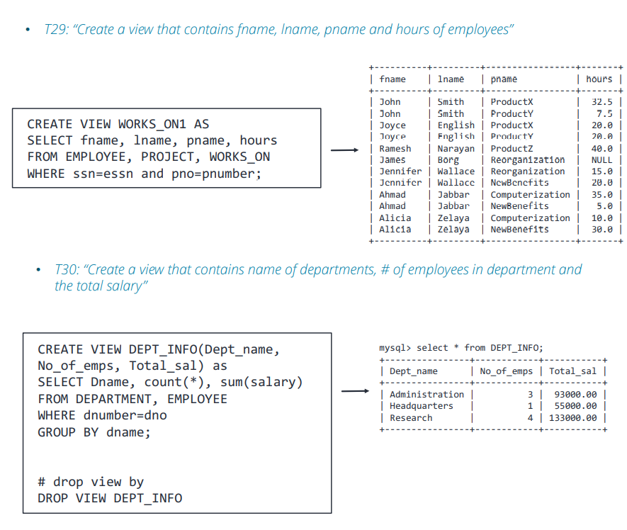

# Database_W5. SQL 2

## 비교를 위한 NULL 값


+ SQL 은 Attribute 값이 NULL 인지 아닌지 체크한다 
  - IS or IS NOT NULL
  - WHERE Super_Ssn = NULL 하면 안된다!
  
```
SELECT Fname,Lname FROM EMPLOYEE WHERE Super_Ssn IS NULL;
```

+ SQL 에서, NULL 은 어떤것과도 같지 않다. 심지어 다른 NULL 과도 equal 관계가 아니다.
+ True, False, unknown(NULL 을 support 하기 위함) 이렇게 3개가 있다.


```
SELECT Fname, Lname FROM EMPLOYEE WHERE Super_Ssn = NULL;
```

+ 위 Query 문에 대한 설명
  - WHERE 문에 대한 결과가 항상 unknown 이다. 그래서 모든 row를 다 reject 하는 것이다.
  - 항상 WHERE 문이나 HAVING 문은 TRUE 일 때 그 결과를 띄워준다. unknown 이면 안된다.

## Nested Query
  - 쿼리문 내부의 쿼리문
  - UNION 이랑은 다르다
    - UNION 문은 단순히 두 데이터를 하나로 합쳐서 보여주면서, 각 쿼러가 서로간에 영향을 미치지 않았다. 
    
```
SELECT Fname,Lname FROM EMPLOYEE WHERE Dno IN 
(SELECT Dnumber FROM DEPARTMENT WHERE DEPARTMENT.Dname = 'Research');
```

+ 위의 쿼리문 설명
  - Nested Query 를 먼저 실행한다(괄호로 쌓여 있는 부분)
  - 그래서 해당 Dnumber 부분의 Table을 만든다 
  - 그리고 EMPLOYEE 테이블에서 커서를 옮기면서, Dno 부분이 기존 Nested Query 의 결과 테이블 안에 있는 내용물에 포함되어 있는지 확인한다. 
  - 안에 있는 것이 존재하면, 그 tuple 을 결과안에 포함시킨다. 
  
## Restrictions on Nested Queries

+ 단순 비교연산자( =,<,>,<>) 쓸때는, Nested Query 가 오직 한개의 tuple 만을 반환해야 한다
  - 스칼라 값이라고 불린다 
  - ALL 연산자를 사용할때는 여러개여도 괜찮다
    - ALL : 해당 쿼리에 있는 애들보다 전부 크거나, 전부 작거나 등일때 활용함.(Scalar 비교)
    
+ Nested Query 에서는 일반적으로 하나의 Column 만 선택해서 테이블을 만든다.
  - EXIST 가 예외이다.
    - EXIST : 단순히 SubQuery 가 반환하는 결과값이 존재하는지를 조사한다. 
    - 단지 반환된 행이 있는지 없는지만 보고, 값이 존재하면 참, 아니면 거짓을 반환한다. 
    - 조건에 해당하는 ROW의 존재유무만 보기 때문에, IN 에 비해 속도나 성능면에서 더 좋다.
    
+ IN 도 많이 쓰기는 하지만, __하나 이상의 튜플을 만들 때 쓰기 좋다.__

## Attribute Ambiguity

```
SELECT Fname, Lname FROM EMPLOYEE WHERE Dno IN (SELECT Dno FROM DEPT_LOCATIONS
WHERE Dlocation = 'Houston');
```

+ 여기서 왜 오류날까?
  - 확실한 건, correlated query 라는 것은 맞지만, Nested Query 문에서 Outer Query 의 Attribute 를 select 하고 있다는 사실이다. 
  - IN 은 기본적으로 OR과 같다. 아래의 구문은 둘다 같은 구문이다. 
    - OR는 TRUE,FALSE를 뱉는 WHERE 문에서 역할을 한다고 생각하면 된다.
  - 아무것도 없는 테이블을 검색하여, OR 문을 돌리면 오히려 하나도 비교할 게 없어져서 WHERE문이 무력화된다. 
  

```
WHERE Condition = 'A' OR Condition = 'B'
WHERE Condition IN ('A','B')
```

## Multiple Tuples can be returned

```
select distinct essn from WORKS_ON where (pno,hours) in 
(select pno,hours from WORKS_ON where Essn = '333445555');
```

+ 이렇게 두개 다랑 매칭이 되는 in 도 있다.

### Nested Queries with HAVING

+ Subquery 는 HAVING 이랑 쓸 수 있다.
+ Subquery 는 생성된 튜플 수(1개)에 대한 규칙을 준수하는 한, Aggregate Function을 사용할 수 있다.

## Correlated Nested Queries

+ Correlated nested query는, __내부 쿼리의 WHERE 절__이 __외부 쿼리의 FROM 절에 있는 테이블을 참조할 때__ 존재한다고 할 수 있다.

+ 하위 쿼리는 외부 쿼리 테이블의 각 행에 대해 한번씩 실행된다.
+ = 또는 IN 비교 연산자를 사용하는 Nested Query 는, 하나의 블록으로 축소할 수 있다.
  - 아래의 두 쿼리문은 같은 결과를 낸다.

```
SELECT E.Fname, E.Lname FROM EMPLOYEE AS E WHERE E.ssn in 
(select D.essn from DEPENDENT AS D WHERE E.Fname = D.Dependent_name);

SELECT E.Fname, E.Lname FROM EMPLOYEE AS E, DEPENDENT AS D
WHERE E.ssn = D.essn AND E.fname = D.Dependent_name;
```

### Correlated Subquery 는 어떻게 동작하는가?

1. 외부 쿼리에 지정된 테이블에서, row(tuple) 하나를 선택한다. 이것을 "현재 행"이라고 하자.
    - 커서라도고 한다.
2. 외부 쿼리의 FROM 절에 있는 별칭(alias) 에, "현재 행" 값을 저장한다. 
3. 서브쿼리를 수행한다.
4. 서브쿼리의 결과를 사용하여, 외부 쿼리의 서술 식을 평가한다. 그리고 현재 행이 선택되었는지 여부를 서브쿼리의 결과를 보고 결정한다. 
5. 외부 쿼리의 테이블의 각 row에서, 위의 1~4를 반복한다. 


### Exists Operator

+ Nested Query 를 인수(argument) 로 사용하는 boolean 연산자
  - 서브쿼리가 어떤 결과라도 내면 TRUE
  - 서브쿼리가 아무 결과도 못 내면 FALSE
  - Unknown 결과가 나올수가 없다.(무조건 TRUE/FALSE 둘중하나다)
  - 아래 첫번째 쿼리에서, 서브쿼리에서 딱 하나의 tuple 이 나왔다. 
    - 하나라도 있으니 true 이다. 
    - 그냥 계속 참이 나오니, 모든 employee의 fname, lname 이 다 출력된다.
    
  - 이것을 의미있게 만들려면, 두번째 query 처럼 해도 된다.
    - 지금 보고 있는 외부 쿼리의 Dno를 걸어버렸으니, 값이 딱 하나만 매칭된다. 
    - 다른것에는 다 false 가 나오고, 하나만 true 가 나오니, 하나만 출력된다.
  
```
SELECT Fname, Lname from EMPLOYEE WHERE exists
(SELECT * from department where dname = 'Headquarters');

SELECT fname, lname from EMPLOYEE WHERE exists 
(select * from department where Dname = 'Headquarters' and employees.Dno = Dnumber);
```


### EXISTS, NOT EXISTS, UNIQUE

+ 이런 연산자들은 주로 correlated nested query 와 함께 사용된다
+ 이 연산자들은 전부다 TRUE,FALSE 둘중 하나만 리턴하는 boolean 함수이다. 

+ EXISTS 는 Nested Query 결과가 공집합이 아니면 무조건 참이고, 아니면 거짓이다 
+ NOT EXISTS 는 Nested Query 결과가 공집합이면 참이고, 아니면 거짓이다.

+ UNIQUE(Q) : 쿼리 Q의 결과에 중복 튜플이 없으면 TRUE를 반환한다.


## Join Tables

+ 유저가, 쿼리의 from 절에서 join 작업으로 테이블을 새로 만들어 지정할 수 있다.
  - 그리고 아래 두 쿼리는 같은 쿼리이다.

```
SELECT Fname, Lname, address FROM (EMPLOYEE JOIN DEPARATMENT ON Dno = Dnumber) WHERE Dname = 'Research';

SELECT Fname, Lname, address FROM EMPLOYEE, DEPARTMENT WHERE dno = dnumber AND dname = 'Research';
```

### Natural Join

+ 교집합 그림이다. 

+ 잘 쓰지는 않는다. 
  - R과 S가 완전히 똑같은 이름을 가지는 Attribute 가 있어야 함. 
  - 그렇지 않으면 에러
  
### Left Outer Join

+ R과 S가 겹치는 부분을 다 표기하고, __왼쪽__ 의 겹치지 않는 부분은 NULL 처리해서 표기


+ 위아래 Query 차이점
  - WHERE 이 붙어서, James NULL 여기가 사라짐. 
  - 저 부분이, S.ssn IN (SELECT super_ssn from employee); 이부분에 걸려서 NULL 이 걸러졌다.
    - 어차피 SSN 자체에는 NULL 이 없다. 
    
### Right Outer Join

+ 겹치는 부분을 다 표기하고, __오른쪽__ 의 겹치지 않는 부분을 NULL 처리해서 표기


### Full Outer Join

+ Left Outer Join 과 Right Outer Join 을 UNION 한 부분. 
  - 그냥 단순히 UNION 해서 두개 표기하고, UNION 자체가 중첩을 빼주니까 이렇게 할수있다.
  

## Aggregate Functions

+ Aggregate : 집계

+ 많은 튜플의 정보를 요약해서, 하나의 튜플로 만드는 것
+ 내장 Aggregate(집계) 함수가 있다.
  - COUNT,SUM, MAX,MIN, AVG
  
+ Grouping
  - summarizing(요약) 하기 전에, tuple 의 subgroup 을 만든다. 

+ Having 문은 전체 그룹을 select 할 때 사용한다.
+ Aggregate Function 은 SELECT 문이나 HAVING 문에 사용된다. 

### Example - Count

```
SELECT count(*) FROM EMPLOYEE;
SELECT count(*) AS Researchers FROM EMPLOYEE, DEPARTMENT WHERE dno = dnumber AND dname = 'Research';
```

## The GROUP BY clause

+ Group By 문

+ 튜플의 부분집합의 분할 Relation
  - Attribute 을 그룹화하는 것을 기반으로 한다 
  - 각 그룹에 독립적으로 function 을 적용한다 
  
  
  
```
SELECT Dno, count(*), avg(salary) FROM EMPLOYEE GROUP BY Dno;
```

+ 설명
  - Dno 로 분류해서 그룹화한 것을 카운트하고, 평균 낸 것을 표기했다.

```
SELECT pnumber, pname, count(*) FROM PROJECT, WORKS_ON
WHERE Pnumber = Pno GROUP BY pnumber,pname
```

+ 설명 
  - pnumber, pname 두개의 요소를 가지고 그룹을 나누었다. 
  - PROJECT, WORKS_ON 을 Join 한 결과를 가지고, 넘버와 이름이 같은 것들을 카운트했다.
  - WORKS_ON 은 직원과 프로젝트를 이어 주는 Relation 인데, 여기서 GROUP BY를 이용해서 각 프로젝트에 사람이 얼마나 많이 들어갔는지 확인할 수 있게 Query 를 만들었다. 
  
### Example - GROUP BY with HAVING


+ 설명
  - 위의 결과에서, count(*) > 2 이상을 가진 것을 골랐다. 
  
  
  
+ 위는 틀리고 아래는 맞는 것이다
  - 위가 틀린이유
    - 맨처음에 Salary가 40000 이 넘는 직원의 Dno, count(*)을 구하라고 했다. 
    - 이까지만 보면 딱 하나 나와야 한다. Dno 는 맨앞에 하나만 나오고, count(*) 로 카운팅만 된다.
    - 근데 여기서 GROUP BY Dno 덕분에, 그래도 Dno 별로 분리가 되기는 했다. 
    - 하지만, 여기서 having count(*) > 1 에서 전부 걸러졌다. 
    - 종합해 보면 이 Query 문은, 각 부서에 40000 이 넘는 사람이 몇명 있는지 를 구하는 것이었는데, 그 부서에 40000불 이상 받는 사람이 2명 이상이 있는 부서는 어디인가? 를 묻는 Query 문이다. 
    - 원래 기존 질문과는 맞지 않는 것이었다. 
 
  - 아래가 맞는 이유
    - 맨처음에 EMPLOYEE 테이블에서 Dno, count(*) 구하는 것은 같았다. 
    - 여기서 Salary 가 40000불을 넘는 것을 먼저 1차적으로 걸렀다. 
    - 그리고 Dno 가 포함되어 있는지를 물어본다
      - SELECT Dno FROM EMPLOYEE GROUP BY Dno 에서, Dno로 묶어서 보았다. 그럼 Dno가 3개가 나온ㄷ
      - 여기서 count(*) > 1 에서, Dno 로 묶인 애들이 2개 이상인 그룹으로 걸러진다.
    - 그런 서브쿼리에 Dno 가 포함되어 있는지를 묻는 것이다. 
    - Salary 가 40000 보다 크면서, dno 는 서브쿼리 안에 있는 직원을 세었다. 
    - 그러면서 Dno 를 결국 물었으니, Dno를 구한게 맞다. 
    
    
## Assertions and Triggers

+ Assertions 는 MySQL 에 없어서 잘 안쓴다. 

+ 그래서 MySQL 에서는 TRIGGERS 를 대신 쓴다
  - TRIGGER 는 테이블과 연결되어 저장된 하위 프로그램(subprogram) 으로, DB가 바뀔때마다 DBMS 에 의해 자동으로 호출되어, __변경사항이 TRIGGER 를 어기지 않는지 체크한다. __
  - 복잡한 business rule 을 DB가 따르도록 강제하는 것에 쓰이기도 한다.
    - 만약 판매원이 5만불 이상을 팔았으면, 자동으로 축하 메세지를 띄운다.
  - 알리는 목적 : 로그 생성
    - 누가 언제 무엇을 테이블에다가 했는지?
  - 지정된 특성 값을 자동으로 생성하기(글 ID 만들기 등)
  - 테이블을 복제하고, 파일을 백업하는데 씀

+ Trigger Logic
  - Event/Condition/Action 식으로 이루어져 있음
  - Event 
    - Trigger 가 실행되는 조건문
    - INSERT,UPDATE,DELETE
    - 시간 : BEFORE/AFTER
  
  - Condition(Optional)
    - 트리거가 실행될 때 만나는 조건
  - Action
    - 실행되는 SQL 문
    


+ 관련 값들 - NEW & OLD
  - OLD.<attribute name>
    - UPDATE 문에서 변경되기 전, 혹은 DELETE 문 앞의 Attrubite 값이다.
    - INSERT 문의 경우, 이 값은 NULL 이다.
    
  - NEW.<attribute name>
    - UPDATE 문 또는 INSERT 문 뒤의 Attribute 값이다. 
    - DELETE 문의 경우 이 값이 NULL 이다.
    
  - 별칭을 붙일 수 있다. 
    - NEW AS (newname)
    - OLD AS (oldname)
    
 
 
 + DELIMITER : 문장 끝낼때 붙이는것. \s 로 확인가능하다
 
## Views(Virtial Tables) in SQL

+ SQL 에서의 View 의 Concept
  - 다른 이미 있는 테이블로부터 파생시켜서 나온 하나의 테이블
  - 실질적으로 만들어지지 않은 __가상의 테이블__ 처럼 취급된다.

+ CREATE VIEW 명령어
  - 테이블 이름, attribute 이름들, 그 view 의 컨텐츠들을 정해주는 쿼리문 으로 이루어짐.
  - 실질적으로, SELECT 문을 한번 가상으로 저장해 놓고 쓰는 개념임.
  
+ DROP VIEW <view_name> : 해당 뷰를 없앰.
 
 
  
