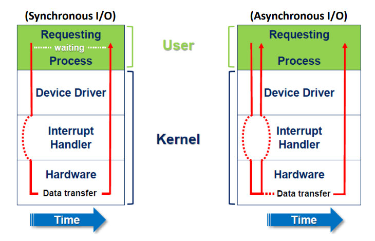
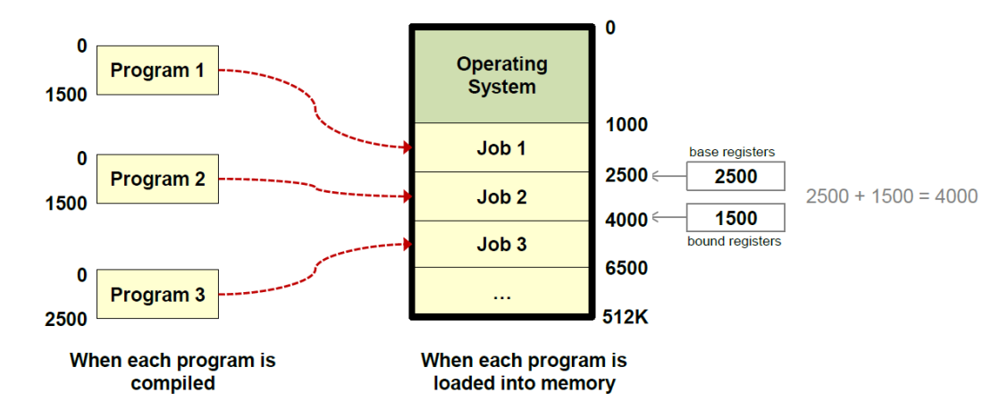
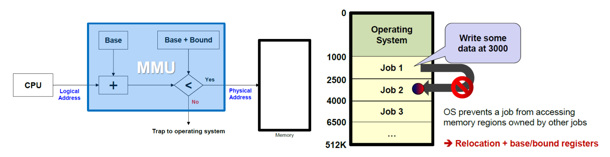
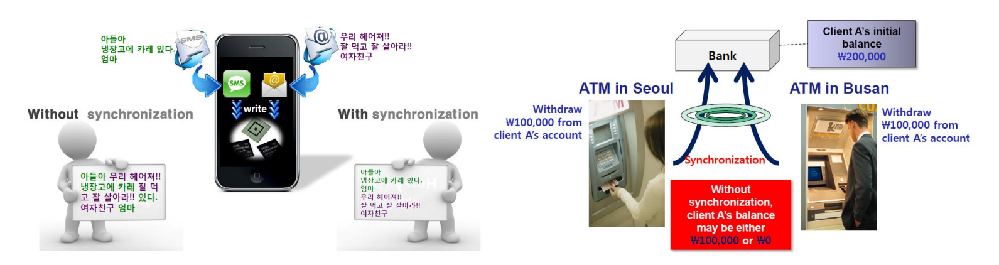

# Chapter1. Introduction

## 운영체제(Operating System, OS)란? : 
  - 컴퓨터 하드웨어의 자원을 효과적으로 잘 관리해 주는 시스템 프로그램이며, 사용자가 컴퓨터에 대해 잘 모르더라도 컴퓨터를 원활하게 잘 다룰 수 있도록 중간에서 도와주는 프로그램.
  
  - Application Software : High-Level Language(C/C++, Python, SQL...)로 쓰여진 프로그램
  - Hardware : Processor, Memory, I/O Controller 같은 것들
  - System Software(OS단) 
    - Compiler : High Level Language를 Machine Code로 컴파일해줌. 
    - __Operating System__ : I/O 핸들링해주며, 메모리와 보조 저장장치를 관리하며, Job Scheduling이나, resource를 sharing 해주는 등의 역할을 수행함. 
    
  - OS는 컴퓨터 하드웨어와 User Application Software 사이에서, 그 둘의 Interface 역할을 수행한다. 
    - Interface : 중간 사이의 소통창구 정도로 생각해도 좋다.
    - UI(User Interface) : 유저와 프로그램(?) 사이에서, 서로의 소통창구가 되어주는 것. 
        
## Kernel

   
   
  - 커널(Kernel) 이란, 운영체제의 핵심 부분으로, 커널의 역할 역시 운영체제의 핵심 부분임. 
  - 뒤에 나오는 운영체제의 내용은 당연히, 커널이 하는 역할이기도 하다. 
  - 커널 내에 있는 기능
    - Utility : 사용자에게 다양한 부가기능을 제공한다. 
    - System Call Library : 개발자가 OS를 통해, 시스템에서 제공해주는 기능을 call 할 수 있게 해주는 Library
  - 좁은 의미의 Operating System 는, "커널" 그 자체라고 이야기할 수 있을 정도이다. 
  
  - 운영체제의 목적 : 컴퓨터를 잘 모르는 사람들도 원활하게 사용할 수 있게 해주는 것이다. 
  - 운영체제가 하는 역할 : 
    - 보안 : 컴퓨터 하드웨어와 프로세스의 보안을 책임지는 역할을 함. 
    - 자원 관리 : 한정된 시스템 자원을 효율적으로 관리하여 프로그램의 실행을 원활하게 만듬. 특히 프로세스에 처리기를 할당하는 것을 스케쥴링이라고 함. 
    - 추상화 : 같은 종류의 부품에 대해 다양한 하드웨어를 설계할 수 있기 때문에, 하드웨어에 직접 접근하는 것은 문제를 매우 복잡하게 만들 수 있음. 일반적으로 커널은 운영 체제의 복잡한 내부를 감추고, 깔끔하고 일관성 있는 인터페이스를 하드웨어에 제공하기 위해 몇 가지 하드웨어 추상화(같은 종류의 장비에 대한 공통 명령어의 집합)들로 구현된다. 이 하드웨어 추상화는 프로그래머가 여러 장비에서 작동하는 프로그램을 개발하는 것을 돕는다. 하드웨어 추상화 계층(HAL)은 제조사의 장비 규격에 대한 특정한 명령어를 제공하는 소프트웨어 드라이버에 의지한다. 
    - System call을 통한 하드웨어에 접근 : 읽고/쓰고/수정하는 등의 역할을 도와준다. System call을 통해서만 하드웨어에 접근 가능하다.
    
      - 컴퓨터 하드웨어를 안전하게 보관하기 위한 필수적인 기능이다.
      - 그렇지 않으면 하드웨어가 망가지거나, 하드웨어가 제 기능을 온전히 사용하지 못할 수 있다
      - 컴퓨터가 동작하는 일은, 운영체제 안에서 해결하거나, System Call에 접근해서 하는 일이다.
      
## OS의 두가지 측면
   
   
  - 시스템 자원은 언제나, 동서고금을 막론하고 항상 한정되어 있다. 
  - 그래서 언제나 OS는 hardware 자원을 효율적으로 관리해야 한다. 그래서 performance를 최대화해야 한다. 
    - 한정된 자원을 효율적으로 잘 써서, 컴퓨터 성능을 Maximize 해야만 한다. 
    
  - OS는 hardware 자원을 공정하게 각 프로세스에 배분해서, "사용자 경험"을 언제나 일정 수준 이상 보장해야 한다. 
  - 결론적으로, OS는 컴퓨터 시스템을 사용자가 편하게 사용할 수 있도록 만들어 줘야 한다!
    - 유저 프로그램을 실행시켜, 유저가 문제를 해결할 수 있도록 도움을 줘야 한다. 
    
## Categories Of Operating System(Two Aspect)
  - 얼마나 많은 유저들이 "그 순간에" 사용할 수 있는가?
    
    1. Single User System : 
        - "한 순간"에 한 사람이 시스템에 접근할 수 있음.
        - 간단하지만, 제한된 성능을 낼 수 있음 
        - MS-DOS, Windows, Mac-OS
    
    
    2. Multi-User System:
        - 한 순간에 여러 사람이 시스템에 접근할 수 있음
        - 복잡하고, 여러 다른 일들을 스케쥴링해야 하며, 각 유저에 대해 접근 권한도 관리해야 하고, 보안에도 신경써야 함. 하지만 전반적인 퍼포먼스를 올릴 수 있음
        - Unix, Mainframe, Windows NT, Linux 등
    
  - "동시"에 일을 얼마나 많이 할 수 있는가    
  
    1. Single Tasking System 
        
        - 한 순간에 하나씩 할 수 있음
        - MS-DOS, Windows CMD
        
    2. Multi Tasking System 
        - 한 순간에 여러 일을 할 수 있음
        - 대부분의 현대 OS like Linux, Unix, Windows...
        
  - Open Source vs Closed Source System
  
    1. Open Source OS(Linux) : 
        - 소프트웨어 값이 공짜이며, 소스코드를 제한 없이 고쳐 쓸 수 있다. 
        - 소스 코드가 해커 연습용으로 풀려 있다. 
        
    2. Closed Source OS(Windows) :
        - 값을 지불하고 사용해야 함. 
        - 소스 코드를 볼 수 없고, 바꿀수 없음. 
        - 보안에는 더 강력하다고 알려져 있다. 
        
        
  
  - Monolithic Kernel(단일 커널) vs Micro Kernel(마이크로 커널)
  
    1. Monolithic Kernel(단일 커널) 
        - 커널의 다양한 서비스 및 높은 수준의 하드웨어 추상화를, 하나의 덩어리(주소 공간) 으로 묶어 놓은 것이다. 
        - 운영체제를 개발자 입장에서는, 유지보수가 일반적으로 더 어렵다. 
        - 디스크 드라이버에 정보를 추가하고 지우기도 빡세다. 
        - 각 부분들이 효율적으로 서로 상호 소통하기 때문에, 속도가 빠르다
        - Unix, Linux
        
    2. Micro Kernel(마이크로 커널)
        - 하드웨어 추상화에 대한 간결한 작은 집합들을 제공하고, 더 많은 기능을 서버라고 불리는 "응용 소프트웨어"를 통해 제공한다. 
        - 각기 다른 주소 공간에서 돌아간다. 
        - 이런 서버들이 서비스라는 이름으로 불리고, 프로세스 간 통신(Inter-Process Communication, IPC)위에서 각기 상호 소통이 이루어진다. 
        - Mac OS X, Windows NT, MINIX 등
        
    3. Hybrid Kernel -> 두개 섞어 놓은느낌     
        
## History of Operating System
   
   
  - Serial Processing (~1950s)
    - 하드웨어는 비싸고, 사람은 쌌던 시대 
    - 최대한 하드웨어를 효율적으로 사용해 보자!
    - OS가 없어서, 기계어로 프로그램을 돌려야 했다. 
    - 프로그램이, 컴퓨터가 사용하기 위한 모든 것들을 담고 있어야 함. 
    - 개개인 유저가 콘솔에서 일하고, 오프라인에서 디버깅하는 시대 
    - job-to-job transition이 느렸다.
    
   
   
  - (Single)Batch Processing(~1960s)
    - 여전히 컴퓨터가 아직 많이 비쌌던 시대. 그런 비싼 CPU가 노는 시간이 줄어야 했다. 
    - 모든 타입의 프로그램과 데이터를 다 한방에 넣어 놓고, 프로세스를 시작함. 
    - 한꺼번에 같이 수행할 수 있는 애들을 묶자!
    - 한꺼번에 수행 가능한 애들을 묶어야 하는데, 이것을 판단하는 것이 OS가 하는 역할이었다. 그래서 놀고 있는 시간을 최대한 줄이는 것이 OS가 하는 일이었다. 
    - 그래서 CPU Utilization을 최대화하는 노력을 함. 
    - Special Programming Language. JCL(Job Control Language)가 모니터에 있었음. 
    - 프로그램 설치와, 다시 되돌려 받는 시간이 줄어들어서 CPU 활용 시가닝 늘어남. 
    - 모니터는 단순히 간단한 스케쥴러였음(메모리 보안, 타이머, 명령어, 인터셉트만이 추가됨)
    - 두 개의 overhead : 메모리와 프로세서 시간이 모니터에 표기되어 있었음. 
    - 역시 한 순간에 한 일만 하다 보니, 활용도가 여전히 낮았음.(CPU 활용도가 3.2% 수준)
    - 돌아가는 프로그램이 아닌 것이 매모리 상에 올라가 있었음.
      - 이 프로그램은 메모리를 관리해 주는 프로그램이었고, 이 프로그램이 OS의 시초라고 할 수 있겠다.
    
    

+ Multiprogramming Batch Programming(1960~1970s)
  - 여전히 I/O 가 잡아먹는 시간이 많았음. 그래서 최대한 I/O 에 들어가는 시간을 숨겨 보자!
  - 그래서 Job에 I/O를 요처앟면, 그 프로세스는 CPU 상에서 내려서 I/O를 기다렸다가 받게 해 놓고, 다른 일을 하는 방식으로 처리할 수 있었다. 
  - I/O를 기다리는 시간 자체가 사라지다 보니, CPU 활용 시간이 비약적으로 상승할 수 있었다.
  - 기존에는 Job 1 이 수행이 끝날때까지 Job 2가 수행될 수 없는데, 이제는 바뀌어서 동시에 여러 개의 프로그램이 동작하는 방식이 되는 것이다. 
    - 정확하게 한 순간에 한꺼번에 수행되는 것은 아니지만, 각 Job 들이 끝나기 전에 다른 것들이 돌아갈 수 있다!
    - 이런부분을 보고 Multiprogramming이라고도 할 수 있다.
    - 많은 유저들이 시스템을 공유하는 식이라고 볼 수 있다. 
    - 두 개 이상의 batch program 이 한 프로세서에 같은 시간에 돌아가는 식이었기 때문에, 가능한 한 컴퓨터를 바쁘게 만들 수 있었다. 
      - 프로세서가 Job들 사이에서 Switching 되는 식으로 처리될 수 있었다.
    
    - 동시에 이루어지는 프로그래밍(Concurrent Programming)이 가능해졌다.
    - Job Scheduler가, 우선순위나 메모리 사이즈 같은 것들을 고려하면서 Job 들을 선택해 가며 일했다.
    

+ 두 형태의 I/O
  - 동기(Synchronous) I/O : I/O가 호출되면, 프로세스가 인풋이 들어올때까지 기다려줌
  - 비동기(Asynchronous) I/O : I/O가 호출되면, 프로세스가 다른일 하고, I/O가 종료되면 그때가서 그 프로세스를 다시 처리해서 되돌려 준다
    - CPU Utilization을 극대화하기 위해서 이렇게 처리한다. 
    
    
    
+ Memory Relocation 
  - 프로그램이 0~1500번지까지의 크기가 여러 개 있으면, 실제 메모리 주소 안에 넣는 일은 MMU(Memory Management Unit, 하드웨어적으로 존재함)가 해준다.
  - 메모리 주소(Logical Address)를 변환해서 Physical Address에 넣어준다. 
  - 그렇게 해서, CPU가 엄한 곳(OS단이 존재하는 메모리나, 다른 프로세스에 할당된 메모리주소)에 접근하는 것을 막아준다. 

 
  
+ Base/Bound Registers
  - Base Register는, 실제 물리적인 메모리에서 해당 프로그램이 시작되는 주소값을 저장한다.
  - Bound Register는, 해당 프로그램이 얼마만큼의 크기를 가지고 있는지에 대한 값을 저장한다. 
  - Bound Register가 필요한 이유 : 
    - Virtual Memory에 너무 큰 값이 입력될 경우, 매핑되지 않은 주소 구역에 참조를 할 수 있으므로, 이를 막기 위해서이다.(Memory Protection)

+ Concurrency and Synchronization

  
  - Synchronization
    - 요즘은 동시에 프로세싱이 가능한데, I/O가 동시에 읽다 보면, 내용물이 다 섞일 수 있을 것이다. 
    - 이 문자열 앞뒤에 표시를 해주어, 따로 읽어 각각 합칠 경우, 각각 내용을 모아서 사용자가 읽을 수 있는 문자열이 완성될 것이다. 
 
  - Synchronization 2
    - 서울 ATM과 부산 ATM에서, 20만원 들어 있는 통장에서 동시에 돈을 10만원치 인출했다는 가정.
    - Synchronizaiton 해주지 않으면, 돈이 0원이 남았는지, 10만원이 남았는지 판단하지 못할 수도 잇다. 
       
+ Batch Programming vs Multi-Programming
  - Batch Programming은 사용자와의 상호작용 없이 컴퓨터에 의해 차례로 실행되는 처리 작업 그룹인 반면, Multi-Programming은 단일 프로세서에서 여러 프로그램을 동시에 실행할 수 있는 OS 능력이다
  
|Batch Processing|Multi-Programming|  
|-----|-----|
|Slower|Faster|
|CPU가 일하지 않고, 기다리는 시간이 있을 수 있음|CPU가 언제나 동작하고 있음|
|사람과의 Interaction 과 비용을 줄여줌|CPU 활용도를 극대화함|
  
+ Time-Sharing Process(1970s~1980s)
  - Batch-Multiprogramming 시스템 구도의 논리적 확장이 이루어짐. 
  - CPUC가 job 들을 switching하는 것이 엄청 자주 일어나서, 각자의 job들이 돌아가고 있는 와중에도 해당 사용자들과 상호작용하는 것이 가능해짐. 
  - interactive computing이 가능해짐.
  - 각 유저가 메모리 상에 최소 한 개의 프로그램(Process) 을 실행시킴
  - 반응시간(Response Time) << 1s
  - Job & Process를 Scheduling하는 과정
    - System Clock이 Interrupt를 발생시킴
    - 각 시간대마다 System 이 컨트롤해서 Processor 를 각기 다른 Job에 줌(Time-Slicing)
    - CPU 시간이 Sliceㄹ 나뉘어져서 프로세스들을 순차적으로 돌리게 됨.

  - 실행되는데 한시간짜리 프로그램을 작동시킨다고 한다면, I/O가 없다고 해서 계속 그것만 실행시킨다고 한다면, 컴퓨터는 그 사이에 사용자의 추가적인 명령 신호를 받아들이지 못한다. 
  - CPU Utilization은 거의 100% 이겠지만, 사용자 경험 측면에서 되게 불만이 발생할 것이다. 
  - 할당받을 수 있는 CPU의 Computing 능력을, CPU를 점유할 수 있는 시간, 기회를 균등하게 나누어 주자! (1ms씩 나누어 주면 될 수 있다) 
  - 실제로도 이렇게 한다! 
    - CPU의 속도, 하드웨어의 속도가 워낙 빨라서, 사람이 입력을 하거나 아웃풋을 해석하는 시간 동안 충분히 다른 것들을 다 수행할 수 있기 때문에 가능했다. 
    - 실제로는 1 nanosecond 동안 한개의 일이 수행되는 것인데, 사용자는 CPU를 온전히 다 사용하고 있다고 생각하게 되는 것이다(실제로는 10명이 사용하고 있더라도) 
    - 10명이 사용하든 100명이 사용하든, Time Sharing 으로 인해서 각 User들이 CPU를 본인 혼자서 사용하고 있다고 "착각"하게 만드는 것이 Time-Sharing의 핵심이다. 
  
  - 이런 "착각"을 불러일으키는 것이 가능한 방식이 Time-Sharing 원칙이다. 
  - Time-Sharing 방식은 기존의 Multiprogramming 이 지향하는 목적과는 다르다.
  - 왜 Time-Sharing의 목적은 "Response Time을 줄이는 것" 인가?
    - 애초에 계산을 요청했는데, 앞에 24000명씩이나 있어서 일주일 뒤에 나온다고 한다면, 매우 곤란할 것이다. 
    - __Response Time__  : 컴퓨터에 요청하고, 그 첫번째 output 이 나올때까지의 시간<중요>
  
  - __Context Switching__ : Round Robin 방법에서 A에서 B로 Job 을 바끌 때 일어나는 switching.
    - 너무 자주 Context Switching이 일어나면, 오히려 이 Context Switching으로 인해 전체 Response Time이 줄어들 위험이 있다. 
  
  - Interactive Computing
    - 사용자가 컴퓨터와 상호작용하고 생각할 수 있을 만큼 response time을 최소화해 놓은 컴퓨팅.
    
      - By Time-Sharing System
    
    - 멀티프로그래밍 이 확장된 버전임.
    
  - __ThroughPut__ : 정해진 시간 동안 수행되는 Task의 양이나 갯수.
  
  

+ Real Time System
  
  - Hard Real-Time System : 곧죽어도 데드라인을 맞춰야 하는 시스템
    - ex) 항공기 랜딩과 같은 시스템
    - 맞추지 못했을 경우 재앙적인 결과가 나올 수 있는 곳에서 씀
  
  - Soft Real-Time System : 데드라인을 맞추지 못했더라도 재앙적인 결과가 나타나지 않을 경우 사용. 가끔가다가도 데드라인을 어길 수도 있는 Real-Time System.
    - 대부분의 경우, 1초 안에 화면이 뜰 수 있는데, 주변 환경의 영향으로 더 늦게 뜰 수도 있음. 
    - 그렇다고 해서 사람이 죽는 등 큰 손해가 발생하는 정도의 큰일이 발생하지는 않는다. 
      - 다만, 사용자 경험 측면에서 해를 끼칠 수는 있다. 
  
    - QoS(Quality of Service) 
      - ex) QoS 99% : 99번 안에는 deadline을 지키고, 한번 deadline을 어기는 정도. 
