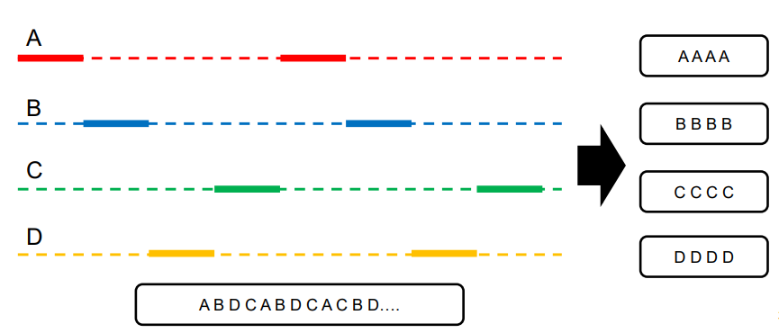
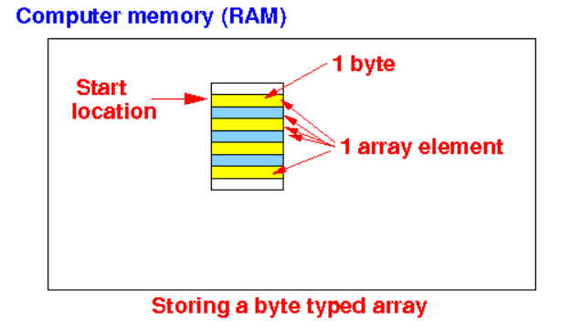
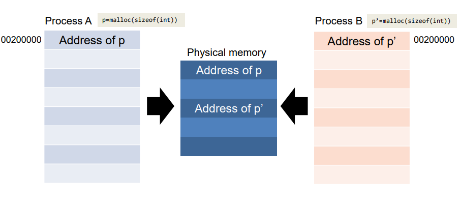

# Chapter 2. Introduction to Operating Systems

+ OS : 사용자가 Hardware Resource를 독점하고 있다는 환상을 심어 주는 역할을 함. 
  - OS Part는 크게 3가지로 나뉜다
  - (CPU/Memory) Virtualization 
    - 사용자가 hardware resource를 독점하고 있다는 illusion을 제공하는 역할을 한다. 
    
  - Concurrency
    - 여러 프로세스가 동시에 동작할 때 or Thread가 동시동작할 때 어떻게 원하는 동작 결과를 보장할 것인가?
    
  - Persistence 
    - 컴퓨터 프로그램에 실행에 대한 정보, 저장한 정보를 어떻게 안전하게 저장할 것인지?
    - 에러가 났을 때 어떻게 데이터를 복구할 것인지?
    - 명령어를 어떻게 잘 전달할 것이며, 이를 보장할 것인지?
      
## Virtualization(가상화)

#### CPU Virtualization 

+ 상세내용
  - 물리적 CPU는 하나밖에 없지만, 모종의 일을 통해 거의 무한개의 사용가능한 CPU가 존재하는 것처럼 Illution이 User에게 보이게 하는 것
  - ex) 4개의 프로그램이 한방에 돌아가는 것 같은 환상을 User에게 제공함
  - 이것을 어떻게 구현할지, 어떻게 제공할지에 관한 부분이 CPU Virtualization이다!
    - Time-Sharing이 그 방법 중 하나가 될 수 있음. 
    - 물리적으로 하나의 프로그램밖에 못 돌리긴 함. 하지만, Time-Sharing을 통해 5~6개가 동시에 돌아가는 것 같은 illusion을 제공할 수 있는 것이다. 
    - 당장도, Chrome, Kakaotalk, etc 등등이 다 동시에 실행되고 있는것처럼 "보이는" 것이다. 

#### Memory Virtualization

+ 각 프로세스가, 각각 자신들만의 메모리 공간을 가지고 있다고 착각하게 만드는 것. 
  - Physical Memory는 "Array of bytes" (바이트의 배열)이다.
  - 원래는 Physical Memory의 공간은 한정적이다. 
  - 실제 User, Programmer, Program 등은 Physical Memory 를 보는 것이 아닌, Logical Memory를 보고 있는 것이다. 

+ A가 부르는 100번지, B가 부르는 100번지, C가 부르는 100번지 주소는, 실제 Physical Memory에서는 다 다른 
