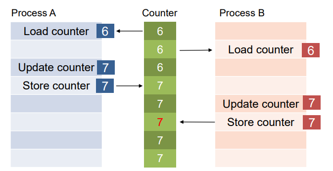

# Chapter 2. Introduction to Operating Systems

+ OS : 사용자가 Hardware Resource를 독점하고 있다는 환상을 심어 주는 역할을 함. 
  - OS Part는 크게 3가지로 나뉜다
  - (CPU/Memory) Virtualization 
    - 사용자가 hardware resource를 독점하고 있다는 illusion을 제공하는 역할을 한다. 
    
  - Concurrency
    - 여러 프로세스가 동시에 동작할 때 or Thread가 동시동작할 때 어떻게 원하는 동작 결과를 보장할 것인가?
    
  - Persistence 
    - 컴퓨터 프로그램에 실행에 대한 정보, 저장한 정보를 어떻게 안전하게 저장할 것인지?
    - 에러가 났을 때 어떻게 데이터를 복구할 것인지?
    - 명령어를 어떻게 잘 전달할 것이며, 이를 보장할 것인지?
      
## Virtualization(가상화)

+ Virtualization : Trick!

#### CPU Virtualization 

+ 상세내용
  - 물리적 CPU는 하나밖에 없지만, 모종의 일을 통해 거의 무한개의 사용가능한 CPU가 존재하는 것처럼 Illution이 User에게 보이게 하는 것
  - ex) 4개의 프로그램이 한방에 돌아가는 것 같은 환상을 User에게 제공함
  - 이것을 어떻게 구현할지, 어떻게 제공할지에 관한 부분이 CPU Virtualization이다!
    - Time-Sharing이 그 방법 중 하나가 될 수 있음. 
    - 물리적으로 하나의 프로그램밖에 못 돌리긴 함. 하지만, Time-Sharing을 통해 5~6개가 동시에 돌아가는 것 같은 illusion을 제공할 수 있는 것이다. 
    - 당장도, Chrome, Kakaotalk, etc 등등이 다 동시에 실행되고 있는것처럼 "보이는" 것이다. 

#### Memory Virtualization

+ 각 프로세스가, 각각 자신들만의 메모리 공간을 가지고 있다고 착각하게 만드는 것. 
  - Physical Memory는 "Array of bytes" (바이트의 배열)이다.
  - 원래는 Physical Memory의 공간은 한정적이다. 
  - 실제 User, Programmer, Program 등은 Physical Memory 를 보는 것이 아닌, Logical Memory를 보고 있는 것이다. (실제 DRAM이 아닌 Logical Memory에 접근!)

+ A가 부르는 100번지, B가 부르는 100번지, C가 부르는 100번지 주소는, 실제 Physical Memory에서는 다 다른 Physical Memory Address 이다.
  - 한쪽에서 돌아가는 프로그램에서는, 다른쪽에서 돌아가는 프로세스의 메모리공간을 침범하지 못한다. 
    
## Concurrency 

+ 동시에 어떤 것들이 돌아가도, 하나만 돌았을 때와 결과가 차이가 없어야 함. 
  - 동시에 수행하더라도, 얘를 혼자 수행했을 때의 결과와 서로 다르지 않음을 보장해 준다!

+ 위 그림에서, 이렇게 Program Counter Register 에 두 Process가 동시에 참조를 해서 Update, Store를 하는 경우, Concurrency 를 보장할 수 없다. 
  - 원래 Process는 거의 무작위로 실행되는 측면이 있다. 
  - 이 경우에서 Concurrency를 만족시키기 위해서는, 강제로 두 프로세스의 실행 순서를 고정시키거나, 아니면 한쪽만 Program Counter를 쓰던가 둘중 하나만 해야 한다. 

+ 뭐 요런 "동시성" 문제를 concurrency 부분에서 배운다. 

## Persistence (컴퓨터의 신뢰성)

+ example 1)
  - 데이터 센터가 있다고 했을 때, 수많은 저장장치들이 있을 것임. 
  - 데이터 센터를 운영하는 OS가 있다고 했을 때, 이 OS가 가장 중요하게 여기는 것은 Persistence일 것이다. 
    - 빠르게 무엇인가를 처리하는 것도 중요하지만, 빠르지 않더라도 소비자에게 치명적인 일이 벌어지지는 않는다.
    - 하지만, 데이터가 망가져, 저장한 데이터를 복구할 수 없으면 소비자에게는 치명적인 문제가 된다. 
  
+ 데이터를 어떻게 하면 안전하게 저장할 수 있고, 유사시에 어떻게 하면 복구할 수 있는지? 
+ Storage 에는 어떤 명령어가 있고, 어떻게 사용자 CPU에 전달되는지?

+ About File System, 파일복구 등을 배우는 단계이다. 
