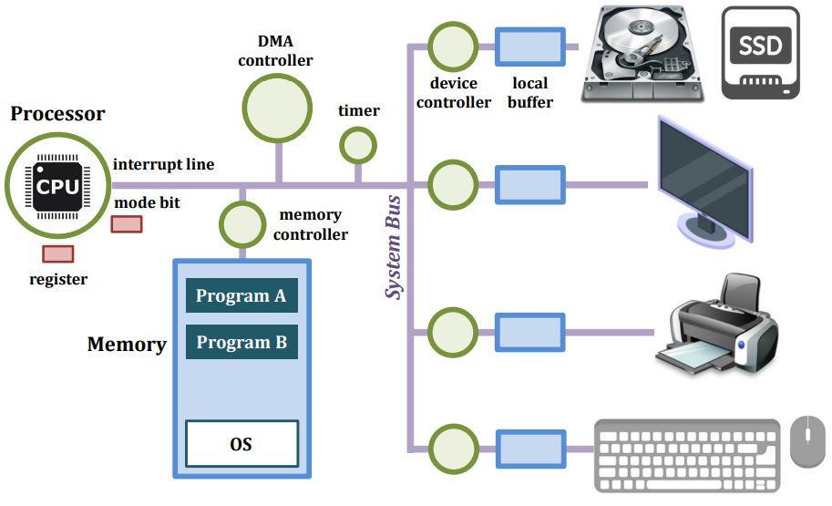
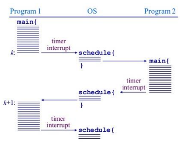
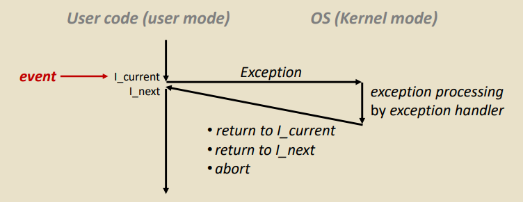
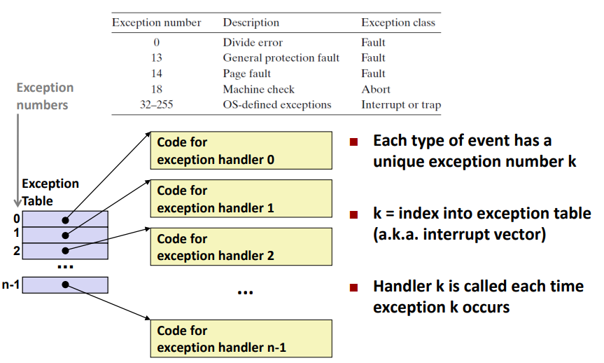
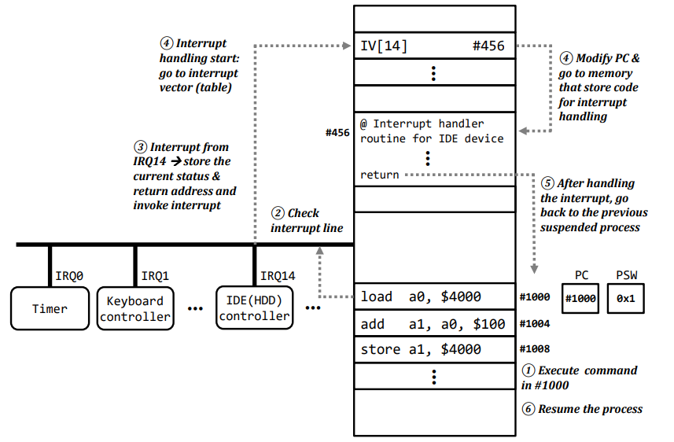

# Chapter 3. Introduction to Computing Systems

### Schematic Overview of Computer System

#### 위 그림에 대한 설명

+ 색상 설명
  - 파랑 네모 : Memory
    - Device에 붙어 있는 Memory는, 해당 device를 controll 하기 위한 정보도 메모리에 포함되어 있다. 
  - 빨강 네모 : register
  - Green Circle : Processing Unit(Controller)
  - 보라색 선 : System Bus

+ mode bit(Register) : 컴퓨터가 동작할 때 2가지 mode가 존재한다
  - CPU 권한을 누가 가지고 있냐에 따라 mode가 달라진다
  - mode bit 1(User Mode) : User가 CPU 권한을 가지고 있을 때, User Program이 돌게 된다. 
  - mode bit 0(Kernel Mode) : CPU에 대한 권한을 OS가 가지고 있을 때이다. 
  - 이렇게 나눈 이유 
    - 컴퓨터 OS는 관리해야 할 것이 많은데, User 에게 이런 Resource 고나리를 모두 일임했을 때 문제가 발생할 수 있다. 
    - 이런 접근(Critical 한 동작)들을 OS 가 관리하는 것이다. 
    - OS가 사전에 약속된 동작들을 수행하게 된다.(Protecting)
  - Linux 에서는 mode bit이 2개라서, cs register라는 곳에서 2bit 주면서 0~3 사이로 관리함. 
  
    
+ Timer : Time-Sharing 을 위한 시간을 hardware 적으로 측정해 주는 것.(hardware)
  - Computer 가 시간에 대한 정보가 필요할 때, Timer로부터 알 수 있음. 
  - Interactivce Computing 을 만들기 위해서 Time-Sharing System 이 필요하다. 
  - Timer 에서 1초가 지나면, Operating System 에서 mode bit을 0으로 돌리고 Context Switching 해줌.

+ I/O Device : 모니터, 프린터, 키보드 등
  - 이 I/O Device 내에도, Device Controller 와, 내부의 local buffer가 들어 있음.  
    
+ 휘발성 메모리(Volatile Memory) : 전원을 끄면 데이터가 날아감. 
  - 대표적인 예시 : SRAM, DRAM

+ 비휘발성 메모리(Non-Volatile Memory) : 전원을 꺼도 데이터가 날아가지 않는 것. 
  - 대표적인 예시 : 하드디스크나 낸드플래스 메모리
  
+ System Call 은 OS가 관리함(당연)  

## Computer System - Timer

+ Interactive Computing System을 위해 필요한 것.(For Time-Slicing)
  - Time-Slicing을 통해 User Experiment를 개선했다. 
  - 개별 유저나 프로세스가 특정 시간동안만 system 과 CPU를 사용할 수 있도록 하는 것에 관여하는 것이 Timer이다. 
  - 시간을 하드웨어적으로 제공한다. 

+ Timer와 Time-Sharing에서, Time-Slicing 하는 것에 있어 Timer Interrupt가 들어간다. 
  - Interrupt : 무엇인가가 진행되고 있는 것을 일부러 Stop 시키는 것. 
    
+ Timer & mode bit 의 연관성
  - Time-Sharing 할 때, 타이머를 써서 time-slicing하는 것이다. 
  - 이때, Time-Sharing 하면서 중간중간에 OS가 권한을 가지게 된다. 
  - 프로그램이나 유저가 권한을 가지고 있으면 CPU가 유저에게 사용권한을 준다. 
    - 이때 mode bit은 user mode(1)
  
  - 중간중간에 서로 다른 프로그램으로 CPU 권한을 넘길 때, CPU를 OS가 받아야 다른 쪽으로 권한을 줄 수 있다. 
    - 이때 중간중간에 mode bit은 kernel mode(0)
    - Timer Interrupt를 걸면서 mode bit을 0으로 갖고 온다. 

+ For Example
  - Program 1, Program 2는 둘다 메인 메모리 상에 올라와 있다고 침.
  - Program 1 이 돌아가고 있다가 Timer Interrupt를 만남.
    - 이때 mode bit 은 1 에서 0으로 바뀜
    
  - OS는 timer에서 나온 정보를 바탕으로 Timer Interrupt를 걸고, context switching 하여 Program 2가 수행할 준비를 끝내고 Program 2에게 CPU 권한을 줌. 
  - Program 2 가 돌아가면서 mode bit은 다시 1로 바뀜(User Mode).
  - Program 2가 1초 동안 돌아갔다가, 다시 Timer Interrupt를 만남. (mode bit : 0, Kernel Mode)
  - OS가 위의 경우와 같이 Timer Interrupt를 건 것이고, 다시 위와 같은 이유로 Program 1 이 돌아감. 
  - 프로세스가 종료될때까지 반복.
  
+ 지정된 Time Slice 에 따라, Timer를 보면서 계속 Timer Interrupt를 OS가 걸고, 그 다음 수행할 것을 찾아서 OS가 그 다음 프로세스에 CPU 권한을 줌. 

## Computer System - I/O Device

+ I/O Device는 각각이 작은 CPU라고 생각하면 된다. 
  - If not) 이걸 만약에 메인 CPU가 한다 치면, 모니터에 띄우는 작업까지 메인 CPU에서 다 해야 한다.
  - 그렇게 치면, CPU는 다른 일을 하러갈 수가 없다. 
  - 그런데 CPU는 입출력을 I/O Device에 던져놓고 다른일 하러 감. 
  - CPU는 명령어만 던져놓고, 잊어버리면 된다. 
  - 그 수행 자체는 각각의 I/O Device Controller가 하는 것이다.(보조기억장치, I/O 장치 포함)
  - 그 결과를 다시 돌려줄때까지, 본래 CPU는 다른 일을 할 수 있다. 
  
+ I/O Device 는 Device Controller 와 Device Driver 로 이루어진다. 
  - 이 Device Controller는 하나의 아주 작은 컴퓨터라고 생각하면 된다. 
    - 작은 CPU이다.
    - 컴퓨터 CPU나 메모리에서 오는 Signal 영역들을, 이 Controller가 처리하는 것이다.
  
  - Device Driver는, Device Controller 가 어떤 동작을 해야 하는지, 그 동작을 관장하는 프로그램이다. 
    - Device Driver 는 I/O Device 내의 자그마한 OS 역할을 수행한다. 
    
## Computer System - Exception(Interrupt)     

+ Exception(Interrupt) : 하던 작업을 중간에서 Stop 시키는 것을 interrupt라고 한다. 

  - User Program 이 동작하던 중에, User Program 내에서 소홀이 할 수 없거나 처리할 수 없는 일이 발생했을 때, 그 User Program은 해당 문제를 어떻게 처리해야 할지 잘 모름.(프로그램 내에서는 해결이 불가하다)
    - ex) 숫자를 0으로 나누었을 때(ArithmeticException), 유저 프로그램은 어떻게 해야 할지 정보가 없다. 
  - 그래서 OS에 이것을 해결해 달라고 요청한다. (Kernel Mode, Mode bit 0)
  - OS 에서는, 각각의 "event" 에 있어 어떻게 처리할지 에 대한 Solution들을 미리 다 저장해서 번호 붙여 놓았다. 
    - 그에 해당하는 "handler" 로 가서, 해당 User Program 에서 나온 문제를 OS가 수행하며, 문제를 해결한다. 
    
  - 그다음, 해결이 되었으면
    - 기존에 수행하던 코드로 돌아갈 수도 있고 (I_Current)
    - 그 다음 코드로 들어갈 수도 있고(I_Next)
    - 잠시 아예 그 자리에서 멈출 수도 있다(Abort)
    - 어쨋든 다음으로 넘어가는 식이다. 
    
+ 일단, 이런 "event" 가 발생하는 것을 모두 총칭해서 Exception 이라고 부른다. 
  - User Program이 기대했던 것이 아닌 예외사항이 발생했을 때.
  - OS 로 넘어가서 먼저 처리되고, User Program에 되돌아온다. 
    
+ 특히나 외부의 Device에서 발생하는 Event에 의한 Exception 때문에 발생하는 것을 Interrupt라고 부른다. 
  - Timer 도 Hardware 인데, Timer 때문에 발생한 Interrupt도 Interrupt이다! (Timer Interrupt)
  
+ 이런 수행의 전체 flow를 exception 처리라고 부른다. 
  
## Asynchronous Exceptions : Interrupt

#### 예외사항이 모두 동일하냐? 그렇지도 않다. 

+ 예외사항이 CPU 외부의 어떤 device 에 의해서 발생하는 것을 보고 interrupt라고 부름.
  - Hardware Exception 이라고도 부르지만, Interrupt라고 자주 부른다. 
  - Exception 을 발생시키는 요인이 Hardware 인 것이다. 
    - 대표적인 예시 : I/O Device, 외부 Networking, Timer
  
  - Process 외부에 있는 Hardware로부터 발생함!
  - Unpredictable
    - 언제 CPU에게 올지 모른다!
    - ex) 키보드로부터 데이터를 받아와야 하는데, 실제 완료되는 시간이 사람마다 당연히 다 다르다. 예측할 수 없다. 
  
#### 다음 Instruction 으로 넘어가야 하느냐, 아니면 현재 코드를 다시 실행해야 하느냐가 Exception들의 큰 구분점이다.

+ 외부에서 오는 Interrupt는 무조건 다음 Instruction을 실행한다.
  - 만약에 scanf를 요청해서, I/O Device 로 부터 "Hello World"를 입력받은 상황이라면, 
  - 다음 코드로 넘어가야 한다. 그 줄을 다시 실행시키면 scanf를 다시 요청하는 것이라서 상황에 맞지 않다. 
 - File을 열람하는 코드라면, 당연히 메모리에 올라가 준비된 상태에서 "다음 코드"로 가야지, 다시 요청하면 상황에 맞지 않을 것이다. 
 
#### Exception 구분 1. Exception 처리 이후 다음 명령어 수행하냐/ 그 Event 발생한 code 재실행하냐 ? 
  
+ Interrupt는 다음 Instruction 수행

## Synchronous Exception 

+ CPU 그 자체에서 trigger 걸려서 나온 Exception을 Synchronous Exception 이라고 부른다. 
  - "Software Interrupt", 혹은 "Internal Interrupt" 라고도 불린다. 

+ Traps
  - 외부에서 문제가 생긴 것은 아니지만, 내부에서 system call을 부르는 경우나, 내부에서 스스로 trigger를 걸어서 OS에게 상황을 주는 것이다. 
  - ex) scanf를 받았을 때, 혼자서는 해결이 안되니, system call을 부르고, I/O를 요청한다음, 다른 것을 수행하고 있다가 그 정보가 들어오면 처리하고 system call을 끝냄. 그리고 그 "다음" 라인으로 감.
  
+ Fault
  - 무엇인가 User가 잘못한 부분이 존재함. or 무엇인가 의도하지 않은 실수를 한 부분이 여기에 해당됨.
  - 가장 대표적인 예시 : Page Fault 
    - 프로세스를 수행할 때, 프로세스는 당연히 메모리 안에 모든 명령과 데이터가 있을 것이라 생각함.
    - 하지만 없으면, Page Fault 준다. 
    - 프로그램에서 수행에 필요한 데이터가 메모리에 없는 경우가 Page Fault 이다. 
    - 이때는 OS에게 요청하고, OS는 원하는 것이 Storage에 있을 수 있다고 판단해 원하는 부분을 Memory에 올린다. 
    
    - 이 Fault 에서, 해결 후 돌아가야 되는 곳은, 이전에 멈추었던 line의 code이다. 문제가 생겨서 해결하고 돌아왔으면 거기서 다시 시작해야 하는 것이다. 
  
+ Abort 
  - 완전히 멈춰버린 것!
  - 의도하지도 않았을 뿐더러, 완전히 에러가 발생한 경우. __OS도 해결방법이 없다__ .
    - 다른 부분은, falut 포함해서, 다 해결방법이 OS 내에 들어가 있다. 
  - 에러를 체크한 것이다. 문제 해결이 되면, 처음부터 다시 시작해야 함. 
  - (저번에 gdb에서 만났을 때는 메모리 침범 문제였었는데, Abort 라고 등장한 적이 있었다.)
  
## Handling Exception

+ Exception 해결 순서를 표현한 것이다 

  1. Exception Number 확인하고, 전달됨.
      - 미리 어떻게 되는 번호인지 다 저장해 놓음. 이 번호를 보고 OS가 아는 것이다. 
      - Page Fault 면 14번. 14번에 해당하는 solution이 OS에 존재한다.
     
  2. OS의 Exception Table 에서 해당하는 번호의 메모리 주소를 참조함.
      - 위의 Page Fault의 경우, 해당 Table에서 14번째 주소를 참조해 그 handler로 이동한다. 
      - 해당 문제의 solution이 위치한 메모리의 주소를 Exception Table 이 가지고 있다. (Pointer 역할)
     
  3. 그 solution 의 코드를 OS가 수행함. 
      - OS가 권한을 갖고 있기 때문에 OS가 수행함.

  4. 그 다음, 상황에 맞게 다음 코드가 실행됨
  
### Summary of Exception 

|Class|발생 이유|Async/Sync|Return 이후|
|:-----:|:-----------:|:----------:|:-----------:|
|Interrupt|I/O device로부터의 signal을 받아서 나옴|Async|항상 다음 명령어 코드로 넘어감|
|Trap|의도된 exception으로부터 발생|Sync|항상 다음 명령어 코드로 넘어감|
|Fault|잠재적으로 해결가능한 에러로부터 발생|Sync|현재 명령어 코드 재실행|
|Abort|OS단에서도 해결할 수 없는 에러|Sync|아예 처음으로 돌아감|

## Example : Interrupt Handler

#### 시험 등장이력 있음

#### Interrupt 처리 순서

1. 메모리의 현재 참조주소 : 1000번지
    - PC(Program Counter) : 현재, 또는 그다음 봐야 할 명령어가 어디에 있는지를 저장하고, 알려주는  Register
    - PC(Program Counter) 가 1000번지를 가리키고 있으니, #1000 에 있는 명령어가 수행된다(어셈블리어)
  
2. load a0, $4000 : 4000번지에 있는 메모리의 데이터를 갖고와서 , a0(register) 에 값을 넣어놔라!
    - 근데 여기서 하드웨어에 있는 값을 가져와야 하는데, Interrupt가 터짐.
    - __Interrupt Line__ 을 체크함. 
    - System Bus 에 같이 있음
    
3.     
