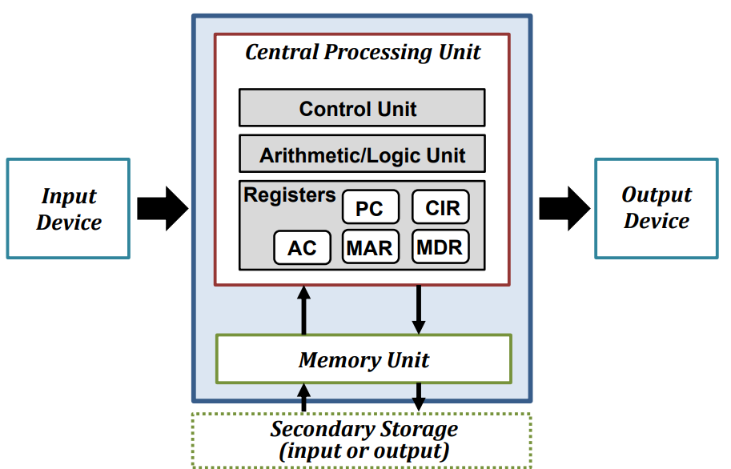
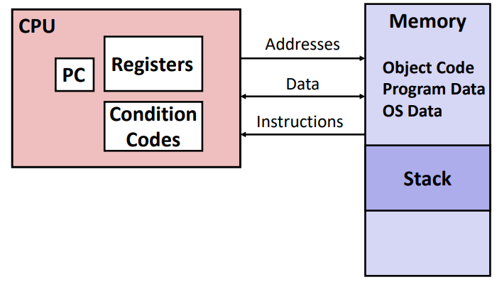
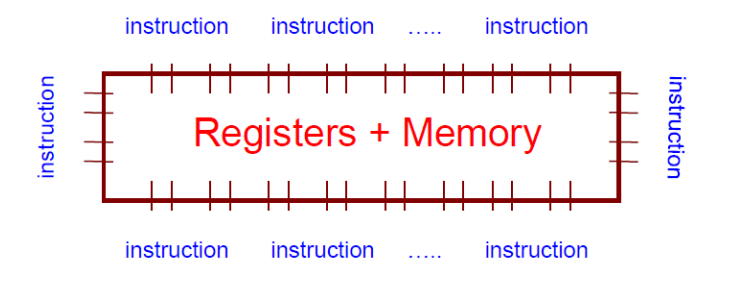
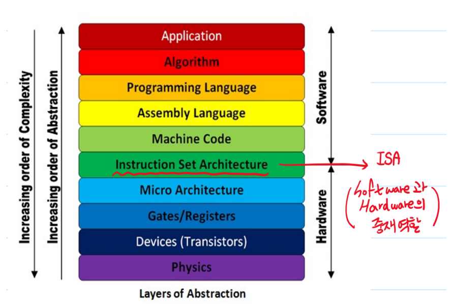
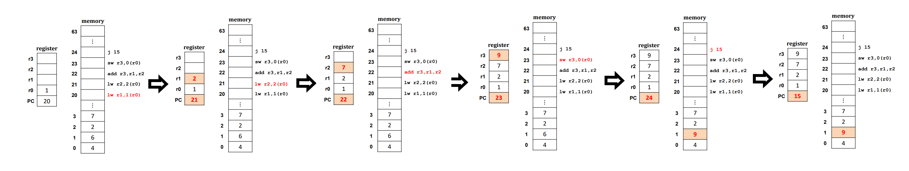

# Chapter 4 & 5. The Abstraction : Process

+ Virtualization : 내가 가지고 있는 resource가 물리적으로 제한되어 있음에도 불구하고, User에게는 무한한 Logical 한 Resource를 제공할 수 있는 것만 같은 illusion을 제공하는 것.
+ 수업에서는 single-core 환경을 가정함

+ CPU Virtualization : 한개의 CPU가 있지만, 사용자에게는 무한개의 logical CPU가 있는 것처럼 환상을 주는 기법

+ Memory Virtualizaiton : 물리적 메모리의 사이즈는 제한되어 있지만, 어떤 기법들을 가지고 사용자에게 무한한 크기의 logical 메모리 크기가 있어 보이는것같은 illustion을 제공해 주는 기법.

## Von Neumann Machine

+ 폰 노이만 머신(Von Neumann Machine) : 모든 성격의 머신의 Prototype
+ 폰 노이만 머신에 포함되어야 하는 것
   - 산술 논리 장치와 프로세스 레지스터를 포함하는 "처리 장치"
   - 명령 레지스터와 Program COunter를 포함하는 Control Unit
   - 데이터와 명령어를 저장하는 (Main)Memory
   - 외부 대용량 저장장치
   - 레지스터 
      - 컴퓨터 프로세서 내에서 자료를 보관하는 아주빠른 기억 장치. 
      - 메모리 계층의 최상위에 위치하며, 가장 빠른 속도로 접근 가능한 메모리.

+ 폰 노이만 Architecture에서, CPU 는 오로지 메인메모리하고만 통신함. 

+ Programmer의 관점에서 바라보는 CPU와 Main Memory
   - CPU 안에는 여러 register들이 있어서, CPU를 보조해줌. 
   - 메모리는, Array of Byte로 되어 있음. 
      - 그냥 1byte 가 아래로 쭉 있는 배열
      
## Appendix : Instruction Set Architecture(ISA)    

+ Instruction Set Architecture : (프로세서가 인식해서 기능을 이해하고, 실행할 수 있는 기계어)명령어 집합.
   - 명령어 : 프로그래밍 언어로 짠 코드를 컴파일한, 기계어 level의 instruction (Machine Level Language)
   - 컴퓨터와 대화하기 위해서는, 기계어가 되어야 함. 
   - 컴퓨터를 잘 몰라도, 기계어로 컴퓨터와 대화할 수 있음. 기계어도 Interface 라고 할 수 있다. 
   
   - 명령어의 각 비트는 기능적으로 분할하여 의미를 부여하고 숫자화한다. 
   

+ Software 에서 Hardware 로 넘어가는 단계에서 중재자 역할을 해 주는 것이 ISA라고 할 수 있다.

### Appendix : Instruction Set Architecture Example

+ lw : word 단위로 load

1. lw r1,1(r0) : r0 에 있는 값을 +1 한 메모리 주소로 가서 거기에 있는 값을 r1 레지스터에 집어넣기
   - r0에 있는 값은 1, 거기에 +1 하면 2, 2번지에 있는 값을 r1에 저장해서, r1에 2가 저장되었다.
   - Program Counter : 21로 바뀜

2. lw r2,2(r0) : r0 에 있는 값을 +2 한 메모리 주소로 가서, 거기서 있는 값을 r2 레지스터에 집어넣기 
   - r0 에 있는 값은 1, 거기에 +2 하면 3, 3번지에 있는 값을 r2에 저장. r2가 7이 되었다. 
   - Program Counter : 22로 바뀜.
   
3. add r3,r1,r2 : r1, r2에 있는 값을 더해서 r3에 업데이트.
   - r1 : 2 / r2 : 7  이므로, r3에 2+7 = 9. 9를 r3에 업데이트.
   - Program Counter : 23으로 바뀜. 
   
4. sw r3,0(r0) : r3에 있는 값을 메모리 주소 r0에 저장하기.
   - r3에 있는 값인 9가 1번지 메모리 주소에 저장됨. 
   - Program Counter : 24로 바뀜. 
   
5. j 15 : 다음 수행할 명령어인 15로 점프할 것
   - Program Counter 만 15로 바뀜. 
   
#### 1 by 1 으로 수행하면서, 레지스터나 메모리에 업데이트함.    
   
