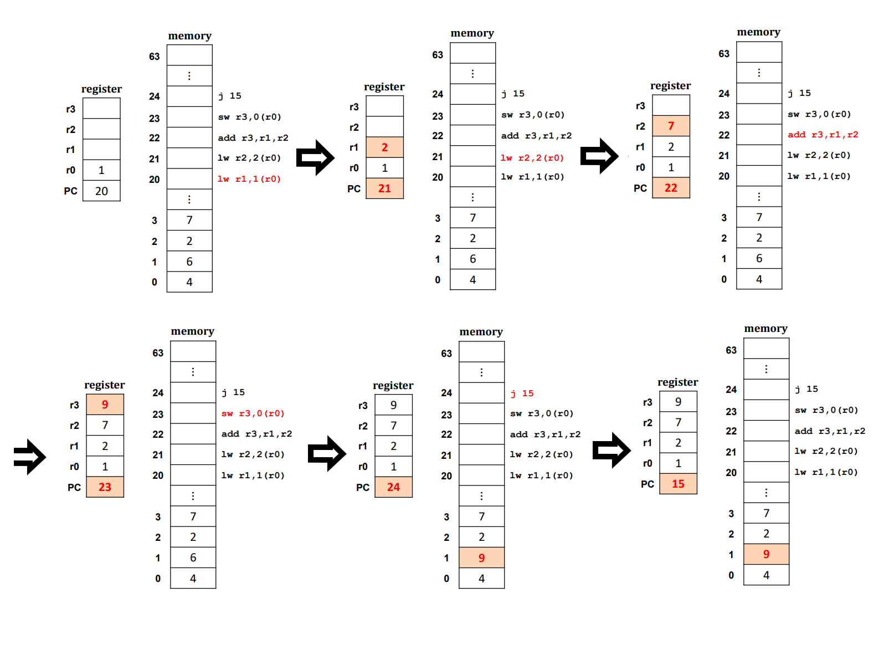

# Chapter 4 & 5. The Abstraction : Process

+ Virtualization : 내가 가지고 있는 resource가 물리적으로 제한되어 있음에도 불구하고, User에게는 무한한 Logical 한 Resource를 제공할 수 있는 것만 같은 illusion을 제공하는 것.
+ 수업에서는 single-core 환경을 가정함

+ CPU Virtualization : 한개의 CPU가 있지만, 사용자에게는 무한개의 logical CPU가 있는 것처럼 환상을 주는 기법

+ Memory Virtualizaiton : 물리적 메모리의 사이즈는 제한되어 있지만, 어떤 기법들을 가지고 사용자에게 무한한 크기의 logical 메모리 크기가 있어 보이는것같은 illustion을 제공해 주는 기법.

## Von Neumann Machine

+ 폰 노이만 머신(Von Neumann Machine) : 모든 성격의 머신의 Prototype
+ 폰 노이만 머신에 포함되어야 하는 것
   - 산술 논리 장치와 프로세스 레지스터를 포함하는 "처리 장치"
   - 명령 레지스터와 Program COunter를 포함하는 Control Unit
   - 데이터와 명령어를 저장하는 (Main)Memory
   - 외부 대용량 저장장치
   - 레지스터 
      - 컴퓨터 프로세서 내에서 자료를 보관하는 아주빠른 기억 장치. 
      - 메모리 계층의 최상위에 위치하며, 가장 빠른 속도로 접근 가능한 메모리.

+ 폰 노이만 Architecture에서, CPU 는 오로지 메인메모리하고만 통신함.

+ Von Neumann Machine 과 지금의 컴퓨터
   - Von Neumann Machine 에서의 레지스터 숫자 보다는 지금의 레지스터가 16개(혹은 32개)로 더 많다. 
   - 하지만, 레지스터가 하는 역할 자체는 Von Neumann Machine 에서나 지금의 컴퓨터에서나 같다. 
   - 같은 프로그램을 수행하기 위해 필요한 Information 들을 레지스터에 담아와서, 레지스터에 있는 값들을 가지고 연산하는 것이다. 
   - 연산된 값도 다시 메모리에 주는 것도, 현재의 컴퓨터나 그때의 Von Neumann Machine과 같다. 
      - Output Device에 CPU가 직접적으로 데이터를 줄 수가 없다. 
      - 무조건 메모리에 담아야 하고, 메모리에 담고 있는 데이터를 Output Device에 넘겨주는 것이다. 
      
+ Registers
   - AC(Accumulator Register) : 누산 레지스터. 연산장치의 입출력 데이터를 임시적으로 기억하는 레지스터.
   - PC(Program Counter) : CPU가 그 다음 참조해야 하는 명령어 코드 주소를 가지고 있는 레지스터. 
   - CIR(Current Instruction Register) : 명령어 레지스터. 명령어를 읽어와 저장하는 레지스터. 해독,수행하기 전에 이 레지스터를 거친다. 
   - MAR(Memory Address Register) : 현재 접근할 메인 메모리의 주소를 기억하는 레지스터
   - MDR(Memory Data Register) : 메인 메모리로부터 읽거나 쓰여질 데이터를 일시적으로 저장하는 레지스터

+ Register가 필요한 이유 : CPU는 동시에 여러 개를 계산할 수 없으니, 중간에 저장하기 위해 레지스터가 실제로 필요할 수 밖에 없다. 

+ Programmer의 관점에서 바라보는 CPU와 Main Memory
   - CPU 안에는 여러 register들이 있어서, CPU를 보조해줌. 
   - 메모리는, Array of Byte로 되어 있음. 
      - 그냥 1byte 가 아래로 쭉 있는 배열
      
## Appendix : Instruction Set Architecture(ISA)    

+ Instruction Set Architecture : (프로세서가 인식해서 기능을 이해하고, 실행할 수 있는 기계어)명령어 집합.
   - 명령어 : 프로그래밍 언어로 짠 코드를 컴파일한, 기계어 level의 instruction (Machine Level Language)
   - 컴퓨터와 대화하기 위해서는, 기계어가 되어야 함. 
   - 컴퓨터를 잘 몰라도, 기계어로 컴퓨터와 대화할 수 있음. 기계어도 Interface 라고 할 수 있다. 
   
   - 명령어의 각 비트는 기능적으로 분할하여 의미를 부여하고 숫자화한다. 
   

+ Software 에서 Hardware 로 넘어가는 단계에서 중재자 역할을 해 주는 것이 ISA라고 할 수 있다.

+ State Machine
   - 우리가 어떤 명령어를 주면, state가 하나씩 바뀌는 Machine
   - 우리가 아는 모든 디지털 기기는 finite state machine 이다. 
   - state 라고 하는 것은, 메모리나 레지스터 두개를 묶어서 말하는 것이다. 
   - Insturction Set 이라고 하는 것은, 결국에는 "State를 바꾸는 일" 밖에는 하는 것이 없다. 
   - ex)
      - 1+2 = 3을 계산할 때, Register 두개에 1,2를 넣고, 결과를 다른 레지스터에 넣는다. 
      - 결과를 다른 레지스터에 넣었으면, 해당 레지스터에는 이전의 어떤 값에서 3으로 그 state가 바뀌는 것이다. 
      - 반대로, 이 결과값을 출력하고 싶으면, 레지스터 값을 출력하고 싶은 메모리에 다시 넣어 주어야 한다. 
   
   - Instruction Set이라고 하는 것은, 복잡한 문법을 다 차치하고, 결국에는 State를 바꾸는 것이다. 
   - 그리고 State는 메모리 와 레지스터를 말한다. 
   
   

### Appendix : Instruction Set Architecture Example

+ lw : word 단위로 load

1. lw r1,1(r0) : r0 에 있는 값을 +1 한 메모리 주소로 가서 거기에 있는 값을 r1 레지스터에 집어넣기
   - r0에 있는 값은 1, 거기에 +1 하면 2, 2번지에 있는 값을 r1에 저장해서, r1에 2가 저장되었다.
   - Program Counter : 21로 바뀜

2. lw r2,2(r0) : r0 에 있는 값을 +2 한 메모리 주소로 가서, 거기서 있는 값을 r2 레지스터에 집어넣기 
   - r0 에 있는 값은 1, 거기에 +2 하면 3, 3번지에 있는 값을 r2에 저장. r2가 7이 되었다. 
   - Program Counter : 22로 바뀜.
   
3. add r3,r1,r2 : r1, r2에 있는 값을 더해서 r3에 업데이트.
   - r1 : 2 / r2 : 7  이므로, r3에 2+7 = 9. 9를 r3에 업데이트.
   - Program Counter : 23으로 바뀜. 
   
4. sw r3,0(r0) : r3에 있는 값을 메모리 주소 r0에 저장하기.
   - r3에 있는 값인 9가 1번지 메모리 주소에 저장됨. 
   - Program Counter : 24로 바뀜. 
   
5. j 15 : 다음 수행할 명령어인 15로 점프할 것
   - Program Counter 만 15로 바뀜. 
   
#### 1 by 1 으로 수행하면서, 레지스터나 메모리에 업데이트함.    
   
## Appendix : (Virtual) Memory (Logical Memory)

+ Logical Memory 부분이라는 것을 잊지 말자! 

+ 그리고 당연히, Memory 는 Byte Array이다.

+ 32bit Architecture
   - 32bit Architecture는 4 byte 단위로 명령어가 이루어져 있다(1byte = 8bit)
   - 명령어 길이가 32bit이다. 
   - 32bit Architecture 는, 메모리 구조도 32bit 단위로 어떻게든 이루어진다. 
   - 32bit을 가지고 표현할 수 있는 경우의 갯수는 2^32 개 이다. 2^32 B 는 4GB이다.
      - 그래서 32bit Architecture가 가질 수 있는 Maximum Memory Size 가 4GB 이다. 
   - 메모리 주소 길이가 32bit을 넘지 못한다. 
      
#### 질문 : 32 bit Architecture 에서, 1byte가 쭉 이어져 있는 것이 메모리이고, 명령어의 길이가 32bit 으로 이루어져 있는데, 하나의 메모리 주소가 가질 수 있는 size 는 어떻게 1byte 인가? 
#### 혹시 하나의 메모리 주소가 가리키는 부분이 1byte 라는 의미로 받아들이면 되는 것일까? 메모리 "한 칸" 이라서? -> 화요일 가서 질문하기. 

+ CPU가 바라보는 메모리는, bytes Array이고, 메모리 size는 CPU가 몇 bit Architecture 이냐에 따라 다르다
   - 32bit Architecture 일 때는 4GB, 64bit Architecture 일 때는 4 * 2^32 GB

+ (메모리 주소가)0000 0000 ~ FFFF FFFF 까지 있다(32bit Architecture)
   - 이 구조로 구분할 수 있는 경우의 수는 2^32 개 이다. 그리고 이 경우의 수를 byte 하나에 매칭해 보면, 2^32 byte = 4GB 가 나온다. 
   - 그래서 Maximum Memory Size가 4GB가 나오는 것이다. 
   - 근데 지금 돌리는 게임 크기가 4GB 넘는 것들이 있는데, 이 부분은 어떻게 할 것인가? 에 대한 문제가 나온다. 
      - By Memory Virtualization(무한한 메모리가 있는 것처럼 보이는 Virtualizaiton)

+ Kernel(OS) :  운영체제 부분이 메모리에 상주함. 
   - OS 영역은 메모리에 고정적으로 들어간다 
   - Linux는 25%, Windwos는 50% 정도가 메모리에 상주한다고 한다. 

+ Instructions : 유저 프로그램의 명령어(코드) 가 들어가는 부분이다.
 
+ Literals : 프로세스가 시작할 때 초기화되며, literal 상수(메모리 상의 값이 변하지 않는 데이터) 가 들어가는 부분이다. 

+ Static Data : 스태틱 영역의 데이터들이 들어가는 부분이다,. 

+ Stack : 함수(function) 이나 지역변수(local variable) 이 들어가는 부분이다. 

+ Heap : 동적 메모리할당(malloc, new 등의 키워드로 메모리 할당) 된 부분이 Heap 에 들어간다. 

+ 확실히 알아야 하는 것 : Virtual Memory 중 일부는 OS, 다른 일부는 User Program 영역에 들어간다는 사실을 알자.

## CPU Virtualization 

+ CPU Virtualization 의 등장
   - 컴퓨터가 가지고 있는 Physical Core(CPU) 는, (가정상) 1개이다. 
   - 하지만, User, Programmer 에게 무한개 처럼 보이는 Logical CPU를 제공해야 함. 
   
+ How to CPU Virtualize?
   - OS에 의해서 구현된 것이 동작한다. 
   - Time-Sharing 으로 동작한다.
      - 각각의 User, 개별 Process, Program에 각각 CPU를 사용할 수 있는 시간을 주고, 그 시간동안만 사용한다는 개념
      - 그럼에도 불구하고, CPU 처리 성능이 유저의 인식속도보다 굉장히 빠르기 때문에, User 혼자서 쓴다는 착각을 만들 수 있을 정도가 되어서 이런 CPU Virtualization 이 가능했다. 
      - 일단 기본적으로 Round-Robin 방식이 대표적인 Time-Sharing 방식이다.
      
#### 그렇다면, Time-Sharing 을 위해 고려해야할 점은 어떤 것이 있는가?

+ 구현하기 위해서는 크게 2가지를 고려해야 한다. 

1. 어떻게 지금 돌아가고 있는 프로세스를 정지시키고(끊고), 다른 프로세스를 수행했다가, 이어서 __다시 아무런 문제없이 돌아와서 끝까지 잘 수행되어 기대했던 결과를 낼 것인가?__
      - 절대 기존에 기대했던 결과와 달라서는 안되겠다. 한마디로, Time-Sharing 이 프로그램이 동작하는 것에 대해 영향을 미치는 것처럼 보여서는 안 되겠다. 
      - Timer Interrupt를 이용해서 처리하면 될 것이다.

2. 이런 Time-Sharing 이 구현되어 사용 가능하도록 Hardware와 Software가 준비되었다고 한다면, 만약 프로세스가 2개가 아닌 __10개, 100개가 되었을 때 그 다음 처리해야 할 프로세스는 어떻게 결정하며, 어떤 과정으로 Process 에게 CPU 권한을 줄 것인지?__
      - 그냥 순서대로 줄 것인지?(FIFO)
      - OS 는, Process를 Stop 시키고 나서 어떤 Process 에게 CPU 권한을 줄 것인지 결정해야 한다. 
      - 10개 중 일부 Process 를 끝냈는데, 3개의 프로세스가 새로 들어온다면 어떤 순서대로 배분할 것인지?
      
+ 이런 Scheduling을 OS가 처리하게 된다. 

## A Process

+ 앞에서는, Program, Process를 혼돈해서 사용했지만, 전공했다고 말하려면 구별해서 말할 수 있어야 한다. 

### Program vs Process vs Processor

+ Processor : 하드웨어(CPU 프로세서, 중앙처리기, 처리기 등)을 말함. 

+ Program : 실행가능한(executable, reloadable) 형태의 Object File(or Something).
   - 저장장치(SSD, HDD) 에 상주하고 있음. 
   - Program 은 code + data 의 집합이다. 
   - Instruction + 실행할 때 필요한 data 들의 집합. 
   - 그냥 Disk에 상주할 뿐이다. 
   - 그렇기에 CPU 권한을 획득하지 못하고, 실행 "가능" 할 뿐, 실행될 준비가 되어있지는 않다.
   - status 가 없다.
   
+ Process : Program 이 Memory(DRAM) 에 load가 되어 실행할 수 있게 되는 상태 
   - Process는 "Instance of Running Program"(러닝 프로그램 자체인 객체) 이다. 
   - 실행 시, 위치가 메모리에 올라와 있다. 
   - Active Entity. (State가 가변적이다)
   - 실행되고 있는 형태의 것이다. 
   - Time-Sharing System 에서 실제로 관심있는 것은 이 "Process" 이다!
   - Program 이라는 말은 이제 Persistence 이야기하기 전까지는 등장하지 않는다. 거의 Process에 주안점을 두고 이야기가 나온다. 
   - Time-Sharing System 에서, 하나를 끊고 다른 것을 수행할때, 이게 가능할려면 메모리에 "Processs" 상태에 있어야 한다는 것을 전제로 한다. 

+ 만약 지금 갖고 있는 system이 Single Core Process System 이라면, Program 과 Process 는 혼돈될 수 있음.
   - 어차피 그렇다면, 수행가능한 프로그램이 하나밖에 없음. 
   - 저장장치에서 딱 하나의 "프로그램"만 메모리에 올라올 것임. 
   - 이때는 프로그램과 프로세스가 동일한 의미로 사용될 수 있다. 
   - 하지만 지금 시스템에서는 그럴 수 없다!
   
+ Program vs Process 의 차이점
   - 가장 크고 의미있는 차이중 첫번째는, CPU 권한을 받아 동작할 수 있냐 없냐의 차이다.
      - 두 개가 각각 어디에 있느냐로 함축해 표현되기도 한다. 
      - Program은 저장장치(디스크) 에 그냥 존재하지만, Process는 메모리에 올라와야지만 비로소 탄생한다. 
   
   - 두번째 차이 
      - 프로그램은 status(lifecycel)가 없지만, 프로세스는 lifecycle을 갖는다. 
      - 프로그램은 그냥 SSD, HDD에 존재하는 것일 뿐이다.
      - 하지만, 프로세스는 Lifecycle 을 갖는다. 즉, 메모리에 올라오면 탄생된 것이고, 메모리에 올라오기 전에는 해당 프로세스가 존재하지 않는 것이다. 
      - 메모리에 올라와야만 creation 된 것이고, run 되기도 하며, CPU를 할당받으려 기다리고 있기도 하고(waiting), 메모리에서 쫓겨나기도 한다(exit)
      - Process는 exit 되기도 했지만, 그 상태에서 메모리에 다시 올라가려고 대기 상태가 되기도 한다(zombie state)
      - 이렇게 프로세스는 다양한 상태(status)를 가질 수 있다.
   
   - 메모리에 있냐 vs 디스크에 있냐 차이가 제일 두드러지게 알 수 있는 차이점이라고 볼 수 있겠다. 그리고 실행준비 유무 정도. 

+ 쉽게 볼 수 있는 Program vs Process
   - Chrome Browser 를 키기 전에 바탕화면에 존재하는 것(Chrome)은 Program.
   - 더블클릭해서 Chrome 이 켜지면, Process가 그제서야 수행되는 것이다. 
      - 더블클릭 : 하드웨어에 있는 프로그램이 메모리에 올라와서 CPU 사용권한을 획득하고, 수행됨. 

+ 추가적인 이야기 
   - 메모리는 항상 제한적이라서, Process 라 하더라도, 전체를 다 올려서 사용하지는 않는다.
   - 우리가 당장 필요한 것만 올려서 사용한다. 
   
