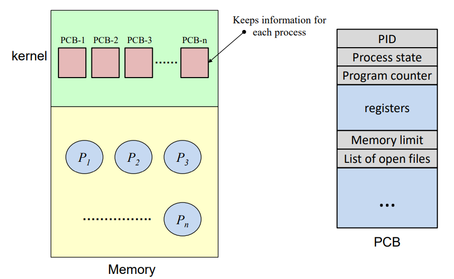

# Chapter 4 & 5. The Abstraction : Process

+ Virtualization : 내가 가지고 있는 resource가 물리적으로 제한되어 있음에도 불구하고, User에게는 무한한 Logical 한 Resource를 제공할 수 있는 것만 같은 illusion을 제공하는 것.
+ 수업에서는 single-core 환경을 가정함

+ CPU Virtualization : 한개의 CPU가 있지만, 사용자에게는 무한개의 logical CPU가 있는 것처럼 환상을 주는 기법

+ Memory Virtualizaiton : 물리적 메모리의 사이즈는 제한되어 있지만, 어떤 기법들을 가지고 사용자에게 무한한 크기의 logical 메모리 크기가 있어 보이는것같은 illustion을 제공해 주는 기법.

## Von Neumann Machine

+ 폰 노이만 머신(Von Neumann Machine) : 모든 성격의 머신의 Prototype
+ 폰 노이만 머신에 포함되어야 하는 것
   - 산술 논리 장치와 프로세스 레지스터를 포함하는 "처리 장치"
   - 명령 레지스터와 Program COunter를 포함하는 Control Unit
   - 데이터와 명령어를 저장하는 (Main)Memory
   - 외부 대용량 저장장치
   - 레지스터 
      - 컴퓨터 프로세서 내에서 자료를 보관하는 아주빠른 기억 장치. 
      - 메모리 계층의 최상위에 위치하며, 가장 빠른 속도로 접근 가능한 메모리.

+ 폰 노이만 Architecture에서, CPU 는 오로지 메인메모리하고만 통신함.

+ Von Neumann Machine 과 지금의 컴퓨터
   - Von Neumann Machine 에서의 레지스터 숫자 보다는 지금의 레지스터가 16개(혹은 32개)로 더 많다. 
   - 하지만, 레지스터가 하는 역할 자체는 Von Neumann Machine 에서나 지금의 컴퓨터에서나 같다. 
   - 같은 프로그램을 수행하기 위해 필요한 Information 들을 레지스터에 담아와서, 레지스터에 있는 값들을 가지고 연산하는 것이다. 
   - 연산된 값도 다시 메모리에 주는 것도, 현재의 컴퓨터나 그때의 Von Neumann Machine과 같다. 
      - Output Device에 CPU가 직접적으로 데이터를 줄 수가 없다. 
      - 무조건 메모리에 담아야 하고, 메모리에 담고 있는 데이터를 Output Device에 넘겨주는 것이다. 
      
+ Registers
   - AC(Accumulator Register) : 누산 레지스터. 연산장치의 입출력 데이터를 임시적으로 기억하는 레지스터.
   - PC(Program Counter) : CPU가 그 다음 참조해야 하는 명령어 코드 주소를 가지고 있는 레지스터. 
   - CIR(Current Instruction Register) : 명령어 레지스터. 명령어를 읽어와 저장하는 레지스터. 해독,수행하기 전에 이 레지스터를 거친다. 
   - MAR(Memory Address Register) : 현재 접근할 메인 메모리의 주소를 기억하는 레지스터
   - MDR(Memory Data Register) : 메인 메모리로부터 읽거나 쓰여질 데이터를 일시적으로 저장하는 레지스터

+ Register가 필요한 이유 : CPU는 동시에 여러 개를 계산할 수 없으니, 중간에 저장하기 위해 레지스터가 실제로 필요할 수 밖에 없다. 

+ Programmer의 관점에서 바라보는 CPU와 Main Memory
   - CPU 안에는 여러 register들이 있어서, CPU를 보조해줌. 
   - 메모리는, Array of Byte로 되어 있음. 
      - 그냥 1byte 가 아래로 쭉 있는 배열
      
## Appendix : Instruction Set Architecture(ISA)    

+ Instruction Set Architecture : (프로세서가 인식해서 기능을 이해하고, 실행할 수 있는 기계어)명령어 집합.
   - 명령어 : 프로그래밍 언어로 짠 코드를 컴파일한, 기계어 level의 instruction (Machine Level Language)
   - 컴퓨터와 대화하기 위해서는, 기계어가 되어야 함. 
   - 컴퓨터를 잘 몰라도, 기계어로 컴퓨터와 대화할 수 있음. 기계어도 Interface 라고 할 수 있다. 
   
   - 명령어의 각 비트는 기능적으로 분할하여 의미를 부여하고 숫자화한다. 
   

+ Software 에서 Hardware 로 넘어가는 단계에서 중재자 역할을 해 주는 것이 ISA라고 할 수 있다.

+ State Machine
   - 우리가 어떤 명령어를 주면, state가 하나씩 바뀌는 Machine
   - 우리가 아는 모든 디지털 기기는 finite state machine 이다. 
   - state 라고 하는 것은, 메모리나 레지스터 두개를 묶어서 말하는 것이다. 
   - Insturction Set 이라고 하는 것은, 결국에는 "State를 바꾸는 일" 밖에는 하는 것이 없다. 
   - ex)
      - 1+2 = 3을 계산할 때, Register 두개에 1,2를 넣고, 결과를 다른 레지스터에 넣는다. 
      - 결과를 다른 레지스터에 넣었으면, 해당 레지스터에는 이전의 어떤 값에서 3으로 그 state가 바뀌는 것이다. 
      - 반대로, 이 결과값을 출력하고 싶으면, 레지스터 값을 출력하고 싶은 메모리에 다시 넣어 주어야 한다. 
   
   - Instruction Set이라고 하는 것은, 복잡한 문법을 다 차치하고, 결국에는 State를 바꾸는 것이다. 
   - 그리고 State는 메모리 와 레지스터를 말한다. 
   
   

### Appendix : Instruction Set Architecture Example

+ lw : word 단위로 load

1. lw r1,1(r0) : r0 에 있는 값을 +1 한 메모리 주소로 가서 거기에 있는 값을 r1 레지스터에 집어넣기
   - r0에 있는 값은 1, 거기에 +1 하면 2, 2번지에 있는 값을 r1에 저장해서, r1에 2가 저장되었다.
   - Program Counter : 21로 바뀜

2. lw r2,2(r0) : r0 에 있는 값을 +2 한 메모리 주소로 가서, 거기서 있는 값을 r2 레지스터에 집어넣기 
   - r0 에 있는 값은 1, 거기에 +2 하면 3, 3번지에 있는 값을 r2에 저장. r2가 7이 되었다. 
   - Program Counter : 22로 바뀜.
   
3. add r3,r1,r2 : r1, r2에 있는 값을 더해서 r3에 업데이트.
   - r1 : 2 / r2 : 7  이므로, r3에 2+7 = 9. 9를 r3에 업데이트.
   - Program Counter : 23으로 바뀜. 
   
4. sw r3,0(r0) : r3에 있는 값을 메모리 주소 r0에 저장하기.
   - r3에 있는 값인 9가 1번지 메모리 주소에 저장됨. 
   - Program Counter : 24로 바뀜. 
   
5. j 15 : 다음 수행할 명령어인 15로 점프할 것
   - Program Counter 만 15로 바뀜. 
   
#### 1 by 1 으로 수행하면서, 레지스터나 메모리에 업데이트함.    
   
## Appendix : (Virtual) Memory (Logical Memory)

+ Logical Memory 부분이라는 것을 잊지 말자! 

+ 그리고 당연히, Memory 는 Byte Array이다.

+ 32bit Architecture
   - 32bit Architecture는 4 byte 단위로 명령어가 이루어져 있다(1byte = 8bit)
   - 명령어 길이가 32bit이다. 
   - 32bit Architecture 는, 메모리 구조도 32bit 단위로 어떻게든 이루어진다. 
   - 32bit을 가지고 표현할 수 있는 경우의 갯수는 2^32 개 이다. 2^32 B 는 4GB이다.
      - 그래서 32bit Architecture가 가질 수 있는 Maximum Memory Size 가 4GB 이다. 
   - 메모리 주소 길이가 32bit을 넘지 못한다. 
      
#### 질문 : 32 bit Architecture 에서, 1byte가 쭉 이어져 있는 것이 메모리이고, 명령어의 길이가 32bit 으로 이루어져 있는데, 하나의 메모리 주소가 가질 수 있는 size 는 어떻게 1byte 인가? 
#### 혹시 하나의 메모리 주소가 가리키는 부분이 1byte 라는 의미로 받아들이면 되는 것일까? 메모리 "한 칸" 이라서? -> 화요일 가서 질문하기. 

+ CPU가 바라보는 메모리는, bytes Array이고, 메모리 size는 CPU가 몇 bit Architecture 이냐에 따라 다르다
   - 32bit Architecture 일 때는 4GB, 64bit Architecture 일 때는 4 * 2^32 GB

+ (메모리 주소가)0000 0000 ~ FFFF FFFF 까지 있다(32bit Architecture)
   - 이 구조로 구분할 수 있는 경우의 수는 2^32 개 이다. 그리고 이 경우의 수를 byte 하나에 매칭해 보면, 2^32 byte = 4GB 가 나온다. 
   - 그래서 Maximum Memory Size가 4GB가 나오는 것이다. 
   - 근데 지금 돌리는 게임 크기가 4GB 넘는 것들이 있는데, 이 부분은 어떻게 할 것인가? 에 대한 문제가 나온다. 
      - By Memory Virtualization(무한한 메모리가 있는 것처럼 보이는 Virtualizaiton)

+ Kernel(OS) :  운영체제 부분이 메모리에 상주함. 
   - OS 영역은 메모리에 고정적으로 들어간다 
   - Linux는 25%, Windwos는 50% 정도가 메모리에 상주한다고 한다. 

+ Instructions : 유저 프로그램의 명령어(코드) 가 들어가는 부분이다.
 
+ Literals : 프로세스가 시작할 때 초기화되며, literal 상수(메모리 상의 값이 변하지 않는 데이터) 가 들어가는 부분이다. 

+ Static Data : 스태틱 영역의 데이터들이 들어가는 부분이다,. 

+ Stack : 함수(function) 이나 지역변수(local variable) 이 들어가는 부분이다. 

+ Heap : 동적 메모리할당(malloc, new 등의 키워드로 메모리 할당) 된 부분이 Heap 에 들어간다. 

+ 확실히 알아야 하는 것 : Virtual Memory 중 일부는 OS, 다른 일부는 User Program 영역에 들어간다는 사실을 알자.

## CPU Virtualization 

+ CPU Virtualization 의 등장
   - 컴퓨터가 가지고 있는 Physical Core(CPU) 는, (가정상) 1개이다. 
   - 하지만, User, Programmer 에게 무한개 처럼 보이는 Logical CPU를 제공해야 함. 
   
+ How to CPU Virtualize?
   - OS에 의해서 구현된 것이 동작한다. 
   - Time-Sharing 으로 동작한다.
      - 각각의 User, 개별 Process, Program에 각각 CPU를 사용할 수 있는 시간을 주고, 그 시간동안만 사용한다는 개념
      - 그럼에도 불구하고, CPU 처리 성능이 유저의 인식속도보다 굉장히 빠르기 때문에, User 혼자서 쓴다는 착각을 만들 수 있을 정도가 되어서 이런 CPU Virtualization 이 가능했다. 
      - 일단 기본적으로 Round-Robin 방식이 대표적인 Time-Sharing 방식이다.
      
#### 그렇다면, Time-Sharing 을 위해 고려해야할 점은 어떤 것이 있는가?

+ 구현하기 위해서는 크게 2가지를 고려해야 한다. 

1. 어떻게 지금 돌아가고 있는 프로세스를 정지시키고(끊고), 다른 프로세스를 수행했다가, 이어서 __다시 아무런 문제없이 돌아와서 끝까지 잘 수행되어 기대했던 결과를 낼 것인가?__
      - 절대 기존에 기대했던 결과와 달라서는 안되겠다. 한마디로, Time-Sharing 이 프로그램이 동작하는 것에 대해 영향을 미치는 것처럼 보여서는 안 되겠다. 
      - Timer Interrupt를 이용해서 처리하면 될 것이다.

2. 이런 Time-Sharing 이 구현되어 사용 가능하도록 Hardware와 Software가 준비되었다고 한다면, 만약 프로세스가 2개가 아닌 __10개, 100개가 되었을 때 그 다음 처리해야 할 프로세스는 어떻게 결정하며, 어떤 과정으로 Process 에게 CPU 권한을 줄 것인지?__
      - 그냥 순서대로 줄 것인지?(FIFO)
      - OS 는, Process를 Stop 시키고 나서 어떤 Process 에게 CPU 권한을 줄 것인지 결정해야 한다. 
      - 10개 중 일부 Process 를 끝냈는데, 3개의 프로세스가 새로 들어온다면 어떤 순서대로 배분할 것인지?
      
+ 이런 Scheduling을 OS가 처리하게 된다. 

## A Process

+ 앞에서는, Program, Process를 혼돈해서 사용했지만, 전공했다고 말하려면 구별해서 말할 수 있어야 한다. 

### Program vs Process vs Processor

+ Processor : 하드웨어(CPU 프로세서, 중앙처리기, 처리기 등)을 말함. 

+ Program : 실행가능한(executable, reloadable) 형태의 Object File(or Something).
   - 저장장치(SSD, HDD) 에 상주하고 있음. 
   - Program 은 code + data 의 집합이다. 
   - Instruction + 실행할 때 필요한 data 들의 집합. 
   - 그냥 Disk에 상주할 뿐이다. 
   - 그렇기에 CPU 권한을 획득하지 못하고, 실행 "가능" 할 뿐, 실행될 준비가 되어있지는 않다.
   - status 가 없다.
   
+ Process : Program 이 Memory(DRAM) 에 load가 되어 실행할 수 있게 되는 상태 
   - Process는 "Instance of Running Program"(러닝 프로그램 자체인 객체) 이다. 
   - 실행 시, 위치가 메모리에 올라와 있다. 
   - Active Entity. (State가 가변적이다)
   - 실행되고 있는 형태의 것이다. 
   - Time-Sharing System 에서 실제로 관심있는 것은 이 "Process" 이다!
   - Program 이라는 말은 이제 Persistence 이야기하기 전까지는 등장하지 않는다. 거의 Process에 주안점을 두고 이야기가 나온다. 
   - Time-Sharing System 에서, 하나를 끊고 다른 것을 수행할때, 이게 가능할려면 메모리에 "Processs" 상태에 있어야 한다는 것을 전제로 한다. 

+ 만약 지금 갖고 있는 system이 Single Core Process System 이라면, Program 과 Process 는 혼돈될 수 있음.
   - 어차피 그렇다면, 수행가능한 프로그램이 하나밖에 없음. 
   - 저장장치에서 딱 하나의 "프로그램"만 메모리에 올라올 것임. 
   - 이때는 프로그램과 프로세스가 동일한 의미로 사용될 수 있다. 
   - 하지만 지금 시스템에서는 그럴 수 없다!
   
+ Program vs Process 의 차이점
   - 가장 크고 의미있는 차이중 첫번째는, CPU 권한을 받아 동작할 수 있냐 없냐의 차이다.
      - 두 개가 각각 어디에 있느냐로 함축해 표현되기도 한다. 
      - Program은 저장장치(디스크) 에 그냥 존재하지만, Process는 메모리에 올라와야지만 비로소 탄생한다. 
   
   - 두번째 차이 
      - 프로그램은 status(lifecycel)가 없지만, 프로세스는 lifecycle을 갖는다. 
      - 프로그램은 그냥 SSD, HDD에 존재하는 것일 뿐이다.
      - 하지만, 프로세스는 Lifecycle 을 갖는다. 즉, 메모리에 올라오면 탄생된 것이고, 메모리에 올라오기 전에는 해당 프로세스가 존재하지 않는 것이다. 
      - 메모리에 올라와야만 creation 된 것이고, run 되기도 하며, CPU를 할당받으려 기다리고 있기도 하고(waiting), 메모리에서 쫓겨나기도 한다(exit)
      - Process는 exit 되기도 했지만, 그 상태에서 메모리에 다시 올라가려고 대기 상태가 되기도 한다(zombie state)
      - 이렇게 프로세스는 다양한 상태(status)를 가질 수 있다.
   
   - 메모리에 있냐 vs 디스크에 있냐 차이가 제일 두드러지게 알 수 있는 차이점이라고 볼 수 있겠다. 그리고 실행준비 유무 정도. 

+ 쉽게 볼 수 있는 Program vs Process
   - Chrome Browser 를 키기 전에 바탕화면에 존재하는 것(Chrome)은 Program.
   - 더블클릭해서 Chrome 이 켜지면, Process가 그제서야 수행되는 것이다. 
      - 더블클릭 : 하드웨어에 있는 프로그램이 메모리에 올라와서 CPU 사용권한을 획득하고, 수행됨. 

+ 추가적인 이야기 
   - 메모리는 항상 제한적이라서, Process 라 하더라도, 전체를 다 올려서 사용하지는 않는다.
   - 우리가 당장 필요한 것만 올려서 사용한다. 
   
## Process Creation : A Little More Detail

+ Program to Process
   - Program Code, Data는 프로그램 영역
   - 실행가능한 채로 있다가 메모리에 올라가게 되면, 각각의 해당 위치로 올라감
   - 코드는 코드대로, 데이터는 데이터대로 올라감
   - CPU는 그 메모리를 보고 실행할 수 있게 된다. 
   - 다운로드를 받으면 디스크에 올라갔다가, 실행하면 메모리(DRAM) 에 올라감. 
   
### Process API   
   
+ Interface 
    - 만약 consumer 가 있고, 실제 구현하고자 하는 기능이 있으면, 그 사이에 Interface라는 것이 잇는 것이다. 
    - 인터페이스는 그냥 consumer 와 구현기능을 이어주는 것이다. 
    - 어떤 정보를 보겠다는 신호가 정보 전달되고, 하드웨어에 대한 디테일은 모르지만, 그 정보가 내가 텆치하는 것을 통해서 정보가 보여지는 function 이 수행되는 것이다.   
   
+ API(Application Program Interface) :    
   - 똑같이 Interface 이다. 
   - ex) 손님과 요리사 사이의 점원의 역할을 한다고 할 수 있다. 
   - 손님은 요리가 어떤 식으로 나오는지는 모르지만, 음식을 시킬 수는 있다. 
   - 점원도 모르지만, 요리사에게 요청을 해서 손님에게 가져다 주는 식이다. 
   - printf, scanf 도 우리는 어떻게 동작하는지 몰라도, 잘 갖다 쓸 수 있는 것과 같다. 

+ create() / destroy() / wait() / status() / misc control 이렇게 5가지가 있다. 

## Process Creation
   
+ 디스크에 있는 것이 메모리로 올라온다(Fetch)

+ OS는 loading을 "lazy" 하게 한다는 소리가 있음

+ 컴퓨터 공학에서는 lazy라는 표현을 하는 것을 어떻게 표현하는가?
   - 학생들로 치면, 미리미리 안하고 벼락치기 하는 것으로 비유되어 흔히 표현된다 . 
   - 만약 사용자가 프로그램을 실행할 것 같으면, 미리 메모리 상에 올려 놓으면 되는데, 막상 실행 요청이 닥쳐야 한다는 것이다. 
      - 지금은 올리지 말고 냅두는 것임. 사용 가능성이 있지만, 안할 수도 있으니까

   - 다른 프로세스를 수행하기 위해서 메모리를 차지해야 되는데, 미리 올렸다가 막상 안쓰면 다시 내려야 한다. 
   - 일단 버티다가 정말 필요하다는 판단이 들면 그때 올리는 것이다. 발등에 불떨어져야 올리는 것이다.
   - 메모리 resource 가 언제나 모자라니, 그때가서 올리는 것이다. 어쩔 수 없는 부분이라고 생각해도 좋다. 
      - 만약 메모리가 무한대였으면 당연히 미리 올림. 
      - 그런데 메모리가 남는 일은 절대 발생하지 않고, 언제나 모자랄 뿐이다. 
      - 그래서 미리미리 올리지 못한다. 

+ Creation 되는 과정
   - 먼저 그 프로그램의 Heap이 만들어짐(Allocation)
   - OS가, 그 프로그램이 시작할 때 해야할 일을 한다. 
   - C 로 치면, main function 이 올라가고 나면, 이제 프로그램이 실행되는 것이다. 

## Process Starts(3 Model States)

+ Process는 서로 다른 상태를 가지고 있다(여러가지 state)

+ 특징마다 3,5,7 state model 이 있다.

+ 3 state model 은 state 가 3개로 이루어져 있다. (3개를 잘 구분해야 한다)
   - running
   - ready
   - blocked(wait)

+ Running :
   - 내가 이 Process 를 수행하기 위한 모든 resource를 가지고 있으며, CPU에 대한 권한도 가지고 있다.
   - 그래서 실행되고 있는 상태이다. 
   
+ Ready: 
   - 수행하기 위한 모든 resource를 가지고 있지만, CPU에 대한 권한이 없다. 
   - CPU 권한만 있으면 실행할 수 있다. 

+ Blocked:
   - 수행하기 위한 resource 도, CPU 권한도 없는 상태 

+ 각 부분의 화살표
   - Descheduled :
      - CPU를 받아서 수행하고 있는데, time-slice가 끝나 timer interrupt가 걸렸음. 
      - 멈췄으면 누군가에게 CPU 권한을 주고 기다리게 된다(to Ready State)
   
   - Scheduled(Dispatch) 
      - ready 상태에서, CPU가 다른 것을 수행하다가 OS가 Process에게 CPU 권한을 주면, 받아서 running 상태로 들어갈 수 있다. 
      
   - I/O: Initiate
      - running 상태에서 I/O 가 발생한 경우, 데이터를 키보드로부터 받아와야 하는 상황이 있을 수 있음
      - 이럴 때는 필요한 데이터를 받아와야 하는 상황임(resource가 충분하지 않음)
      - running 되다가, 해당 프로세스가 멈추고, 그 정보가 들어올 때가지 대기하고 있어야 함.(준비될때까지) 
      - 그래서 OS는 그 Process 에게 CPU권한을 뺏고, 대기하고 있으라고 함. (Resource도 부족해짐)

   - I/O done(I/O Completion)
      - I/O가 왔으니, resource는 준비되었음. 
      - 하지만 바로 running 될 수는 없다. CPU 권한이 없기 때문이다. 
      - 그래서 Ready Queue에서, OS가 CPU 권한을 줄 때가지 기다리고 있어야 한다. 

## 5-State Model

+ Ready Queue, Block Queue
   - 기본적으로, 시스템 내에서는 프로세스가 2개가 있는 것이 아니라 여러 개 있을 것이다. 
   - 그렇다면, ready,block 상태에서 기다리고 있는 애들이 많을 것이다. (CPU 권한은 하나밖에 못가지니)
   - 대기실이 있어야 한다. 
   - 이런 대기실 역할을 하는 애가 Ready Queue, Blocked Queue 이다. 
   - Blocked Queue 에서 해당 resource를 다시 충족하면 Ready QUeue로 옮겨질 것이다 
   - 어떤 순서로 Queue에 배정될지는, 만든 사람의 목적에 따라 다 다를 것이다. 
      - FIFO, Priority Queue 방식 등등
         
+ 기본적으로는 3-State Model 에서, New, Exit이 추가된 것이다. 

+ 새로 추가된 것 : New
   - 프로세스가 생성된 것이다. 
   - 메모리에 올라오라는 허락을 받았지만, 아직 실제 수행해야 할 만큼의 resource를 할당받지는 못한 상태이다. 그래서 new는 ready 라고 할 수는 없다.(Resource 가 준비된 상태가 아니기 때문. 
   - (OS가, 해당 프로세스가 필요한 것 같아 보여, 메모리에 올라오라는) 허락만 받은 상태가 new이다.
   - Example
      - 놀이기구에 줄을 설 때, 표를 함께 받아야 한다. 표를 받으면, 놀이기구를 탈 수 있는 기본적인 권리가 생기는 것이다. 
      - 표를 끊는 __행위 자체__ 가 new 이다. 표를 끊었으면, 이제 ready로 가는 것이다. 
      - 내 차례가 오면 놀이기구를 타는 것이다(Running)
  
   - New 에서 Resource 를 받으면, Ready가 되는 것이고, 그 상태에서 CPU 권한을 받으면 Running 이 되는 것이다. 그러다가 Timeout이 되면 다시 Ready State로 돌아온다. 
   
+ 새로 추가된 것 : Exit
   - 프로세스가 다 수행되었으면, 프로세스가 끝난다. 
   - 다시 Ready 에 넣을 필요가 없어서, 내보내는 것이다. 
   - 메모리에서 쫓아내 비우고, 내리는 것이라고 볼 수 있다. 
   - 물론, 수행이 다끝나서 HDD,SSD에 바꿔야할 내용이 있으면, 메모리에서 내리면서 해당 업데이트에 대한 값들을 반영해 줄 것이다. 
   - exit 의 상태에 따라 여러 가지로 나뉜다. 

+ PCB
   - 프로세스가 메모리에 올라오면, 디스크에 있던 애를 메모리에 올리는 것이다. 
   - 새로운 프로세스가 메모리에 올라오면, intercept(Context Switch) 하는 것을 관리하기 위해 세부 정보를 관리해야 함. 
   - 프로세스의 세부정보를 관리하기 위해서, OS가 Procses의 세부정보(I/O 정보 등)를 특정 영역에 관리하는데, 그 영역이 PCB이다. 
   - PCB 는 그 세부정보를 Process 별로 관리한다. 

+ Process State : Zombie State(in Exit)
   - 메모리에서, exit 상태가 되면 OS는 PCB에서 관리하고 있던 그 Process 의 세부정보가 필요없어져서, 지운다. 
   - ex) 특정인의 여권, 주소변동기록 등의 주민등록 관리 기록을, 그 사람이 사망하면 국가에서는 그 정보를 말소해도 된다. ( 사망햇으니, 국가가 더이상 관리하지 않는 것이다 )
   - 메모리에서는, 해당하는 Process 가 exit 이 되어, 메모리 상에서 날렸는데, OS는 해당 exit된 프로세스 정보를 일정 시간 쥐고 있는 경우가 있다. 이런 case state를 zombie state 라고 한다. 
   
   - 언제 필요한가?
      - fork를 불러서 Child Process 를 만들 경우, Child Process 가 완료될때까지 Parent Process 의 정보가 필요하다. 
      - parent 프로세스를 메모리에서는 날리지만, 정보는 OS에서 계속 들고 있어야 한다. 
      - Child 가 없어진 것을 확인해야, OS에서 parent process의 정보를 날린다. 
      
   - 이렇게, 이미 Process 가 종료되었는데도 그 프로세스의 정보가 남아 있는 경우를 보고 zombie state 라고 부른다. 
   
   - Orphan State : Chlid Process는 종료되지 않았는데, Parent Process가 종료되어 "고아 상태" 가 된 경우. 
   
## 7-State Model

+ 기본 5-State Model 에서 어떤 점이 다른가?
   - Suspended 라는 개념이 추가되어, 5 에서 7로 state 종류가 늘었다. 

+ Difference Between Preemption VS Suspend
   - 둘다 "정지하다, 끊어내다" 라는 표현으로, 무엇인가 현재진행되고 있는 것을 Stop 시키는 표현이다. 
   
   - Preemption 
      - Running State 에서 Ready State로 바뀌는 것
      - 현재진행되고 있는 것을 끊는 것이지만, Running State Process 를 Ready State로 옮기는 것이 Preemption 이라는 것을 알아야 함. 
      - Suspend 와는 다르게, Ready State로 옮기는 것이고, 메모리 안에는 있는 것이다. 
      
   - Suspend
      - 멈추고, 막는것은 같지만, Suspend 는 각 메인 메모리에서 프로세스를 Storage로 빼면서 "멈추고, 막는" 것이다. 
      - Main Memory 의 Ready, Blocked State 에서, 메모리가 가득 차서 Ready/Suspend, Blocked/Suspend 부분으로 옮기는 것이 Suspend 이다. 
         - 메모리의 크기가 항상 제한적이기 때문에, Storage로 그 Process를 Suspend 하는 것이라고 생각할 수 있다. 
      
      - Preemption 과는 다르게, 그 Process가 Main Memory 안에 없다는 것이 차이이다. 
      - Why Suspend? : 만약 새로운 Process 가 Create(New) 되어서 Ready State에 들어갔다가 Running 되어야 하는데 공간이 없다면, 있는 Ready State에서 당장 사용자가 요구하는 것을 먼저 처리해야 하므로, 제일 중요한 프로세스를 처리하기 위해서 메모리 공간을 확충해야 한다. 
      - 중요도가 낮다고 생각되는 Process 를 Storage 로 내릴 수밖에 없다. 
      - Blocked State에 있는 애들도 메인 메모리를 차지하고 있기는 마찬가지이다. 
      - Suspend 되면, blocked에 있던 애들도 blocked/suspend Storage 공간으로 내보내진다. 
      - 그리고 Blocked Queue에 여유 공간이 생기면 그때 다시 메인 메모리 상으로 올린다. 
      - Blocked 된 애들은 덜 급한게 맞으니, Blocked 들을 Ready 보다 우선적으로 내릴 수는 있다. 하지만, blocked 된 애들 중에 중요도가 높은 애들은, ready를 먼저 메인메모리에서 내리고 지켜줄 만큼 중요도를 가진다. 
   

      - 만약 blocked/suspend 에 있던 애들 중에 I/O가 도착했으면? : Ready/Suspend로 이동한다. 
      - blocked 에 있었지만, resource를 다 충족해서 바로 running state 나 ready state 로 갈 수 있을것 같지만, OS가 메모리로 불러줄 때가지 Ready/Suspend 에서 기다려야 한다. 
      - 메인 메모리로 불러지면, 메인 메모리에서 기다렸다가 CPU를 받아서 running 되는 것이다. 

#### Preemption vs Suspend 는 반드시 시험에 나온다. 교수님이 등장예고 하심.

+ CPU 권한이 있는지? 메인 메모리에 있는지 디스크에 있는지? resource 가 충분하지? 에 따라 7-state 를 구별할 수 있다. 

+ 어떤 event 가 일어날 때, 어느 부분에서 어느 부분으로 이동하는지 알도록 하자.

### Appendix : Swapping

+ Swapping 
   - 프로세스의 일부를 메인 메모리로부터 디스크로, 디스크에서 메인 메모리로 바꾸는 것을 Swapping 이라고 한다. 
   - Swap in : Disk 에서 Main Memory로https://www.kumoh.ac.kr/ko/sub04_02_04_01.do 올라오면 Swap In 이라고 한다. 
   - Swap Out : Main Memory 에서 Disk 로 프로세스가 이동하면 Swap Out 이라고 한다. 
   - 실제 디스크는, Executable File 로 저장되어 있는데, 그냥 일부를 Swapping 하는 부분에 사용해서 쓰는 것이다. 
   - 일반 exit 과 suspended 되는 부분이 다른 것 : exit은 해당 프로세스에 대한 정보가 사라지지만, suspended 에 있는 애들은 PCB에서 사라지지 않는다 
      - Disk 에 어떤 프로세스가 지금 존재하는지 알아야 해서, OS가 그 정보를 남겨놓을수밖에 없다.

+ Swapping 단점 
   - Swapping 은 어떤걸 하냐? : 상대적으로 덜 중요한것, 혹은 inactive 한 Process를 내려보낸다. 
   - 가급적 swapping 은 안 일어나는 것이 좋다. CPU가 연산하는 속도 대비, 메모리에서 읽고쓰는 속도가 느린데, 디스크 읽고쓰는 속도는 그것보다도 훨씬 느리기 때문이다. 
   - (메모리 - 디스크) 간 읽고쓰는 속도는, (CPU-메모리) 읽고쓰는 속도의 1000배 느리다. 
   - 그러므로 swapping 이 빈번하게 일어나면, 전체 컴퓨터 성능이 뚝 떨어지는것과 같은 영향이 생긴다. 
   
  - swapping 이 덜 일어나게 할려면, 그냥 메모리 용량을 늘려서 swapping을 줄이는 수밖에 없다. 
  - 어떻게 보면 Swapping 도 I/O 이다. 
  - 그래서 메모리를 더 쓰면 성능이 더 올라가는 부분도 있다. 
  
+ 그럼에도 불구하고, 제한된 메모리를 효과적으로 사용하는 방법은 swapping 이다!

## Process State Tracking : CPU only Case VS CPU with I/O Operation 

+ CPU Only Case
   - I/O가 발생하지 않고 나오는 것의 Tracking
   - CPU 권한 없으면 ready 상태. 끝났으면 다시 다른 쪽이 ready에서 running 으로 바뀐다. 

+ I/O 가 발생한 상태 
   - Resource 가 충분하지 않은 상태가 되었을 때(ex:I/O 요청), ready 가 아닌 blocked 상태로 이동. 
   - blocked 이후, I/O 받았으면 다시 ready state
   - 이후, CPU 권한을 받아야 Running
   - Blocked 에서 Ready가 되었다고 해서 바로 CPU 권한 받을수 있는 것이 아니다! 그래서 Running 이 아니라 Ready에서 기다리는 것임. 
   - Process 1 이 CPU 권한을 내려놔야만, Process 0 이 다시 Running 할 수 있다. 
   
   
## PCB : Data Structure

+ PCB(Process Control Block) : 간단하게 말해, Process를 관리해야 할 때 필요한 Data Structure 
   - 어떤 Process 는 Running, 어떤 프로세스는 Ready... 등등이 있는데 이 정보들을 당연히 일일이 관리해 줘야 한다. 
   - 어떤 것을 어떻게 수행하는지도 다 관리해야 함.

+ What's Inside in OS(Kernel Area)?
   - OS 에는 코드만 있는 것이 아니다. 
   - Exception Handler, PCB 등이 당연히 있다. 
   - Process 생성될 때, 그 정보(PCB 정보)도 OS의 특정 메모리 영역에 생성되고 관리된다.
   
+ What's Inside in PCB?
   - 각각 개별 Process에 대한 정보를 모두 갖고 있다.(하나의 Data Structure로써)
   - Context Switching 하는 것도 다 OS에서 PCB 내부의 정보가 있어야 한다. 그래야 Process를 Time-Sharing 하면서 원활하게 Context Switching 을 진행할 수 있다. 
   - 재수행할 때의 모든 정보를 Setting 해줘야, 멈췄던 부분에서, 그 전에 했던 부분을 문제없이 다시 재실행할 수 있는 것이다. 
   - 내용물
      - PID : 프로세스를 구분할 수 있게 해주는 Process ID 이다. 
      - Process State : Process 상태는 시간에 따라 달라져야 한다. 
      - Program Counter, CPU Register : CPU 가 돌아가기 위해서는 CPU 내의 register 값을 알아야 한다. 어떤 정보인지, 수행해야 할 instruction 이 어디에 있는지를 알아야 하니, 꼭 있어야 한다. 
      - Scheduling Information, Memory Management Information 등등(나머지)
    
    - 특히 Program Counter 와 다른 CPU Register 에 대한 정보들을 Context 라고 부른다. 
      - Process를 Stop 시켰을 때의 레지스터 정보가 있어야 다시 실행시킬 때 복구할 수 있다. 
      - 하나의 Process 가 Stop 되었을 때, 다 갖고 있어야 재수행을 한다. 
      
    - 정확히 어떤 정보를 저장하는지는 system 마다 조금씩 다르다. 
    - 가장 근본적인 것은 내용물 위에서 4번째ㄸ까지이다. 그중에서도 Context(Program Counter, CPU Register) 부분이 제일 중요하다. 
        
       
+ 어떻게 PCB는 동작하는지?
   - Process 가 생성되면, Process 가 메모리에 올라오기 전에 PCB가 먼저 생긴다. 
   - 메모리에 Process가 올라가면 Ready State.
   - Exit 가 되면, Process 가 메모리에서 사라지고, 해당 PCB 정보도 사라진다. 
   - PCB 에 저장되는 정보들은 대학교 학생정보가 관리되는 것과 비슷할 것이다. 졸업되면 관리될 필요가 없어서 내려갈 수 있을 것이다. 

+ Time-Slice 가 작으면 어떤 문제가 벌어지는가?(PCB를 알았으니 그 이후의 관점)
   - Context Switching : Context(Program Counter, CPU Registers)를 바꾸는 것. 
   - 현재의 것을 저장하고, 그 전의 것을 restore
   - Context Switching 이 빈번하게 발생한다는 것은, 메모리에 빈번하게 접근한다는 것이다. 
   - 너무 Time-Slice가 작으면, 오히려 메모리 접근 시간이 respose time의 대부분을 차지할 수 있다는 것이다. 
   - 그렇게 되면 response time 이 악화될 수 있다. 
   
+ PCB를 관리하는 가장 주요한 목적은, Context Switching 에 있다. 

+ 그림으로 보는 PCB 운영
   - new 로 creation 되면, PCB에 먼저 올라가고, 그 다음에 User 영역의 메모리에 올라가게 된다. 
      - 노란색 영역이 Memory 에서의 User 영역.
      - OS도 Process 이다. 부팅하는 순간에 BIOS 에서 예약되어, 디스크에서 Kernel 영역(약속된 영역) 메모리에 올라온다. OS 는 그다음에 동작함.
   
   - 프로세스 갯수별로 Process Count Block 이 생긴다.
      - P1 Process 를 만들면 PCB 1이 생기고, P2 Process 를 만들면 PCB 2 가 생기는 구조이다. 
      
   - PCB 안에 위에서 있던 내용물이, Data Structure 로써 담겨 있는 것이다. 
   - PCB 안에 무엇이 있는지는 OS에 따라 세부적으로 다를 수는 있지만, 기본적으로 필요한 것은 같다. 
      - PID 별로 포인터 형식으로 구성되기도 하고, Descriptor 별로 구성되기도 한다.(OS마다 다르다)

+ 상황에 따라 다르겠지만, 기본적으로 어떤 데이터가 들어가 있으며, 어떤 역할을 하는지는 기억하도록 하자. 

## Example of Data Structure

+ 32 bit Architecture 내부의 Context는 이렇게 생겼다. 

+ Proc 에는 메모리주소, 어떤 것이 메모리에 올라와 있는지, bottom address 는 어디에 있는지 등이 담겨 있다. 

+ 요런 것이 Data Structure 의 형태로, OS 영역의 메모리에서 저장되어 있다. 

## Fork : Creating New Process

#### 사진을 보면 이해가능하다. 

