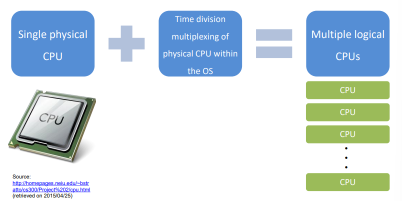

# Chapter 6. Mechanism : Limited Direct Execution

## CPU Virtualizaiton

+ 우리가 가지고 있는 Physical Resource 는 하나이지만, 유저에게는 Logical CPU가 무한 개 잇는것같은 illusion을 제공하는 것을 목표로 한다. 
+ 그러기 위해서는 2가지 고려사항이 필요하다. 
    
    1. 메모리에서 여러 개의 프로세스가 올라와서, 어떻게 Time-Sharing을 이루어 낼 것인지?
        - 사용자가 CPU를 오롯이 먹는다는 착각을 하게 만들려면, Time-Sharing은 필수적일 것이다. 
        - 여러 개의 프로세스가, Context-Swiching을 거치면서, 계속적으로 수행했던 프로세스가 다시 수행되어야 할 것이다.
        - 당연히 Software 로만 구현되지는 않는다.
        - 시스템 관련 Software는, 문제를 해결하는데 있어 오롯이 Software 영역에서만 해결하지 않고, Hardware 가 Critical 한 부분에 있어서 지원해주기도 한다.
        - 물론 Hardware 가 지원해주는 부분을 Software가 추가적으로 최적화해서 문제해결을 하는 경우가 상당히 많고, 효율적이다.
        - Hardware, Software 각 하나만 써도 상관없지만, 더 효율성을 추구하는 것이 좋을 것이다.
        - Hardware + Software 구조로 둘다 써서, 기능을 최적화하는 것이 더 중요하다.
        - OS는 이런 부분을 고려해서 만들어졌다. 
        - CPU Virtualization 도, Time-Switching 하는 부분에 있어 Low-Level Mechanism(Hardware 의 지원을 받아서) 으로 수행된다.(Context Switching)
    
    2. 위의 Time-Sharing을 수행한다고 했으면, __프로세스를 어떤 순서로 실행__ 할 것인지?
        - CPU Virtualizaiton 에서, 기본적으로 이것을 구현하기 위해서는, System 의 성능적인 부분에 side-effect가 발생하지는 않는지 고려해야 한다.
        - 당연히 Side-Effect없이 구현해야 한다.
   
    - 추가적으로, 프로세스에 어떻게 CPU 를 할당하고, 할당받은 것들은 어떻게 안전하게 컨트롤할 수 있는지?
 
+ CPU에 대한 권한(CPU에 대한 권한을 OS가 갖는지, 유저가 갖는지에 대한 개념)
  - CPU가 수행해야 할 명령어가 User Memory 영역에 있으면, User Mode
  - CPU 가 수행해야 할 명령어가 Kernel Memory 영역에 있으면, Kernel Mode
  - Program Counter 를 가지키는 메모리 주소가 어떤 메모리 주소를 가리키는지 로 판가름 낼 수 있다.
  - 당연히, OS에 있는 코드를 CPU가 수행하고 있으면 OS가 CPU 권한을 가진다(Mode bit : 0)
  - User Memory 영역의 코드를 CPU가 수행하고 있으면 User 가 CPU 권한을 가지는 것이다.(Mode bit : 1)
 
+ 어찌되었든, CPU를 효율적이고 안전하게 컨트롤하는데 있어 가장 효과적인 것은, Hardware 와 Software가 협력해서 , 기능을 최적화시키는 것이다.

## Basic Technique : Direct Execution 

+ 최종적인 방법의 형태를 설명하기 위해, Computer Science 에서의 Technique 역사를 보여주면서 차이를 보자.

+ How to?
  - 이때는 (상대적으로) OS 가 하는 일이 별로 없다.
  - function 수행하라고 요청을 하면, 메모리에 올라와 있는지 체크함. 그리고 CPUC가 필요한 것을 요청하면, 그 코드가 전달되는 것은 라이브러리가 전담했다. 
  - 약속된 형태의 특정 코드를 만들어 놓고, CPU가 필요할 때, 그냥 단순히 그 코드를 불러서 사용하는 것이다.
  - CPU 가 요청하는 일만 하는 형태로 수행되었다. 
  - 그렇다고 해서, CPU 가 대부분의 일을 하고, OS가 "간섭을 별로 안한다, 특별히 하는게 없다"는 의미는 아니다!
    - Process 가 돌기 위한 다양한 기능들은 여전히 OS 가 처리하고, 프로세스가 수행되는 중간에는 OS가 중간에 끼어들지 못한다는 의미이다.
    - 프로세스가 중간에 끊기지 않는 Technique 방식이다.
  
  - 물론 지금은, 금방금방 OS가 간섭해서 끊고, 다른걸 수행하게 한다.

+ 이 방법이 가지는 문제점
  
  1. Restricted Operation
      - User Code 안에서 "모든" 동작을 다 수행할 수는 없다!
      - 메모리를 부르고, 지우고, 할당하는 등의 행위는 프로그래머가 모두 처리할 수는 없다.
      - 제한된 동작 이외에는 프로세스가 수행할 수 없다. 그런 부분들이 모두 허가된다면, 효과적으로 컴퓨터가 운영되지 못할 것이다.

  2. Switching Between Processes
      - Direct Execution 방식을 사용한다면, simple 하기는 하지만, Process가 동작하는 동안에는 그 사이에 OS가 간섭하지 못한다. 
      - OS가 간섭할 수 있어야지만 멀티프로그래밍을 할 수 있다. 

+ 효과적으로 컴퓨터를 동작시키려면, 프로세스를 멈출 수도 있어야 한다.
 
## Limited Direct Execution(LDE)
 
+ Direct Execution (직접적으로 실행) 하는 것이기는 하지만, 제한사항을 두는 방법이다.
 
+ 문제 1 : 만약 특정한 동작(I/O 수행 등) 을 수행하려고 하거나, 특정 Hardware Resource를 요청할 때, 이런 부분들을 각 프로세스가 요청하면 어떻게 대응할 것인가?
  - 메모리에서, Process 하나만 그 순간에 그런 요청을 하면 괜찮다. 하지만, 메모리에 올라가는 프로세스는 여러 개 이다..
  - 그 많은 프로세스가 다 I/O 요청하거나 Disk Access 등을 요청하면 어떻게 처리할 것인가?
 
+ __누군가는 간섭해서 조정해야 한다__ .
  - 특정 동작에 대해, 유저가 요청하면 __즉시__ 수행되는 path를 없앨 수도 있을 것이다.
  - 누군가가 관리하고자 한다면, 요청과는 별개로 실행시켜 주는 것은 어떤 순서로 요청을 수행해 줄 것이며, 누가 그 요청들을 관리할 것인지?
  - 그 역할을 OS가 수행할 수 있다.

  
 

