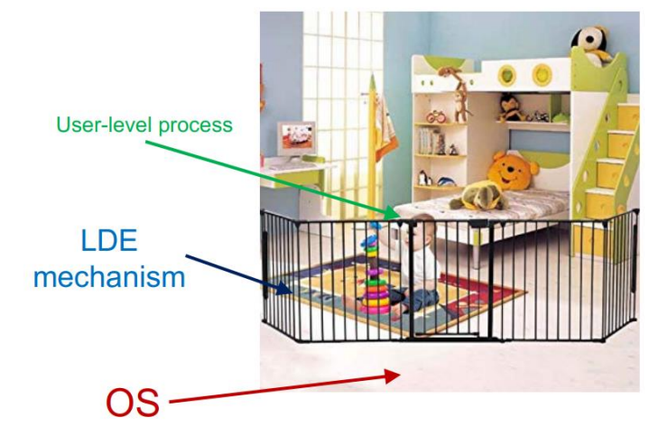
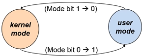
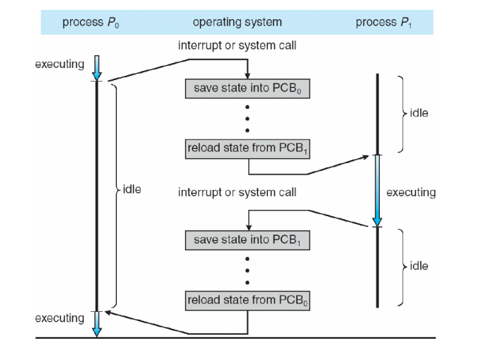

# Chapter 6. Mechanism : Limited Direct Execution

## CPU Virtualizaiton

+ 우리가 가지고 있는 Physical Resource 는 하나이지만, 유저에게는 Logical CPU가 무한 개 잇는것같은 illusion을 제공하는 것을 목표로 한다. 
+ 그러기 위해서는 2가지 고려사항이 필요하다. 
    
    1. 메모리에서 여러 개의 프로세스가 올라와서, 어떻게 Time-Sharing을 이루어 낼 것인지?
        - 사용자가 CPU를 오롯이 먹는다는 착각을 하게 만들려면, Time-Sharing은 필수적일 것이다. 
        - 여러 개의 프로세스가, Context-Swiching을 거치면서, 계속적으로 수행했던 프로세스가 다시 수행되어야 할 것이다.
        - 당연히 Software 로만 구현되지는 않는다.
        - 시스템 관련 Software는, 문제를 해결하는데 있어 오롯이 Software 영역에서만 해결하지 않고, Hardware 가 Critical 한 부분에 있어서 지원해주기도 한다.
        - 물론 Hardware 가 지원해주는 부분을 Software가 추가적으로 최적화해서 문제해결을 하는 경우가 상당히 많고, 효율적이다.
        - Hardware, Software 각 하나만 써도 상관없지만, 더 효율성을 추구하는 것이 좋을 것이다.
        - Hardware + Software 구조로 둘다 써서, 기능을 최적화하는 것이 더 중요하다.
        - OS는 이런 부분을 고려해서 만들어졌다. 
        - CPU Virtualization 도, Time-Switching 하는 부분에 있어 Low-Level Mechanism(Hardware 의 지원을 받아서) 으로 수행된다.(Context Switching)
    
    2. 위의 Time-Sharing을 수행한다고 했으면, __프로세스를 어떤 순서로 실행__ 할 것인지?
        - CPU Virtualizaiton 에서, 기본적으로 이것을 구현하기 위해서는, System 의 성능적인 부분에 side-effect가 발생하지는 않는지 고려해야 한다.
        - 당연히 Side-Effect없이 구현해야 한다.
   
    - 추가적으로, 프로세스에 어떻게 CPU 를 할당하고, 할당받은 것들은 어떻게 안전하게 컨트롤할 수 있는지?
 
+ CPU에 대한 권한(CPU에 대한 권한을 OS가 갖는지, 유저가 갖는지에 대한 개념)
  - CPU가 수행해야 할 명령어가 User Memory 영역에 있으면, User Mode
  - CPU 가 수행해야 할 명령어가 Kernel Memory 영역에 있으면, Kernel Mode
  - Program Counter 를 가지키는 메모리 주소가 어떤 메모리 주소를 가리키는지 로 판가름 낼 수 있다.
  - 당연히, OS에 있는 코드를 CPU가 수행하고 있으면 OS가 CPU 권한을 가진다(Mode bit : 0)
  - User Memory 영역의 코드를 CPU가 수행하고 있으면 User 가 CPU 권한을 가지는 것이다.(Mode bit : 1)
 
+ 어찌되었든, CPU를 효율적이고 안전하게 컨트롤하는데 있어 가장 효과적인 것은, Hardware 와 Software가 협력해서 , 기능을 최적화시키는 것이다.

## Basic Technique : Direct Execution 

+ 최종적인 방법의 형태를 설명하기 위해, Computer Science 에서의 Technique 역사를 보여주면서 차이를 보자.

+ How to?
  - 이때는 (상대적으로) OS 가 하는 일이 별로 없다.
  - function 수행하라고 요청을 하면, 메모리에 올라와 있는지 체크함. 그리고 CPUC가 필요한 것을 요청하면, 그 코드가 전달되는 것은 라이브러리가 전담했다. 
  - 약속된 형태의 특정 코드를 만들어 놓고, CPU가 필요할 때, 그냥 단순히 그 코드를 불러서 사용하는 것이다.
  - CPU 가 요청하는 일만 하는 형태로 수행되었다. 
  - 그렇다고 해서, CPU 가 대부분의 일을 하고, OS가 "간섭을 별로 안한다, 특별히 하는게 없다"는 의미는 아니다!
    - Process 가 돌기 위한 다양한 기능들은 여전히 OS 가 처리하고, 프로세스가 수행되는 중간에는 OS가 중간에 끼어들지 못한다는 의미이다.
    - 프로세스가 중간에 끊기지 않는 Technique 방식이다.
  
  - 물론 지금은, 금방금방 OS가 간섭해서 끊고, 다른걸 수행하게 한다.

+ 이 방법이 가지는 문제점
  
  1. Restricted Operation
      - User Code 안에서 "모든" 동작을 다 수행할 수는 없다!
      - 메모리를 부르고, 지우고, 할당하는 등의 행위는 프로그래머가 모두 처리할 수는 없다.
      - 제한된 동작 이외에는 프로세스가 수행할 수 없다. 그런 부분들이 모두 허가된다면, 효과적으로 컴퓨터가 운영되지 못할 것이다.

  2. Switching Between Processes
      - Direct Execution 방식을 사용한다면, simple 하기는 하지만, Process가 동작하는 동안에는 그 사이에 OS가 간섭하지 못한다. 
      - OS가 간섭할 수 있어야지만 멀티프로그래밍을 할 수 있다. 

+ 효과적으로 컴퓨터를 동작시키려면, 프로세스를 멈출 수도 있어야 한다.
 
## Limited Direct Execution(LDE)
 
+ Direct Execution (직접적으로 실행) 하는 것이기는 하지만, 제한사항을 두는 방법이다.
 
+ 문제 1 : 만약 특정한 동작(I/O 수행 등) 을 수행하려고 하거나, 특정 Hardware Resource를 요청할 때, 이런 부분들을 각 프로세스가 요청하면 어떻게 대응할 것인가?
  - 메모리에서, Process 하나만 그 순간에 그런 요청을 하면 괜찮다. 하지만, 메모리에 올라가는 프로세스는 여러 개 이다..
  - 그 많은 프로세스가 다 I/O 요청하거나 Disk Access 등을 요청하면 어떻게 처리할 것인가?
 
+ __누군가는 간섭해서 조정해야 한다__ .
  - 특정 동작에 대해, 유저가 요청하면 __즉시__ 수행되는 path를 없앨 수도 있을 것이다.
  - 누군가가 관리하고자 한다면, 요청과는 별개로 실행시켜 주는 것은 어떤 순서로 요청을 수행해 줄 것이며, 누가 그 요청들을 관리할 것인지?
  - 그 역할을 OS가 수행할 수 있다.

+ OS의 목적(복습)
    1. 유저가 컴퓨터 하드웨어를 디테일하게 모르더라도, 컴퓨터를 편하고 효율적으로 사용할 수 있게 해준다. 
    2. 컴퓨터 시스템을 보호한다
        - 유저가 컴퓨터를 모르는데, 함부로 접근해서 사용하면 취약적인 오류가 나타날 수 있다. 
        - 다른 유저에게 피해를 끼치는 것을 막고자 한다 
        - 나아가서 시스템을 안전하게 보호할 수 있다. 

+ 그래서 LDE는 무엇을 하는가?
    - 유저가 모든 것을 완전히 자유롭게 하는 것을 막는다. 
        - 유저는, 메모리에 대한 resource 나 특정 명령어(하드웨어 리소스 사용관련)를 직접 사용하려고 할 때, 유저가 요청할 수 있게는 하되, 유저 프로그램에서 실행되지는 않도록 막는다. 
        - printf(), scanf() 를 실제구현 하려고 할 때, 그 모든 부분이 다 User Program 내에서 동작해야 함. 
        - 하지만 Limited DE 에서는 그런 부분을 제한한다. 
        - 유저가 요청할 수 있게는 하지만, 유저 프로그램 내에서 "실행" 되지는 못하게 막는다(위험).
        - 하나의 프로세스가 아닌 여러 개의 프로세스가 동시에 해당 I/O 구현을 해놓은 것을 처리하려고 하면 시스템이 망가질 수 있다.
    - 유저에게 허용된 동작이 어느 정도는 정해져 있다.
        - 유저 영역에서 실행가능한 것과, 실행 불가능한 것을 OS가 정해놓고, 처리한다. 
    - 허가된 영역 외 나머지 동작들은 유저 자체적으로는 수행하지 못하고, OS에게 요청해야 한다. 
    - 요청된 동작들 중 유저가 스스로 못하게 막아둔 부분은, OS (Kernel) Mode 가 개입되어 처리되어야 한다.
    - User는 System Call 을 통해서 유저에게 필요한 부분을 OS에 요청할 수 있다. 그러면, OS가 요청받아서 처리해 줄 것이다.
        - Kernel Mode 로 전환되어 일이 처리된다. 당연히 그때는 OS 메모리가 같이 사용될 것이다.
        - 당연히 Mode bit 이 들어가서 사용될 것이다.
    
    - 그렇게 User 가 요청할 수 있는 방안은 System Call 이다. 
        - System Call 이 들어오면, OS가 요청받은 것을 처리할 것이고, 그때는 Mode bit = 0 이 될 것이다. 

+ LDE 와 System Call 사용 예시 : scanf()
    - scanf() 에 해당하는, OS가 지정한 특정 메모리영역의 코드 부분이 있을 것인데, 이것이 실행된다.
    - User Mode/Kernel Mode 는 하드웨어의 도움(mode bit)을 받아서 함. 
        - 물론 Software 영역에서만 할 수도 있지만, 오류를 일으킬 수도 있으니, 두개 같이 함.
        - Mode bit(PSW Register) 을 사용하게 되면, 그 해당 순간에 모든 하드웨어가 Mode bit 이 1 임을 확인해 그에 맞게 돌아가게 할 수 있다. 

+ LDE : Remaining Challenge
    - 유저가 사용하는 것은 제한하는데, 허용되지 않은 명령어를 사용할 때는 OS가 처리하도록 한다 

## System Call

+ About System Call
    - System Call 요청이 오게 되면, OS에서 해당 요청을 수행한다. 
    - 유저 프로그램이 요청한 것은 System Call 로 요청하는 것이다.
    - 유저가 Hardware Resource 에 접근할 수 있는 방법은, 미리 약속된 System Call 이 아니고서는 접근할 수 없다. 
    - 그래서 System Call 이 각각 몇번인지 다 정해져 있다.
    - 정해진 Path 를 제외하고는, 유저는 Hardware 에 접근할 수 없다. 
    - 이런 System Call  은, 유저 프로세스에서 Trap 이라는 이름(Exception) 으로도, Mode bit 0이 되어 수행될 수 있다.  

+ System Call 의 다른 이름, Exception(Trap)
    - 내부에서 처리할 수 없는 부분이기 때문에, System Call 을 부르면서 OS에게 유저프로그램이 요청함. 
    - Trap 이라고 볼 수 있다. Trap 의 가장 대표적인 예시 또한 System Call 이다. 
    - __Exception Handling Flow 다시 한번 볼 것!__
    - scanf, printf 를 코드에 쓰면 하드웨어에(I/O) 요청을 하는 것이다(by System Call to OS)
    - 요청하는 순간 유저 프로그램에서 실행이 불가하기 때문에, OS로 Mode bit 이 바뀌어야 함
        - User Mode to Kernel Mode
        - User Mode 에서 실행하다가 System Call 요청이 들어오면, Mode가 바뀌고(Mode bit = 0), OS가 CPU 권한을 가지며 그 부분을 처리한다.
        
    - scanf 를 받았다면, except handler가 확인하고 처리한다. 
    - 그에 맞는 System Call 번호가 정해져 있고, 그 번호에 맞게 Trap Handler 에 간다
    - Handler가 그에 맞는 코드를 실행하고, 끝나면 다음 코드(Next Instruction)로 넘어간다. 
        - 특정 이벤트를 해결하기 위한 Solution 은, Handler 라는 이름으로 OS영역에 부팅할 때 올라가 있다. 

+ Kernel Stack
    - OS에 올라와 있는 메모리 중 stack 처럼 쓰는 영역이 있는데, 이를 Kernel Stack 영역이라고 이야기한다 
    - Virtual Memory 에서 Stack 과 Heap 같이 시간에 따라 그 크기가 변하는 Memory 부분이 있을 것이다. 
    - Stack은 함수가 계속 쌓이면 쌓일수록 올라가서 재귀적으로 활용 가능한 구조이고, heap 은 동적 메모리 할당과 해제로 사용가능한 부분이다. 
    - Stack 과 Heap 크기가 계속 바뀌는 이유는, 메모리가 항상 부족하기 때문이다. 
    - 그래서, 최대한 메모리를 아끼기 위해서는, 쓸 때 할당해서 쓰는 것이고, 안쓸때는 내리면서 메모리를 아끼는 것이다. 
    - OS(Kernel) 영역에서도 이런 비슷한 일이 일어난다. 
    - OS 내에, 시스템이 켜질때부터 꺼질 때까지 그 사이에 무조건 필요한 코드들이 존재할 것이다. 
    - 반면에, 특정 요청이 있을때만 할당해서 쓸 필요가 있는 애들도 분명히 존재할 것이다.
    - 그렇다면, 필요할 때만 할당해서 쓰고, 필요없을 때는 할당 해제해 줄 수 있는 메모리 영역이 OS에도 필요하다. 
    - 이런 것을 보고 Kernel Stack 이라고 한다. 
    - Context나 Flag, 다른 레지스터에 대한 정보들을 프로세스 별로 Kernel Stack 영역에 넣어 활용하자!(PCB)
    - Kernel 의 대표적인 예시 : PCB
        - 사용 가능한 모든 프로세스에 대한 정보를 OS가 다 가지고 있을 필요는 없다. 
        - 해당 프로세스가 만들어지는 순간에, PCB가 Kernel Stack 영역에 생긴다. 
        - 그렇게 필요할 때 사용하고, 그 프로세스가 Exit 하게 되면 그 PCB 영역도 날리면 된다. 

## System Call Interface

+ Interface 이기 때문에, OS 위, OS 안에서 다 필요한 부분이다.
+ 중요한 것은, User 가 System Call 을 통해서만 하드웨어 리조스에 접근할 수 있다는 사실이다 
+ System Call 은, User 와 System 을 사용하는 사용자들에게 약속되어 있는 함수이다. 
    - 그리고 그 표준 또한 존재한다 
    - OS 별로 System Call 이 다르긴 하다. 하지만, 함수마다 몇 번이 어떤 System Call을 부르게 되는지만 다르다. 그래서 OS별로 그 부분만 다르게 처리되는 것이다. 
 
 ## Appendix : System Call Procedure
 
 + __System Call 이 불리는 과정(매우 중요한 부분)__
    - 맨 처음에 printf 함수가 불렸다(I/O)
    - I/O 요청은 유저 프로그램 스스로 처리할 수는 없는 부분이기 때문에, System Call을 통해 OS에게 해당 요청이 들어간다 .
    - System Call은 Trap 이다. 그래서 Trap 이 들어왔으면 OS는 Mode bit을 0으로 바꾼다. 
    - OS가 Standard C Library 를 확인해 본 결과, 해당 "Trap" 이 부르는 System Call 은 3번(예시) 이다.
    - 확인하기 위한 code가 Kernel Code(OS 메모리 내의 코드) 에 있는데, 3번이라면 어디에 solution이 있는지 있는지 그 주소를 따라가서, 수행한다.
    - 그렇게 OS는 해당 I/O 요청을 모니터에게 Output을 띄우라는 신호를 보낸다. 
    - 한편, Stop 시켰으면 OS 내의 PCB에 저장하고 해당 프로세스의 정보를 저장하고, I/O 들어온 부분을 signal 보낸다.
    - 그동안 프로세스는 blocked state 로 넘어간다. 
    - OS는 다음 프로세스 할 것을 골라서 그 프로세스에게 CPU 권한을 준다 
        - 필요한 정보 역시 해당 PCB 에서 갖고 와서 세팅하고, Mode bit을 다시 1(User Mode) 로 바꾼다. 
        - 당연히 next process는 ready queue에 있던 애 중 하나를 가지고 온다.

    - I/O 요청이 끝나서 일이 수행되었으면, 일이 끝났다는 signal이 OS에게 간다. 
        - 연결된 전선으로 Hardware Interrupt를 통해 signal 이 이동한다. 
        - 그리고 끝났으면, 가서 실행된 결과를 유저에게 돌려준다. 
    
    - 해당 프로세스는 blocked 에서 ready로 넘어간다. 
    - OS 가 지금 돌리는 Process의 Time-Slice 가 끝나면, 다시 Kernel Mode로 바꾸고, OS가 CPU 권한을 갖는다 
        - 기존 수행하던 Process를 Ready Queue 로 돌리고, 현재 상태를 그 프로세스의 PCB 에 저장한다. 
        - I/O 받은 애의 PCB로 가서 그 값을 CPU에 다시 세팅하고, 세팅한 프로세스의 Next Instruction  을 수행한다. 

#### 챕터별로 나눠서 배우지만, 이 모든 것이 하나로, 유기적으로 돌아간다 

## Switching Between Process

+ 어떻게 CPU는 이런 프로세스를 멈춘 다음, 재수행하는가?
    - 2가지 방법이 있다. 

+ Cooperative Approach VS Non-Cooperative Approach
    - OS가 어떻게 CPU 에 대한 권한을 찾아오는지, 그 부분에 대한 방식
    - Cooperative Approach : OS가, 그냥 Process가 CPU 권한을 놓을때까지 기다리는 방식
        - Process가 때가 되면 자발적으로 CPU 권한을 놓아줄 것이라고 기대하는 방식
        - 너무, Process의 선의에 기대는 방식이다. 
    
    - Non-Cooperative Approach : Process가 자발적으로 CPU 권한을 놓을 것이라고 기대하지 않음.
        - 필요할 때마다 OS가 Interrupt를 통해서 해당 프로세스 작업을 끊고, OS가 CPU 권한을 갖는다. 
        - 애초애 주기적으로 CPU가 권한을 놓을 것이라고 생각하지 않음
        - OS가 필요하면 CPU 권한을 획득할 수 있게 함.
        - 가능한 주기적으로 OS가 CPU 권한을 갖기 위한 방식을, Timer Interrupt 방식을 사용한다 
        - 특정 시간동안만 해당 Process가 CPU 권한을 갖고, 그 시간이 지나면 CPU 권한을 OS에게 양보해야 한다. 

    - 최근에는 다 Non-Cooperative Approach 방법을 사용한다 
        - Cooperative 방식으로 했을 경우, 만약 User Process가 Trap을 걸었을 때, 유저가 의도한 부분이다 보니, trap을 요청하기 전에 미리 CPU 권한을 내려놓을 수 있을 것이다. 
        - 하지만, Fault는 개발자가 예측할 수 없는 부분이다. 
        - 전혀 의도하지 않는 Fault가 일어났으면, 해결이 되지 않고 CPU도 내어놓지 않는 상태가 된다. 
        - 그렇게 되면 무한 루프에 빠질 수 있다. 
        - 그래서 OS가 CPU 권한에 대한 부분을 스케쥴링해서, 계속 다른 프로세스들에게 CPU 권한을 제공한다.

## Saving and Restoring Context

+ Context Saving : 
    - 프로세스 동작에 가장 필요한 것은, 해당 프로세스를 실행하기 위한 레지스터(Context) 정보이다.
    - 끊겼을 때 상태의 레지스터를 PCB 에 저장한다. 

+ Context Restoring :  
    - 다른 Process를 돌리다가, 다시 이전에 돌렸던 Process를 재실행하려면, 그 프로세스 정보를 다시 PCB에서 가져와서 세팅해야 함. 이 작업을 보고 Context Restoring 이라고 한다.

## Context Switching

+ Context Switching : 
    - process 1의 context를 가져와서 수행하다가, process 2를 수행하려면, PCB 2에서 Context 2를 가져와야 함.
    - Process 3을 수행할때는 Context 3을 가져와서 Switching 해야 함.
    - 이렇게 Process 를 계속 바꿔서 수행할 때, Context도 계속 바뀌어야 함.
    - 이렇게 Switching 하는 것을 보고 Context Switching 이라고 한다. 
    - OS가 Kernel Mode 에서 CPU 권한을 가지고 Switching 에 관여한다. 

+ 상세설명
    - 한 프로세스의 실행을 멈추고, 다른 프로세스를 구동시키기 위해서는, __실행시키고 있던 프로세스의 정보를 저장하고, 새로 수행할 Context를 Loading 해야 한다.__ 
    - Context : 레지스터 정보(Program Counter, Other Registers..)를 말함. 
    - 해당 프로세스를 돌리기 위해서는, 돌아가고 있던 Register 상태를 그대로 복구해야 하고, 그러려면 Context가 필요하다. 

## Appendix : PCB

+ Process 에 대한 모든 정보를 저장하는 데이터 구조(Data Structure) 이다. 
+ Process가 생길 때 만들어지고, 사라질 때는 PCB 정보도 OS Kernel Stack 영역에서 사라진다.
+ Process 별로 존재한다. 

+ 왜 단순히 Response Time 을 줄이기 위해서 Time-Slice를 무작정 작게 해서는 안되는가?(Context Switching Overhead)
    - Context Switching 하는 데도 들어가는 시간(overhead)가 필요하다. 
    - PCB가 있는 곳은, 결국 메모리이다. 
    - 프로세스를 바꾸려면, 현재 실행중인 상태를 PCB에 저장하고, 그 다음에 수행해야 할 정보를 해당 Process의 PCB에서 가져와야 한다. 
    - __컴퓨터의 성능은, 얼마나 메모리 접근을 최소화하냐에 따라 다르다__.
        - CPU 가 메모리보다 훨씬 속도가 빠르기 때문이다. 
        - Context를 빈번하게 바꾸게 되면, Switching Overhead 에 필요한 시간으로 인해 컴퓨터 시스템 성능이 떨어진다. 
    - Time-Slice 자르는 것은, Response Time 을 최소화하기 위해서인데, 개별 Process 의 Response Time이 그렇게 치면 줄어야 함. 그게 좋은 것이다. 
    - 하지만, Time-Slice를 작게 한다는 것은, 계속 Process를 끊고, 저장하고, 복구해서 새로운 프로세스를 구동시키는 것이다. 이렇게 되면 Context Switching 이 너무 빈번해지는 결과를 가져온다. 
    - 너무 짧게 하면, Context Swtiching 시간이 더 비대해져서, 오히려 성능, Response Time 에 악영향을 준다. 
    - 따라서 Time-Slice 를 결정할 때는, __Time Slice 값 뿐만 아니라, Context Switching 하는 시간까지 같이 고려해야 한다.__
        - 최적화의 영역이다.

## Example of Context Switching

+ 수행되는 순서
    - 메모리에 Process 가 2개 존재한다고 했을 때, Process 0 을 먼저 수행한다
    - Time-Slice 가 다 되면, Timer Interrupt를 걸어 Process 0을 멈춘다
    - Mode bit 이 0이 된 다음에, Process 0의 정보를 PCB에 저장한다. 
    - 다음 수행해야 할 Process 1의 정보를 PCB에서부터 가지고 와 세팅한다. 
    - CPU 권한을 Process 1에게 할당하고, Mode bit 이 1로 전환된다.
    - Process 1이 수행되고, Time-Slice 1초가 다 사용되면 다시 Mode bit 이 0이 된다(Timer Interrupt)
    - Process 1의 정보가 PCB 1에 저장되고, 다시 Process 0 의 정보를 PCB 0 에서 Loading 해 온다.
    - Mode bit 이 1이 되면서, Process 0 이 다시 실행된다.

