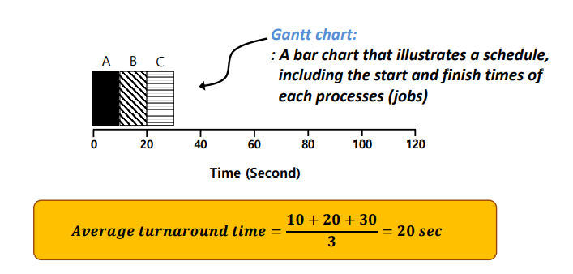
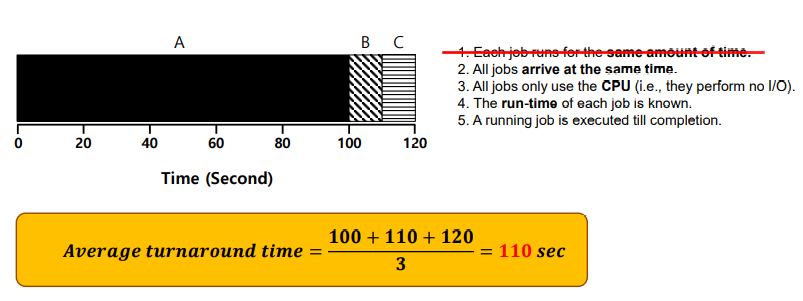
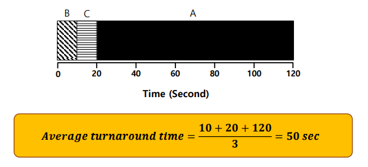
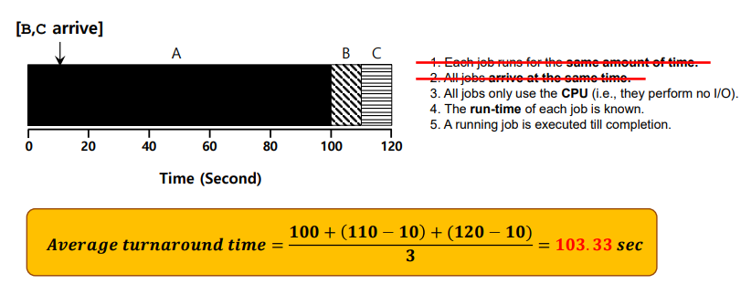
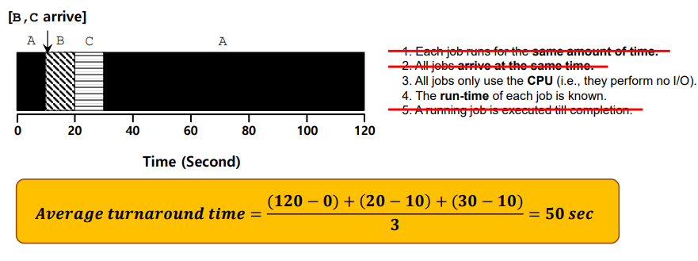
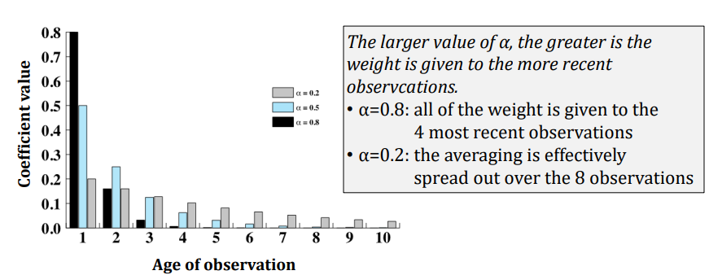
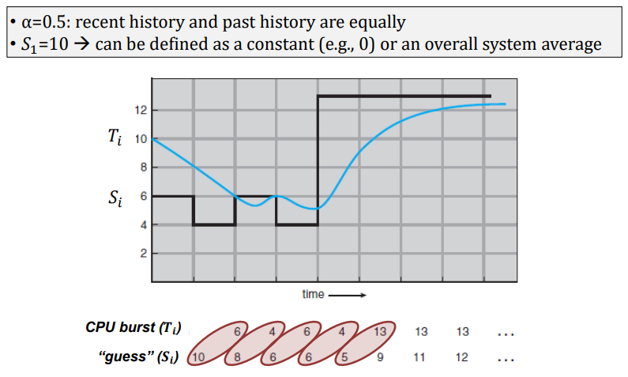
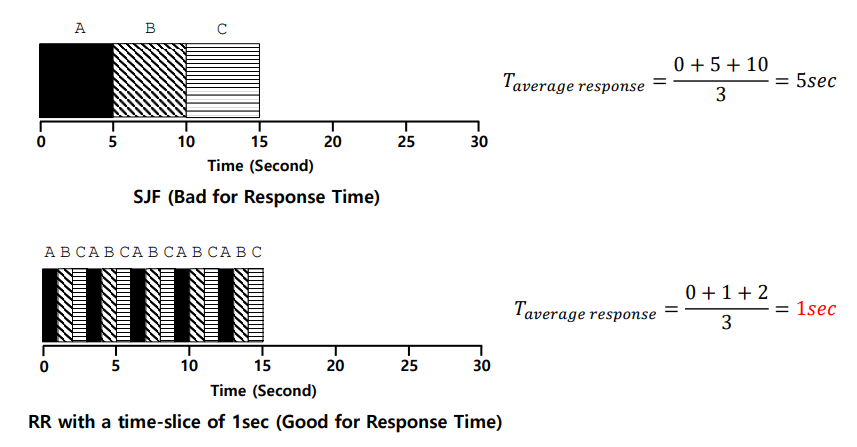
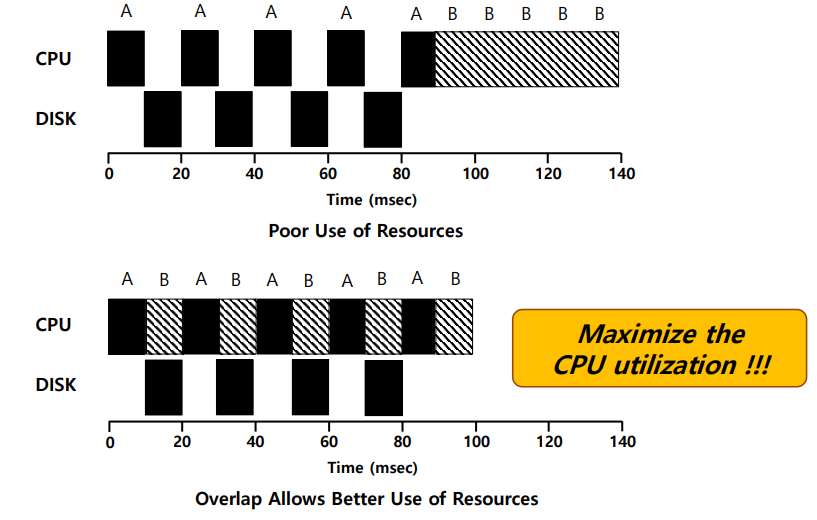

# Chapter 7. Scheduling : Introduction

+ 여전히 CPU Virtualizaiton 에 대한 부분을 다룬다.
  - CPU 는 여전히 하나이지만, Logical CPU는 무한개를 제공하고 싶다.
  - 그러기 위해서는 2가지 기법이 필요하다. 
    - 하나는, 프로세스를 멈추고 다른 프로세스를 구동했다가, 다시 돌아와서 해당 프로세스를 문제없이 진행하는 것이다.
    - Context Switching 이 이것을 가능케 했다.  
    - 다음 OS가 할 일은, 만약 수행중인 프로세스를 멈추었다면 다음은 어떤 것을 수행해야 괜찮을지에 대한 부분이다.
    - __메모리에 10개,100개의 프로세스가 올라가 있으면, 다음은 무엇을 실행할 것인가?__

+ 더 발전되는 질문
  - 100개의 Process 중 하나를 선택해야 한다면, 나머지 99개의 Process는 어떤 상태에 있어야 하는가?
  - 당연히 Ready, 적어도 Suspended Ready 에 있어야 한다. 
  - Block 에게 CPU 실행권한을 줘봤자, Resource가 모자라기 때문에 실행할 수 없다. 
  - __그러므로, Ready State 에 한해서 Scheduling 을 적용해 보자!__
  - Blocked State는 이 단원에서 신경쓰지 않아도 될 것이다. 

## Process Scheduling

+ Ready Queue 에 있는 Process 를 대상으로 한다. 
+ 수행하기 위해 필요한 모든 Resource를 가지고 있고, CPU 권한만 기다리고 있는 Process 중, 그 다음 어떤 것을 실행할 것인가?
  - 이런 주제가 Scheduling 이다.

+ CPU Scheduling, __Job Scheduling__, Process Scheduling 다 같은 말이다. 
  - Job Scheduling 이라는 말을 자주/쓴다. 
  - OS 역사에서 처음에 한 일은, 동시에 수행될 수 있는 Job 이나 Task를 Batch 형태로 모아서 순서대로 수행시키는 것(Single Batch) 였다.
  - OS와 비슷한 역할을 하는, 모니터라는 장치가 등장했고, 순서를 결정했었다. 
  - 왜 __Job Scheduling__ 이라는 말이 Scheduling 에서 메인이 되었나?
    - 옛날에는 Process라는 개념이 없었다. 그냥 Job, Task라는 이름으로 많이 불렸다. 
    - 그 당시부터, 어떤 순서대로 일을 처리할지 라는 개념이 만들어지다보니 Process라는 이름이 쓰이지 않았다. 
    - 그래서 Job Scheduling 이라고 많이 표현되는 모양이다. 

  - CPU Scheduling : CPU에 일을 주는것이다보니 CPU Scheduling 이라는 이름이 많이 쓰이기는 했다. 

+ 하지만, Thread Scheduling 은 당연히 다른 말이다. 

+ Scheduling 은 Multiprogramming OS 에서의 기본이 되는 이야기이다. 

+ 메모리에 올라오는 Process 중 어떤 것을 쓸 것인지?
  - 어떤 Scheduling 기법, 어떻게 Process를 선택할지에 대해, 다양한 방법들이 존재한다 
  - 보이는 많은 Scheduling 기법 중 어떤 것이 현 상황에 더 맞는지를 판별할 수 있어야 한다. 
    - 그리고 A,B Scheduling 기법이 있다면 둘중에 하나를 선택할 때, A Scheduling 이 B Scheduling 기법보다 더 적합한 기법이라고 판단한 근거 역시 있어야 한다. 
    - 다양한 근거가 존재할 수 있다. 
    - 기본적으로는 Turnaround Time(TAT) 나 Response Time 을 기준으로 하기도 하고, deadline을 얼마나 잘 맞추는 기법인지 보기도 하고, 각 개별 Process 들의 Fairness 를 기준으로 하기도 한다. 

+ Turnaround Time(TAT) : 어떤 Job 이 시작해서, 완료될때까지의 시간
  - ex1) 손님이 중국집에 들어가는 순간부터, 주문하고, 짜장면이 나와서 다먹고 계산하고 나올때까지 측정한 시간
  - ex2) 4개의 음식을 주문했다면, 4개의 요리가 다 나올때까지의 시간

+ Response Time : Process 를 실행시키고 나서, 첫번째 반응이 돌아올때까지의 시간. Job 이 완료되는 시간 기준이 아니다. 
  - ex1) 짜장면을 주문하고, 처음 반응(짜장면을 마주할 수 있는 시간)
  - ex2) 음식 여러개를 시켰다면, 그 중 어떤것이 먼저 나오든 관계없이 첫번째 음식이 나올때까지의 시간

+ Scheduling 에서, 첫번째는 Turnaround Time 을 기준으로 판단할 수도 있고, Response Time 을 기준으로 볼 수도 있다. 

+ System Oriented VS User Oriented
  - System Oriented 기준으로 보면, ThroughPut 이라는 개념이 중요해진다. 
    - ThroughPut 은 제공자가 생각하는 성능 수치. 
    - ThroughPut : 시간당 얼마만큼의 task가 이루어졌는지를 보는 수치
    - ex) 짜장면 집을 운영하고 있는 사람의 관심은, 손님에게 얼마나 빨리 음식이 나갔느냐도 중요하지만, 기본적으로 하루에, 혹은 한시간당 몇 그릇을 팔았느냐이다. 
    - 시간당 완료되는 task 의 갯수라고 이해해도 된다. 
    - 서버 입장에서나, 서비스를 제공하는 입장에서의 중요사항 중 하나가 ThroughPut 이다. 
    - System Oriented 라는 것은, 컴퓨터 시스템 기준에서는 서버를 기준으로 생각하는 것이다.

  - User Oriented 기준에서는, Turnaround Time 이나 Response Time 이 중요사항일 것이다.
    - User Oriented 라는 것은, 서비스를 받는 사용자의 기준에서 생각하는 것이다.

  - System Oriented/User Oriented 여부에 따라, 각각의 평균값 구하는 방법이 다르다고 한다. 
    - User 입장에서는 산술평균으로, Service 입장에서는 조화평균으로 구한다고 한다.
    - CPU의 성능 측정하는 방법 중, 평균내는 것을 많이 한다고 한다.
    - 왜 그런지는 컴퓨터 구조 시간에 자세히 알아보자.
    - 각 평균의 의미가 어떻게 되는지, 왜 그렇게 해야 되는지도 알아놓도록 하자.

+ About Fairness
  - Fairness 관련한 Scheduling 기법도 뒤에 나온다. 
  - Fairness : CPU 에 대한 권한을 최소한 어느정도는 개별 프로세스가 무조건 받을 수 있게 해 주는 Scheduling 기법.
  - 만약 Fairness 를 고려하지 않는다면, 중요도나 우선순위가 낮은 Process 는 CPU에 대한 권한을 계속 받지 못하는 문제가 생길 수 있다. 
    - Starvation : Process 가 계속해서 CPU 권한을 받지 못하는 것. 속칭, "굶는 것:
    - Starvation 에 대한 방지책이 필요해서, Fairness를 중시하는 Scheduling 기법들에 대해 많이 연구개발되었고, Linux 나 Android 등에서는 Fairness 를 고려하는 Scheduling 기법이 다 들어가 있다고 한다. 

+ "특정 Scheduling 기법이 왕도는 아니다"
  - 모든 Scheduling 기법 중, 어느 것이 좋고 나쁜지에 대한 많은 이슈가 있다. 
  - 하지만, 모든 부분을 만족하는 Scheduling 기법은, __존재하지 않는다__.
    - Turnaround Time(TAT)를 중요하게 생각한다면, TAT 에 맞는 Scheduling 기법을
    - Response Time 을 중요시하게 생각한다면, TAT에 맞는 Scheduling 기법은 오히려 맞지 않는다. 
    - Fairness 를 다루는 부분에 있어서도 또 다른 기법을 적용해야 한다. 

  - 그러므로, 특정 Schedule 기법을 설정할 때는, __구현하는 시스템에서 가장 중요시하게 여기는 항목이 무엇인가__ 를 생각해서 설정해야 한다. 
    - User 입장에서 설계해야 한다면, Turnaround Time 이나 Response Time 을 중요하게 생각할 것이다. 
    - Server 입장에서 해야 하는데, TAT나 Response Time 을 기준으로 Scheduling 을 설정해서는 안된다. 
    - Server 입장에서는 CPU Utilization 에 포커스를 맞춰서 Scheduling 을 설정하는 것이 좋을 것이다.
    - 혹은, 어떤 시스템 중 모든 Process의 Fairness 를 만족시켜야 하는 부분이 있다면, 그에 맞춰 설정해야 한다. 
    - 모든 Scheduling 일에도, Tradeoff 라는 것이 존재하므로, 그것을 설정하는 것이 Engineer 가 할 일이다. 
 

## Scheduling Criteria

+ 어떤 부분에 Focus를 맞추느냐에 따라, 최적화하는 방법은 다 다르다. 
   - CPU Utilization, Throuput, Turnaround Time 중 어떤 것에 집중하냐에 따라 다 다를 것이다. 
   - Throughput : 단위시간당 수행된 일의 양
   - Turnaround Time(TAT) : 어떤 일이 시작해서, 완료될때까지의 시간(Time Interval)
   - Throughput 과 TAT 는 많이 평가되는 요소이기도 하다. (평균이 어떻게 되는지?)

+ Scheduling 을 디자인하는 System 이, 어떤 항목을 중시하는 System 인지 파악하고,거기에 맞는 Scheduling 기법을 사용할 수 있도록 하자.

### Appendix : QoS

+ "100만 번 중 999,999 번은 제한시간 내에 프로세스가 완료되게 해 달라!"
  - 컴퓨터 시스템에서의 새로운 요구조건이 되어가고 있다. 

+ QoS(Quality of Service)
  - 특정 서비스의 요청에 대한 동작시간이, 특정 시간 내에 완료되는 비율(Percentage)
  - User Experience 에 대한 척도가 되어버렸다. 
  - 요즘은 QoS가 거의 기준화되어 사용되고 있다. 

+ 옛날기준과 지금기준
  - Turnaround Time 과 Response Time은 옛날 기준이 되어가는 중이다. 
  - QoS와 Soft Real Time 부분을 요즘에는 많이 본다고 한다. 
  - 자율주행 쪽에서는 확실히 이런 부분이 자주 고려된다.
     - 외부환경의 변화에 의해, 자율주행 시스템이 반응해야 하기 때문.

## Process Scheduling

+ OS가 하나의 Process 를 멈춘 다음에, 메모리에 올라와 있는 여러개의 Process 중 다음 어떤 것을 수행해야 할까?
  - 기본적으로는 여러 고려사항이 있다. 
    - Long-Term Scheduling : 실제 메모리에 몇개의 프로세스를 올리고, 몇개의 프로세스를 내리는지?
    - Middle Term Scheduling : 어떤 것을 Swapping 하고, 어떤 Process를 사용하며, 언제 Swapping 하는지?
    - Short-Term Scheduliing :  Ready Queue 에 있는 Process 중 다음에 어떤 것에 CPU 권한을 줄 것인지?
    - Short Term Scheduling 은 Dispatcher 라고 불리기도 한다. 
  
  - 기본적으로 Scheduling 기법 에 있어서는, Short Term Scheduling 에 집중해서 다룬다. 

### Three Types of Processor Scheduling

+ 각 Scheduling 고려사항들이 어떤 Range 위에서 고려되는지?
  - Long Term : New 에서 Ready로 넘어가는 과정 부분의 고려대상
    - 사용자가 요청하는 어떤 것을 메모리에 올리고, 어떤 것들을 메모리에서 비워낼지 결정하는 Scheduling. 
    - 사용자가 요청하는 Process 와 System 등을 고려해서 어떤 것들을 메모리에 올릴지 결정하는 부분이다. 
    - 내가 가지고있는 Resource를 통해 어떤 Service를 할수 있는지?
  - Middle Term : About Block, Suspend, Ready 에서 해당
    - Middle Term : Swapping 에 관련된 부분
    - 메모리가 부족했을 때, 특정 Process 또는 특정 Code를 메모리 공간을 활용하기 위해 Swap Space에 잠시 옮기는 부분을 말함
    - Swap In, Swap Out(메모리에서 디스크로 가는 suspended 부분
    - Swapping을 할때, Process 의 어떤 Code를 내릴 것이며, 어떤 것을 먼저 메모리에 올릴지 에 대한 부분이 Middle Term 부분이다. 
  - Short Term : Like 3-state Model. 3-state model에서 각 부분이 Short Term 에서의 고려대상이다.
    - Ready Queue 에 있는 애들에 대해서, 어떤 순서대로 CPU의 권한을 결정해줄지 정하는 것이다.  

## Terminology for Scheduling(Scheduling 에서의 용어들)

+ Preemptive : 현재 수행중인 Running State에서의 Process 를 멈추고 Ready State 상태로 보내는 것.
  - Context Switching 이 발생함
  
+ Non-Preemptive(Cooperative) Scheduling
  - 일단 수행되면, 중간에 Process를 강제로 끊지 않는 것.
  - 지금 사용되지 않는 방법이라고 하여, 무조건 Non-Preemptive Scheduling 이 나쁜 것만은 아니다.
  - 장점 : Context Switching 이 적게 일어나고, Simple 함.
  - 단점 : Response Time 이 당연히 나쁘다. 

+ Preemptive Scheduling
  - 장점 : Flexable. Response Time 줄이는 것에 도움을 준다
  - 단점 : Context Switching 에 대한 성능 변화 부분이 존재한다. 
    - System 최적화할 때는 Context Switching 에 대한 부분(Overhead)을 반드시 고려해야 한다.

+ 일반적으로는, OS의 많은 부분이 Preemptive Scheduling 으로 이루어진다.

+ CPU Burst & I/O Burst
  - CPU Burst : CPU가 동작하는 __구간__
  - I/O Burst : I/O 로 인하여, idle이 되거나, (Multiprocess 입장에서는) 잠시 멈추는 __구간__.
  - CPU Burst를 Running Time이라고 부르는 표현도 존재한다. 

+ CPU Bound Process : Process 가 시작해서 끝날 때까지 CPU 가 연산과정을 거치면서 진행되는 Process
  - CPU의 성능, CPU의 동작하는 시간을 얼마나 빠르게 하느냐에 따라, 전체 수행시간이 결정되는 중요한 기준이 된다. 

+ I/O Bound Process :  
  - 전체 Process 가 동작하는 시간 중 I/O 를 요청하는 시간이 굉장히 많아서, I/O 를 얼마나 빠르게 처리하냐에 따라 해당 프로그램의 수행시간이 결정되는 Process
  - I/O 를 얼마나 빨리 처리하느냐에 따라 System 의 성능이 결정되게 된다. 

+ Process 를 동작시킬 때, 이 Process가 CPU Bound 인지, I/O Bound 인지 그 성격에 따라 System 의 성능을 최적화하는 접근방법이 달라지게 된다. 

## Scheduling : Introduction 

+ Scheduling 기법을 만들 때, 그 방식과 고려사항이 존재한다 
  - 어떤 것을 고려해야 하는지?
    - 현재 우리가 구현해야 하는 시스템이 어떤 시스템인지?
  - 처음부터 복잡한 상황을 다 고려해서 Scheduling 기법을 만드는 것은 너무 어렵다. 
  - 현재 상황을 Simple 하게 만드는 몇 개의 과정을 Setting 하고 진행할 수 있다. 

+ Scheduling 기법을 만드는 과정
  - 상황을 Simple 하게 만든다음, 가장 Simple 한 상황에서 Scheduling 기법을 만든다
  - 이후, 가정들을 하나씩 지워나간다. 
    - 가정들을 하나씩 지울 때마다 실제적인 복잡한 시스템이 만들어진다. 
    - 하나씩 가정을 지우면서, 기존의 문제점을 개선하고 바꾸며 최종 Scheduling 기법을 만든다. 
    - 역사적으로 Scheduling 기법을 만드는 과정들이, 이런 과정을 통해 개발되었다. 

+ 5개의 가정을 만들자
    1. 개별 Job 들의 Running Time은 같다. 
        - 실제로 그렇지는 않겠지만, 먼저 모든 Ready Queue의 Process 수행시간이 동일하다고 가정한다. 
    
    2. 모든 Job 들은 동시에 메모리에 올라온다. 
        - 실제로는 동시에 도달하지 않는다. 
        - FIFO 를 쓴다고 하면, 먼저 도달한 Process 먼저 하겠지.
        - 원래는 도착시간은 제각기 다르다. Delay 되기도 한다. 하지만 나중에 고려하고 지금은 Simple 하게 상황을 만들어 나가기로 한다. 

    3. I/O 작업은 없다고 가정한다. 
        - I/O Burst 없이 CPU Birst 만 존재한다고 가정한다. 
        - 물론 실제로는 I/O 가 존재할 것이지만, 없다고 가정해 보자.

    4. 개별 Process 의 Running Time 을 다 알고 있다고 가정하자
        - 실제 나중에는, Running Time 을 미리 안다는 이 가정을 지우는 것이 가장 힘든 작업이다. 
    
    5. Non-Preemptive 이다. Process 가 한번 수행되면, 멈추지 않는다고 가정한다. 

  - 이 5개의 가정이 가장 강력한 가정이다. 
  - 이 가정이 있는 상황에서의 Scheduling 기법을 가져와서, 기존의 Scheduling 이 어떤 문제가 있었기 때문에 그 다음의 Scheduling 방법이 어떻게 바뀌는지, 이때동안 있어 왔던 Scheduling 기법을 배운다. 

## Scheduling Metrics

+ Turnaround Time(TAT)를 최적화하는 방식으로 먼저 진행한다. 
+ 이후 Fairness를 고려할 수 있을 것이다. 
+ 위의 가정들을 하나씩 지우면서, 다음으로 고려할 것은 TAT를 최적화하는 것을 목적으로 다가간다. 
+ 찾아가는 과정들을 중요하게 보자.
  - System 의 복잡도를 한방에 고려해서, 좋은 Scheduling 기법을 만들어내는 것은 상당히 어렵다 
  - Simple 한 상황으로 시작해서, 하나씩 만들나간 다음에, 그 가정들을 하나씩 지워나가며 Scheduling 기법을 찾아나가는 방법이 좋다. 
  - 현재 나와있는 모든 Scheduling 기법은 이렇게 만들어진 것이 대부분이다. 

+ 5가지 가정
  1. 프로세스는 동일한 Runtime 을 가진다 
  2. Process 는 동시에 도착한다 
  3. I/O 작업을 하지 않는다
  4. 메모리에 올라올땐, 모든 Job들의 Runtime 을 알고 있다
  5. Non-Preemptive 이다.(중간에 Process 진행을 OS가 끊지 않는다)

+ 첫번째 관심가지는 부분은 Turnaround Time 이다. 
  - TAT : Process 가 시작해서 모두 완료될때까지 소요된 시간
  - Task가 시작부터 완료될때까지의 시간이다. 
  - Turnaround Time 을 어떻게 하면 최소화할 것인지의 기준에서 Scheduling 기법을 선택한다. 
  - A,B Scheduling 기법 중, 각 Turnaround Time 을 비교해서 더 적은 Turnaround Time 을 만들어내는 기법을 판단해 볼 것이다. 

## First In, First Out(FIFO)

+ 먼저 들어온 Task를 먼저 수행하겠다는 것이다.
+ FCFS(First Come, First Served) 이라고도 불린다 
+ Chart 설명
  - 이 예에서는, A,B,C 3개의 Job 이 잇다. 
  - System 에 동시에 도달했다고 가정한다. 
  - 아주 미세한 차이로, A,B,C 순서대로 도착했다고 가정한다
  - 그래서 A,B,C 순서대로 흘러간다 
  - 각각의 Job들의 수행시간을 10초라고 가정한다.
  - 위의 Chart 는 Gantt Chart 라고 부른다. 
    - 각 Job 들의 수행시간과, 수행순서를 Time 축에 맞춰서 그린 것이다. 
  
  - Non-Preemptive 라서, A가 끝날때까지 다른 것이 수행되지 않는 구조이다. 
  - B 가 System 에 도착한 시간은 0초이지만, 실행하는 것은 10초 뒤에 실행된다. 
  - C 도 System 에 도착한 시간은 0초이지만, A,B 다 수행되고 나서 20초에 실행되어 30초에 완료되었다.

+ 각 Process의 Turnaround Time 과 3개 Process 의 평균 Turnaround Time
  - Process A : 10sec
  - Process B : 20sec(10+10)
    - 도착을 0초에 해서, 실행이 끝났을 때 기준으로 20초가 걸렸다.
  - Process C : 30sec(20+10)
    - 도착을 0초에 해서, 실행이 끝났을 때 기준으로 30초가 걸렸다.

  - 평균 Turnaround Time : (10+20+30)/3 = 20 sec

+ 구하는게 어렵지는 않다. 
  - 도착하는 시간과 Runtime 따라, Turnaround Time 과 Response Time을 계산할 수 있을 것이다. 

## Why FIFO is Not That Great? (FIFO 가 문제가 없을까?)

+ 1번째 과정 : 모든 Job 들의 Running Time 이 동일하다 
  - 만약에 Running Time 이 동일하지 않다면? (가정 1번이 삭제된다)

#### 이런 경우의 평균 Turnaround Time은 어떻게 되는가?

+ 각 Process의 Turnaround Time 
  - A : 100sec
  - B : 110sec(100+10)
  - C : 120sec(100+10+10)
  - B와 C의 수행시간은 각 10초이지만, 둘다 A를 먼저 기다려야 한다
    - A의 Running Time 이 길어서, 그 영향을 정통으로 맞았다. 
  
+ 결국 평균 Turnaround Time 이 110sec 이 되어버렸다. 

+ 이 상황에서의 문제점
  - A,B,C 를 동시에 놓고, 그냥 맘대로 Scheduling 할 수 있다면?
  - Running Time 이 짧은 Process 가 많으면, 그것을 먼저 수행할 수 있기 때문에, 짧은 Running Process를 먼저 수행하고, 뒤에 Running Time이 긴 Process를 두어 Scheduling 할 수 있을 것이다. 
  - 만약, B,C는 Run Time이 되게 짧게 끝난다 해도(B:1초/C: 0.5초), A가 끝날때까지 기다려야 한다는 것이 단점이다.
  
+ 위의 문제점이 대표적인 "Convoy Effect" 이다. 
  - 굉장히 수행시간이 긴 Job 때문에, 평균적으로 Turnaround Time 이 짧은 Process 가 굉장히 긴 시간을 기다려야 하는 현상을 Convoy Effect 이라고 부른다
  - ex) 마트 장보기
    - 만약에 앞사람이 계산할 것이 너무 많으면, 그 사람때문에 내가 오랫동안 기다려야 하는 Effect.
  
  - FIFO 는 Convoy Effect 의 위험을 피하기 대단히 어렵다. 
    - 만약, Non-Preemptive 한 상태에서 I/O가 굉장히 많은 Process를 마냥 기다려야 한다면? 상당히 비효율의 끝을 달릴 것이다.

+ 그냥 짧게 먼저 끝내는 애들을 먼저 하는것이 좋지 않는가? 

## Shortest Job First(SJF)

+ 그럼, 위에서 나온것처럼 B,C를 먼저 실행하고 A를 나중에 실행해서 처리하자!

+ 각 Process의 Turnaround Time 과 평균 Turnaround Time
  - B's TAT : 10sec
  - C's TAT : 20sec(10+10)
  - A's TAT : 120sec(20 + 100, 20초를 기다리고 나서 100초 수행. 120초)
  - Average TAT : (10+20+120)/3 = 50sec

+ "모든 Process의 Running Time이 같다" 라는 가정이 없어졌을때, FIFO의 평균 TAT는 110 초였는데, Runtime 이 짧은 Process를 먼저 수행하니, 평균 TAT가 50초로 줄었다.
  - 각각의 Job 이 수행하는 시간이 달라서 생기는 문제를, 짧은 애를 먼저 수행한다는 조건으로 배치해 수행하니 해결이 되었다. 

+ 요런 기법을 Shortest Job First(SJF) 라고 부른다. 짧은 Process를 먼저 수행하는 것이 전부이다.

+ 그렇다면, 이 기법을 사용했을 때 모든 문제가 해결되는가?

## SJF with Late Arrivals from B and C(SJF면, 모든 문제가 해결되는가?)

+ 가정 2. "모든 Job들의 도착시간이 같다" 
  - 이 가정을 지워자. 
  - 모든 Job 들의 Running Time 이 같다는 가정을 지우니까 Convoying Effect를 만났고 얘를 해결하기위해서 SJF를 선택함.
  - 그리고 나서 "모든 Job이 시스템에 똑같이 들어온다는 가정"을 지우자.
  - A는 그대로 0초에 들어오고, B,C는 10초 뒤에 들어온다. 
  - 가정을 지웠으면, 시스템에 A는 0초에 들어왔지만, B,C가 메모리 상에 올라오지 않았으니 A부터 숳애한다.
  - 중간에 B,C가 들어왔지만, A가 막상 들어왔을 때는 B,C가 없었으니 A를 먼저 실행해야 한다. 
  - A가 끝날때까지, B,C가 기다렸다가 수행되어야 할 것이다. \
  - 이 상황에서 Average Turnaround Time 은?
    - ( 100 + (110-10) + (120-10) ) / 3 = 103.33s
    - FIFO 였을 때 TAT 평균이 110s 였다. 지금은 이렇게 조금(10s)만 늦게 와도 103.33s 라는 시간이 나온다. 다를바가 별로 없다. 

+ 이 상태를 해결하려면 어떻게 해야 할까?
  - 어렵지 않다. 그냥 A를 중간에 일시정지 시키고 B,C를 수행하고 돌아오면 된다.
  - 합리적으로 생각하면, B,C가 더 짧으니, 중간에 Process를 멈추지 못한다는 가정만 없으면 그냥 중지시키고, B,C를 실행한 이후에 다시 A를 실행시킨게 더 합리적이다 

+ SJF 로는 충분하지 않았다. 
  - Preemption 으로 진행하도록 하자. 굳이 Non-Preemption 을 할 필요가 없다. 
  - 새로운 Job 이 들어오면, System 에서 어느 Process가 먼저 끝나는지 확인하면 될 일이다. 
  - __먼저 끝나는 Process를 먼저 진행하자!__

## Shortest Time-to Completion First(STCF)

+ STCF 개요
  - Runtime 이 짧은 Process를 먼저 수행하는 것이 아니라, 새로운 process가 메모리상에 올라왔을 때 각각 "남은 시간" 을 보는 방식
  - 새로운 Process가 들어왔을 때, Runtime 짧은 순서가 아닌, 각각 "종료까지 남은 시간"을 보는 것이다.
  
+ 예시
  - A가 수행되다가 B,C가 왔는데, 그 순간에 각각 "종료까지 남은 시간" 을 확인한다.
  - Runtime 을 이미 알고 있다고 했으니, B가 끝날때까지는 10초, C가 끝날때까지도 10초, A는 110초 남았다(10초 뒤에 B,C가 들어왔을 때 기준)
  - A Process 를 끊고, B와 C를 먼저 수행하고 그다음에 다시 돌아와서 Process A 를 수행하자
  - 이때 각 Process의 Turnaround Time 과 평균 Turnaround Time
    - Process A's TAT : 120s
    - Process B's TAT : 10s (20-10)
    - Process C's TAT : 20s (30-10)
    - Average TAT : 50s
  - 처음에 보았던 Shortest Job First(SJF) 처럼 잘 동작하더라~
  
+ 함정예시 : 만약 B,C가 95초에 도착했다면?
  - Process A 는, 95초 시점에 종료까지 남은 시간은 5초, B,C는 10초
  - 이럴때는 Process A를 먼저 수행해야 한다.
    - STCF 로 했을 때, 상황이 95초일때는, 잘 판단해야 한다. SJF 아니다!
    - B,C를 먼저 수행해야 한다고 "낚일 수" 있다. 
  
  - STCF Scheduling 기법에서는 Runtime 을 보고 판단해서는 안된다! 
    - 그 특정 시간대에서, "종료까지" 남은 시간이 각각 얼마인지를 확인하도록 하자.
  
+ 일반적으로 SJF, STCF 가 이론적으로는 맞지만, System 에서 구현하는 것이 참 어렵다
  - 4번째 가정 : "System 에 들어온 개별 Process의 Runtime 을 모두 알고 있다"
    - 개별 Procses의 Runtime 을 모두 안다는 것은 실제적으로는 불가능하다. 
    - 그렇다면, 위에서 했던 가정들이 FIFO 제외하고는 의미가 없어지는 것이다.
  
  - 그렇다면, 쓸려면 어떻게 해야 하는가?
    - Process 의 Runtime 을 "예측" 해서 가야 한다. 
    - 그러려면, 과거와 당장 현재의 그 Process 의 Runtime 을 보고 판단해야 한다. 
    - 과거와 현재에도 이러했으니, 미래도 이러할 것이라는 예측 기법으로 예측해 볼 수 있다.
    
+ 그럼 어떻게 예측할 것인데?
  - 확률과 통계에서 예측이론을 가져올 수 있다.
  - 기본적으로 STCF 를 실제적으로 System 에 실제적으로 적용할려면, 예측을 할 수밖에 없다.
  - 정확하게는 알 수 없지만, 어쨋든 결국 과거와 현재의 수행시간을 가지고 평균 내어 예측해 볼 수 있을 것이다. 
  - 그 Process의 내용이 크게 바뀌지 않는 이상, 과거의 평균에서 크게 다르지 않은 실행시간을 가질 것이라 예측해 볼 수있다.
  
## Appendix : Exponential Averaging

+ Next Job 의 수행시간을 예측하는데 있어, 이러한 방식으로도 가능하다. 
  - 10번의 평균을 가지고 단순히 평균내어 11번째를 보는 것은 너무 naive 하다. 
  - 단순히 그냥 10번의 데이터를 평균내는 것보다는, 1번째 실행시간보다는 9번째, 10번째에 다음 11번째의 Runtime 이 가까울 확률이 높다고 판단해도 무리는 아니다. 
    - 최근에 수행되었던 패턴과 조금더 유사하다고 판단하는 것이다. 
  
  - 그렇다면, 평균을 냈을 때, 조금 더 최근의 Runtime 에 가중치를 두면 더 좋지 않을까?
    - 최근 수행 Runtime 에, 과거의 것보다 더 가중치를 주면 더 정확한 예측이 가능할 것이다. 
    - 가중치 (alpha 값) 를 얼마로 세팅할 것인지는 Engineer 의 판단에 맡길 수 있을 것이다. 
    - Alpha 값을 높여서 책정한다는 것은, 가장 최근에 수행되었던 Process의 Running Time 에 더 가중치를 얹어서 계산한다는 의미이다. 
    - 중간(0.4~0.6) 정도면 4번째 것 까지, 0.2 정도로 세팅하면 저 과거의 것까지 같이 고려하겠다는 의미로 받아들일 수 있다. 
    
+ Averaging 방식 정리
  - 그냥 과거의 평균 데이터로 미래를 예측해 보는 것이다. 
  - 미래를 예측할 때는, 최근 데이터에 더 가중치를 줄 것인지, 데이터 전체를 고르게 볼 것인지를 선택할 수 있다. 
  - 선택하는 것의 기준은, 해당 Job 이나 System 의 특성을 보고 결정할 수 있는 것이다. 
  
## Appendix : Predict the Next CPU Burst Time

+ Alpha 값을 0.5를 세팅해서, 가장 최근의 데이터와 현재의 데이터를 반반(2개 평균) 하여 예측한 것이다.

+ 그 전것과 지금것을 계속 반반 가중치하여 평균내서 데이터를 보니까, 그래도 아예 Trend를 못따라가는 결과가 나오지는 않았다. 

+ 다음 수행 시간을 예측하는 방식으로 해 보았지만, 수행 시간을 이런 식으로 해서 STCF 를 적용할 수는 있을 것이라는 말은 할 수 있다.

## New Scheduling Metric : Response Time

+ 기준의 전환
  - 실제 이론적으로 STCF를 가지고 최대한 Turnaround Time 을 줄여 보았다. 
  - 지금까지 Turnaround Time(TAT) 만 가지고 Sheduling을 했는데, 이제는 목표로 하는 성능의 기준을 Response Time 으로 바꿔 보자. 
  
+ Response Time
  - 무엇인자 시작을 해서, 그 일이 진행되고 있는 첫번째 반응 시간을 기준으로 잡는다. 
  - ex) 식당 주문
    - 주문했을 때, 주문한 모든 음식이 다 나올때까지의 시간은 Turnaround Time
    - 하지만, 첫번째 갖다준 것이 음료수가 나왔다면, 주문에 대한 첫번째 Response Time 은, 주문 들어가고 나서부터 음료수가 나왔으니, 음료수 나온 시간까지가 Response Time
    
#### 과연, Turnaround Time 을 최소화한 Scheduling 기법이 Response Time 를 최적화하는 데도 똑같이 사용할 수 있을까?

## Round Robin(RR) Scheduling

+ 기본적으로 Response Time 을 개선하는 기법은 이미 있음.
  - 이제는 당연히 그런가보다 할 수 있는 Round Robin 기법이다. 

+ Round Robin : 기존의 Time-Sharing 방식에서 하듯이, 그냥 돌아가면서 Process를 진행하는 것이다. 
  - 각각의 개별 Job 들을, 지금 Time-Slice 만큼만 수행하고, 계속 옮겨가면서 수행하는 것이다
  - FIFO 와 같기는 하지만, 계속 그냥 옮기는 것.

+ Round Robin 과정
  - Time Slice가 2초라면, 실행 후 2초 뒤에 Timer 에게서 Timer-Interrupt가 도달한다. 
  - 외부 Hardware Interrupt 이다. CPU 를 사용가능한 시간만큼 썼으니, CPU 권한을 달라는 것
  - Interrupt 를 받으면, User Mode 에서 Kernel Mode 로 바뀌고, OS가 CPU 권한을 받은 다음 Context Switching 을 하며, 다음 Process 에게 CPU 권한을 할당한다. 
  - Round Robin 의 Time Slice는 여러 번에 걸쳐서 확인해서 설정해야 한다.
    - 세팅한 Time-Slice 는 2초인데, 한 Process 의 전체 수행시간은 0.5초라고 한다면, 2초를 줬지만 1.5초는 놀게 된다. 그러면 Time-Slice를 잘못 세팅한 것이다. 
    - 그냥 바로 Time Slice 를 막 세팅하면, 이런 Unbalance 한 결과를 가져올 수 있다.

## Round Robin Scheduling Example

+ A,B,C 가 동시에 도착했는데, 수행시간이 같으면 그냥 FIFO(or SJF) 처럼 하면 될 것이다 

+ 이때의 Response Time?
  - Process A's Response Time : 0s
  - Process B's Response Time : 5s
  - Process C's Response Time : 10s
  - __Average Response Tiem : 5s__
  
+ Round Robin 에서의 Response Time( Time Slice = 1s )
  - Process A's Response Time : 0s
  - Process B's Response Time : 1s
  - Process C's Response Time : 2s
  - __Average Response Tiem : 1s__
  
#### Response Time 은 TAT를 고려하는 다른 방법보다는 무조건 Round Robin 방식이 좋다. 

+ 평균 Turnaround Time 은?
  - FIFO(or SJF)
    - Process A's TAT : 5s
    - Process B's TAT : 10s
    - Process C's TAT : 15s
    - Average TAT : 10s
    
  - Round Robin
    - Process A's TAT : 13s
    - Process B's TAT : 14s
    - Process C's TAT : 15s
    - Average TAT : 14s
    
  - Turnaround Time 으로만 보았을 때, Round Robin 방식은 매우 좋지않다. 
  - 하지만 Response Time 으로 보면 Round Robin 이 정답이다.
  - 뭐가 더 좋은지는 그때그때 다르다. 어떤 부분을 중요시하게 생각하냐에 따라 다른 것이다. 
  
#### 모든 조건을 모두 다 만족하는 완벽한 Scheduling 기법은 존재하지 않는다. 

+ 개발자가 타켓팅하는 목적, 디자인 하는 부분에서 중요시하게 생각하는 것이 뭔지 보고 나서, 그 System 특성에 맞는 Scheduling 방식을 선택하는 것이 좋다.

+ 어떤 것을 성능기준으로 선택하냐에 따라, 적합한 Scheduling 기법이 바뀐다.
  - Turnaround Time(TAT)를 성능 기준으로 잡았을 때는, TAT를 최소화하는 방식으로 Scheduling 기법을 잡아야 한다. 
  - Response Time 을 중요하게 생각했으면, Response TIme 이 최소화될 수 있는 Scheduling 기법을 선택해 일을 수행해야 한다. 

  - __개발자가 만드는 시스템에서 중요한 것을 먼저 파악하고, 진행해야 한다!__
    - Round Robin 쓰게 되면, 당연히 Response Time 이 최소화된다.
    - Context Switching 을 고려하지 않고 생각한다면, 당연히 Yes
    - Time Slice = 1s 이면, Round Robin 평균 Response Time 평균 = 1s가 된다.((0+1+2) / 3) 5초로 했으면 Response Time 평균도 5초 정도 되었을 것이다. 
    - Response Time 을 중요하게 생각한다면, Round Robin 방법을 선택하는 것이 정답이다. 
    - 하지만, Round Robin 방식으로 진행하면, Turnaround Time은 완전히 나빠진다. 
    - Turnaround Time 이 System 에서 중요한 Performance 지표라면, Round Robin을 채택해서는 안될것이다. 

## Incorporating I/O

+ Preemptive 해도 되는 상황이니, CPU 를 수행하다 I/O를 Process 가 요청하면
  - 일단 해당 Process 를 Stop 시키고, 다른 Process를 수행할 수 있도록 Overlapping 시켰다(아래 그림)

+ 각각의 Scheduling 기법에서, Targeting 하는 개별 시스템의 Performance Matching을 이해 해야 한다. 
  - Time 부분(Turnaround Time, Response Time), Throughput, Fairness, CPU Utilization 등 서로 다른 Target(성능적 부분) 이 존재할 수 있다.
  - 각 Scheduling 이 어떤 상황에서 적합한지 알고, Scheduling을 잘 선택하도록 하자. 

+ 각각의 Job 들의 Runtime 을 System 이 미리 알기는 어렵다. 
  - STCF(Shortest Time-to Completion First)  가 이론적으로는 최적일 수 있지만, 현실적으로 STCF 방식을 구현하는 것에는 굉장히 많은 걸림돌이 있다. 
  - 일반적인 Runtime 예측하는 방법 : 과거의 형태를 보고 미래를 예측하자
    - 그렇다 하더라도, 정확히 맞출수는 없다. 
    - 비슷하게 따라갈 뿐, 정확하지 않다. 
