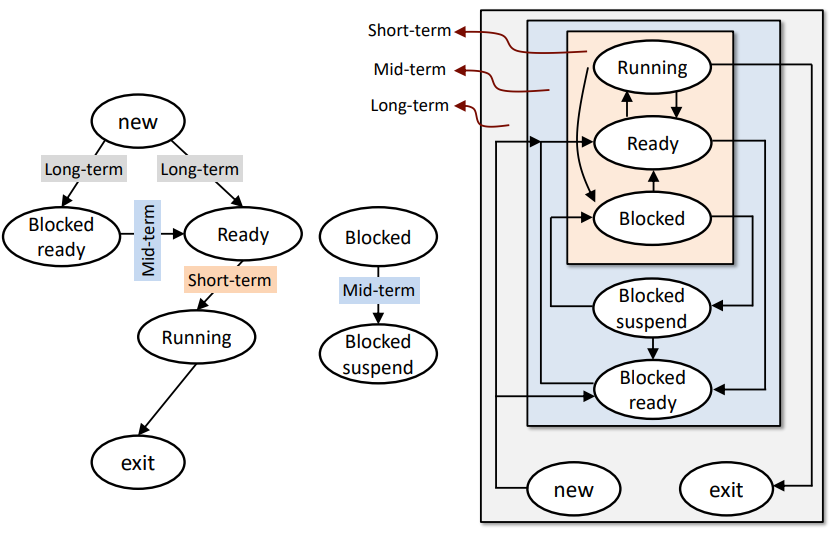

# Chapter 7. Scheduling : Introduction

+ 여전히 CPU Virtualizaiton 에 대한 부분을 다룬다.
  - CPU 는 여전히 하나이지만, Logical CPU는 무한개를 제공하고 싶다.
  - 그러기 위해서는 2가지 기법이 필요하다. 
    - 하나는, 프로세스를 멈추고 다른 프로세스를 구동했다가, 다시 돌아와서 해당 프로세스를 문제없이 진행하는 것이다.
    - Context Switching 이 이것을 가능케 했다.  
    - 다음 OS가 할 일은, 만약 수행중인 프로세스를 멈추었다면 다음은 어떤 것을 수행해야 괜찮을지에 대한 부분이다.
    - __메모리에 10개,100개의 프로세스가 올라가 있으면, 다음은 무엇을 실행할 것인가?__

+ 더 발전되는 질문
  - 100개의 Process 중 하나를 선택해야 한다면, 나머지 99개의 Process는 어떤 상태에 있어야 하는가?
  - 당연히 Ready, 적어도 Suspended Ready 에 있어야 한다. 
  - Block 에게 CPU 실행권한을 줘봤자, Resource가 모자라기 때문에 실행할 수 없다. 
  - __그러므로, Ready State 에 한해서 Scheduling 을 적용해 보자!__
  - Blocked State는 이 단원에서 신경쓰지 않아도 될 것이다. 

## Process Scheduling

+ Ready Queue 에 있는 Process 를 대상으로 한다. 
+ 수행하기 위해 필요한 모든 Resource를 가지고 있고, CPU 권한만 기다리고 있는 Process 중, 그 다음 어떤 것을 실행할 것인가?
  - 이런 주제가 Scheduling 이다.

+ CPU Scheduling, __Job Scheduling__, Process Scheduling 다 같은 말이다. 
  - Job Scheduling 이라는 말을 자주/쓴다. 
  - OS 역사에서 처음에 한 일은, 동시에 수행될 수 있는 Job 이나 Task를 Batch 형태로 모아서 순서대로 수행시키는 것(Single Batch) 였다.
  - OS와 비슷한 역할을 하는, 모니터라는 장치가 등장했고, 순서를 결정했었다. 
  - 왜 __Job Scheduling__ 이라는 말이 Scheduling 에서 메인이 되었나?
    - 옛날에는 Process라는 개념이 없었다. 그냥 Job, Task라는 이름으로 많이 불렸다. 
    - 그 당시부터, 어떤 순서대로 일을 처리할지 라는 개념이 만들어지다보니 Process라는 이름이 쓰이지 않았다. 
    - 그래서 Job Scheduling 이라고 많이 표현되는 모양이다. 

  - CPU Scheduling : CPU에 일을 주는것이다보니 CPU Scheduling 이라는 이름이 많이 쓰이기는 했다. 

+ 하지만, Thread Scheduling 은 당연히 다른 말이다. 

+ Scheduling 은 Multiprogramming OS 에서의 기본이 되는 이야기이다. 

+ 메모리에 올라오는 Process 중 어떤 것을 쓸 것인지?
  - 어떤 Scheduling 기법, 어떻게 Process를 선택할지에 대해, 다양한 방법들이 존재한다 
  - 보이는 많은 Scheduling 기법 중 어떤 것이 현 상황에 더 맞는지를 판별할 수 있어야 한다. 
    - 그리고 A,B Scheduling 기법이 있다면 둘중에 하나를 선택할 때, A Scheduling 이 B Scheduling 기법보다 더 적합한 기법이라고 판단한 근거 역시 있어야 한다. 
    - 다양한 근거가 존재할 수 있다. 
    - 기본적으로는 Turnaround Time(TAT) 나 Response Time 을 기준으로 하기도 하고, deadline을 얼마나 잘 맞추는 기법인지 보기도 하고, 각 개별 Process 들의 Fairness 를 기준으로 하기도 한다. 

+ Turnaround Time(TAT) : 어떤 Job 이 시작해서, 완료될때까지의 시간
  - ex1) 손님이 중국집에 들어가는 순간부터, 주문하고, 짜장면이 나와서 다먹고 계산하고 나올때까지 측정한 시간
  - ex2) 4개의 음식을 주문했다면, 4개의 요리가 다 나올때까지의 시간

+ Response Time : Process 를 실행시키고 나서, 첫번째 반응이 돌아올때까지의 시간. Job 이 완료되는 시간 기준이 아니다. 
  - ex1) 짜장면을 주문하고, 처음 반응(짜장면을 마주할 수 있는 시간)
  - ex2) 음식 여러개를 시켰다면, 그 중 어떤것이 먼저 나오든 관계없이 첫번째 음식이 나올때까지의 시간

+ Scheduling 에서, 첫번째는 Turnaround Time 을 기준으로 판단할 수도 있고, Response Time 을 기준으로 볼 수도 있다. 

+ System Oriented VS User Oriented
  - System Oriented 기준으로 보면, ThroughPut 이라는 개념이 중요해진다. 
    - ThroughPut 은 제공자가 생각하는 성능 수치. 
    - ThroughPut : 시간당 얼마만큼의 task가 이루어졌는지를 보는 수치
    - ex) 짜장면 집을 운영하고 있는 사람의 관심은, 손님에게 얼마나 빨리 음식이 나갔느냐도 중요하지만, 기본적으로 하루에, 혹은 한시간당 몇 그릇을 팔았느냐이다. 
    - 시간당 완료되는 task 의 갯수라고 이해해도 된다. 
    - 서버 입장에서나, 서비스를 제공하는 입장에서의 중요사항 중 하나가 ThroughPut 이다. 
    - System Oriented 라는 것은, 컴퓨터 시스템 기준에서는 서버를 기준으로 생각하는 것이다.

  - User Oriented 기준에서는, Turnaround Time 이나 Response Time 이 중요사항일 것이다.
    - User Oriented 라는 것은, 서비스를 받는 사용자의 기준에서 생각하는 것이다.

  - System Oriented/User Oriented 여부에 따라, 각각의 평균값 구하는 방법이 다르다고 한다. 
    - User 입장에서는 산술평균으로, Service 입장에서는 조화평균으로 구한다고 한다.
    - CPU의 성능 측정하는 방법 중, 평균내는 것을 많이 한다고 한다.
    - 왜 그런지는 컴퓨터 구조 시간에 자세히 알아보자.
    - 각 평균의 의미가 어떻게 되는지, 왜 그렇게 해야 되는지도 알아놓도록 하자.

+ About Fairness
  - Fairness 관련한 Scheduling 기법도 뒤에 나온다. 
  - Fairness : CPU 에 대한 권한을 최소한 어느정도는 개별 프로세스가 무조건 받을 수 있게 해 주는 Scheduling 기법.
  - 만약 Fairness 를 고려하지 않는다면, 중요도나 우선순위가 낮은 Process 는 CPU에 대한 권한을 계속 받지 못하는 문제가 생길 수 있다. 
    - Starvation : Process 가 계속해서 CPU 권한을 받지 못하는 것. 속칭, "굶는 것:
    - Starvation 에 대한 방지책이 필요해서, Fairness를 중시하는 Scheduling 기법들에 대해 많이 연구개발되었고, Linux 나 Android 등에서는 Fairness 를 고려하는 Scheduling 기법이 다 들어가 있다고 한다. 

+ "특정 Scheduling 기법이 왕도는 아니다"
  - 모든 Scheduling 기법 중, 어느 것이 좋고 나쁜지에 대한 많은 이슈가 있다. 
  - 하지만, 모든 부분을 만족하는 Scheduling 기법은, __존재하지 않는다__.
    - Turnaround Time(TAT)를 중요하게 생각한다면, TAT 에 맞는 Scheduling 기법을
    - Response Time 을 중요시하게 생각한다면, TAT에 맞는 Scheduling 기법은 오히려 맞지 않는다. 
    - Fairness 를 다루는 부분에 있어서도 또 다른 기법을 적용해야 한다. 

  - 그러므로, 특정 Schedule 기법을 설정할 때는, __구현하는 시스템에서 가장 중요시하게 여기는 항목이 무엇인가__ 를 생각해서 설정해야 한다. 
    - User 입장에서 설계해야 한다면, Turnaround Time 이나 Response Time 을 중요하게 생각할 것이다. 
    - Server 입장에서 해야 하는데, TAT나 Response Time 을 기준으로 Scheduling 을 설정해서는 안된다. 
    - Server 입장에서는 CPU Utilization 에 포커스를 맞춰서 Scheduling 을 설정하는 것이 좋을 것이다.
    - 혹은, 어떤 시스템 중 모든 Process의 Fairness 를 만족시켜야 하는 부분이 있다면, 그에 맞춰 설정해야 한다. 
    - 모든 Scheduling 일에도, Tradeoff 라는 것이 존재하므로, 그것을 설정하는 것이 Engineer 가 할 일이다. 
 

## Scheduling Criteria

+ 어떤 부분에 Focus를 맞추느냐에 따라, 최적화하는 방법은 다 다르다. 
   - CPU Utilization, Throuput, Turnaround Time 중 어떤 것에 집중하냐에 따라 다 다를 것이다. 
   - Throughput : 단위시간당 수행된 일의 양
   - Turnaround Time(TAT) : 어떤 일이 시작해서, 완료될때까지의 시간(Time Interval)
   - Throughput 과 TAT 는 많이 평가되는 요소이기도 하다. (평균이 어떻게 되는지?)

+ Scheduling 을 디자인하는 System 이, 어떤 항목을 중시하는 System 인지 파악하고,거기에 맞는 Scheduling 기법을 사용할 수 있도록 하자.

### Appendix : QoS

+ "100만 번 중 999,999 번은 제한시간 내에 프로세스가 완료되게 해 달라!"
  - 컴퓨터 시스템에서의 새로운 요구조건이 되어가고 있다. 

+ QoS(Quality of Service)
  - 특정 서비스의 요청에 대한 동작시간이, 특정 시간 내에 완료되는 비율(Percentage)
  - User Experience 에 대한 척도가 되어버렸다. 
  - 요즘은 QoS가 거의 기준화되어 사용되고 있다. 

+ 옛날기준과 지금기준
  - Turnaround Time 과 Response Time은 옛날 기준이 되어가는 중이다. 
  - QoS와 Soft Real Time 부분을 요즘에는 많이 본다고 한다. 
  - 자율주행 쪽에서는 확실히 이런 부분이 자주 고려된다.
     - 외부환경의 변화에 의해, 자율주행 시스템이 반응해야 하기 때문.

## Process Scheduling

+ OS가 하나의 Process 를 멈춘 다음에, 메모리에 올라와 있는 여러개의 Process 중 다음 어떤 것을 수행해야 할까?
  - 기본적으로는 여러 고려사항이 있다. 
    - Long-Term Scheduling : 실제 메모리에 몇개의 프로세스를 올리고, 몇개의 프로세스를 내리는지?
    - Middle Term Scheduling : 어떤 것을 Swapping 하고, 어떤 Process를 사용하며, 언제 Swapping 하는지?
    - Short-Term Scheduliing :  Ready Queue 에 있는 Process 중 다음에 어떤 것에 CPU 권한을 줄 것인지?
    - Short Term Scheduling 은 Dispatcher 라고 불리기도 한다. 
  
  - 기본적으로 Scheduling 기법 에 있어서는, Short Term Scheduling 에 집중해서 다룬다. 

### Three Types of Processor Scheduling

+ 각 Scheduling 고려사항들이 어떤 Range 위에서 고려되는지?
  - Long Term : New 에서 Ready로 넘어가는 과정 부분의 고려대상
  - Middle Term : About Block, Suspend, Ready 에서 해당
  - Short Term : Like 3-state Model. 3-state model에서 각 부분이 Short Term 에서의 고려대상이다. 

## Terminology for Scheduling(Scheduling 에서의 용어들)

+ Preemptive : 현재 수행중인 Running State에서의 Process 를 멈추고 Ready State 상태로 보내는 것.
  - Context Switching 이 발생함
  
+ Non-Preemptive(Cooperative) Scheduling
  - 일단 수행되면, 중간에 Process를 강제로 끊지 않는 것.
  - 지금 사용되지 않는 방법이라고 하여, 무조건 Non-Preemptive Scheduling 이 나쁜 것만은 아니다.
  - 장점 : Context Switching 이 적게 일어나고, Simple 함.
  - 단점 : Response Time 이 당연히 나쁘다. 

+ Preemptive Scheduling
  - 장점 : Flexable. Response Time 줄이는 것에 도움을 준다
  - 단점 : Context Switching 에 대한 성능 변화 부분이 존재한다. 
    - System 최적화할 때는 Context Switching 에 대한 부분(Overhead)을 반드시 고려해야 한다.

+ 일반적으로는, OS의 많은 부분이 Preemptive Scheduling 으로 이루어진다.

+ CPU Burst & I/O Burst
  - CPU Burst : CPU가 동작하는 __구간__
  - I/O Burst : I/O 로 인하여, idle이 되거나, (Multiprocess 입장에서는) 잠시 멈추는 __구간__.
  - CPU Burst를 Running Time이라고 부르는 표현도 존재한다. 

+ CPU Bound Process : Process 가 시작해서 끝날 때까지 CPU 가 연산과정을 거치면서 진행되는 Process
  - CPU의 성능, CPU의 동작하는 시간을 얼마나 빠르게 하느냐에 따라, 전체 수행시간이 결정되는 중요한 기준이 된다. 

+ I/O Bound Process :  
  - 전체 Process 가 동작하는 시간 중 I/O 를 요청하는 시간이 굉장히 많아서, I/O 를 얼마나 빠르게 처리하냐에 따라 해당 프로그램의 수행시간이 결정되는 Process
  - I/O 를 얼마나 빨리 처리하느냐에 따라 System 의 성능이 결정되게 된다. 

+ Process 를 동작시킬 때, 이 Process가 CPU Bound 인지, I/O Bound 인지 그 성격에 따라 System 의 성능을 최적화하는 접근방법이 달라지게 된다. 

## Scheduling : Introduction 

+ 
