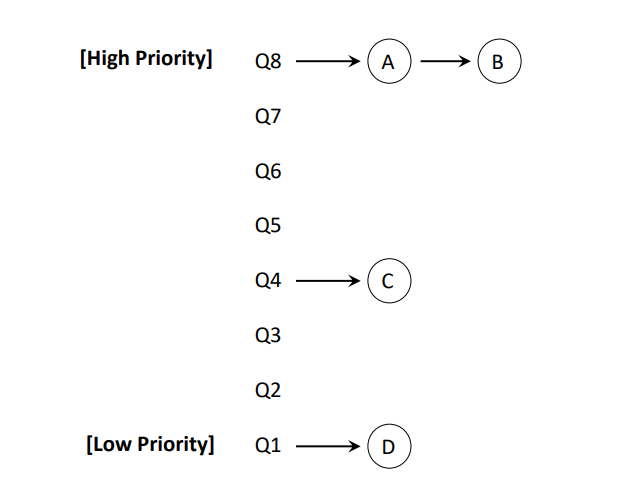

# Chapter 8. The Multi-Level Feedback Queue(MLFQ)

+ 개요
  - 우리가 Runtime 을 모르지만, 그것을 고려해서 만든 새로운 Scheduling 기법이다. 
  - System 에 지금 사용되고 있는 Scheduling 기법이기도 하다.  
  - Multi-Level Feedback Queue
    - Multi-Level Queue : 여러 개의 레벨(층) 이 있는 Queue.
    - Ready Queue 가 하나가 아닌 여러개의 Level 이 중첩되어 있는 것이다. 
    - Feedback : 일반적으로, 한 번 수행했을 때 나오는 결과를 그 뒤에 반영하여, 정책이나 다른 것을 바꾸는 것을 보고 Feedback 이라고 부른다.
    - "한번 수행해서 이런 결과가 나왔으니, 다음에는 이렇게 바꿔야지!" 하는 것이다. 
  
  - Queue 가 여러개 적층되어 있고, Job 이 수행하는 Scheduling 의 결과를 가지고 Feedback 하여 정한다 라고 볼 수 있겠다.

## Multi-Level Feedback Queue(MLFQ)

+ Multi-Level Feedback Queue 는, 처음에는 Multi Level Queue 에서 시작했다. 
  - 그러다가 Multi-Level Feedback Queue 로 발전해서, 현재 사용하고 있다. 

+ Multi-Level Queue : 기본적으로는 Turnaround Time 을 최적화하는 것을 일차적인 목표로 하고, Response Time 도 2차적으로는 최소화하는 것으로 한다. 

+ Runtime 을 모르지만, 그럼에도 불구하고 수행에 있어 가능한 Turnaround Time 을 최적화 하면서도, Response Time 을 최소화 할 수 있다. 

## MLQ : Basic Rules

+ 실질적으로 Multi-Level Queue 가 먼저 개발되고, 이후에 MLQ가 가지고 있는 문제들을 해결하기 위해 MLFQ가 나왔다.

+ Rules
  - MLQ는 기본적으로, Process 실행에 있어 각각의 Job 에게 Priority 를 세팅했다. 
  - Priority 를 주었다는 이야기는, Scheduling 기법에서 Ready Queue 가 하나가 아니라 여러 개가 된다는 이야기이다. 
    - 우선순위에 따라 서로 다른 Ready Queue 에서 기다리고 있는 것이다. 
    - 단순히 하나의 Queue 에서 Job(or Process) 가 Priority 를 갖는 구조가 아니라, Ready Queue 가 Priority 에 따라 여러 개(1번,2번,3번,4번...) 이 있는 것이다. 
    - 그래서 그 Job 이 갖는 Priority에 따라 1번,2번,3번,4번 (Ready)Queue에서 대기하는 것이다

  - __A 의 Priority 보다 B 의 Priority 가 더 크면, Process A를 무조건 먼저 실행한다__
  - __두개의 Priority 가 같으면(동일한 우선순위이면),Round Robin 방식__ 으로 수행한다. 이때 먼저 메모리 상에 올라온 애부터 순서대로 수행된다. Time-Slice 만큼 수행될 것이다. 

## MLQ Example : Static Snapshot

+ 그림설명
  - 이 예시에서는 숫자가 클수록 Priority 가 크다.
  - Q8 의 A,B를 먼저 실행한다. 여기서는 두개의 우선순위가 같으니 Round Robin 방식으로 수행될 것이다.
  - 이후 Q4의 C를 수행하고, C가 끝난 다음 Q1의 D가 수행된다.

+ 높은 우선순위의 Job(또는 Process)를 Round-Robin 방식으로 수행하고, 끝나면 그 다음 Priority에 있는것, 끝나면 그다음 식으로 수행한다. 

+ MLQ에서는, 기본적으로 서로 다른 우선순위에 있는 Queue를 가지고, 각각의 Job(또는 Process, Task) 실행하는 부분에 있어서, 우선순위라는 개념으로 나누어 우선순위가 높은 애들부터 수행하는 것이다. 

## MLQ : Basic Rules

+ Turnaround Time 도 최적화하는 것이지만, Response Time 도 최소화하기 위해 크게 2가지 Case를 볼 필요가 있다.
  - 이 2개의 Case 중 중간 단계에 속하는 애들도 있을 것이지만, 크게 2가지로 나눌 수 있다고 생각할 수 있다. 
  - 특정 Job 이 반복적으로 짧게 CPU를 요청하고 I/O를 요청하고를 반복하는 경우(CPU 사용량은 적다)
    - I/O Bound Process
    - Interactive 한, 사용자가 주로 사용하는 Job 이라고 볼 수 있을 것이다.
    - 사용자가 쭉 사용하면서, 입력하고, 결과 받고, 결과 보고 다시 입력해서 결과 받는 식의 Process.
    - ex) SNS, Word, 검색 같은 것들이 있다.
    - 요청하고, 요청 결과를 받고, 다시 Service를 요청하는 것을 반복한다. 
    - 이런 Job 들은 가능한 짧은 Time-Slice를 가지고, 높은 우선순위에 있는 것이 Interactive Program 에서의 Response Time 에 좋을 것이다. 
    
  - CPU를 오랫동안 사용하는 경우
    - CPU 사용량이 많아서, 한번 수행되면 중간에 쭉 길게 수행하는 케이스이다.
    - 기본적으로, 사용자가 당장 급하게 Response 가 필요한 Process 는 아니다. 
    - 가능한 Time-Slice 를 길게 가져가는 것이 Turnaround Time 에 좋다.
    - 이전에, Round Robin Scheduling에서 , 짧게 Round Robin 을 돌렸을 때 Turnaround Time 이 나빠지는 것을 확인해 본 적이 있다. 
    - I/O 를 별로 요청하지 않고 쭉 가는 Job 에 대해서는 Time-Slice를 길게 해 주는 것이 Turnaround Time 에 좋다.
 
 + 두 타입 Process 의 접근방식
    - 실제 CPU를 사용할 수 있는 Time-Slice 는 5초인데, 0.1초 CPU 사용하고 I/O 요청하는 것을 반복한다면, Time-Slice 를 길게 제공하는 것이 의미없다. 
    - 이런 Interactive Process 는, Time-Slice 를 작게 주면서 Response Time을 줄이는 것이 훨씬 낫다.
    - 사용 기록을 보니, 사용자가 지금 당장 입력값을 넣어 결과를 보고 싶은 "프로그램" 들이 대부분이었다. 
    - CPU 는 적게 쓰고, I/O 가 빈번하게 사용되는 이런 애들은, 사용자가 요청하는 것에 대한 Response Time 을 개선하기 위해서, Time-Slice 를 작게 주고, 높은 Priority 에 두는 것이 이득이다.
    - 대신, I/O 를 요청하지 않고 CPU를 길게 쓰는 애들의 경우, 당장 사용자가 결과를 받아봐야 하는 Job 들은 아니지만, 수행은 반드시 되어야 한다. 
    - Response Time 이 중요하지 않은 Job 들이니, Turnaround Time을 Optimization 하는 식으로 가면 좋을 것이다. 
    - 그러려면, 짧은 Time-Slice를 돌리게 되면 Turnaround Time 이 나빠지니, 이런 것들은 Time Slice를 길게 주자!
    - 그래서 어떤 Job(Interactive 한) 들은, CPU를 양보하면서 I/O를 수행하는 것이다. 
      - 이 Job 들의 경우, Response Time 을 개선하기 위해 Time-Slice를 작게 하고, Interactive 한 것의 가능성이 있기 때문에 Priority 를 높게 준다.
    
    - Interactive 하지 않은 다른 Job들의 경우, Turnaround Time 을 개선하는 것이 System 전체적으로 보았을 때 중요하니, Time Slice를 길게 주고 Priority 를 낮춘다. 

## MLFQ : How to Change Priority

+ MLQ 에서는 하나의 문제가 있다.
  - Job (혹은 Process) 가 처음에 들어왔을 때 Priority를 정해주면, 그 뒤로는 종료될때까지 Priority를 바꿀 수 없다는 단점이 존재한다. 
    - Job 들이 서로 다른 Priority를 갖는 Queue 사이를 옮겨 다니는 매커니즘이 존재하지 않는다. 
    - 그 우선순위면, 거기서 못 움직이니까 계속 높은 Priority 는 Time-Slice가 작고, 낮은 Priority 에 있는 애들은 Turnaround Time 을 최적화하게끔 되어 있어 Time-Slice를 계속 길게 가져가야 한다. 
    - 하지만, 과연 Job 의 특성이, 실행되면서 계속 똑같은 상태로 있을까?
    - 처음에는 I/O 를 별로 요청하지 않다가, 나중에는 빈번하게 요청할 수도 있는 것이다. 
    - __Process 의 특성이 바뀔 때는 대응할 수가 없다__

#### 그래서 나온 것이 MLFQ 이다!

+ 수행되는 특성에 따라, Queue 들 사이에서 Job 이 이동할 수 있게 만들어 놓았다. 
+ 그래서 새로운 Rule이 추가되었다. 
  - 3. Memory 에 새로운 Process 가 들어오면, 무조건 가장 높은 Priority Queue 에 들어간다
    - 아무런 History 가 없을 때는, 가장 높은 우선순위에 둔다. 
  - 4.a 만약에, Job 이 해당 Priority Queue 에 설정되어 있는 Time Slice를 다 쓰면, Round Robin 에서 Ready Queue 로 이동할 때 한 단계 낮은 Priority Queue 로 이동된다. 
    - 높은 Priority 의 Time Slice 를 작게 설정하고, 낮은 Priority Queue 의 Time-Slice를 길게 설정해 놓았으니, 얘는 Time Slice가 더 긴 것이 좋겠다고 판단되는 것이다. 
    - 낮은 Priority 로 이동하는 Process 들은, CPU 수행시간이 길다는 의미이다. 
    - 얘가 정말 짧은 Response Time 을 원하는 Interactive 한 Job 이었으면, 맨 위의 Priority 에 있을 때 충분히 사용하고, I/O를 던졌을 것이라고 예상할 수 있다. 
    - 하지만 계속 CPU를 사용하고 있으면, CPU Time 이 긴 아이니까, Round Robin 으로 Ready Queue에 돌아갈 때 한단계 낮은 Priority Queue 에 집어넣어 주는 것이다. 

  - 4.b. 만약에 제한된 Time Slice 안에 CPU 를 다 쓰고 I/O를 요청하면, Time Slice 보다 실제 수행시간이 더 짧다는 것이므로, 굉장히 Interactive 한 Job 이라고 볼 수 있으니 해당 Priority 의 Queue에 남긴다. 
    - 이런 Interactive 한 Job 들은 Response Time 이 제일 중요하니까, 높은 Priority 에 그대로 있으라고 할 수 있는 것이다. 
    - 그래서 낮은 Priority 로 내려가는 것이 아닌, 해당 Queue의 끝에 다시 가는 것이다 (For Round-Robin)

#### 높은 Priority 의 Time Slice는 작게! 낮은 Priority 의 Time Slice는 길게!
+ 낮은 Priority 의 Time Slice를 길게 가져가는 이유는, TAT Optimize 때문이다. 

+ Rule 3,4 가 있는 이유
  - 3번 Rule
    - System 에 들어온 Job 들의, 맞는 Priority 를 알 수 없다. 그리고 Runtime 도 모른다
    - 그래서 일단 제일 높은 Priority 에 넣는 것이다. Interactive 할 수도 있는 노릇이니 말이다. 
  - 4a,4b Rule
    - 한번 수행한 결과를 갖고, 제일 높은 Priority 에 유지할지, 아니면 한단계 낮은 Priority로 내릴지를 결정하는 것이다. 
    - CPU 를 굉장히 길게 필요로 하는 CPU Bound Process의 경우, Response Time 이 중요한게 아니라 Turnaround Time 이 더 중요하니, 내리는 것이다. 이런 애들은 Interactive 하지 않다. 
    - 해당 Queue 에 설정된 Time Slice 내에서 끝났으면, System 이 해당 process가 Interactive 하다고 판단했기 때문에, 그 Queue 에 계속 있으라 할 수 있다. 
    - 이런 방식으로, 해당 Job 이 있어야 할 Priority 가 어디가 될지 결정할 수 있는 것이다. 
    - 그래서 Feedback이라는 말이 붙었다. 

## Example 1 : A Single Long-Running Job

