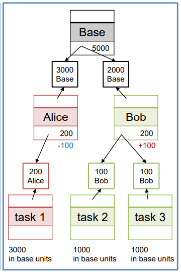
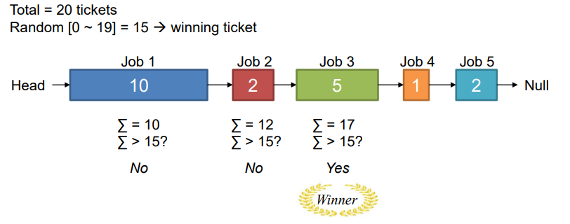
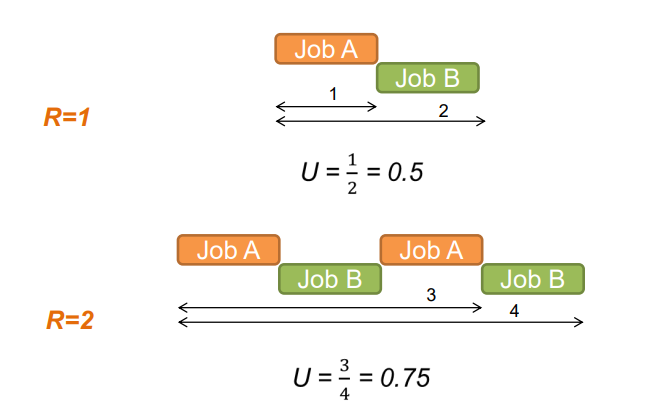
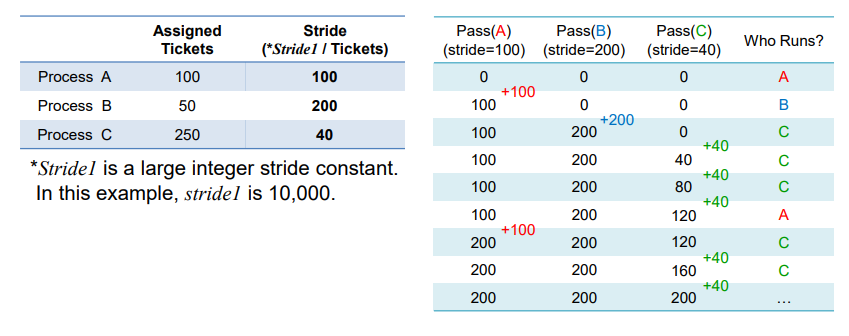
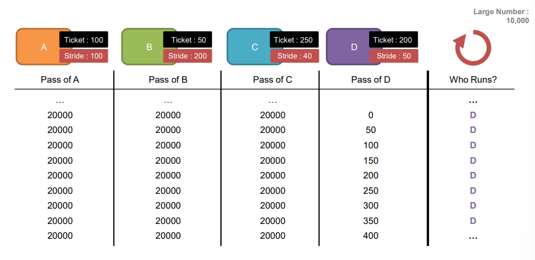

# Chapter 9. Proportional Share Scheduling

+ 기존 Scheduling 기법(MLFQ) 에서의 문제점
  - MLFQ 에서는 Starvation 문제가 생길 수 있었다
  - 성능도 중요하지만, 특정 Process 가 CPU 권한을 오랫동안 받지 못하는 것이 상당히 좋지 않다.
  - __Fairness를 보장하는 Scheduling 기법이어야 한다.__
    - 실제 System 에서는, 성능과 Utilization 도 중요하게 생각하지만, Fairness 도 굉장히 중요하게 생각한다. 
    - Starvation 을 회피하는 방법을 찾아 보자!
    
+ 이 시간에 중점을 두어 보는 것
  - __어떻게 하면 Ready Queue 에 있는 Job 들이 CPU 권한을 최대한 공평하게 받을 수 있을까?__
  - Fare Share

+ Proportional-Share Scheduling(비례되어 나누는~ )
  - Fair-Share Scheduling 이라고도 불린다. 
  - 모든 Process 가 똑같은 권한으로 CPU 에 접근하는 것을 보고 Fair 하다고 부르지는 않는다. 
  - Example 1
      - 10 개의 Process 가 10% 씩 CPU 권한을 갖는 것은 얼핏 보면 Fair 해 보일 수 있다.
      - 하지만, 각각의 process 의 중요도가 완전히 동일한 것은 아니다. 
      - 훨씬 더 중요한, 혹은 덜 중요한 Job 들이 있기 마련이다. 
    
   - Example 2
      - 스마트폰으로 카카오톡을 한다고 했을 때, 사용자가 주로 쓰는 카카오톡은 foreground, 메모리를 관리하는 눈에 보이지 않는 Process 들은 Background 에서 동시에 돌아갈 것이다.
      - Background 작업들이 중요하기는 하지만, User Experience 를 위해서라면 Foreground 에서 돌아가는 것이 훨씬 중요하다.
      - 그렇다면, Background 와 Foreground 에 똑같은 CPU 권한을 주는 것은 과연 Fair 한가?
      
   - 특정 Process가 , CPU 에 대한 권한을 오랫동안 차단당하는 Starvation 이 일어나지 않게 되는 것으로 이런 개념이 출발했다. 
   - "각각의 Process 가 특정 percentage 만큼의 CPU 권한을 가져야 한다"
   - 그러면서, 설정해준 Process 의 CPU 권한 가지는 시간 대비 효율을 계산해 주면서, 해당 Process 의 CPU 권한을 갖는 시간을 조절해 나갈 수 있다.
   - __각각 개별 Process 들에게는, 최소한의 Percentage 를 가지고, CPU 권한을 획득할 수 있는 기회를 제공할 수 있다.__
   
+ Lottery Scheduling & Stride Scheduling 이 있다.

## Basic Concept : Tickets Represent Your Share

+ 기본 Concept : Tickets(몇 퍼센트의 티켓을 가지고 있는지?)
  - 몇 퍼센트의 Ticket 을 가지고 있는가는, 각 Process 가 전체 CPU 중 몇 퍼센트의 CPU 사용권한 시간을 가질 수 있는가로 결정된다. 
  - Ticket 을 몇 개 가지고 있느냐에 따라(Ticket 수에 비례해서) CPU 권한을 그만큼 많이 획득한다(percentage 에 비례한다)
  - 이렇게 Ticketing 을 통해 Scheduling 하면, Starvation 을 막을 수 있을 것이다. 하지만, 정말 그 해당 Percent 만큼 맞아떨어지지는 않는다. 
  - 개별 Process 에게 최대한 골고루 Ticket 을 나눠 주는 것이 기본적인 Idea 이다.
  
#### 이렇게 각 Process 에 Ticket 을 줬다면, 어떻게 그 확률만큼 실제로 CPU 권한을 갖게 할 수 있는가?

## Lottery Scheduling(확률 기반)

+ 진행과정
  - Scheduler 가 Winning Ticket 을 한장 뽑는다.
  - 만약 Scheduler 가 63번을 뽑았다면, A가 승자이다. A를 실행ㅎ나다 
  - 다시 Ticket 뽑기를 진행한다. 
  - 이런 식으로 계속 뽑기로 Ticket 을 줘서 진행한다 
  
+ 과연 그래서 그 퍼센트만큼 잘 맞아 떨어지나?
  - Percentage 를 줬다고는 하지만, 정확히 그렇게 시행되지는 못한다. 
  - 확률적이기 때문이다. 물론 엄청 긴 시간동안 실행한다면 CPU 를 75:25 정도로 근접하게 배분할 수 있을 것이지만, 정확히 Lottery Scheduling 에서 우리가 원하는 정도의 CPU 권한을 나눠갖게 되는 것은 아니다. 
  - 그저 그 수치에 근사하게는 만들 수 있다. 
  
+ Lottery Scheduling 장단점
  - 장점 : 
    - Simple 하게, 각 Process 가 가지고 있는 Ticket 수에 비례해 CPU 권한을 할당할 수 있다. 
    - 계속 돌리면, 근차시로 맞아떨어질 수는 있다.
    
  - 단점 :
    - 딱 그만큼 정확히 맞아떨어지지는 않는다.
    - 그래서 정확히 그 배분을 Guarantee(보장) 하지는 못한다. 
    
+ 핵심 Idea : "Random Selection"
  - 특징 : 확률적으로 Fair 하게 이루어진다. 
  - 정확하게는 아니지만, 그들이 들고 있는 Ticket 에 비례하게 CPU 권한을 할당해 준다. 

#### 이런 Simple 한 Ticket 방식을, 실제 System 에서 활용하기 위해서는 몇 가지 Technique 이 필요하다. 

## A. Ticket Currency

+ 그림 설명
  - Base 에서 Alice 와 Bob 에게 각각 3000,2000 만큼 나눠 주었는데, Alice와 Bob 은 각각 하위 Task 에게 자기들이 나눠주고 싶은 만큼 잘라서, Ticket 을 각각 할당했다. 
  - 아무리 Alice 와 Bob 이 그렇게 할당했다 하더라도, 결국 base 입장에서 보면, 2000/1000/1000 정도로 나뉘어 분배가 된 것이다. 
  - 다시 base 입장에서 환산해서 CPU 에 대한 권한을 획득하게 된다. 
  
+ Ticket Currnecy Concept
  - Main System 이 자기가 알아서 CPU 권한을 할당해서 Sub-System 에게 주고, Sub-System 이 자기가 하고 싶은 단위대로 아래 Task 에게 CPU 권한을 나눠줄 수 잇다. 
  - 물론, Task가 받은 CPU 권한들은, __다시 제일 위에 있는 Main System 의 Percentage 기준으로 환산하여 사용해야 하지만, Sub-System 들도 자기 식대로 Ticket 을 발행해서 나눠줄 수 있는 것이다.__
  
### Ticket Transfer
  - Ticket 을 다른 Process 에게 주거나, 받아올 수 있다. 
  - Ticket 을 매개로 한 Communication  이 가능한 것이다,
  

+ 가장 대표적인 예시 : Server - Client
  - Client 는 Server 에게, 자신이 수행해야 할 일이 있으니 이 일을 빨리 처리해 달라고 Message 를 보낼 것이다. 
  - Client 는 자신이 요청한 일이 빨리 처리되었으면 하는 희망이 있는데, 막상 Client 자신은 그 결과를 기다리는 상황이라 막상 할 일이 없다. 
  - 그러니, Server 에 요청을 보낼때 자신이 가지고 있는 Ticket 까지 같이 보내면, Server 가 가지고 있는 Ticket 갯수가 올라갈 것이다. 
  - 그럼 Server 가 CPU에 대한 권한을 획득할 확률이 올라간다. 
  - Server 는 해당 결과를 Feedback 해 주고, Client 에게 빚졌던 Ticket 을 다시 돌려주면 된다. 
  - Client 도, 그 Ticket 을 돌려받아야 그 뒤에 수행할 후속 작업을 CPU에 접근해 진행할 수 있을 것이다. 
  
### Ticket Inflation/Deflation  

+ 일시적으로 Process 가 가지고 있는 Ticket 양을 늘릴 수도 있고, 줄일수도 있다. 

+ 예시
  - 일시적으로 Bob쪽이 더 중요한 일을 수행해야할 때가 있을 것이다. 
  - 특정 Process 가 더 중요해져서, 더 많은 CPU 접근 권한 시간을 받아야 할 필요가 있을 때는, 위 그림처럼 Alice 가 Bob 에게 Ticket 을 넘겨주는 방식으로 Ticket 을 늘릴 수 있다. 
  - Bob 은, 받은 Ticket 을 추가해서, 자신의 Sub-Task 에게 나눠줄 수 있을 것이다. 
  - 거꾸로, Alice 가 중요도가 높은 일을 배정받았을 때는, bob 이 자신이 가진 Ticket 을 낮추고, Alice 가 자신의 Ticket 갯수를 높여 Inflation 할 수 있다. 

+ 고려해야 할 사항?
  - 이렇게, 시간에 따라서 Dynamic 하게 바뀌는 Process 들의 특성에 맞게끔, Ticket 의 양을 스스로 올리고 내릴 수 있다. 
  - 하지만, base 가 갖고 있는 global ticket 의 양이 변해서는 안된다. 
    - Alice 가 100 줄이는데, Bob 이 100 늘릴 수는 있지만, 200을 늘려서는 안된다는 이야기
    - Global Ticket 의 총량은 맞춰 주되, 내부적으로 Process 들이 Inflation 과 Deflation 을 통해 시간에 따라 중요도가 큰 Job 들이 우선적으로 수행될 수 있게끔 만들어 주는 것이다. 
  
## Key Mechanism of Lottery Scheduling

### 그렇다면, 어떤 식으로 구현할 수 있는가?

1. Random Selection : 어떤 process 가 Winning Ticket 을 가지는지?
  - 위의 그림처럼, list 를 유지해 가면서, 합계를 내며 winner를 선정할 수 있다. 

## Fairness

+ Unfairness Metric (U)
  - U = (첫번째 Job 이 끝나는 시간) / (두번째 Job 이 끝나는 시간)
  - Example
    - 첫번째 Job 이 끝난 시간 : 10s , 두번째 Job 이 끝나니 시간 : 20s
    - U = 10/20 = 0.5
    - U 가 1에 근접할수록, Scheduler 가 더 Fair 하다는 의미이다. 
    

+ Runtime 이 얼마이고, Time Slice 가 얼마냐에 따라, 당연히 U 값이 바뀔 수 있으며, 1에 가까울수록 Fair 하다는 의미이다. 

## Dark Side of Lottery Scheduling

+ Lottery Scheduling 의 단점
  - 확률적으로만 Percentage 를 보장한다. 길게 수행해야 좀 정확하게 그 비율만큼의 CPU 할당 시간을 보장할 수 있다. 
  - 반대로, 짧게 수행했을 때 CPU 접근 시간 할당에 있어서는 제대로 잘 되지 않는다. 
  
#### 그렇다면, 어떻게 하면 deterministic(결정론적인) 하게 fairness 를 보장해 줄 수 있는가?

## Stride Scheduling

+ Main Issue (Stride : 보폭)
  - 10000 이라는 큰 수를 Setting 해 놓았으면, 몇 번의 보폭을 걸어야 10000이라는 수에 도달할 수 있을 것인가?
  - Process A 는 100개의 Ticket 을 가지고 있으므로, 100 번 Stride 해야 도달한다. 
  - Process B 는 50개의 Ticket 을 가지고 있으므로, 200 번 Stride 해야 도달한다. 
  - 이때동안 얼마나 사용했는지 보고, 적게 사용한 Process 에 더 CPU 권한을 많이 주는 관점으로 간다. 
  - Ticket 숫자에 반비례하게, CPU 권한이 주어진다.

#### Assigned Ticket 을 보고, Stride (총 Stride / Ticket ) 값을 구해서, 그 Stride 만큼 계속 더해주면서 더 "총 거리" 작은 애들에게 계속 주는 식이다. 

+ 그림 예시 
  - Ticket 숫자로 Stride를 정해 두고, 다 같다면 아무거나 하나 먼저 실행한다. 
  - 그 다음부터는 무조건 총 Stride 가 제일 작은 것을 실행시킨다. 
  - B가 한번 실행되고 나서, C보다 pass 값이 적으니, B는 C가 200이 될 때까지 실행될 리가 없다. C가 B랑 같아지면 그제서야 B가 실행될 확률이 생긴다 

####  Stride Scheduling은 random하게 하지 않고, pass 값에 따라서 deterministic하게 어떤 것을 실행시킬지가 정해짐! 그렇다보니, 확률적으로 보장하는 것이 아니라 확실히 그 비율대로 보장해줄 수 있음. 

## Stride vs Lottery Scheduling ( Stride 관점에서 )

+ Stride 의 강점 
  - 확률이 아닌, Deterministic 하게 Fairness 를 보장해 준다. 

+ Stride 의 단점
  - 복잡한 Dynamic Operation 상황에서는 약하다. 
  - Example
    - 메모리 상에서 10개의 Process 가 있었다고 해서, 계속 Process 가 10개라는 보장이 없다. 
    - 메모리 상에 Process 가 20개로 늘어날 수도 있고, 5개로 줄어들 수도 있다. 
    - 이런 상황(메모리에 Process가 계속 늘고 주는 상황) 에서 제대로 동작할 수 있을지 확신할 수 없다. 
    
    
## Monopoly Problem 

+ Lottery Scheduling 같은 경우에는, 이런 문제가 발생하지 않는다. 
  - D에 그냥 Ticket 주고, Global Ticket 에서 조정하여 환산하면 된다. 
  - Simple 하다.
  
+ Stride Scheduling 의 경우에는, 이런 경우 추가적으로 D에 설정해 주는 추가적인 작업이 필요하다.

+ 그럼 결국에 뭐쓴다는 이야기?
  - 둘중 하나를 골라야 한다면, System 의 제약 사항을 보고 결정해야 한다.
  - 대충만 맞아도 상관없으면, Lottery 사용하면서 System Resource 최소화하는 방향으로 가도 된다.
  - 정확히 분배야되야 한다면, 그만큼 Resource를 감내하며 쓰면서 Stride Scheduling을 사용하면 된다. Resource를 많이 쓰는 대신에 Deterministic 해진다
  
  

    
