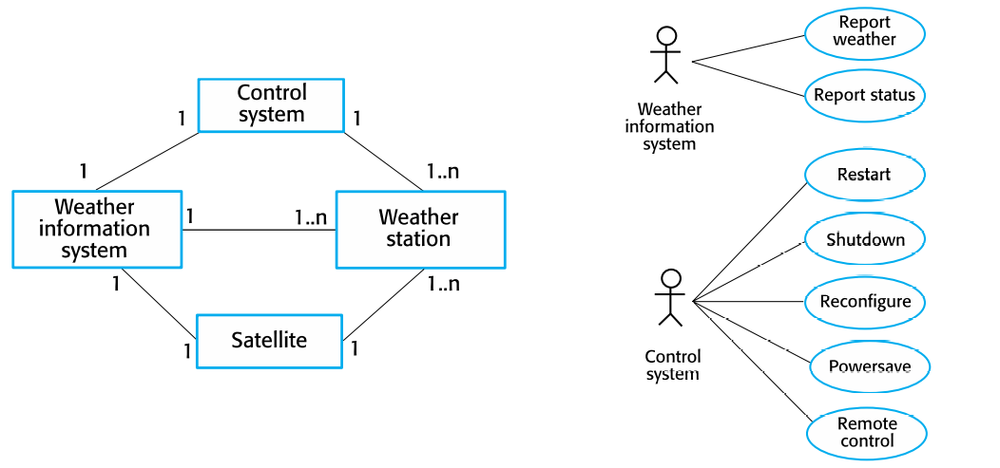
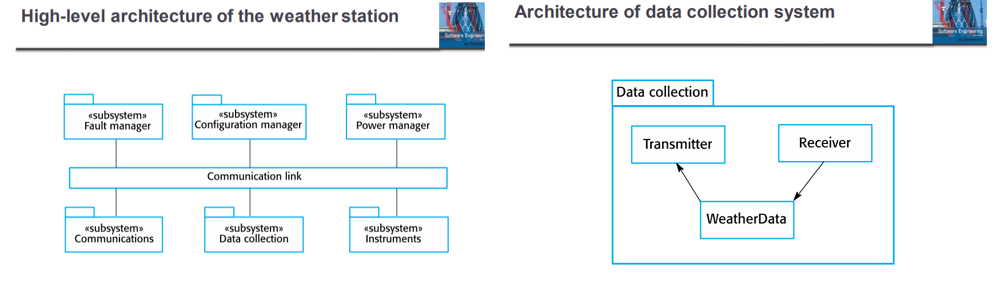
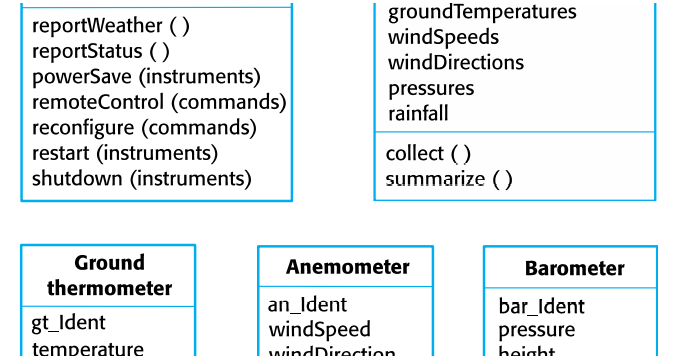
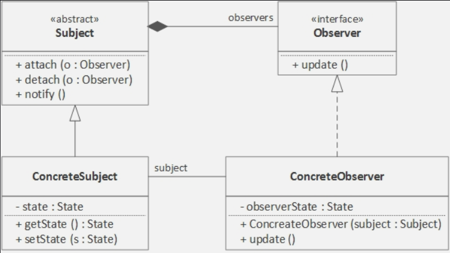
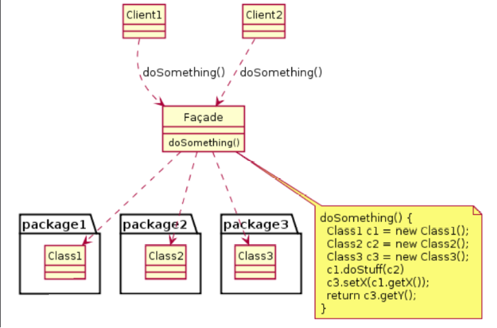

# Chapter7. Design & Implementation

## Topics Covered
+ UML을 사용한 객체지향 디자인
+ 디자인 패턴
+ 구현이슈
+ 오픈소스 개발

### Design and Implementation

+ 소프트웨어 설계 및 구현은 SW공학 프로세스에서 실행 가능한 소프트웨어 시스템을 개발하는 단계이다.
+ 소프트웨어 디자인과 설계는 항상 같이 함께하는 요소이다.
  - 문서로 설계된 내용들을 실제 동작하게끔 만드는 것이 구현이다.

### Build or Buy

+ 넓은 범위에서, 이미 만들어져 있는 시스템 중 유저의 Requirement에 맞게 선택해 가공하여, 최적화해서 판매하는 것이 가능해졌다.
  - 이미 만들어져있는 것 중 사용자의 요구에 따라 조금씩만 가공해서 판매하면, 프로그램 코드의 재사용성이 크게 늘어날 것임.
  - Ex) Medical Record System을 구현하고 싶다면, 이미 병원에서 사용하고 있는 패키지를 구매해서 약간씩만 바꿀수도 있다
  - 밑바닥부터 프로그래밍 언어로 시스템을 개발하는 것보다, 이미 만들어져 있는 시스템에서 바꿔 개발하는 것이 훨씬 더 저렴하고 개발기간이 빠를 수 있다. 

+ 이러한 방식으로 응용프로그램을 개발하면, 이미 있는 프로그램을 구성하는 기능들을 어떤 식으로 배치하고 사용하여 System Requirement를 만족할지를 잘 생각해서 개발해야 할 것이다. 
  - 아이폰에 들어갈 것이면, 그런 System Requirement에 맞게끔 처음부터 고려해서 만들어야 한다. 안드로이드로 먼저 만들어 두면, 나중에 아이폰에 못 넣을 것이다.
  
## Object-Oriented design using the UML(UML을 사용한 객체지향 디자인)

### An object-oriented design process

+ 구조화된 객체지향 설계 프로세스는 다양한 시스템 모델을 개발하는 것을 포함해야 하는(수반하는) 활동이다.
+ Small System 같은 경우, 이렇게 객체지향을 엄청 고려해서 만드는 것이 상당히 비효율적이다.
  - 작은 프로그램을 만드는 경우, 그냥 밑바닥부터 시작해도 금방 만드는데, 괜히 있는 것을 재사용한다고 하면 엄청 비효율적일 수 있다.
  - 바로 요구사항에 맞게끔 바로 코드를 짜 버리는게 더 유리할 수 있음. 
  - 무조건 객체지향적으로 짜는 것이 유리하다고 할 수는 없다.

+ 객체지향으로 프로그래밍할 때는 비교적 큰 시스템에서 하는것이 더 좋다.
  - 비교적 큰 시스템에서 프로그래밍할 때는, 개발 그룹 간에 커뮤니케이션을 어떤 식으로 가져갈 지 정하는 것도 중요하다.

### Process Stage

+ Context(맥락), 시스템의 행위 모델에 대한 내용을 정하기
+ System Architecture 디자인하기
+ 객체들에 대한 내용 정리(이 객체는 어떤 일을 한다!)
+ 설계 모델 개발하기
+ 만들어 놓은 객체들을 어떻게 사용할 것인지 Interface에 대한 내용 정리하기
  - 객체 간에 데이터들을 어떻게 주고받을지
  - 객체 처리들을 어떻게 해주면서 처리할지, 정해놓은 객체를 합쳐서 개발할지, 쪼개서 개발할지 등

### System context and Interactions

+ 사용자와 시스템, 시스템 객체와 객체 간에 정보를 주고받는 관점에서 이해해서 프로그램을 짜야 한다.
  - 어떤 기능을 만들때 객체는 몇개 만들 것인지, 객체 간에 communication은 어떻게 처리할 것인지를 먼저 고려해서 구조를 잡아야 한다.
  - 이런 구조들이 먼저 잡혀져 있어야, 그다음에 해당 메소드를 구현하는 것이 대단히 쉬워진다. 
  - 그냥 마구잡이로 만들 수는 없다. 만들 때 어떻게 합칠지 생각을 하고 짜야 하며, 합치기 좋은 형태로 나눠야 함.
  - 만들 객체를 나누는 것 자체가, 어떤 역할을 나누는 것이라고 생각을 하면 될 것이다. 

+ 해당 맥락이나 상황(Context)를 이해하면, 그 맥락 안에 있는 것만 생각하면 된다. 
  - 교실에 있는 상황에서 게임을 진행할 수도 있겠지만, 교실에 왔으면 교실에서만 할 수 있는 것을 생각하면 되는 것임
  - Context-Interaction 모델 자체가, 다 어떤 환경에서 어떤 식으로 처리해 줄 것인지, 그런 관점이나 방식으로 이해하여 설계하는 것을 의미한다.
  - 만약, 필요한 정보를 미리 다 제공해 주면, 그 Controller Context 안에서는 단순히 정보를 처리해서 결과만 주면 되는 시스템이 될 것이다.
  - 객체지향 관점에서는 이러한 Context가 대단히 중요하다.

+ System Context 모델은 개발 중인 객체의 관점에서 다른 객체와의 상호작용을 보여주는 Structural Model이다. 
+ Interaction 모델은, 해당 객체가 사용될 때 어떻게 주변에 있는 다른 객체들과 상호작용하는지 보여주는 동적 모델이다.

+ Ex) Weather Station에서의 System Context & Weather Station에서의 Use Case
  
  
  
  - 컨트롤러 한개가 여러 개의 기상관측소를 컨트롤할 수 있다.
    - 그러려면, 컨트롤러에서 기상관측소에 대한 정보를 다 가지고 있어야 한다. 
 
  - 날씨정보 시스템에서는 Controller 에 대한 정보를 하나 가지고 있어야 한다.
  - 날씨정보 시스템은, 각 장소마다 있는 날씨정보를 다 가져와야 한다. 
  - 기상관측소는 수집기간 내 관측소에서 수집된 기상자료의 요약본을 기상정보시스템에 전송하며, 전송되는 데이터는 대기온도, 기압, 풍속, 강우량,풍향을 최대/최소/평균으로 나눠서 5분 간격으로 전송한다. 
  - 기상정보 시스템은 기상관측소와 위성통신 연결을 구축하고 데이터를 전송해 달라고 요청한다.
  - 그렇게 요약된 데이터는 기상정보 시스템으로 전송된다. 
  - 기상관측소는 보통 1시간에 한번씩 데이터를 전송할 것으로 세팅되어 있지만, 이 빈도수는 관측소마다 다를 수 있으며, 이후 수정될 수도 있다. 
  
  - 그럼 왜 이런 구조로 짰는가?
    - 컨트롤 해주는 애가 컨트롤 전부다 해 주는 것이 나음. 
    - 처음에 개발해줄 때는 큰 차이 없음. 컨트롤러를 거쳐서 짜주나, 그냥 시스템에 다이렉트로 해주나 별차이 없음
    - 코드를 고칠 때, 컨트롤러로 해 둔 쪽이 코드를 고치기 더 쉽다. 

#### Architecture Design 

+ Architecture 설계도 일반적인 설계 단계에 들어간다. (물론 할수도 있고, 안할 수도 있다)
+ System이 돌아가는 환경에 대해서 이해를 하고, 그에 대한 상호작용들까지 고려해야 함.
  - 이런 과정이 있고 나서 System Architecture를 설계하면 된다. 환경과, 상호작용에 대한 내용을 반영하면 된다. 
  - 실제 System Architecture 에 따라서, 어떻게 Architecture를 Design할것인지 다 달라진다.
    - Repository Architecture의 경우, 저장소가 중앙에 위치해서 사용자들이 접속하여 데이터를 받는 등의 구조로 만들 수 있다. 
    - 이런 방식으로 Architecture를 설계하면, 그에 따라가는 여러 가지 Component, Interface들이 따라감.  

+ Architecture Design 예시
  
  

### Object Class Identification

+ 기능적인 Architecture를 다 정했으면, 그에 맞는 Class, 즉 Object를 정해야 한다.
  - 어떤 객체들이 필요한지 다 정하면 된다. 
+ 여기서는 "마법의 공식", 즉 왕도라는 것이 존재하지 않는다. 
+ 경험, 스킬, 관련 도메인 지식, 등에 영향을 많이 받게끔 되어 있다. 쉬운 부분이 아님.
  - 좀 크게크게 잘라서 객체들을 가져가면 그나마 하기쉽다고 한다. 
  - 처음에 10개가 필요한 듯 보이지만, 크게 2~3개를 가져가면서 설계하다가, 그다음에 더 필요한 부분으로 세분화해서 쪼개면 된다. 그러다보면 10개가 만들어지는 것임.

+ Class 나누는 예시
  - Actor별로 나누기
    - 남학생 (남성 유저) / 여학생(여성 유저)
  - 역할에 따라 할 수 있는 권한과 할 수 없는 권한, 메소드들이 다르니 그에 맞춰서 짜기
    - 이 수업 듣는 사람에게는 어떤 정보를 제공하고, 안듣는사람에게는 제공하지 않는 등
    - 수강자와 미수강자의 역할로 나누어진다.(Actor : 수강자 / 미수강자)
    - 수강자가 할 수 있는 메소드와 미수강자가 할 수 있는 메소드로 나뉜다. 

+ 기상관측 관련 예시
  - 실제 존재하는 하드웨어들도 다 객체로 넣을 수 있다.
    - Ground Thermometer, Anemometer, Barometer 등
  - 그 객체가 행동하는것에 따라 메소드를 짜 넣으면 된다.
    - ex) 센서 객체라면, "Gathering" 메소드를 만들 수 있을 것이다. 
    - Input 값을 해당 센서로부터 받아오면, Output은, 센싱된 값을 다시 출력해서 보여주는 등

+ MVC 패턴대로 객체를 나눌 수도 있다. 
  - Controller나, View 처럼 객체를 굳이 나누지 않아도 되는것 처럼 보이는 것도, 실상은 나누는 것이 좋다.
  - 나누어서 이득보는 부분이 분명히 있음!

+ Ex) Weather Station의 Object Class
  
  

### Design Models

+ 디자인 모델은 객체 및 객체 클래스, 그리고 그 사이의 관계를 보여준다.
+ 디자인 모델 종류 :
  - SubSystem Model : 비슷한 애들끼리 모여 있어서, Sub-System 화를 하면 좋다! 하지만, 객체 간 Coupling은 낮아야 한다.
    - ex) MVC 모델에서 View를 담당하는 Sub-System.
    - 대부분 출력이 View에 들어가있는 경우가 많은데, View라는 SubSystem으로 하나 주면 좋다.
    - 그럼 그 안에 보고 싶은 형태에 따라 다른 객체들을 안엔 생성해서 모아둘 수 있다.
    - 관련성이 짙은 것들은 모아주면 좋다! 하지만, 그 모인 것들끼리 의존적이게 되면 안된다! 최대한 독립성을 갖게 만들어야 한다.
    - 의존적이라는 말은, 하나를 바꿀때 다른것도 다같이 굳이 바꿔줘야 하는, 그런것들이 많으면 서로 의존적(Coupling)이라고 함. 
  - Sequence Model
    - Object간의 행위, 상호작용의 순서를 나타내는 Model
  - State Machine Model
  - 기타등등

### State Diagram 
+ State Diagram은 객체가 각기 다른 Service Request에 응답하는 방법과, 이런 Request를 받아들여 어떻게 상태변환이 일어나는지 보여 주는 데 사용된다.
+ State Diagram은, 시스템이나 객체의 Run-Time에서 어떻게 행동하는지 보여주는 High-Level Model이다.
+ 일반적으로 시스템의 모든 객체에 대한 State Diagram이 필요하지는 않다. 시스템의 많은 객체는 비교적 단순하며, State Model은 디자인에 당장 필요하지 않은 디테일한 부분까지 다 추가하기도 한다. 

#### Interface Specification 

+ Interface도, 클래스 형태로, 객체 형태로 만들고 표현한다. 
+ 하지만, 단순히 중간에서 주고받는 것을 관장하는 그런 역할을 하기 때문에, 다른 객체들만큼 중요하지는 않다. 

## Design Pattern

+ 이미 많이 알려진 것들이 꽤 있음. 
+ 어떤 문제가 있고, 그 문제를 해결하기 위한 Solution에 대한 모델.
  - 이미 우리가 마주할 수 있는 문제들에 대한 Solution이 제공되어 있음.
  - "이럴 때 이렇게 쓰면 됩니다!" 라는 것이 Design Pattern이다. 
+ Architecture Model이랑은 좀 다르다. 
  - a라는 문제들을 해결 할 때, A라는 디자인 패턴을 사용하면 된다 라는 그런 Solution들이 개발되어 있음.
  - 하지만, Architecture는 Solution이라고 할수는 없다. 
  - 물론 Solution으로 사용할 수는 있지만, 반드시 그렇다고 할수는 없다. (개념적인 이야기임)

+ Design Pattern에는, 이름이랑 어떤 문제에 사용되는지, 그 문제를 해결하는 Solution, 그리고 절충안, 결과 등이 나타나 있다.
+ 해당 Pattern을 썼을 때 장단점 또한 존재한다. 무조건 해당 Solution이 베스트인것은 아니다!
+ 어떤 Pattern이 더 좋은지는, 사용자가 선택해서 써야한다. 항상 특정 패턴이 무조건 좋다라는 것은 아니다. 

### Observer Pattern 

+ 스타크래프트의 그 옵저버 맞다. 

+ attach / detach : attach 되어 있는 observer에게만 해당 컨텐츠를 전송하겠다!
+ notify : observer에게 정보를 제공하는 함수. 이걸 받아야 observer가 update 함수를 통해 해당 정보를 받아올 수 있다. 

+ Observer가 실제로 보고 싶은 Subject는 제각기 다를 것이다. 이런 부분은 상속으로 처리할 수 있다.
+ 내가 보고 싶은 Subject를 등록하는 것이 아니라, 그 대상이 Observer에게 display를 제공하는 것임! (중요) Subject가 보여주는 것만 Observer에게 display된다! 그래서 어떤 객체에 대해 전부를 볼 수 있는 것이 아니다. 보여지도록 정해져 있는 것들만 볼 수 있고, 그런것들이 Subject에 의해 notify() 된다.
+ ConcreteSubject의 state는, 위의 abstract class에 정보를 상속해주는 애다. 실제 정보는 당연히 ConcreteSubject에 들어가 있음. 그리고 해당 정보를 get/set 해준다. 
  - 이렇게 해주지 않으면, observing 할 클래스에다가 attach,detach,notify를 일일이 다 추가해 줘야 하는데, 그러기는 상당히 귀찮다. 그냥 새로 파서, 볼 클래스를 상속받아서 observe 관련 함수만 구현해 주면 되는것이다.

+ Observing 하는 객체에 대한 state는 속성값으로 표현할 수 있고, 그 속성의 변수값이 어떻게 바뀌는가에 따라 클래스의 상태가 변화한다. 
+ Subject에 대한 변화가 생겨서 Subject가 nofity 해주면, observer들에게 연결된 update가 생성될 수 있게끔 해준다! 하지만, Observer가 보고 안보고는, 각 Observer들이 update하는지 하지않는지에 따라 달리는 것임.
+ Observer들이 보기에 따라, 다양하게 해당 Subject를 바라볼 수 있다. 

<strong>왜 이렇게 만들었는지는 중요하지 않다. 어떤 문제가 있을 때 이렇게 했으면 좋겠다! 하고 추천을 해주는 것이지, 구현과 설계는 굳이 이렇게 하지 않고 다르게 해도 상관은 없다! 이게 무조건 좋다라는 이야기가 되어서는 안된다.</strong>

### Design Problems

+ 디자인에서 어떤 패턴을 쓸려면, 현재 마주하고 있는 설계문제에 적용할 수 있는 디자인 패턴이 어떤 것이 있는지는 알고 그에 맞게 써야 한다. 
  - Observer Pattern : 여러 객체에, 관찰될 객체의 상태가 변경되다는 것을 알릴 때 사용
  - Façade pattern(파사드 패턴) : 객체와 관련된 interface 숫자가 좀 될때 사용. 
  
    
    
    - 하나를 바꿔 줄 때 여러개를 그에 맞게 다 바꿔줘야 하며, 내부를 다 알아야 해서 복잡하다.
    - 그냥 중간에 통신하는 애 하나만 주고, 나머지는 통신하는 중간 애한테만 다 일임하는 패턴
    - 장점 : 하나만 신경쓰면 되어서, 필터 역할을 해 준다. 
    - 단점 : 클래스 한개 더 만들어야 해서 귀찮다.
    
  - Iterator Pattern : Collection이 구현되는 방식에 관계없이, Collection의 요소에 Access 하는 표준적인 방법
      
      
      
      - 개체 수가 50개가 될수도, 100개가 될 수도 있다. 
      - 그냥 그 다음 것을 찾다가, 없으면 끝내는 식.
  - Decorator Pattern : 런타임에서, 기존 클래스의 기능(functionality)을 확장하고 싶을 때 사용하는 패턴.
      
      
      - 객체에 동적으로 새로운 기능을 추가할 수 있게 하는 패턴이다. 정적으로 서브클래스를 생성하지 않고, 동적으로 생성하기 때문에 런타임에 유연하게 동작 가능하다 
      - 보통 상속으로 SubClass 를 계속 만드는 방법이 실질적이지 못할 때 사용하고, 동적으로 투명하게 다른 객체에 영향을 주지 않고 각각의 객체에 새로운 기능을 추가할 수 있다. 이런 데코레이터 패턴을 적용하면, 기능을 무한정 추가할 수 있다.
      - 참고 : https://sup2is.github.io/2020/06/26/decorator-parttern.html

### Implementation Issues

+ Reuse : 
  - 비용 절감 때문에라도, 재사용하는 것이 좋다!
  - 상속 받아쓰면 좋다! 기존 상속하는 것에서 무엇인가를 잘못 만들어 놓았으면, overriding해서 그 부분만 새로 만들어 쓰면 된다!
  - 안쓰는 메소드 있으면, 그냥 안쓰면 된다! 추가적으로 개발할 것이 있으면, 상속받았으니 거기에다가 함수만 추가해서 개발하면 된다.
  - 이렇게 Reuse 가 편리하다~
  - 작은 System은, 그냥 새로 짜는게 더 빠를 수도 있기는 하다. 
  - Reuse 하는 Level : 
    - Abstraction Level : 설계 단계에서 무엇인가를 추상화 할 때 필요하면 Reuse 함. (Architecture Level)
    - Object Level : 그냥 Class 를 갖다쓰는 단계. 상속 정도로 보면 될 것이다. 
    - Component Level : Class의 집합을 갖다쓰는 단계. 위의 Object Level 처럼 똑같이 쓸 수 있을 것이다. (Framework 를 갖다쓰는 것.)
    - System Level : 그냥 있는 System 자체에다가 뭔가를 그냥 단순히 추가해서 갖다쓰는 단계. System 자체에다가 단순히 추가한것이라 그냥 실상은 다 갖다쓰는 느낌이다. 혹은, API를 갖다쓰는 것임.

+ Configuration Management
  - 요즘은 Orchestration이라고 나와 있지만, 이런 인프라 구성이 예전만 해도 대단히 빡셌다.
  - 서버, DB, 프론트에 뭘 쓸건지, 버전은 어떻게할것인지, 호환은 어떻게 할것인지, 그 전반적인 것들을 다 호환시키고, 보안이랑 연동되게끔 하는 작업을 했어야 했다. 
  - 하는 것에 맞게끔 최적화 해주는 작업이다. 각각(API등등) 에 대한 조합, 연결 해서 어떻게 연동할 것인지에 대한 전반적인 것들을 세팅하는 것. 
  - 상당히 어려운 작업이었다. 요즘 나오는 유명한 것들은 Architecture 단에서 나와 있는 것들은, 어느정도 자체 Configuration을 갖춰 놓고 시작하는 경우가 많다.

+ Host-Target Development 
  - 주로 Embedded System 분야에서 이런 이야기가 많이 나옴. 
  - Host와 Target이 달라서, Cross-Compile 하는 경우가 많음! (Host : 개발하는 컴퓨터 / Target : Cross-Compile 되어 들어가는 기계)
  - Platform 이라는 것은, 단순히 Hardware일 뿐만 아니라, target까지 고려해서 생각해야 하는 개념임. 
  - 개발할 때 언어만 잘 알아서 되는 것이 아니라, Platform도 잘 알아야 한다!
  - 요즘에는, 그냥 비싼 hardware 쓰고 블록코딩처럼 나오는 Platform 써도 상관없는 시대가 슬슬 되고 있다!
  - Platform은, 단순 하드웨어 뿐만 아니라, OS, 관련된 Runtime Software Library, DB, 기타등등이 모두 포함되어서 나온다.
  - 이미 해당 플랫폼에서, 어떤 OS인지, 어떤 DB인지 싹 정해져서 나오기 때문에, 그것을 갈아치우기보다는 그에 맞게끔 개발하는 것이 좋다.
  - 실제로 설치되는데 맞춰서 개발한다! 기존 다른 것은, 다 선택해서 집어넣는데 반해, Platform을 기반으로 하면 이런것에 차이점이 있다.
  - 실제로 특정 Library가 있어서 그에 맞게 다 개발했는데, 실행하는 곳은 해당 Library가 없다면, 낭패를 볼 것이다. 이런것까지도 신경써 주는 것이 좋다. 
  - 플랫폼이 있다면, 그 플랫폼에 맞춰서 개발하는 것이 좋다. 아니면 개발 다 한 후에 해당 플랫폼에 맞추는 작업까지도 해야 하기 때문.

### Component/System Deployment Factors(배포 요소들)

+ 지원하는 Hardware / Software를 잘 봐야 한다. (Platform)
   - Hardware + Software 합쳐서 Platform이라고 많이 이야기하는데, 해당 플랫폼 안에서 모든 것들을 다 해결하는 것이 좋다. 플랫폼을 고려해야 한다!

+ 하나의 Platform에서만 동작하는 것이 아니라, 여러 개의 Platform에서 동작하는 것이 좋다. 
  - 한 Platform에서 보안 문제가 생기면, 다른 Platform에서 돌려야 하기 때문에, 여러 군데에 다 만들어 놓으라는 의미.

+ Communication Traffic이 많이 발생하는 것이 2개 있으면, 물리적으로 가까이 해 두는 것이 좋다!
  - 통신하는 데도 비용이 들고, Traffic이 많이 소모가 되기 때문에, 이렇게 통신을 주고받는 것에도 많은 비용이 소모된다. 
  - 최대한 물리적으로 가까이 두거나, 한 군데에 두자! 그래서 Communication Delay를 최소화하자.

## Open Source Development

+ 오픈소스를 가지고 결과물을 만들어 내자!
+ 물론 오픈소스 안 써도 된다. 하지만, 100명 넘게 붙어서 만드는 것이다 보니, 확률적으로 에러가 상대적으로 적다는 이점이 있다.
+ 오픈소스는 공개된 것이다 보니, 속일 수가 없다. 공개된 소프트웨어 자체는 속일 수가 없음.
  - 아예 소스코드가 다 오픈되어 있는 것이다 보니, 소스코드 보면 결국 못속인다. 
  - 반면에 혼자 다 짜고 이런저런 기능이 있다고 말하는 것이라면, 소스코드 공개 안하면 속일 수도 있는 것임. 
  - 그렇다 보니, 상대적으로 혼자 짠것보다 오픈소스를 신뢰할 수밖에 없는 것이다. 

+ 오픈소스이다 보니, 그 소스에서 다른 것을 더 확장해서 개발하거나 새롭게 개발할 수 있다.
+ 만약 코드가 공개되어 있지 않다면, 코드를 짠 특정인에게 또 수정해달라고 요청해야 하고, 회사나 기업 입장에서는 그사람 아니면 안되는 것이니 싫어함. 여러 사람이 누가 와도 수정할 수 있게끔, 사람에 의존적이지 않게 되려고 하는 곳이 많다. 그래서 오픈소스를 많이 사용한다.
+ 비즈니스 할 때도, 어떤 기술을 사용했냐고 물어볼 일이 많다. 어떤 오픈소스를 기반으로 해서 어떤 식으로 개발했다고 말하면, 해당 오픈소스를 서로 아니까 상호간에 이해가 빠르다. 
+ 다양한 오픈소스가 많다. 
+ 상업적으로 쓸수있는지? 수정가능한지? 특허? 개인적으로 사용가능한지? 품질보증 해주는지? 에 대한 관련 신경써야 할 요소들이 많다.

