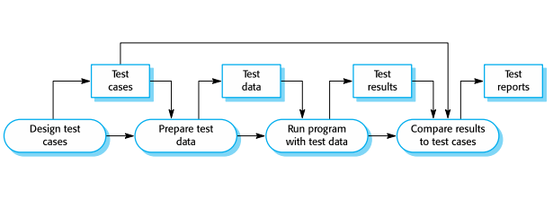

# Chapter 8. Software Testing

## Topics Covered

+ Development Testing
+ Test-Driven Development
+ Release Testing
+ User Testing

### Program Testing

+ Testing 이란 무엇인가? 
  - Program Defect(결함) 찾기!
  - 프로그램을 만들었으면, 의도한 대로 잘 동작하는지 확인하기
+ 인위적인 Data로 테스트를 한다!
  - 물론 실제 데이터로 할 수도 있음. 하지만 그게 실제 데이터라 할지라도, 동작하면서 나오는 데이터가 아니다 보니 진짜 "실제 데이터"는 아니다!
  - 실제 데이터를 다시 가져와서 넣는것 자체가 이미 인위적인 데이터이다.(이미 한차례 가공이 된 것임)

+ Error 결과 확인하고 고치기
+ Non-Functional 적인 부분 확인하기. 여기서 Non-Functional 만족하지 못하면, 잘못된 것이라고 인식을 한다.
+ Testing을 했다고 해서, Error 가 없다는 것을 완전히 보증할 수는 없다. 에러가 있는데 못찾은 것일수도 있음.
+ 테스팅한 부분만 에러가 없다는 것을 보증할 수는 있어도, 나머지 테스팅이 안된 부분은 보장할 수 없는 것이다.
  - 모든 경우에 대해서 다 테스팅 해볼수 있다면, 에러가 아예 없다는 것을 보증할 수 있지만, 현실적으로 불가능하다. 

+ 크게 나누면, Verification & Validation 두개로 나눌 수 있다. 
  - Verification : 스펙에 적혀있는 의도대로 되어 있는지?(스펙에 적혀져 있는 대로 되어 있는지?)
  - Validation : 유저가 의도하는 대로 만들어져있는지?

+ Testing하는 목적 : 
  - Developer와 Customer에게 보여주기 위한 목적이 있다.
  - Testing이 잘 수행되면, 해당 Software가 잘 만들어졌고, Requirement를 달성했다고 볼 수 있다. 
  - <strong> 1. 앞서 User Story, User Senario가 있었고, 그것을 가지고 System Requirement를 뽑아낼 수 있었다. 그럼 그 Requirement가 잘 되는지 보여주어야 테스트가 끝나는 것이다.(Validation)</strong>
  - <strong> 2. 스펙과 맞지 않는 이상한 짓을 하는지 여부를 체크하는 것. (Defect 체크) </strong>
  - Validation 이 되기 전에, Verification을 체크하지 않으면 이후 Validation이 될 수가 없다.
    - 애초에 스펙이 다 만족이 되지 않으면, Validation에서 통과가 될 리가 없다. 
    - Validation은, Verification 이후 유저가 직접 눌러보면서 확인하면 그것이 Validation이다.
  - 일단 먼저, 맨날 쓰던 대로 써보고 그것부터 다 만족이 되어야, 그다음에 Error를 찾는것이 의미가 있다.
    - 애시당초에 맨날 쓰던대로도 충족을 못하는데 Error를 찾는게 무슨 의미가 있을까?
  
### Validation & Defect Testing
  
+ Validation Testing : 개발자와 Customer가 만나서 스펙에 따라 다 짜여졌는지 확인하는 것.
+ Defect Testing : Defect, Error, Failure 등을 찾아내는 것.
  
### Testing Process Goals
+ 기본적으로 원하는 Input을 넣어보고, 원했던 Output이 잘 나오는지 부터 테스트해보는 것이다.
    - Black-box Testing : 시스템 내부는 아무것도 모르는 상태로, 입력을 줬을 때 출력이 제대로 나오는지 확인하는 방식.

### Verification vs Validation 

+ Verification : Product를 만들 때 올바르게 만들었는가?
  - 만들어야 하는 것을 만들었는가?
  - 스펙에 맞게 만들었는가?

+ Validation : 유저가 원하는 대로 만들었는가? 유저가 실제로 요구하는 것이 무엇인가?

+ Verification 과 Validation 중 하나라도 빠지면 안된다. 
+ Software 목적/유저가 바라는 사항/Marketing 환경 등은 Validation 에 속한다
  - 저런 것들은 Requirement랑은 관계없는 경우가 많다.
  - 꼭 보고 싶었으면 Requirement에 집어넣었을 수도 있지만, 대체로 집어넣을 수 없는 것들이 많다. 

### Inspection(검사,점검) & Testing

+ 흔히 Review라고 많이 이야기한다. 
+ Inspection : Requirement 에 있는 애들과 소스코드를 비교하며, 맞는지 아닌지 "검사"할 수도 있다. (정적 분석, Static Verification 이라고도 부름)
  - 문서만, 코드만 봐도 당장 앞뒤가 안맞는 부분들, 모순되는 부분들이 나올 수 있다! 그런것들을 찾는 것이다.
  - 동작시켜서 찾는것보다 훨씬 더빨리 찾을 것이다. 
  - Tool based document : IDE에서 제공되는 Tool에서 경고 뜨는것들로 충분히 찾을 수 있다!
  - Inspection 할때는, 스펙, Architecture, 설계, Schema 등 다 "검사"할 수 있다.
  - 프로그램이 개발 안된 상태에서도 할 수 있다.
  - 동작시켜서 보는것만큼 디테일하게 볼 수는 없다. 동작시켜서 보는것만큼 더 많은 것을 할 수는 없다. 대신, 전 단계에 걸쳐서 할 수 있다.
  - 실행하지 않고서도 볼 수 있다

+ Testing : 실제로 Product를 돌려보면서 찾을 수도 있다. (동적 분석, Dynamic Verification) 
  - 실행시키면서 잘 동작하는지 보는 것을 동적 분석이라고 많이 이야기한다. 
  - 결과물이 있어야만 테스팅할 수 있다.

+ 둘다 해도 못 찾는 에러가 나타날 수 있다. 그러므로, 최소한 Inspection, Testing 둘 다 해보면서 에러를 찾아야만 한다.
+ V&V(Verification & Validation) Process 안에서, 두개 다 할 수 있다. 
  - Inspection 같은 경우, Non-Functional Check 하는 것이 불가능하다. 
  - Performance, Usabilty, 기타등등 특성에 관련된 것들은 Inspection 으로 파악하는 것이 불가능하다. 직접 해봐야 알 수 있다.
  - 스펙 문서만 보고 파악하는 것이기 때문에, 유저의 요구사항은 확인할 수 없다.(문서도, User Requirement가 한번 거쳐서 온 것임)
  - 동적 테스팅할 때는, 유저가 옆에서 보고 있으니 유저의 실제 요구사항을 반영할 수 있다.

### A model of the software testing process

+ Test Case : Test Input과 기대값(expect value)가 합쳐진 것.
  - 설계할 때 Requirement 보고 이야기할 때, 어떤 것을 눌렀을 때 무엇이 나와야 하는지 같은 것들.
  - 처음에 기대했던 것과, 나중에 나오는 것을 비교하면서 테스팅을 진행할 수 있다.
+ Test Data : Test에서의 Input
+ Test Result : Test에서의 Output
+ Test Report : 몇개 통과했는지, 몇개 Fail났는지 나오는 Report

### Stages of Testing(테스팅 단계)

+ Development Testing(개발 테스팅)
  - 시스템 개발할 때, 개발 중간에 이루어지는 여러 가지 테스팅. 
+ Release Testing
  - 개발이 끝났고, 출시하려고 하는 프로그램을 다른 테스트 팀(QA 팀)에서 테스트해 보는 것.
+ User Testing
  - 실제 사용자가 테스팅하는 것. 결국 Release Testing하는 사람도 개발자임. 실제 사용할 사용자가 할때는 또 다르게 될 수도 있다.
  - ex) 핸드폰을 샀는데, 기능 다 매장에서는 잘 되었는데 집에서는 안되는 경우, 와이파이 표시는 떠있는데 실제로는 데이터를 소모하는 경우 등이 있을 수 있다.
  - 유저가 사용하는 환경에서 사용해 보아야 한다. 

## Development Testing

+ 개발하는 중간에 일어나는 Testing. 개발자가 일반적으로 이야기하는 Testing은 Development Testing이다. 
+ 개발팀이 아닌 사람은, 이 과정을 개발 과정의 일부로 생각한다. 그래서 많은 사람이 아는 Testing은, Development Testing 이후이다.
  - Development Testing 과정에서, 오류가 발견되었다면 Debugging 함. 이것은 개발이라고 볼 수 있음. 계속 코드 고치기 반복하니까!
  - 큰 틀에서 보았을 때는, 개발이다 라고 볼수 있는 것이다. 
  - 심지어 Requirement 만들 때도, Conflict가 일어나니까 계속 고쳐나가는 측면에서는 Debugging이라고 볼 수도 있는 것이다.
  - 개발 과정중에서 하는 검증인데, 마땅한 용어가 없으니까 Testing이라고 한다고 한다. 
  - 말 그대로, Testing이라는 것 자체가 "테스트하는 행위"를 이야기하는 것임. 그냥 이런 행위적인 것들이 들어가면 Testing이라고 이야기하는 것.

+ Unit Testing / Component Testing / System Testing 이런 것들이 있을 수 있다.
+ Unit Testing 
  - 단위 테스팅. 우리가 Software Engineering 할때 가장 기본이 되는 개념은 "객체지향" 이고, 그 안에서 가장 작은 단위는 "객체" 이다.
  - Unit(객체) 를 Testing 하는것을 보고 단위 테스팅, Unit Testing이라고 할 수 있다. 
  - Unit Testing의 가장 큰 목적 : Functionality
    - 객체 안에 여러 개의 Method가 있다. 
    - 객체 안에 어떤 값들도 확인하고, Method도 다 잘 동작하는지 확인해야 한다. 
  
  - 객체 만으로 테스팅을 다 하는 것! 객체 단위에서 쪼갤수없는 곳까지 가서, 그 Scale에서 Testing 진행하는 것이다. 
  - 객체, 속성값, 메소드 Level에서 테스팅을 진행하는 것이다. 
  - 만약, Static Class라서 객체 내 속성값이 없는 경우가 있다.(여기서 속성값 : 각 객체가 지니고 있는 고유 값)
    - 메소드만 있다고 가정할 수 있다. 이럴 때는 각 attribute(속성값)을 볼 필요가 없다. 

  - 객체가 Method가 없는 객체일 수 있다! 추상화 클래스라서 속성값만 있다면, 어떻게든 해당 속성값이 변하는 것만 확인하면 된다. 

<strong> 원래는 어떤 객체가 있다 치면은, 다른 외부 Component에서 어떤 Interaction 이 일어나든, 해당 객체에 대한 속성값까지 다 바뀌는 것을 확인해야 한다. Unit Testing 단계에서 확인할 수는 없는 부분이라 할지라도, 원래는 그런것까지 다 체크를 해야 한다는 사실은 알고, 메소드를 테스팅할 때도 그런 부분을 감안해서 개발하고 테스팅해야 한다. </strong>

+ Component Testing
  - Component 단위를 Testing하는 것. Integration Testing이라고도 불린다. 
  - Object보다 더 큰 단계. 여러 개의 Object가 모여있는 것을 보고 Component라고 부른다. 
  - Component는, 또 다른 이름으로 SubSystem이라고도 부를 수 있다. System과 Object 중간의 어딘가에서 테스팅 한다고 생각하면 된다.
  - Component는, 또 다른 Component로도 만들 수 있다. 
  - 객체가 여러 개 있을 것인데, 객체 간 서로 취급하는 데이터가 다 다르고 약속된 것이 다 다르다. 이런 부분을 통합해서 맞추어 주며, 테스팅을 진행하는 것을 Component Testing(Intergration Testing) 이라고 한다. 
  - 하나의 Component로써 무엇인가를 했을 때 그것이 잘 동작하는지 아닌지를 확인하는 것이다. 
  - Component들을 굳이 Sub-System이라고 부르는 이유는, 이것들도 하나의 System으로써 동작할 수 있기 때문이다. 이것을 이미 다른데 갖다 붙이면, 다른 시스템에서 충분히 사용할 수 있을 저옫의 어떤 Level 이 된다. 그래서 Component 단위의 Testing에서도 웬만큼 테스팅이 잘 이루어져야 한다.
 
+ Interface Testing
  - 어떤 데이터를 주면, 어떤 데이터를 다시 돌려주는지의 관점에 따라 행해지는 Testing.
  - 어떤 Input을 줬을 때, 해당 되는 Output을 하나하나 보는 것이 Interface Testing이다. 
  - 

#### 개발할 때는 Top-Down으로 가면 좋지만, 테스팅할 때는 Bottom-Up으로 가는것이 좋다. 
+ 설계할 때는 복잡하게 생각할 것 없이 짜면 되지만, 설계할 때는 아래에서부터 위로 하나씩 테스팅해가면서 진행해야 한다. 
+ 아래에서 위로 진행했으면, 아래에 있는 것들이 모두 테스팅 완료 되었으니, 위에서는 단순히 연결부위 테스팅을 진행하면 된다. 
+ 테스팅했을 때 문제가 생기면, 연결부위에 문제가 생겼을 경우나, 아니면 아랫 부분에서 테스팅에 누락이 발생한 것이다. 
+ 이렇게 진행하다보면 최종적으로 System Testing까지 이루어지게 된다. 
  - System Testing까지 진행되면, 대체로 기능적인 부분은 잘 동작한다고 봐야한다. 
  - System Testing에서는, Component 간의 Interaction을 주로 테스팅한다. 

### Test Coverage

+ 테스트를 어디까지 할 것인가에 대한 이야기이다.
+ Coverage 종류는 여러가지 있음
  - Statement Coverage : 한줄한줄 문장을 하나하나 실행하는 것임. 모든 문장을 실행해야 Test Coverage 가 100% 만족하는 것이다. 
  - Decision Coverage : 모든 문장을 다 실행해볼 필요가 없다. 단순히 분기(If문) 만 다 통과하면 된다는 주의
  - Class의 Test Coverage :  모든 Operation을 다 거쳐야 한다.(Class 내 모든 Method를 다 Testing해야 한다.)
    - 똑같은 Method라도 해당 객체의 Attribute(속성값)이 다르면 동작하는 내용이 달라질 수 있다. 
    - ex) Active / Inactive 에 따라, 같은 Method라도 동작하는 내용이 다를 것이다. 
    - 이런 State도 바꿔 가면서 동작시켜 봐야 한다. 

+ 상속이 개발하거나 설계할때는 되게 좋지만, Test할 때는 대단히 어려워진다. 
  - 추상 클래스 테스트할려면, 아래 자식 클래스 Testing도 다 해야 한다. 부모는 자식에 다 들어갈 수 있으니
  - 객체에 대한 Unit Testing이라고 하고 있는데, 실제로는 "Unit" Testing이 안 되는 것이다. 

+ 테스팅할 때 정답은 없지만, 테스트는 최대한 많이 해보는것이 제일 좋다. 해보는 케이스가 많으면, 해당 프로그램에서의 "정확도" 가 올라가게 된다.
+ 하지만 테스트에서는 무조건 중요한, Critical 한 부분부터 내려가서 점차적으로 중요도가 떨어지는 애들 방향으로 하는것이 좋다. 

### Automated Testing
+ Setup Part : 딱 함수를 테스트하기 전 Pre-Condition으로 만들어 주는 Part. 
  - Setup Part는 고정적이다. 해당 함수를 실행하기 위해서는 그 함수가 실행되는 조건이 있을 것이다. 그 조건으로 만들어 놓고 실행하는 것임.
  - 조건이 없으면 무작위로 실행되기도 한다. Setup Part를 안 쓸수도 있고, Random하게 임의의 값으로 줄 수도 있을 것이다. 
+ Call Part : 실제로 테스트하고자 하는 Part. Test Case를 넣어서 실행시키는 Part.
+ Assertion Part : Call Part에서 나온 내용을 가지고 참/거짓 같은 내용을 바탕으로 후처리하는 Part. 
  - Call Part에 Test Case를 넣어보고, 기대값과 실제 Output을 비교해서 같으면 True, 아니면 False

+ Setup Part는 없을 수 있지만, Call/Assertion Part는 대부분 있다. 

### Choosing Unit Test Cases

+ 어떤 Test Case를 가지고 갈것인지 선택해야 한다!
  - 1~10까지 케이스가 있다고 하면, 다 넣으면 좋다. 
  - 자동화로 하면 그것이 쉬운데, 수동으로 10개, 100개 다 테스트 케이스를 넣어서 테스팅 해보려면 상당히 어렵다.
+ 그럼 그 중에 어떤 것을 해야 하는가?
  1. Normal Operation : 이미 스펙 상 정의된 것들을 가지고 테스트 케이스를 만들어서 넣어 보는 것.
  2. Abnormal Operation : 스펙에 없는 희한한 동작을 해보는 것. 창의적으로 해보는 것.
    - ex : 0 이상의 자연수라서, 0 이하의 숫자는 예외처리를 해 두었는데, 1.5같은 실수를 넣으면? 에러가 날 수 있다.
    - 물론, 여기서 1.5를 넣으면 1로 처리될 수 있으니, 잘못된 입력값이라고 처리를 해 줘야 할 것이다. 1.5가 들어갔을 경우 계산을 멈추게끔 동작시켜야 한다. 
    - 1.5를 넣어서 동작하는것은 Spec 상에 정의된 내용이 아니니 Abnormal behavior라고 말할 수 있다.

### Test Strategies
+ Partitioning Strategy : 
  - 어떻게 Partitioning을 하는가? : Equivalent Partitioning을 하거나, GuideLine Based Testing 진행한다.

### Partition Strategy
+ Partitioning Testing 같은 경우 주로, Input이 100개 있다면, 다 넣어서 테스팅하는 것이 제일 정확하다. 
+ 하지만, 다 하기 너무 힘들어서 Partitioning을 한다. 
+ 데이터 특성을 봐 가면서 조각내면 된다. 
    - ex) 0~20 , 21~40 , 41~60 , 61~80 , 81~100 이렇게 Partitioning 했다면, 각 파트에서 하나씩 집어넣으면서 테스팅하면 될 것이다. 
    - 동작하는지를 보려고 하는 것이니, Input을 그에 맞춰서 집어넣어 보는것을 Partitioning 이라고 한다. 
+ 칸막이 치고, 그 대표값 하나씩 넣어보면 될 것이다. 다른 것들은 넣어볼 필요가 없는 것이다. 

+ 보통 Equivalence Partitioning(균등분할)을 한다. 
   - 1이라는 데이터, 2라는 데이터 가 다 균등, 동등 하다는 이야기임. 
    - 물론 이 "동등" 의 기준은 다 다르다. 코드나 시스템, 스펙에 따라 다를 것이다.
    - 이 "같은" 기준의 집단을 Equivalence Class라고 이야기한다. 
    - 인공지능에서도 이렇게 클래스를 나누어 데이터를 학습시키고 하는 것임. Partition 별로 데이터 Input을 뽑아내어 처리한다. 
    - 함수로 치면, 정의역, 공역에 있는 무엇인가 중 하나가 선택되어 짝지어지는 것임(Test Case로)

+ 보통 경계값에서 문제가 많이 발생한다. 
+ 보통 평균값, 경계값과 평균값 중간 두개, 그리고 경계값으로 테스팅 진행한다. 
  - 경계값을 전후로 해서 하나씩, 그리고 중간에 두개, 그리고 평균값으로 많이 진행하면 맞다. 
  - Equirvalence Partitioning을 이미 했기 때문에, 2개를 더 해주든 3개를 해주든 의미없다. 똑같다. 아니라면 Partitioning 잘못한것임.
  
### Testing GuideLines(GuideLine Based Testing)
+ "가이드" 를 주는 것이다. 
+ 이미 개발해보았던 사람이나, 그 전에 테스팅해 보았던 사람이 경험이 되게 풍부하다고 한다면, 그사람 말 믿고 그사람이 쥐여주는 대로 테스팅 해 보아도 좋을 것이다. 
+ 하지만, 주어진 가이드라인이 부정확할 수 있다는 사실을 언제나 배제해서는 안된다. 

+ 가이드라인 테스팅 같은 경우 어떤 테스팅을 해주는가?
  - 일부러 시스템이 에러를 만들어내게끔 하는 상황에서 테스팅해보는 것.(예외처리가 잘 되어 있는지 확인하기 위해)
  - 스펙에 있는 애들은 잘 되게끔 개발해 두었을 것이다.
  - 하지만, 숨어 있는 Requirement나 Senario에서 나오는 에러들은 스펙에 없는 애들일 것이다. 
  - 이런 것들에 대한 예외처리가 잘 되어 있는지도 가이드라인에 나오는 Test-Case로 진행해 보면 파악할 수 있을 것이다. 
    - ex) 일부러 StackOverFlowException 이 발생하는 시나리오 대로 테스팅해보는 것.
    - 일부러 배열이나 리스트가 넘치게 해 보는것.
    - 일부러 같은 값만 계속 집어넣어 보는것(그럴리가 잘 없음)
    - 우리가 알고 있는 Output이 아닌, 다른 Output Data가 나왔을 때 어떻게 대처되는지 보기
    - 너무 크거나 너무 작은 값으로 나오게끔 계산 강제해 보기.
    - 이런 테스트 케이스를 찾아내는 것도 개발자의 능력이다. 이러한 에러 하나 때문에 시간을 엄청나게 잡아먹게 되고, 이런것들이 다 돈으로 귀결되는 내용이 되어 버린다. 이런 내용들을 이미 다 알고 있어서 객체에 적용한다면, 프로그램이 정말 짜기 쉬워지고 시간을 아끼게 되며, 이것이 다 프로그래밍 실력이 되어 버린다. 
    - 

### Component Testing
+ 

