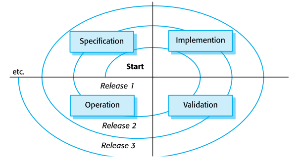

# Chapter 9. Software Evolution

## Topics Covered
+ Evolution Process
+ Legacy Systems
+ Software Maintenance

### Software Change

+ 결국 Software에서 Change는 피할 수 없다. 
  - 똑같은 Software이고, 특별한 요구사항이 없다고 할지라도 사람이 변하고 시대가 변하기 때문에, 기본적인 여러가지 변화들이 생김.
  - 그에 맞춰서 소프트웨어도 변해야 한다! 기본적인 그러한 변화들은 무시할 수 없다. 
  - 그럼 어떤 것들이 변하는가?
    - 에러가 발생가면 고쳐야 함. 
    - 비즈니스 환경이 바뀌면 그에 맞게 대처해야 함
    - 소프트웨어에서 바꿔야 할 변경사항이 생겼다. 당장 고쳐야 한다.
    - 기타등등 
    - "이 모든 것이 Change에 속함!!". Software를 바꿀 모든 사안이 다 Change이다. 

+ Evolution 은 개발과는 별도로 진행되는 경우가 많다. 
  - 요즘에는 개발하는 사람들이 이직도 많이 하고, 업데이트 주기가 짧아지다 보니 원래 만들었던 사람이 하는 경우가 거의 없음.

### A Spiral Model of Developement and Evolution 

