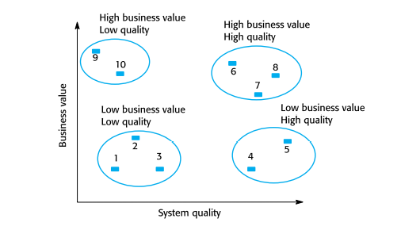

# Chapter 9. Software Evolution

## Topics Covered
+ Evolution Process
+ Legacy Systems
+ Software Maintenance

### Software Change

+ 결국 Software에서 Change는 피할 수 없다. 
  - 똑같은 Software이고, 특별한 요구사항이 없다고 할지라도 사람이 변하고 시대가 변하기 때문에, 기본적인 여러가지 변화들이 생김.
  - 그에 맞춰서 소프트웨어도 변해야 한다! 기본적인 그러한 변화들은 무시할 수 없다. 
  - 그럼 어떤 것들이 변하는가?
    - 에러가 발생가면 고쳐야 함. 
    - 비즈니스 환경이 바뀌면 그에 맞게 대처해야 함
    - 소프트웨어에서 바꿔야 할 변경사항이 생겼다. 당장 고쳐야 한다.
    - 기타등등 
    - "이 모든 것이 Change에 속함!!". Software를 바꿀 모든 사안이 다 Change이다. 

+ Evolution 은 개발과는 별도로 진행되는 경우가 많다. 
  - 요즘에는 개발하는 사람들이 이직도 많이 하고, 업데이트 주기가 짧아지다 보니 원래 만들었던 사람이 하는 경우가 거의 없음.

### A Spiral Model of Developement and Evolution 

+ 테스팅 하는 Validation 과정과, 설치해서 직접 동작시키면서 찾는 것은 또 다른 이야기이다. 
+ 테스팅에서보다, 실제 현장에서 동작시켜보면 Change들이 발생하는 경우가 훨씬 더 많다. (어차피 그 전에 Change가 발생하게 되면, 아무래도 개발을 할때 다 반영이 된다)
+ 하지만 대부분 Change들은 대부분 동작시킬 때 더 많이 발생을 한다. 

### Evolution and Servicing

 

+ 처음에 개발하고, Evolution 거치고, Service 하다가 새로 Evolution 거치며, 마지막 되면 더 이상 안쓰는 소프트웨어가 될 것이다. 
+ Evolution 
  - 필요에 의해 새로운 Requriement들이 정의가 되고, 그에 따라 개발이 이루어진다. (추가, 삭제, 업데이트)

+ Servicing
  - 숨겨져 있던 버그들을 고친다거나, 긴급한 사안이 왔을 때 확인하는 등, 항상 주시하는 단계
 
 + Evolution이 개발과 다른 점 
  - 개발은 대체로 요구사항이 다 정해져 있고, 요구사항 명세도 다 정해놓고 진행함. 그리고 꼭 해야만 하는 것이라 신경써서 봄.
  - Evolution은, 안해도 그만이긴 하다. 
  - 개발 이후에는 사실 잘 동작하더라도, 안에 숨겨진 버그가 있을 수 있음. 그 버그를 찾기 위해서 노력해야 하는데 별로 노력을 기울이지 않는다. 하지만 그렇게 해야만 함. Evolution에는 정해져 있는 GuideLine이 있다거나 그런 것이 없다. 
  - Evolution에서는, 소프트웨어가 변화되어야 하는 부분을 제안서를 받아서 진행하게 된다. 

### Evolution Process 
+ 잘못된 점이 있다거나, 변화되어야 할 것들은 사용하는 사람들이나 개발자들이 계속 관심을 가지고 찾아내야 함. 
+ 이렇게 나오는 부분들은 새로운 Requirement가 된다. 
+ Change Identification 과 Evolution은, 시스템을 사용하는 동안에는 계속 일어나는 부분이다.

### Urgent Change Requests

+ 긴급하게 바꾸거나 처리해야 하는 것들 
  - 심각한 System Fault : 서비스를 제공해야 하는데 서비스를 지속할 수 없을 정도의 System Fault라면, 긴급하게 처리해야 되는건 당연함.
  - OS가 업데이트 되었는데 이런 상황이 생기면, OS를 다시 내리던지, 다운그레이드 시키던지 해야 함
  - Business Change

### Agile Method and Evolution 

+ Agile Method 자체가, 프로토타입을 가지고 계속해서 Evolution하는 것임.
+ 어차피 Change가 발생할 것이니 Evolution 하면 된다. 
+ 그냥 시간이 부족하니 코드에 집중을 많이 해서 개발하자!
+ 자동화해서 Regression Testing 해야 함.
  - 이것을 하기 전에 Impact Analysis  거쳐야 한다. (고쳤을 때 어떤 영향을 미칠지)
  - 그래서 어떤 영향을 미칠지 알아야 정확하게 테스팅할 수 있음.
  
### Handover Problems

+ 개발팀과 Evolution 팀이 달라서 문제가 생긴다 (문제가 생길 여지가 크다) (만든사람과 evolution 하는사람이 다르다보니)

## Legacy Systems

+ Legacy System : 오래된 시스템. 오래되었다고 안쓰는 것이 아니다. 
+ 오래되었다고 안쓰는 것이 아니다. 생각보다 은근히 쓴다 
  - 과학계에서는 만들어놓은 소스코드에 대한 신뢰도 때문에 계속 쓴다 
+ Legacy System을 어떻게 Evolution이나 Maintainance 할것인지?
  - 생각보다 방법이 별로 없다. 하나하나 "떼어서" evolution 하는 수밖에 없다고 함.
    - 한번에 다 바꾸는 것이 아니라, 일부를 바꿔가면서 쓴다. 
    - ex) 옛날에는 MySQL 3. 대 버전을 썼다면, 지금은 업데이트해 준다던지
    - ex2) 포트란으로 되어 있던 일부 라이브러리를 다른 코드로 짠 것으로 바꾸어 준다던지

### Legacy System Components

+ System Hardware
+ Supports Software
+ Application Software
+ Application Data
+ Business Processes
+ Business Policy and Rule

### Legacy System Layers

### Legacy System Replacement

+ Legacy System을 Replacement 하는 것은 일반적인 Software System을 Evolution하는것보다 훨씬 더 리스크가 크다. 
  - Legacy System은 두가지 관점으로 바라볼 수 있다
    - 오래되었다. (이미 너무 구식이다)
    - 그럼에도 불구하고 아직까지도 쓰고 있다.
  - 이것을 바꾸겠답시고 새로 건드는데, 동작하지 않으면, 혹여나 삭제를 시켜버렸다면 더이상 찾을 방도가 없다. 
  - 복사하다가 파일이 깨져서 나왔는데, 복구가 안되면 큰일남.
  - 이런 부분을 이해하고 접근해야 한다.
+ 예전에는 이런 Software Engineering 적인 것이 없었기 때문에, 상당히 커플링이 높은 경우가 많다. 
  - 프로그램도 그럼 뒤죽박죽일 확률이 아주높다. 
  - 필요한 데이터도 많아지고, documentation도 없고, 언어도 Cobol 이런거면 폭탄이다.이런것들을 고려해서 해라! 
  - 가급적 잘개 쪼개어서 하나씩 천천히 반복적으로 하는 수밖에 답이 없다. 
+ 이런 상황에서 Replacement를 할려면 어떻게 해야 하는가?
  - Layer 별로 하는 것이 좋다. 
  
  
### 그래서 위험을 무릎쓰고 어떤 것을 건들 것인가? (Legacy System Category)

+ Low Quality, Low Business Value : 그냥 없애라
+ Low Quality, High Business Value :
  - 시스템 퀄리티는 낮은데 고가치의 Business 하고 있는 경우, 새로 바꾸거나, 새로 만들어서 바꿔치기 하는것도 방법이다. 
  - 아니면 그냥 있던거를 잘쓰자

+ High Quality, Low Business Value : 
  - Business 가치도 따지기 나름이다
  - 이해관계자와 잘 이야기해서 잘 처리해라.

### Business Value Assessment 

+ Business Project나, 환경들을 평가해 보자
  - 평가할 때도 관점에 따라 달라짐. 
     - System EndUser
     - Business Customers
     - Line Managers
     - IT Managers
     - Senior Managers
  - 여러 이해관계자와 이야기해서 수합해서 하자.

### Factors Used In Environment Assesment

+ 연식 : 얼마나 오래되었는지?
+ Failure Rate :  일주일 동안 에러가 몇번 일어나는지?
  - Failure를 사람마다 어떻게 인식하느냐에 따라 다름.

등등
+ 가장 Critical 한것이 가장 영향을 많이 준다!

  
