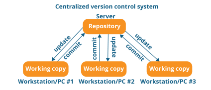
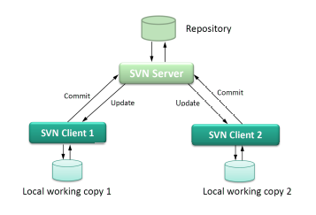
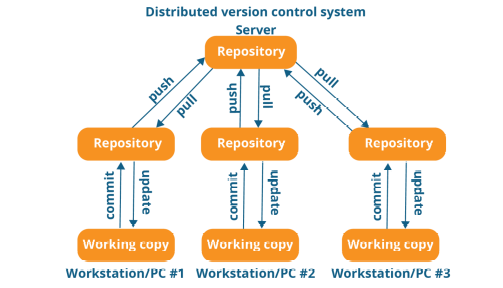

# Ch2. Version Control System

## 2.1 Dealing with Change

+ 작업물을 어떻게 관리할 것인가?
  - 이미 있는 코드 수정
  - 작업하는 코드 백업
  - 아이디어 있을때 체크
  - 그룹 프로젝트에서 코드 공유
  
+ 단점
  - 누가 카피해 가는것
  - 전체 디렉토리 무단도용
  
+ **그래서, 자동으로 프로세스를 관리해 보자!**
  - Version Control System 으로 관리가 가능하다. 
  - Code Base(문서, Build Tool, Config File, Code  등등)을 관리 가능하다.

## 2.2 Version Control System(VCS)

+ 버전관리 툴로 무엇을 할수있나?(버전관리 이점 5가지)
  - 소스코드 관리
  - 수정사항 히스토리 저장
  - 필요시, 이전 버전으로의 회귀
  - 팀 멤버들과 동시에 작업가능
  - 테스트 자동화와 배포 가능

+ 이점
  - 버전 추적가능(소스코드가 바뀔 때마다의 바뀐 부분을 체크하고 관리할 수 있다.)
  - Branching & Merging (수동으로 Merging하는 것이 어렵고, 지저분해짐)
  - 필요시 이전 버전으로 롤백 가능

+ Basic Concept
  - 코드 Check-out
  - 어떤 컴퓨터든 그 컴퓨터에 copy해서 작업가능
  - **코드 차이점 보여주기**
  - 작업물을 서버에 커밋
  - 업데이트
  - 충돌 관리

+ 잘 알려진 VCS
  - CVS, SVN(Subversion), **Git**
  - 다른 SW들
  
### 2.2.1 VCS - CVS

+ CVS(Concurrent Versions System)
  - 2명 이상의 개발자로부터의 동시 접근 가능
  - 하나의 Repository
  - 중앙 집중형 Architecture **(문제 : 한명이 고장내놓으면, 그부분이 남들한테도 싹다 고장나있음)
  
### 2.2.2 VCS - Subversion(SVN)

+ Subversion(SVN)
  - 중앙화 : 이것은 CVS와 같음
  - CVS에서 진화한 점 :
      >> CVS는 file-by-file change를 계속 추적함
      >> SVN 은 그래서 수정 history가 남아있음.

### 2.2.3 VCS - Git

+ **Git**
  - 분산 Architecture
  - 모든 Contributor가 full history 가진채로 clone 해 갈 수 있음
  - 각자의 clone으로부터 수정사항을 커밋할 수 있음.

       
** git 명령어 : 

        - git clone : 클론
        - git log : 커밋 로그 내역 보기(종료 : q)
        - git merge : 두 개로 나뉘어졌던 코드 하나로 합치는 것. 
        - git rebase : 두 개로 합치는데, 어느 한쪽을 새로운 나뭇가지로 해서 아예 base를 한쪽으로 한 새로운 가지를 뻗게 하는 것.. (새로 정리)
         -git commit -m "" : 커밋
         -git push origin master : 푸시
         -git branch ~~ : 새로운 브랜치 개설
         -git branch --all : 모든 브랜치 목록 보기. 그중에서도 현재 브랜치 어떤 것인지 표시해준다
         -git checkout ~~ : ~~ 브랜치로 이동
               
