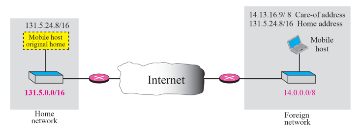

# Chapter 10. Mobile IP

+ 기본적으로 컴퓨터는 다 어딘가에 고정적으로 붙어 있다. 
+ 그럼 노트북은 어떻게 되느냐?(노트북은 움직일 수 있다)
  - 경북대에서 작업하다가 서울에 가서 작업할 수도 있다. (Mobile Host)
  - 하지만, 누군가가 그 노트북 주인이 경북대에 있는 줄 알고 경북대로 Packet을 보낼 수 있다.
  - 그럼 경북대 router는 어떻게 그 packet을 서울까지 보낼 것인가?
  - 이런 문제를 support 하려고 나온 개념이 Mobile IP 이다.
  - 원래는 그럼 노트북에 있는 애가 먼저 패킷을 쏘면 되는 문제이다.
  - 그래서 자체적으로는 안쓰지만, 통신사업자가 이 개념을 변형해서 사용하기는 한다. 
  - "경북대로 온 패킷을 서울까지 어떻게 전달할 것인가?"

### Addressing

+ Home Address & Care-of Address
  - 원래 노트북을 쓰던 사람이 위의 그림에서 131.5.24.8 을 사용하다가, Foreign Network로 넘어갔다. 
  - 외부 사람은 그것을 몰라서 Home Address(노트북이 Home Network에서 썼던 IP)로 보냈다.
  - 그러면, 첫번째 다시 출발하는 주소는 Home Address 로 갈 것이다. 
  - 노트북은, 서울에 있는 Foreign Network 로 넘어가서 그곳의 router로부터 새로운 IP 주소를 할당 받았을 것이다. 
  - 그 주소(외부 다른 route를 통해 접속해 있는 주소)를 보고 care-of address 라고 부른다.

+ Mobile IP는 Home Address와 Care-of Address 두개가 필요하다. 
+ Home Address는 계속 쓰는 주소익, Care-of Address 는 현재 붙어 있는 곳의 임시 주소이다. 

### Agents

+ 할 일은, Home Address 에서 Care-of Address 까지 해당 Packet을 Forwarding 해주는 것이다. 
+ 어떤 과정을 거칠 것인가?
  - "서울"(Foreign Network) 로 간 애가 먼저, 자신의 care-of address가 무엇이라고 Home Address 쪽에 알려 줘야 한다. 
  - Home Address를 쓰는 누군가가 현재 어디에 붙어 있는지 Mapping 정보를, Home Agent에 있는 Mapping Table 에 등록한다. 
    - Home Network에 붙어있는 Router를 "Home Agent" 라고 부른다. 
  
  - 누군가가 아무 생각없이 packet을 home 쪽으로 보내면, Home Agent가 그것을 가로챈다. 
  - Home Agent는 Table을 보고, care-of address로 보낸다. 
 
+ 먼저 care-of address 를 home agent에 등록하는 것, 데이터 오면 전달하는 것. 두가지가 필요하다. 

+ Mobile Host(보내는 사람) 과, foreign agent 가 같은 것이면, care-of address는 "같은 장소에 배치된 care-of address" 이다.

### Three Phases(보내는 3단계)

+ 진행과정
  - home에 있을 때 : 
    - Agent Solicitation(IP 주소 달라고 Agent에 요청)
    - Agent Advertisement(IP가 무엇인지 주변까지 다 알리는 것)
    
  - Foreign Network 로 넘어갔을 때 
    - Agent Solicitation(Foreign Agent에게 새로요청 해야함)
    - Agent Advertisement
    
  - Foreign Network 에서 IP 받은 후
    - Registration Request : 기존 Home Agent에게 알리는 것.
    - Registration Reply : Home Agent 로부터의 회신
    - Home Address 는 Mapping Table로 해당정보를 관리함.
    
  - Data Transfer : 다른 애가 보냈을 때 어떻게 처리되는지?
 
 
  
+ Agent Solititation 할때는 ICMP 를 사용해서 진행된다. 
  - 가급적 새로운 Protocol을 만들지 않는다고 한다. 
  
   
  
+ Care-of Address 등록할 때는, UDP Protocol을 사용한다. 
  - Well-Known Port 434 를 사용한다.

### Inefficiency in Mobile IP

+ Double Crossing

  

+ Triangle Routing

  
