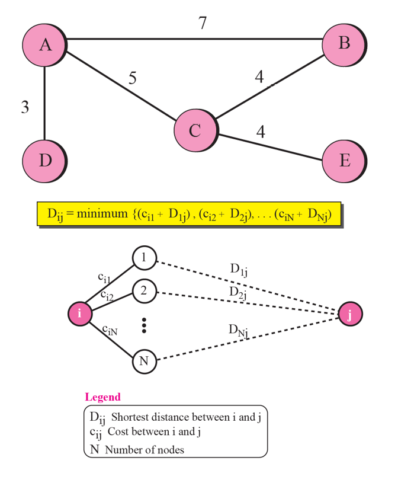
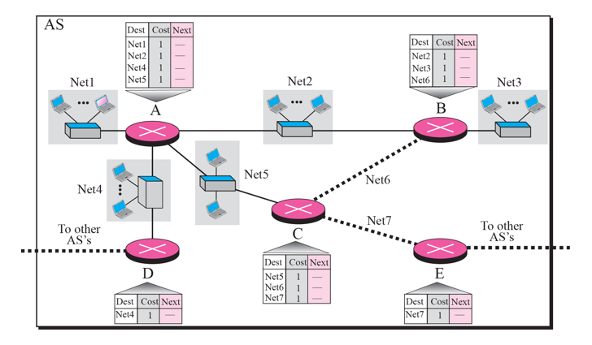
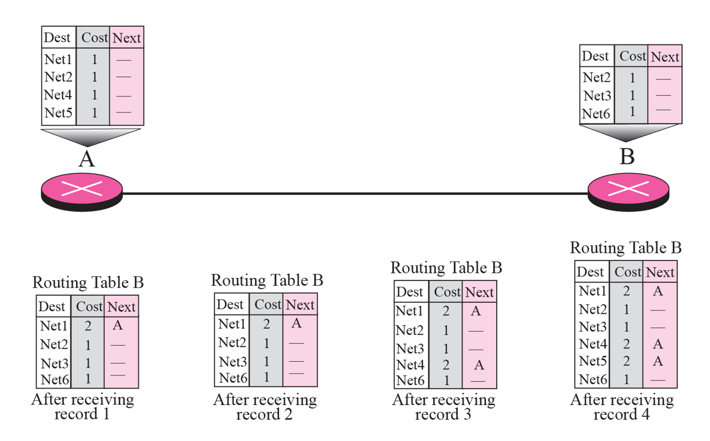
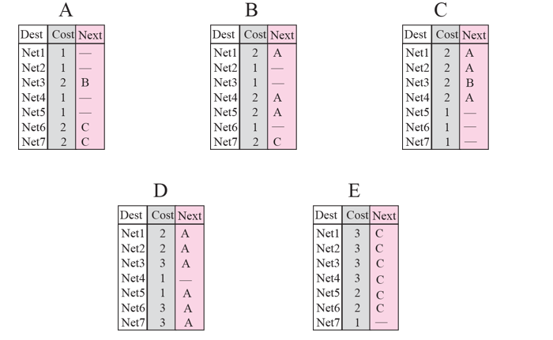
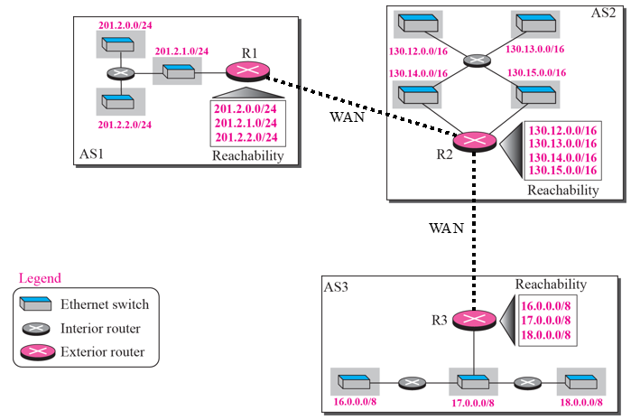
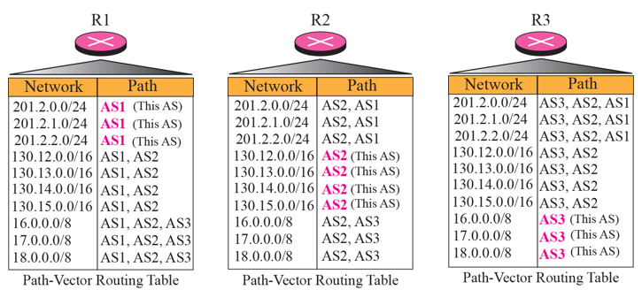

# Chapter 11. Unicast Routing Protocols

+ Internet은 router들로 연결된 네트워크들의 집합이다. 
+ Datagram 이 source 부터 destination 까지 갈 때, destination network 에 도착하기까지 많은 router들을 지나간다.

### Inter- and Intra-Domain Routing

+ 오늘날, 인터넷은 너무 커서, 한 routing protocol 이 모든 router의 routing table 을 다 관리할 수 있는 것이 아니다.
+ 그래서 인터넷은, autonomous(자율적인) systems, AS로 나누어져 있게 된다.

+ Domain : 망 관리를 하는 주체
  - 도메인은 기본적인 망 관리 단을 말함.
  - 정확한 기술명으로는 AS(Autonomous System) 이라고 불린다. 
  - 도메인 간에 통신하는 것이냐(Inter), 아니면 도메인 내부에서 통신하는 것이냐(Intra)로 나뉜다.
  

+ AS(Autonomous System)
  - 위의 그림의 경우, 도메인이 3개 있는 것이다. 
  - AS 번호가 2byte로 다 할당되어 있다. 
    - 8bit. 1~65535 
  - AS 내에서는 독자적인 routing domain 을 갖고 있다고 한다.
    - 이때 도메인 내부이냐, 도메인 외부냐에 따라 inter, intra 가 결정되는 것이다. 

  - 위 그림에서 R1,R2,R3는, 각 domain을 대표하는 것이라서 Gateway 라고도 부른다. 

+ Routing Protocols
  - Intradomain
    - Domain(ex : 경북대) 안에 있음. 
    - Domain(경북대) 안에 있는 것들끼리 주고받는 것이 중요하다.
    - RIP(Routing Information Protocol) : 각 router 간의 거리 정보를 vector로써 나타내 관리하는 것. (Distance Vector)
    - OSPF(Open Shortest Path First) : Link의 상태 정보를 관리하는 것. (Link State) 가장 효율적이라고 한다. 
  - Interdomain
    - BGP(Border Gateway Protocol) : 
    - 도메인 간, Gateway 급 끼리 주고받는 것. 
  
  - 물론 위 3개말고 더 있긴한데, 저 3개가 대표적이라고 한다.
  - 각 목적지로 가는 최단경로로 가게끔 해 주는 Protocol 이다. 

### Distance Vector Routing(RIP : Routing Information Protocol)

+ 각 router 간의 거리 정보를 vector로 나타내는 것.
  - 용적률? 을 관리하겠다는 것이다. 
  - distance vector
  

+ RIP는 Bellman-Ford Algorithm을 사용한다고 알려져 있다. 
  - 인접한 것들의 상태 정보를 계속 관리하면서, Shortest Path를 찾는 Algorithm
  - 붙어 있는 것들의 관리를 n번 반복하면, Shortest Path를 찾을 수 있다. 
  
  
  
+ RIP Example
  - AS(Domain) 안에 Router가 5개 있다. 
  - E에서 시작할 때, E는 C와 Net7 하나로 바로 붙어 있다.
    - Dash Line은 그냥 바로 붙어 있다는 의미.
  - 초기 상태에, 각 Router의 Routing Table이 위의 그림처럼 존재한다. 
  
  - 
    - 초기에, A와 B가 서로 정보를 교환하면서, B의 routing table을 계속 업데이트한다. 
    - 있는거 중에 더 짧은거는 업데이트, 아예 없는것도 업데이트 하는 식으로 n번 반복하면, 모든 router에서 최소 경로를 알 수 있게 된다.
    - 이런 식으로 최단경로를 파악할 수 있다.

+ Example에서의 전체 Router의 Routing Table

 

+ RIP Message Format
+ Request and Response
  - Request 해서 누구에게 요청한다. 
  - Underline으로 UDP를 사용한다. 
  - Well Known Port 번호 520번을 사용한다. 
+ Timers in RIP
+ RIP Version 2
+ Encapsulation

### Link State Routing(OSPF : Open Shortest Path First)

+ OSPF 에서는 Dijkstra Algorithm을 사용한다고 알려져 있다. 

+ 기본 원칙 : 
  - 모든 Router가 다 똑같은 topology를 가지고 있다. 
  - 미리 모든 정보(link 정보)를 파악하고 있어야 함
    - A 도메인에 router가 몇개 있는지, 어디에 붙어 있는지 등(flooding 기법)
  - 한 큐에 쭉 내는 것. 

+ BGP는 도메인 사이에 하는 것이라 알고리즘 이야기랑은 좀 떨어진 것.

+ Underline으로 IP(Internet Protocol)을 사용한다. 
+ AS 안에서 state 정보를 모으는데, link type도 다양하다
  - Point to Point : 직접 붙어 있는 것.
  - Transient : 임시로 지나가거나, 경유하는 것.
  - Stub : 맨 끝에 있는 것.
  - Virtual : 가운데에 있는 것.
  
+ 이런 모든 정보를 취합해서 알려줘야 함.   
  - 이런 모든 정보를 다 알고 나서 Dijkstra 로 최단경로를 찾는다. 
  
+ OSPF Packet Type : 5개
  - Hello
  - Database Description
  - Link State Request
  - Link State Update
  - Link State Acknowledgement
  
### Path Vector Routing(BGP)

 

+ BGP 는 기본적으로 Domain 간에 이루어지는 것이다. 
  - ex) 경북대와 KT 망 사이
  - AS가 있으면, Gateway 끼리 통신하는 것.
  - Gateway 끼리 BGP로 통신하는 것은 WAN 으로, AS 안에서는 LAN으로 통신할 수 있다. 

 

+ 각 Domain을 대표하는 Router 3개가 개입되어 있는데, 이 Router에는 어떤 정보들이 있는가?
  - Next-hop 뿐만 아니라 Full Route 가 다 적혀 있다. 
  - Network 에는 목적지 주소가 적혀져 있다. 

+ BGP는 제일 많이 쓰이는 애 중 하나이다. 
+ BGP Message에는 4가지가 있다 
  - Open
  - Update
  - Keepalive
  - Notification 
  
+ BGP는 classless addressing을 지원하고, CIDR(Classless Inter Domain Routing) 을 지원한다
  - 그냥 classless를 지원한다는 말인 것 같다. 
  
+ BGP는 TCP를 사용하며, Well Known Port 번호 179번을 사용한다. 
  - Gateway 끼리 TCP를 연다. 
  - RIP, OSPF는 교환할 정보가 그렇게 많지 않은데 비해, BGP는 교환할 내용이 많기 때문에 그렇다. 
