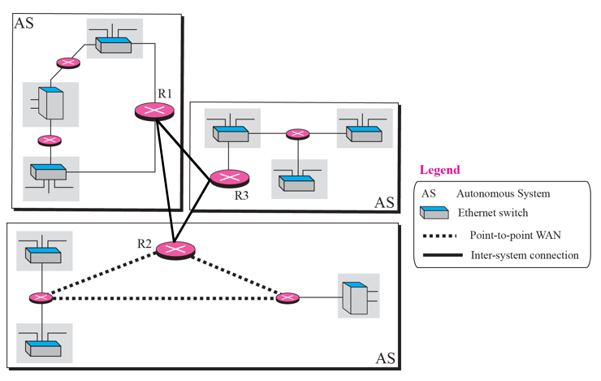
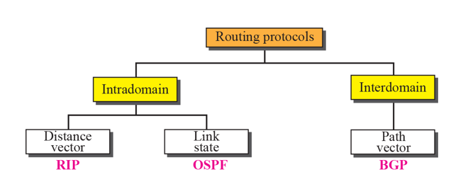

# Chapter 11. Unicast Routing Protocols

+ Internet은 router들로 연결된 네트워크들의 집합이다. 
+ Datagram 이 source 부터 destination 까지 갈 때, destination network 에 도착하기까지 많은 router들을 지나간다.

### Inter- and Intra-Domain Routing

+ 오늘날, 인터넷은 너무 커서, 한 routing protocol 이 모든 router의 routing table 을 다 관리할 수 있는 것이 아니다.
+ 그래서 인터넷은, autonomous(자율적인) systems, AS로 나누어져 있게 된다.

+ Domain : 망 관리를 하는 주체
  - 도메인은 기본적인 망 관리 단을 말함.
  - 정확한 기술명으로는 AS(Autonomous System) 이라고 불린다. 
  - 도메인 간에 통신하는 것이냐(Inter), 아니면 도메인 내부에서 통신하는 것이냐(Intra)로 나뉜다.
  

+ AS(Autonomous System)
  - 위의 그림의 경우, 도메인이 3개 있는 것이다. 
  - AS 번호가 2byte로 다 할당되어 있다. 
    - 8bit. 1~65535 
  - AS 내에서는 독자적인 routing domain 을 갖고 있다고 한다.
    - 이때 도메인 내부이냐, 도메인 외부냐에 따라 inter, intra 가 결정되는 것이다. 

  - 위 그림에서 R1,R2,R3는, 각 domain을 대표하는 것이라서 Gateway 라고도 부른다. 

+ Routing Protocols
  - Intradomain
    - Domain(ex : 경북대) 안에 있음. 
    - Domain(경북대) 안에 있는 것들끼리 주고받는 것이 중요하다.
    - RIP(Routing Information Protocol)
    - OSPF(Open Shortest Path First)
  - Interdomain
    - BGP(Border Gateway Protocol)
    - 도메인 간, Gateway 급 끼리 주고받는 것. 
  
  - 물론 위 3개말고 더 있긴한데, 저 3개가 대표적이라고 한다.
