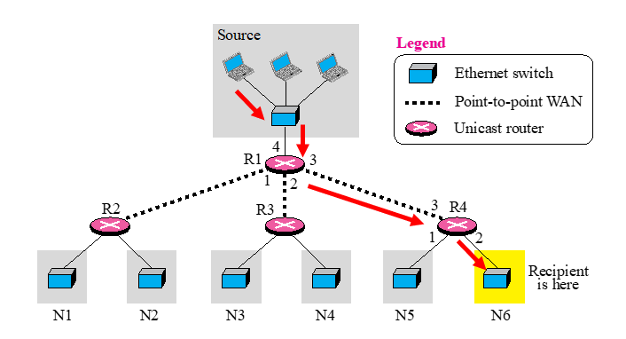
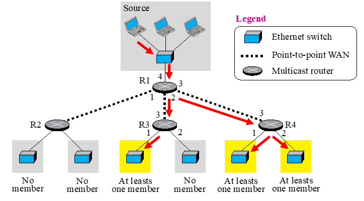
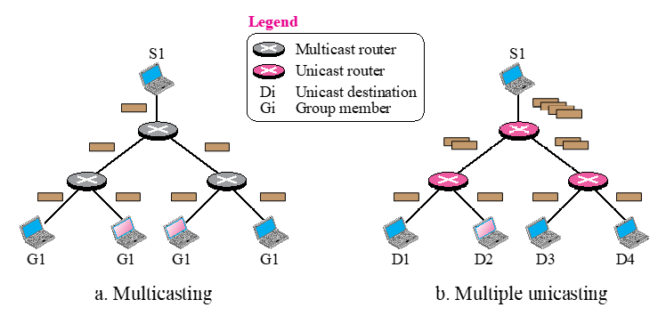
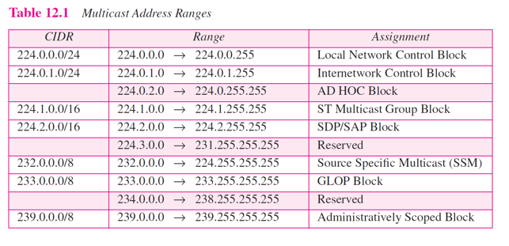

# Chapter 12. Multicasting And Multicast Routing Protocols

+ Unicast : 1 : 1 보내기
  - Routing Table을 봐 가면서, source 에서 목적지까지 보낸다. 
  - 다른 쪽으로 안보내고, 한쪽으로만 보낸다
  - 한쪽으로 그냥 보내기만 하면 되니 simple 하다. 
  - 그냥 고정해서 보내면 된다.
  
  
  
+ Multicast : 1 : 다수 보내기
  - Router 1 입장에서 Multicasting인 경우, 위에서 패킷이 하나만 와도, 두군데 이상으로 보내줘야 하는 것
  - 복제를 하나만 하는것도 아니고, 여러개로 해야 함. 
  - 한쪽으로 그냥 보내는 것아 아님! Router가 여러 interface로 datagram을 보내야 할 수도 있다.
  - ex : 방송국(Multicast Routing Protocol, IGMP)
    - 가입자가 어디에 있는지 파악하고, 있으면 패킷을 보내야 함. 
    - 가입자가 정해진 상황에서, router path를 정하는 것이 multicast route(multicast tree라고도 한다)
    - 그런 정보들을 router 끼리 주고받는다. 자기들만 아는 path를 구성해, 정보를 주고받음
    - router 입장에서는 member가 있는지 여부를 알아야 router 끼리 패킷을 전달함. 
    - 이때 member가 있다는 것을 알리는 방식을 ICMP로 주고받는다. 
    - 만약에 한명이라도 가입자가 있으면, router는 위에 ICMP 방식으로 위에 "요청" 하는 것이다.
    - 그렇게 요청받으면, 상위 router는 계속 위에다가 ICMP로 요청 보내고, 그렇게 정보가 multicast 된다. 

+ Broadcast : 전부한테 보내기

 

+ Multicasting vs Multiple Unicasting
  - Multicasting은 패킷 하나를 내려주면, router에서 해당 패킷을 복제해서 밑으로 뿌림.
  - Multiple Unicasting 은 신호 받은 만큼 맨위에서 패킷을 만들어서, 여러 패킷을 Unicasting하듯이 뿌리는 것.
  - Multicasting
    - 복제하는 식이라, 기술적 효율성이 아주 높다.
  - Multiple Unicasting
    - 맨 위에서 다 만들어서(10만명이면 10만개) 다 쏴줘야 하는 식이라 비효율적이다.
    - source 쪽 traffic이 대단히 많아진다. 
    - real time service 할때는, delay가 대단히 심하다. 
  - 이때 쓰이는것이 Class D를 사용한다. 
  
### Multicast Addresses

 

+ CIDR
  - 224.X... : LAN 안에서 쓰는 multicast 주소
  
 
  
+ Mapping Class D to Ethernet Physical Address
  - Ethernet 에서도 Multicast Address가 따로 있다. 
  - MAC도 Multicast Address 가 따로 있다. 

### IGMP(Internet Group Management Protocol)

+ Multicast Routing Protocol은 router 끼리 하는 것
+ IGMP는 router와 host 간에 진행된다. 
+ router로 하여금, host가 정보를 받아야 한다는 것을 알게 해 주는 것.(요청 보내라!)
+ router가 multicast member가 있는지 없는지 아는 것. 몇명인지는 상관없고 알기만하면 됨! 어차피 위에다가 요청보내야 하는것은 똑같다.

+ IGMP Message(2개밖에 없다)
  - Membership Query : 내 관할에 있는 것 중 Class D 에 관심있는지 자기 구역 내에 물어보는 것.
  - Membership Report : Host들이 Router들에게 필요하다고 메세지 보내는 것.
  
  
### Multicast Routing

+ 

