# Chapter 16. Stream Control Transmission Protocol(SCTP)

+ SCTP(Stream Control Transmission Protocol) 은, 신뢰할 수 있는, 메세지 지향 transport-layer protocol 이다. 
+ SCTP는 UDP와 TCP 의 좋은 점만 취했다!
  - TCP의 좋은 점만 취하고, 안 좋은 것은 다 뺐다.
  - UDP에서는 메세지 기반인 것만 따왔다고 한다. 
  - 기본 단위를 byte가 아닌 packet 단위로 했다.
    - 어차피 패킷이 왔냐가 중요하지 몇 byte인지는 그렇게 중요하지 않다.
    
  - 실제로 쓰이고 있는데, 데스크탑이나 노트북 PC에서는 안 쓰인다고 한다. 
    - 이미 되어 있는 기존 응용을 바꾸기가 쉽지 않았다고 함. 
    - 기존 TCP/UDP로 짠 것을 바꾸려면, 분명히 이유가 있어야 해서 그렇다. 
    - 서버급 통신(SKT 망 같은 사업자 망, 큰 장비들끼리) 에서는 많이 쓰인다. 
    
### SCTP Services

+ SCTP가 들어가는 기능을 보면 TCP가 들어가는 애와 큰 차이가 없다. 
    - Process to Process Communication
    - Full Duplex Communication
    - Connection-Oriented Service
    - Reliable Service
    - Multiple Stream(TCP에 없음)
    - Muitihoming(TCP에 없음)
    
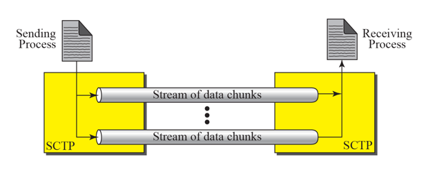    
    
+ Multiple Stream 
  - TCP는 Single Stream인데 반해 SCTP는 Stream Pipe 여러 개를 열어서 일을 처리할 수 있다. 
  - Packet 내에서 Stream을 구분하는 ID가 존재한다.(중요)
  - 왜 Multiple-Stream이 필요했나?
    - TCP의 경우, 모든 데이터가 Stream 한개로 가니까, 하나만 loss 나도 그 뒤에 복구하느라고 뒤에 것의 진도가 나가지 않는다. ALL STOP 때리고 복구하는 것임.
    - 데이터 내용을 보면, 한명 것이 아니라 여러 명 것이다보니, 보내는 내용이나 받는 사람 등에 따라 여러 개로 분리해 놓아서 Stream을 보내면, 한개가 loss가 나더라도 나머지 n-1 개의 stream에서는 문제가 없이 보내질 수 있다. 
    - TCP는 Stream 하나에서 하나만 loss 나도 뒤에 것들이 다 죽음. 이것을 극복하려고 나온 것이 multi-streaming 이다!
    
  - 두 컴퓨터가 통신을 하는데, TCP는 파이프가 한개, SCTP는 여러개이다.
  - 컨텐츠를 분리해서 보내는 것이다. 
  - Stream ID 정보가 Packet에 포함되어 있음. 
  - 하나가 에러가 생겨 복구하는데 많은 시간을 쓰는 것보다, 하나가 loss 나도 나머지를 잘 보낼 수 있게 한다!
  
+ Stream 이 여러개 이다 보니, TCP에서는 단순히 Connection 이라고 부르는데, SCTP에서는 Association 이라고 부른다.(Association이라고 부른다!)
+ Port 는 한개지만, IP 주소는 여러개를 쓴다!   
    
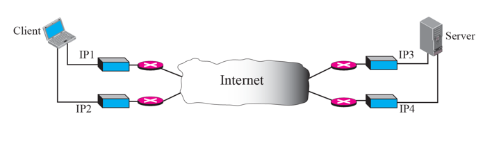    
    
+ Multihoming 
  - Home 이 여러개이다! Address 를 두개 이상 쓴다. 
    - TCP/UDP 는 Adress를 한개만 썼는데, SCTP는 Address를 여러 개 사용할 수 있다!(Port는 한개인데도 불구하고)
    - Address 가 두개라는 이야기는, router가 두개일 수 있다는 이야기.
    - 만약에 한쪽 route가 막히면, 다른쪽으로 보낼 수 있을 것이다!
    - router가 두개 이상 물려있다 보니, 한쪽이 많이 안좋으면, 다른 쪽으로 연결해서 쓸 수 있다!
    - 통신할 때는 하나만 쓴다.(Primary Path) 
    - 문제가 생기면, 다른 쪽으로 넘어가 쓴다.(Secondary Path, Backup Path)
    - 문제가 생기면, Secondary Path로 Switching 해서 쓴다. 그럴려고 Router 를 여러 개 붙이는 것이다. 
    
+ Multiple Stream 과 Multihoming 두가지가 성능을 급격히 올려줄 수 있다!
+ 위의 2가지와 Message 기반 으로 하는 것이 SCTP
+ 사용예시
  - 인터넷 전화(SIP) : 인터넷 전화의 응용 계층 프로토콜을 TCP가 아닌 SCTP를 사용한다. 
  - 계산 정보나 보안 정보는 반드시 도착해야 하기때문에, SCTP를 사용한다.
  - 사업자 망에서는 TCP 로는 이제 어림도없다고 한다. 
    - Multi Streaming : 수만명의 Call 정보가 몰려 있는데, Call 마다 Stream을 하나씩 줄 수 있다. 
    - 1명이 Loss 되어도, 9999명의 것을 잘 처리할 수 있을 것이다. 
    - Multihoming : 만약에 한 데이터가 없어지면, 바로 복구해야 함. 다시 끊었다가 TCP 연결하면 시간이 별로 없다. 
  - end 급 유저가 아닌, 서버 통신에서 주로 사용된다!
  
  + TCP 와의 추가적인 차이점 
    - TSN(Transmission Sequence Number) : Byte 단위로 전송하는 것이 아닌, packet 단위로 전송해 보낸다. SCTP에서는, Data Chunk(묶음, 덩어리) 는 TSN 을 활용해서 numbering 된다. 
      - Data를 나르면 Data Chunk, 나머지 다른것은 Control Chunk
    - SI(Stream Identifier) : Stream ID가 다 할당이 되어 있다. 다른 Stream을 구별하기 위해서, SCTP에서는 SI를 사용한다.
    - SSN(Stream Sequence Number) : Stream 내에서도 순서가 있다! SCTP 에서는 Stream 내에서 순서 매기기 위해서 SSN을 사용한다.
    - Packets : TCP에서는 Segment 라고 했지만, SCTP 에서는 그냥 Packet이라고 부른다. 

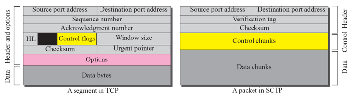 

+ TCP Segment 와 SCTP에서의 Packet 비교.
  - 맨 위(Source port Address, Destination Port Address) 는, TCP,UDP,SCTP 등 다 똑같다. 
  - SCTP의 두번째 나오는 Verification Tag 는, 보안용으로 체크하는 것이다.(32bit)
  - SCTP에서는 Checksum 이 3번째 줄에 나온다.
  - SCTP의 맨 위 3줄이 가본 Header이다. 
  - 그 아래 Chunk 라는 애들이 나타난다. Control Chunk가 4번째, Data Chunk가 5번째 줄.
  - SCTP 에서는 control 정보와 data 정보가 다른 chunk 이다.
  - 요렇게 5줄 묶어서 하나의 Packet이다. 
  - Packet 안에 Header 와 Chunk 가 존재하는데, Chunk는 Control, Data Chunk 가 있는 것.

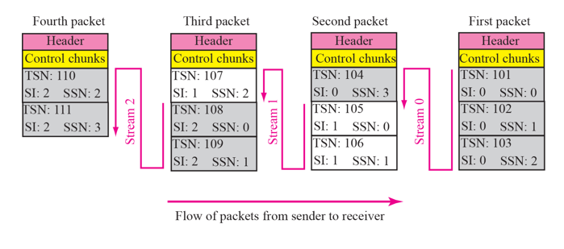 

+ Packet, data chunks, and Streams
  - 패킷이 4개 존재하고, 각 패킷에는 header, control chunk, data chunk가 각각 온다.
  - data chunk에서도 세부적인 내용을 보면, TSN(Transmission Sequence Number) 값이 packet 에 따라 올라간다. 
  - First Packet에서 chunk 하나에서 보니, SI(Stream ID)가 0번, SSN(Stream Sequence Number)은 맨 첫번째 chunk 라서 0번이다.
  - First Packet에서 SSN은 위에서 아래로 갈수록 증가한다. 
  - Stream 별로 SSN이 쭉 가고, 두번째 packet에서 보면, TSN은 그냥 chunk 단위로 계속 올라가는 것이 보인다. SSN은 Stream ID 별로 올라간다. 
  - 패킷 한개에 여러 개의 Control 정보와 Data 정보가 있는데, 패킷 한개에는, Stream ID가 크게 한개씩 들어간다. 
  - Data Chunk 에서 필요한 값 3가지 : TSN , SI, SSN 이렇게 3가지
  - TSN은 일괄적으로 매기는 것이고, SI, SSN은 Stream 별로 매기는 것.
  - Acknowledge(승인) Number 는 data chunk 별로, 받았는지 받지 않았는지 넘버링하는 것을 data chunk 단위로 하는 것이다.
  - control chunk는 따로 acknowledge number가 없다. 필요한 경우, control chunk는 다른 control chunk 에 의해 승인(받았는지 안받았는지) 받는다. 

### Packet Format

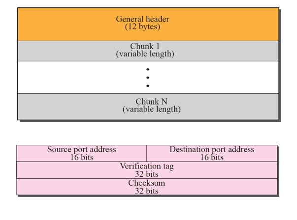 

+ SCTP Packet Format
  - General Header가 12byte
  - Control Chunk가 Data chunk 보다 먼저 옴. 
  - 분홍색 부분이 General Header
  - 맨 첫부분이 Port 번호(Source Port, Destination Port)
  - 이후 Verification tag, Checksum. Checksum도 32bit 사용한다. (TCP는 16bit 사용했다)(이렇게 Checksum을 더 정확히 할 수 있다)

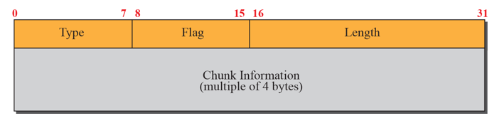 

+ Multiple-Stream Concept
  - 각 Chunk 가 기본적으로 Type, Flag, Length, Chunk Information 순으로 온다. 
  - 말 그대로, Type은 어떤 Type이 오는지 적혀있는 부분.
  - 기본적인 길이는 4byte(32bit)이다! 딱 4byte로 자르고, 모자라면 넣어서라도 4의 배수로 채운다. 
  - 하나만 data고 다른것들은 전부다 Control Chunk....
    - Control Chunk 가 많은 이유는, Control Chunk 는 Control Chunk 에만 응답함. 동료가 많다.
    - 순수 Data는 거의 한개밖에 없다. 
  
  - 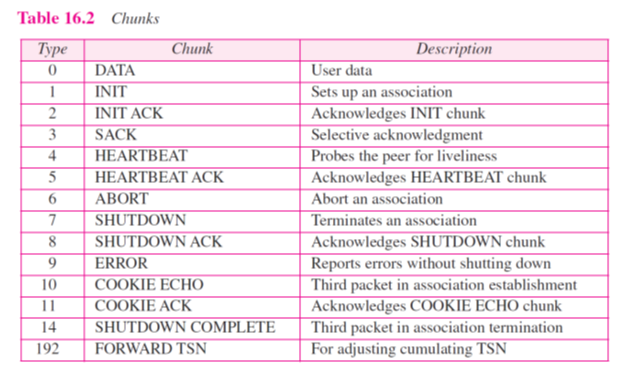 
  
  - 많은 control chunk 와 한 개의 type의 data chunk(type 0번)가 있다.  
  - 거의 TCP Header에 있던 걸 다 끄집어 낸 것이라고 한다. 
  - padding byte는 length 정보에 포함되어 있는 숫자가 아니다. 

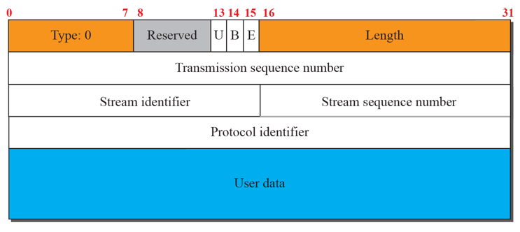 

+ Data Chunk
  - Data Chunk 안에 Header 와 Payload 가 있다. 
  - 두번째 줄에 TSN(Transmission Sequence Number)가 들어간다. 
  - 세번째 줄에 SI(Stream ID), SSN(Stream Sequence Number)가 들어간다. 
  - 당연히, 2~3번째 줄이 제일 중요하다. 4번째 줄까지가 Data Chunk의 Header 부분이다. 

+ Control Chunk

  - 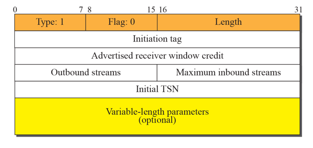 

  - INIT Chunk
    - Data 부분은 포함되어 있지 않다. 

  - INIT ACK Chunk
  
  - COOKIE ECHO Chunk
    - 쿠키 값을 echo 한다는 이야기
    - 쿠키 정보를 확인하기 위해 보내는 chunk
    - 상대방에게 cookie echo 값을 보냄으로써, 자신이 해커가 아니라는 것을 확인시켜주는 용도로 보내는 것이라고 한다. 
    - 이 단계 때문에 3 way 에서 4 way로 늘어난 것이라고 한다. 
    - INIT, INIT ACK 를 보낼때까지는 상대방이 뭘 안만드는데, COOKIE ECHO Chunk가 와야 그제서야 뭔가를 만들기 시작한다고 한다. 
    - TCP의 Sync Attack을 방지하기 위해서 일부러 1 way을 더 늘려서 보안차원에서 만든 애라고 한다.
    
  - COOKIE ACK
  
  - cookie 란? : 클라이언트(브라우저) 로컬에 저장되는 키와 값이 들어있는 작은 데이터 파일이다. 
    - 사용자 인증이 유효한 시간을 명시할 수 있으며, 유효 시간이 정해지면 브라우저가 종료되어도 인증이 유지된다는 특징이 있다. 
    - 쿠키는 클라이언트의 상태 정보를 로컬에 저장했다가 참조한다. 
    - 클라이언트에 300개까지 쿠키를 저장할 수 있고, 하나의 domain 당 20개의 값만 가질수 있다. 

+ Data 통신할 때 관련된 Chunk(Control Chunk)

  - SACK(Selective ACK) Chunk
    - gap, block : TSN 값으로, 어디서 어디까지는 받았고, 어디까지는 못받았는지 한큐에 다 알려주는 것.
    - 효율이 엄청 올라간다. 
    - Data Chunk에 대응되는 것이라고 함. Data Chunk을 기반으로 SACK Chunk를 보낸다.
    
  - HEARTBEAT & HEARTBEAT ACK Chunk
    - 왜 나왔는가 ? : Multihoming 때문에 나옴. 평소에는 Primary 만 쓰다가, 문제 생기면 Backup으로 가야 되는데 Backup 이미 미리 준비되어야 한다. 뜬금없이 Backup을 부를 수 없으니, 끊임없이 HEARTBEAT Chunk 를 보내 확인한다. 
    - HEARTBEAT으로 계속 체크해야, 문제가 생기면 Backup으로 바로 Switching 이 가능하다. 
    
+ 통신을 끝낼 때 관련된 Chunks : SHUTDOWN(Control Chunk)
  - SHUTDOWN을 보내고, SHUTDOWN ACK로 응답하는 구조.
  - SHUTDOWN, SHUTDOWN ACK, SHUTDOWN COMPLETE 순으로 3번 주고받는다. 
  
+ 이렇게 많기 때문에 DATA Chunk에 비해 Control Chunk가 많아질 수 밖에 없었다.
+ TCP에서는 Flag로 처리했던 내용을, SCTP 에서는 큼직큼직하게 Chunk 로 처리했다.

+ Error Chunk(Control Chunk) : 에러 생겼을 때 사용하는 Chunk
+ Abort Chunk(Control Chunk) : 끝낼 때 사용하는 Chunk. TCP의 Reset

### AN SCTP ASSOCIATION

+ SCTP에서의 connection 은 Association 이다!

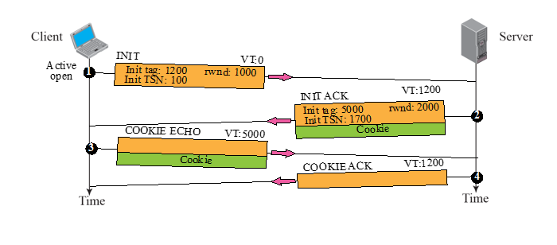 

+ 시작할 때 : Four Way Handshaking
  - INIT 보냄.
  - INIT ACK로 응답
  - COOKIE ECHO 를 다시 보냄(해킹방지)
  - COOKIE ACK가 오면 시작 버전 끝
  
  - 이때 서버는 INIT 할때 뭐 아무것도 하는게 없다. 그냥 응답만 보낸다. 
     - TCP 는 Sync가 오면, 이미 Resource 를 쓰지만, SCTP는 이때 아무것도 안하고, COOKIE ECHO가 와야 해커가 아니라고 판단하는 것이다. 그리고 COOKIE ACK를 보내고 Resource를 만들기 시작한다. 이렇게 TCP 의 Sync Attack 문제를 해결함.
     
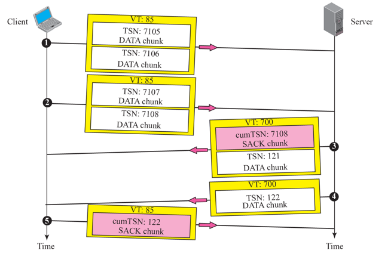 

+ Data 주고받을 때 
  - Data Chunk 보내고, SACK(Selective ACK) 로 응답함.
  - 이렇게 계속 반복한다. 
  - 어디까지 받았고, 어디는 받지 못했는지 다 알수있다. 
  
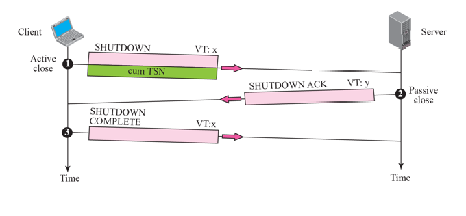 
  
+ 끝낼 때
  - TCP는 4번 주고받지만, SCTP는 3번 주고받는다.
  
   

+ Abortion 은 갑자기 끝내는 것.

### STATE TRANSITION DIAGRAM

+ Connection 상태 변화를 감지하는 단계 보고 State Transition Diagram 이라고 부른다. 

+ TCP와의 차이점 정리
  - Connection 관리하는 방법
  - Message 구조
  - Multistreaming, Multihoming 도입
  - Socket Programming도 나와 있다. 

+ Flow Control 과 Error Control 은 TCP 부분과 같다. 
  - 이 부분은 TCP에서 정리해서 갖고 오기.
  
### 정리
 
+ SCTP도 쓰이지만, 서버단에서 많이 쓰고, End User 에서는 안쓰인다.   
  - 쓸수있지만, 이미 되어있는것을 갈아엎는게 애바여서 안쓰임. 
