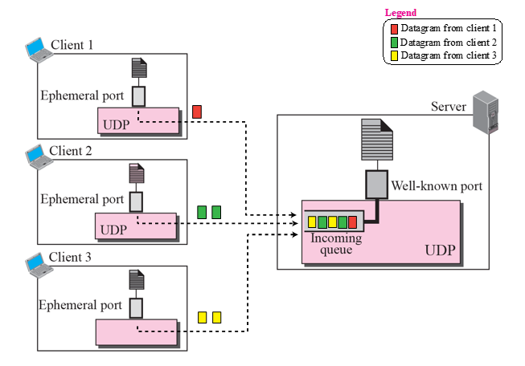
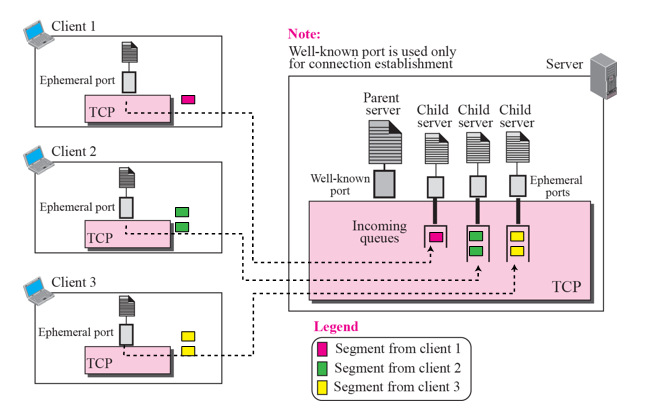
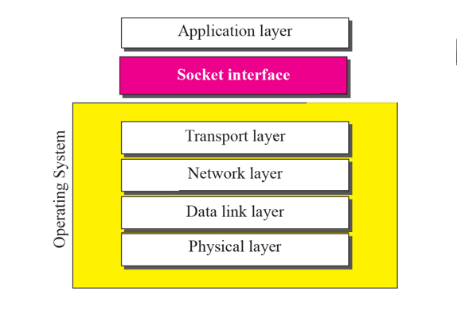
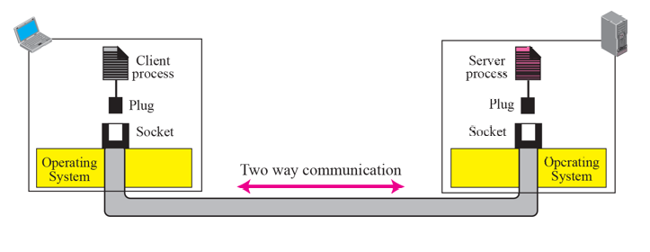
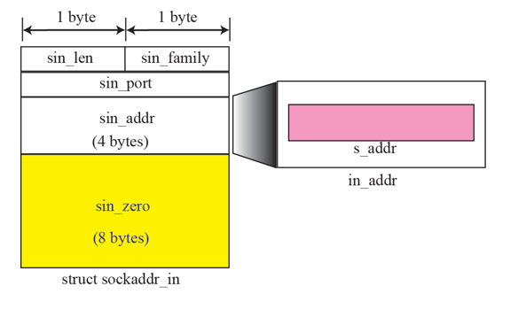

# Chapter 17. Introduction to the Application Layer

+ Service-Specific 한 내용이 많다. 
+ 표준으로 된 것 몇가지에 대해서 나온다. 
+ 응용 프로그래밍에서는 Socket Programming 이야기가 나온다. 결국 Socket에서 씀. 
  - Client-Server 구조 
  - Client 는 어떻게 구현하는지, Server 단은 어떻게 구현하는지, 함수 호출은 어떻게 하는지

+ Connectionless Iterative Server : UDP
  - 10명을 한줄로 세워서, 하나씩 처리함. 
  - 1번째 다 해결하면 2번째 하는 식
  - 같은 것을 여러 번 반복함. 
  - 17대 1을 한명씩 나와서 싸우게 하는 느낌

+ Connection-oriented Cuncurrent Server
  - 동시다발적으로 처리
  - 10명을 일렬 횡대로 세워서 처리하는 것
  - 17대 1로 싸울때 동시에 싸우는 느낌.

+ 위 2개에 따라서 서버의 구현방식이 달라짐.
+ 극단적인 경우 UDP가 Iterative 방식으로 가고, TCP/SCTP는 Cuncurrent 방식을 많이 씀. 
  - Iterative의 경우, Process가 한개인데, Cuncurrent에서는 Process가 그림에서 3개인것을 볼 수 있음.
    - Cuncurrent 의 경우 각각 전담마크로 하나씩 있는 것이다. 
    - Fork 쓰는것도 있고, Thread 쓰는것도 있고 다양하다. 

+ Socket 하다가 문제 생겼을 때, TCP를 알면 어떤 것이 문제인지 파악할 수 있다.
  - 시험이 아니더라도, TCP 부분은 반드시 정리해 두자!

+ Relation between the OS and TCP/IP Suite
  - Physical Layer 부터 Transport Layer 까지가 보통 OS 단(Kernel) 안에 있음.
  - 그 위의 것이 Socket Program 써서 Interface, 응용 Layer를 짜는 것임.
  - Socket Interface(Socket API 함수, Socket/Send/Receive). 이런것들이 다 함수로 있다.

+ Socket의 Concept
  - L4에는 TCP SCTP가 있고, Socket Type이 다 다르다. 
  - 
  - TCP는 Sok_Stream, UDP는 SOK_Datagram, UDP 는 SOCK_Sequencial Packet 등 다르다. 
  - SOCK_RAW(IP) : ICMP 같은 경우 바로 TCP 안쓰고 바로 IP 씀. 
  - 
  
  - Socket Address : IP Address 와 Port 번호 있음.
  
  - Socket 호출순서(UDP) : 
    - Server : 
      - 1. Socket 열기
      - 2. bind 하기.
      - 3. recvfrom 으로 땡겨(?) 옴.(받기
      - 4. HandleRequest
      - 5. Sendto(쏘는것) (이후 2번과 3번 사이로 들어감)
    - Client : 
      - Socket 열고 바로 데이터 쏘기(Sendto)
      - 이후 recvfrom 으로 받기.
      
  - Socket 호출순서(TCP)
    - Server : 
      - 1. Socket 열기
      - 2. Bind
      - 3. Listen
      - 4. Accept(새로 들어감)
    - Client
      - connect 가 있음. 
