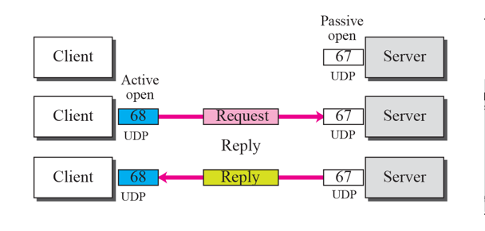
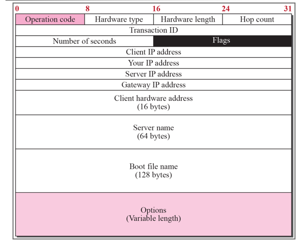

# Chapter 18. Host Configuration : DHCP

+ DHCP는 집에 많이 사용하고 있는 것 중 하나이다.
  - 공유기
  - (공유기에 안 물린 경우) 아파트 단지 내 서버

+ 컴퓨터를 키면 첫번째 하는 일이, 내가 쓸 주소를 땡겨오는 일이다.
  - (주소가 없는 상태에서)주소를 할당받는 것.(공유기면 공유기, 공유기가 아니면 아파트 단지 내 서버에서)
  - Dynamic Host Configuration Protocol : DHCP
  - Dynamic 하게 Host 를 Configuration 하는 것!

+ 보통은 DHCP Client Server가 같은 LAN에 존재한다. 
  - Client와 Server가 같은 망에 있다고 가정함. 
  - Client가 먼저 Request를 보냄(DHCP Request)
  - CIP : Client IP
  - SIP : Server IP
  - 1. Client 에서 갈때, CIP 가 0s(all 0라는 뜻)임. 이때 이것의 의미는, "내가 지금 주소가 없다" 라는 의미이다.
  - 2. SIP(Server IP)는 전부다 1이다(1s, all 1이라는 뜻). 전부 1일 때는 Broadcast 이다. 
    - Server가 어디 있는지 모르니까, 다 보내는 것이다.
    - 이것은 DHCP이다! 라는 것을 알려주기 위한 Port 번호가 다 존재한다. (표준 67,68번)
    - 받는 애는 Port 번호 보고 아는 것이다!
  - 3. Broadcast 하면 어딘가에 있는 서버가 받아서 응답해 주는 것이다.(DHCP Reply)
  - 4. 받는 애한테는 IP를 알려준다. "니가 쓸 주소는 이것이다!"  
  
  
  
+ 만약 DHCP Server가 다른 곳에 있을 때
  - 당연히 Broadcast 패킷은 Router를 넘을 수 없다. 
  - 그래서 필요한 것이 Relay Agent이다. 
  - Relay Agent는 DHCP Server의 Unicast address를 알고 있어서 대신 보내줄 수 있다. 
  - DHCP Server는, Relay Agent의 IP주소를 알기 때문에 해당 Broadcast를 Relay Agent를 통해 받고, 다시 똑같이 해당정보를 DHCP Server가 Relay Agent를 통해 주고, Relay Agent가 다시 DHCP Client에게로 주소를 주는 식이다.
  
   
  
+ Use of UDP Ports
  - DHCP Server와 Client는 UDP Port인 67,68번을 사용한다. 
  - Client는 임시 포트를 사용해도 될텐데 왜 68번을 사용하는가?
    - Server에서 Client로 갈때도 Broadcast로 전달해서 이다. 
    - 만약 A,B가 공교롭게도 DHCP Open이 되어 있고, 똑같이 2017번 Port를 사용한다고 가정하면, Host A,B 가 똑같이 해당 broadcast를 받을 것이다. 그런데 이런 일이 있어서는 안된다. 
  - Well Known Port 68을 사용하면 이런 일이 안생기나?
    - 만약에 DHCP Client가 B도 있다면, 똑같이 socket 통신이 B로도 갈것이다. 
    - 이럴 때 DHCP 에서는 transaction ID라는 것을 만들어, 랜덤하게 숫자를 골라서 준다. 
    - 랜덤이다 보니 똑같은 ID를 똑같은 시간대에 쓰기는 대단히 어렵다. 그래서 이렇게 사용한다. 
    
+ Error Control
  - DHCP는 UDP를 사용하기 때문에, error control 기능이 없다. 
  - 그러므로, DHCP는 에러 컨트롤 부분이 따로 있어야 한다. 
  - 그럼 어케하느냐?
    - UDP에서 checksum 을 사용하면 된다. UDP에서의 checksum은 optional이다.
    - DHCP Client에서 Timer를 사용해서 처리하면 된다. 제 시간 안에 안오면 어딘가 문제가 생긴 것이다. 
    - traffic jam 때문에 제시간에 안 오는거면, DHCP는 client에게 타이머를 맞추기 위해 random number를 사용하게 만든다. 
    

+ DHCP Packet Format
  - Operation Code(8bit) : DHCP Packet의 type 을 결정하다. 1번은 Request, 2번은 Reply
  - Hardware Type(8bit) : Physical Network의 type을 정의한다. 각 네트워크 타입은 정수로 할당된다 
    - ex) Ehternet은 1번
    
  - Hardware Length(8bit) : Physical Address의 길이를 byte 단위로 설정한다. 
    - ex) Ethernet은 6번
    
  - Hop Count(8bit) : Packet이 갈 수 있는 Maximum Hop 갯수
  - Transaction ID(32bit, 4byte) : 정수로 들어간다. 위에서 Well-Known Port 68번으로 가면, ID를 식별하기 위해서 주는 것이다. Client에 의해 만들어지고, Client가 다시 Server로 부터 받아서 이게 자기 것이 맞나 체크하기 위한 것이다. 당연히 Server는 줄때 똑같은 Transaction ID로 준다. 
  
  - Number Of Seconds(16bit) : client가 시작하고 나서 얼마나 시간이 지났는가를 체크하는 것이다. 
  - Flag(16bit) : 제일 왼쪽 비트가 사용되고, 나머지 bit들은 다 0으로 세팅된다. 제일 왼쪽 bit는 서버에게 broadcast reply 하라고 해주는 부분이다. 
    - reply가 unicast로 들어오면, 보내는 IP 주소를 받는 본인이 모르는 상태로 뿌려지게 되기 때문에 패킷이 버려진다. 
    - IP Datagram이 broadcast이기 때문에, 모든 host가 다 받아볼 것이고, broadcast message를 진행할 수 있게 된다. 맨 왼쪽 자리 숫자가 0이면 unicast, 1이면 broadcast 로 들어간다고 생각하면 된다. 
    
    
  
  
