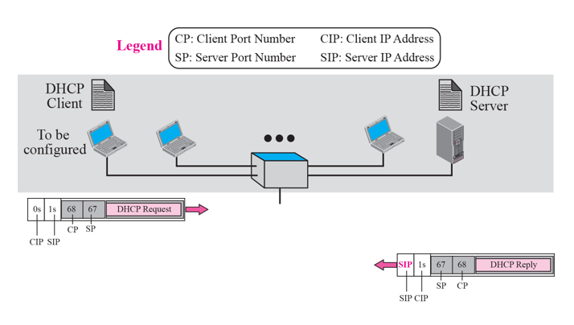
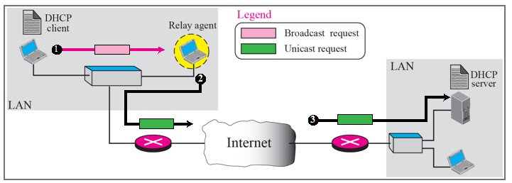

# Chapter 18. Host Configuration : DHCP

+ DHCP는 집에 많이 사용하고 있는 것 중 하나이다.
  - 공유기
  - (공유기에 안 물린 경우) 아파트 단지 내 서버

+ 컴퓨터를 키면 첫번째 하는 일이, 내가 쓸 주소를 땡겨오는 일이다.
  - (주소가 없는 상태에서)주소를 할당받는 것.(공유기면 공유기, 공유기가 아니면 아파트 단지 내 서버에서)
  - Dynamic Host Configuration Protocol : DHCP
  - Dynamic 하게 Host 를 Configuration 하는 것!

+ 보통은 DHCP Client Server가 같은 LAN에 존재한다. 
  - Client와 Server가 같은 망에 있다고 가정함. 
  - Client가 먼저 Request를 보냄(DHCP Request)
  - CIP : Client IP
  - SIP : Server IP
  - 1. Client 에서 갈때, CIP 가 0s(all 0라는 뜻)임. 이때 이것의 의미는, "내가 지금 주소가 없다" 라는 의미이다.
  - 2. SIP(Server IP)는 전부다 1이다(1s, all 1이라는 뜻). 전부 1일 때는 Broadcast 이다. 
    - Server가 어디 있는지 모르니까, 다 보내는 것이다.
    - 이것은 DHCP이다! 라는 것을 알려주기 위한 Port 번호가 다 존재한다. (표준 67,68번)
    - 받는 애는 Port 번호 보고 아는 것이다!
  - 3. Broadcast 하면 어딘가에 있는 서버가 받아서 응답해 주는 것이다.(DHCP Reply)
  - 4. 받는 애한테는 IP를 알려준다. "니가 쓸 주소는 이것이다!"  
  
  
  
+ 만약 DHCP Server가 다른 곳에 있을 때
  - 당연히 Broadcast 패킷은 Router를 넘을 수 없다. 
  - 그래서 필요한 것이 Relay Agent이다. 
  - Relay Agent는 DHCP Server의 Unicast address를 알고 있어서 대신 보내줄 수 있다. 
  - DHCP Server는, Relay Agent의 IP주소를 알기 때문에 해당 Broadcast를 Relay Agent를 통해 받고, 다시 똑같이 해당정보를 DHCP Server가 Relay Agent를 통해 주고, Relay Agent가 다시 DHCP Client에게로 주소를 주는 식이다.
  
+ Use of UDP Ports

