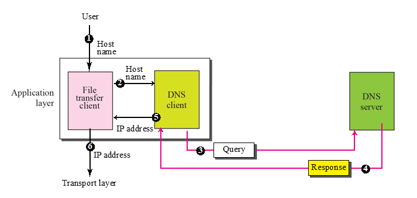
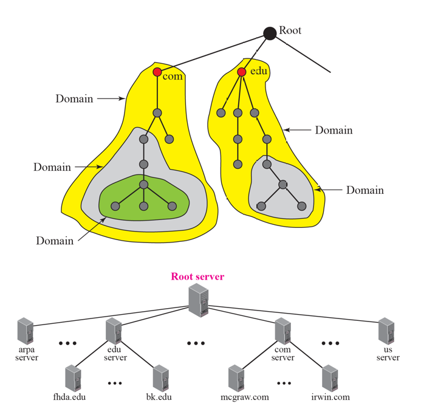
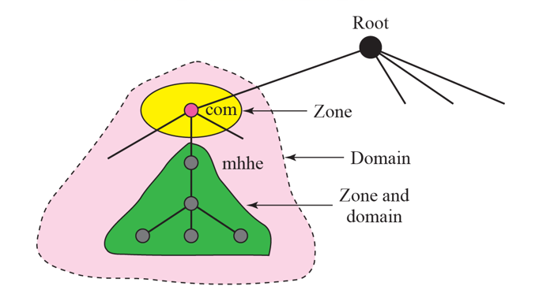

# Chapter 19. Domain Name System(DNS)

+ TCP/IP Protocol은 IP Address가 필요한데, 이런 복잡한 숫자 대신에 그냥 "이름" 을 사용하고 싶더라
+ name 을 address에 매핑하거나, address를 name에 매핑하는 등의 작업이 필요하다. 

### Name Space 

+ IP Address가 Unique하기 때문에, name도 그래야함. 
+ flat 과 hierarchical 한 방법 두가지가 있다.
  - flat : 구조없이 그냥 이름
  - hierarchical : 구조 있고, 다 따로 따로 되어있는게 조합된것. 

+ Tree 형식으로 가는 방법 : com.aaaa.bbbb. 이렇게되면 bbbb.aaaa.com 이렇게 되겠지.
  - Label : 최대 63개 char로 되어있는 node
  - domain name : 거꾸로 올라가면서 읽는 label의 조합. dot로 구분됨. 
+ 당연히 거꾸로 올라가면서 읽는다. 

+ FQDN & PQDN
  - FQDN(Fully Qualified Domain Name)
    - 전체 주소 도메인 네임, 절대 도메인 네임이라고 부르며, 호스트 이름과 도메인 이름을 포함한 "전체 도메인 이름"을 일컫는 용어이다.
    - host의 완전한 이름이다. 
    - 맨 뒤에 root domain(".")도 포함해야 하지만, 보통 도트까지는 생략함.

  - PQDN(Partially Qualified Domain Name)
    - 부분 주소 도메인 네임, 혹은 상대 도메인 네임이라고 부르며, DNS root의 모든 label을 포함하지 않는다. 
    - 단순히 호스트네임이라고 하며, 전체 주소 도메인 네임의 가장 왼쪽에 위치한 label 이다. 

+ Domain 
  - Domain 안에 Domain이 들어갈 수 있는 구조이다. 그냥 tree 구조 상에서 묶음이면 다 domain 이다.

+ Distribution of Name Space
  - 하나에만 다 넣고 관리할려니까, 너무 방대하다. 
  - 하나만 failure 나도 전체 인터넷이 망가질 수 있다. 
  - 그래서, DNS Servers 들을 분산시켜서 역시 똑같이 Tree 구조로 관리할 수 있다. 
  - DNS는 작은 domains(subdomain)들로 나뉘어지고, 계속 tree 처럼 아래로 내려가면서 관리될 수 있다.

  
+ Zone  
  - domain name들이 모여 있는 전체 .com 이런 애들은, 서버 하나로 관리가 안된다. 
  - 그래서 많은 서버들로 나뉘어져 있다. (하나의 node인데도 불구하고)
  - 그래서 domain 이 더 나눌 수 없는 domain 인데도 불구하고 여러 개로 되어 있으면 domain=zone
  - 나눌 수 있으면 domain != zone
  - (새로정리)
  
  
