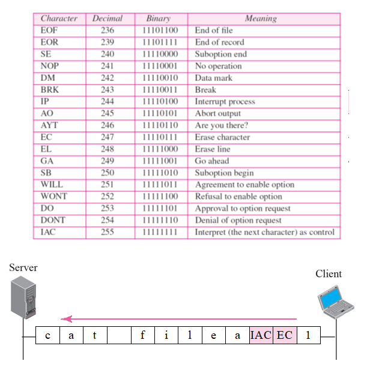
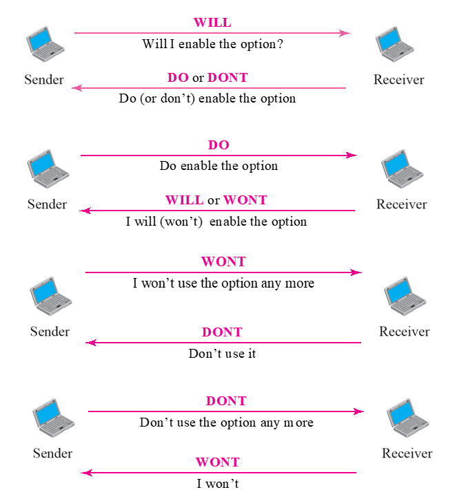

# Chapter 19. Remote Login : TELNET and SSH

+ 요즘 잘 안쓰긴함.(Telnet)
+ Remote Login 하는 것. 
+ Terminal Network의 약자.
  - General Purpose : 컴퓨터를 직접 쓰는것처럼, 원격해서 컴퓨터를 사용하겠다!

+ Local login
  - Terminal에서 사용하는 것.
  - 그런게 있다.
  - TelNet 통해서 가는 것
  - Telnet 의 underline은 TCP
  - Telnet은 컴퓨터를 오랫동안 쓰는 것임.

+ Remote Login
  - Telnet Client / Telnet Server
  - Local 컴퓨터의 charset, Remote 컴퓨터의 charset이 다를 수 있는데, 네트워크에서는 통일시켜야 한다. 
  - 표준으로 NVT Character Set이라는 것을 통일해 놓았다. 
  - 어디에서 뭘 쓰는지는 모르겠고, 네트워크를 지나갈 때는 반드시 이 양식을 지켜서 가야 한다!
  - 요런 내용들이 Telnet Protocol 에 들어가 있음.
  
+ Format of data and control characters

  - 맨 왼쪽 첫번째 bit가 0이면 data, 1이면 control character
  - ascii랑 비슷한 부분이 있다. 
  - 
  - cat filea ~~ : Linux에서 파일 ~의 내용을 출력시키라는 의미
  - ex) EC : 지워라. / IAC : 컨트롤한다는 의미
  - 하나하나가 다 코드가 되어서 감. 
  - 이런 Control 정보가 그대로 Client 에서 Server로 감. 
  
+ NVT Character set for option negotiation(Sync를 맞춰야 해서 협상하는 것)
  - 세부적인 사항에 대해서 협상하는 것.
  - WILL : 옵션을 쓰겠다는 의미
  - WONT : 옵션을 쓰는것을 거부하는 것.
  - 쌍방 간의 능력을, 상태정보를 교환하고 협상한다. 협상해 놔야 다음 telnet 쓸때 무리가 없다.

+ Example
  - 학교에 있는 Telnet server에 컴퓨터로 접속하는 것.
  - sender랑 receiver랑 negotiation 주고받는 것.
  
  
### SECURE SHELL(SSH)

+ 보안을 강화시켜서 나온 것.

+ Telnet의 Sub Port 번호 : 3
+ SSH Port 번호 : 22
