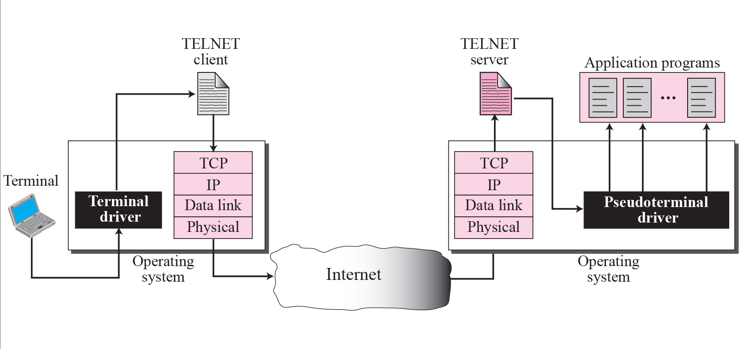

# Chapter 19. Remote Login : TELNET and SSH

+ 요즘 잘 안쓰긴함.(Telnet)
+ Remote Login 하는 것. 
+ Terminal Network의 약자.
  - General Purpose : 컴퓨터를 직접 쓰는것처럼, 원격해서 컴퓨터를 사용하겠다!

+ Local login
  - Terminal에서 사용하는 것.
  - 그런게 있다.
  - TelNet 통해서 가는 것
  - Telnet 의 underline은 TCP
  - Telnet은 컴퓨터를 오랫동안 쓰는 것임.

+ Remote Login
  - Telnet Client / Telnet Server
  - Local 컴퓨터의 charset, Remote 컴퓨터의 charset이 다를 수 있는데, 네트워크에서는 통일시켜야 한다. 
  - 표준으로 NVT Character Set이라는 것을 통일해 놓았다. 
  - 어디에서 뭘 쓰는지는 모르겠고, 네트워크를 지나갈 때는 반드시 이 양식을 지켜서 가야 한다!
  - 요런 내용들이 Telnet Protocol 에 들어가 있음.
  
+ Format of data and control characters

  - 맨 왼쪽 첫번째 bit가 0이면 data, 1이면 control character
  - ascii랑 비슷한 부분이 있다. 
  - 
  
  
