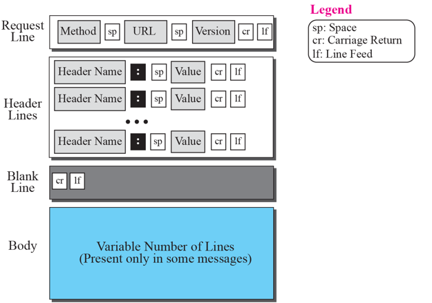
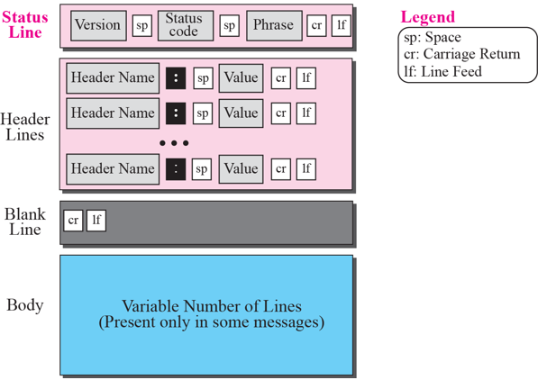
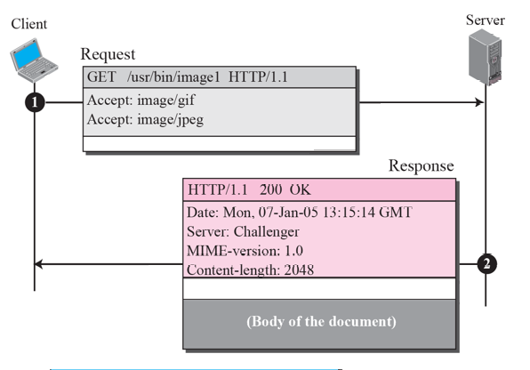
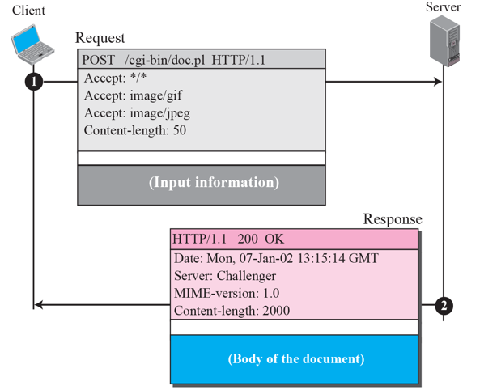

# Chapter 22. Worid Wide Web and HTTP

+ 응용 중에 제일 많이 쓰는 것
+ World Wide Web은 Service 이고, HTTP 는 Protocol

+ WWW의 기본은 Web Client, Web Server가 있을 때 페이지를 다운로드 받는 방식이다. 
  - Web Page를 Request 하면, 응답 메세지 안에 HTML 문서를 던져주는 것이다. 
  - 그럼 받은 HTML 문서를 Browser에 Play 하는 것.
  - 웹 서핑 하다 보면, 링크를 클릭해 다른 웹 서버로 갈 수 있음
    - Client는 한개이지만, Server를 여러 개 동시에 Contact 할 수 있고, 각각 다 Request/Response 가 있음.

+ HTTP(HyperText Transfer Protocol)
  - HyperText 는 Link 라는 이야기이다. 그냥 Text가 아니라 Link 된 Text 를 주고받는다는 의미.
  - 웹 브라우저의 기능 : HTTP, FTP, TELNET, SMTP 등

+ URL(Uniform Resource Locator)
  - 웹 주소라고도 하고, URL 이라고도 함. 
  - 인터넷 상에 있는 Resource의 위치라는 이야기.
  - Uniform : 하나라는 의미
  - Resource : 문서 같은 것, 자원. 
  - Locator : 위치
  - URL 이라고도 하고, URI(Identification) 이라고도 부른다. 
  - 형식 
    - Protocol :// Host : Port / Path
    - http://20.127.94.140:5000/index.html
    - 슬래시(/) 뒤에는, 필요하면 Subfolder 가 들어가는 식
    - HTTP의 Port 번호는 80번인데, 80번이면 굳이 쓸 필요 없지만, 80번이 아닌 경우는 사용해야 한다.

### Web Document

+ 웹 문서의 종류에는 3가지가 있다.
  - Static Documents
    - 변하지 않는 문서. 
    - 보통 홈페이지 화면을 보여주면, 문서가 여기서 추가로 변하지 않는다.
    - 이때 사용하는 Markup Language : HTML, XML 등

  - Dynamic Documents, Active Documents
    - 변하는 문서
    - 어떻게 변하냐에 따라 Dynamic/Active 로 나뉜다. 
    - 옛날에는 CGI 라는 것이 있었는데, Request를 보내면 Request의 정보를 참고해 프로그램이 돌아가며, 그 프로그램이 해당 작업의 결과를 알려주는 식.
    - Client 마다 다른 정보가 들어갈 수 있다. (문서가 Dynamic 하다는 것.) 
  
  - HTML, XML : Markup Language
  - HTTP는 Protocol
  - Web : Service 이름! 

+ Server-site Script 
  - ASP, JSP 등을 사용해, Request 하면 무엇인가(보통 Script)를 돌림.
  - 돌린 결과에 따르는 Dynamic 문서를 보냄.
  - Dynaminc 문서를 때로는 Server-Site Dynamic Document 라 부른다.

+ Active Document using Java Applet
  - 바뀌기는 하는데, Server가 바꾼 상태로 보내는 것이 아니라, Client 단에 와서 바뀌는 것.
  - 응답으로 Applet을 보내고, 그것이 Client에서 실행되어 Clinet에 맞게 Browser 상태나 환경에 따라 다르게 나온다.
  - 대표적으로 Java Applet 이 있다.

+ Active Document using Client-site Script
    - JavaScript 도 Client 단에 와서 정보가 바뀌는 것이다.
    - Client-site 에서의 Dynamic Document! : 바뀌는 시점이 Client 단이다!

### HTTP (HyperText Transfer Protocol)

+ TCP를 사용하며, Well-Known Port 80번을 사용.
+ Request/Response 로 주고받으며, 이 한 쌍을 Transaction(HTTP Transaction) 이라고 부른다. 
  - Transaction 은 HTTP에서 기본 통신 단위이다. 
  
  

+ Format of the Request Message
  - Header 가 여러 개 나오는데, TCP Header의 그 Header는 아니다. 
    - Content Name 관련된 Header가 여러 개 있다. (다른 TCP/IP 같은 Header가 아니다!)
  
  - 기본적으로 다 Text 기반이다. (TCP/IP는 다 Binary Format)
  - Text 기반으로 Header가 쭉 나오고, Body 정보가 나오는데, 그 사이에 Blank LIne이 있어야 함. 
    - Blank Line 기반으로 Header와 Body의 경계점을 판단하게 된다. 
    - Blank Line 이 없으면 판단하지 못한다. 
    
  - Request Line의 Method, URL, Version 이 sp(스페이스) 로 구분되어 나온 뒤, Header 정보가 쭉 나온다. 
  - 이후 Blank Line 나오고 Body 정보가 나온다. 
  - Method 
    - GET : 받는 것
    - POST : 올리는 것.
    - Method 정보가 맨 처음으로 나온다. 
    
  - Header Line
    - 뒤에 Body 를 처리할 때 올 수 있는 것들을 다 집어넣는다.
    - 종류가 대단히 많다.   
    
    
    
+ Format of the Response Message
  - Request Msg와는 맨 앞 부분만 다르다
    - Request Msg에서는 Request Line이었던 부분이, Response 에서는 Status Line으로 바뀜.
  - 나머지는 다 똑같고, Text Format이다!
  - 거의 다 똑같은데, Status Line 에서의 URL 부분이 달라진다. 
    - URL 이 Status Code로 바뀐다. 
    - Code 부분에 숫자(10진수) 3개가 나온다. 
    - 100번대 : Information(참고용)
    - 200번대 : Success( ex : 200 OK )
    - 300번대 : Redirection (다른데로 가라는 의미)
    - 400번대 : Client 쪽의 Error
    - 500번대 : Server 쪽의 Error
    - 각각의 10번대 1번대는 상세한 이유에 대해서 나온다.
      

+ Example
  - Request : GET 으로 이미지 파일을 받고 싶다고 보냄. 
    - VERSION : 1.1
    - ACCEPT : gif 나 jpeg OK 라는 의미
    
  - Request
    - Server가 응답 주면서, HTTP/1.1 200 OK(설명문구)를 보냄.
    - Header 에, 그에 대한 설명 문구가 옴. 
    - Header에 오늘 날짜 들어감
    - Blank Line 온 뒤에, 문서의 body 부분이 들어간다. 
    
    

+ Example 2
  - Request : POST 로, 파일을 올리고자 함.
    - cgi bin 사용해서 pl 파일을 실행시킴.
    - 실행 결과를 쭉 써서 response에다 알려달라고 요청함.

 
 
 + Example 3
 
  - server 에 image 2개랑 파일 하나를 받고자 함. 
    - 기본적으로 HTTP 는 underline 으로 TCP를 사용하고 있다.
    - TCP 3 way handshaking 한 후, Request를 보낼 것임.
    - 이미지 하나 받고 Connection 끊고, 다시 Collection 새로 설정하는 등, 같은 서버인데도 타이밍에 따라서 TCP를 여러 번 세팅해야 할 수도 있다. 
    - 대단히 비효율적일 수 있다. 

 

+  1.0 에서 1.1 로 올리면서, persistent connection 을 만들었다.   
  - 비효율을 개선한 작업.
  - connection 한번 열고 안 끊고, 계속 열어놓음. 
  - 요청이 오지 않으면 그때 닫는다. 
 

