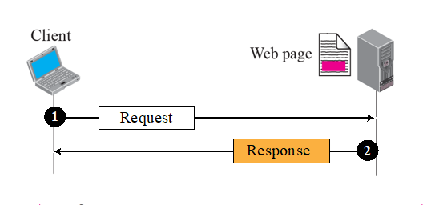

# Chapter 22. Worid Wide Web and HTTP

+ 응용 중에 제일 많이 쓰는 것
+ World Wide Web은 Service 이고, HTTP 는 Protocol

+ WWW의 기본은 Web Client, Web Server가 있을 때 페이지를 다운로드 받는 방식이다. 
  - Web Page를 Request 하면, 응답 메세지 안에 HTML 문서를 던져주는 것이다. 
  - 그럼 받은 HTML 문서를 Browser에 Play 하는 것.
  - 웹 서핑 하다 보면, 링크를 클릭해 다른 웹 서버로 갈 수 있음
    - Client는 한개이지만, Server를 여러 개 동시에 Contact 할 수 있고, 각각 다 Request/Response 가 있음.

+ HTTP(HyperText Transfer Protocol)
  - HyperText 는 Link 라는 이야기이다. 그냥 Text가 아니라 Link 된 Text 를 주고받는다는 의미.
  - 웹 브라우저의 기능 : HTTP, FTP, TELNET, SMTP 등

+ URL(Uniform Resource Locator)
  - 웹 주소라고도 하고, URL 이라고도 함. 
  - 인터넷 상에 있는 Resource의 위치라는 이야기.
  - Uniform : 하나라는 의미
  - Resource : 문서 같은 것, 자원. 
  - Locator : 위치
  - URL 이라고도 하고, URI(Identification) 이라고도 부른다. 
  - 형식 
    - Protocol :// Host : Port / Path
    - http://20.127.94.140:5000/index.html
    - 슬래시(/) 뒤에는, 필요하면 Subfolder 가 들어가는 식
    - HTTP의 Port 번호는 80번인데, 80번이면 굳이 쓸 필요 없지만, 80번이 아닌 경우는 사용해야 한다.

### Web Document

+ 웹 문서의 종류에는 3가지가 있다.
  - Static Documents
    - 변하지 않는 문서. 
    - 보통 홈페이지 화면을 보여주면, 문서가 여기서 추가로 변하지 않는다.
    - 이때 사용하는 Markup Language : HTML, XML 등

  - Dynamic Documents, Active Documents
    - 변하는 문서
    - 어떻게 변하냐에 따라 Dynamic/Active 로 나뉜다. 
    - 옛날에는 CGI 라는 것이 있었는데, Request를 보내면 Request의 정보를 참고해 프로그램이 돌아가며, 그 프로그램이 해당 작업의 결과를 알려주는 식.
    - Client 마다 다른 정보가 들어갈 수 있다. (문서가 Dynamic 하다는 것.) 
  
  - HTML, XML : Markup Language
  - HTTP는 Protocol
  - Web : Service 이름! 

+ Server-site Script 
  - ASP, JSP 등을 사용해, Request 하면 무엇인가(보통 Script)를 돌림.
  - 돌린 결과에 따르는 Dynamic 문서를 보냄.
  - Dynaminc 문서를 때로는 Server-Site Dynamic Document 라 부른다.

+ Active Document using Java Applet
  - 바뀌기는 하는데, Server가 바꾼 상태로 보내는 것이 아니라, Client 단에 와서 바뀌는 것.
  - 응답으로 Applet을 보내고, 그것이 Client에서 실행되어 Clinet에 맞게 Browser 상태나 환경에 따라 다르게 나온다.
  - 대표적으로 Java Applet 이 있다.

+ Active Document using Client-site Script
    - JavaScript 도 Client 단에 와서 정보가 바뀌는 것이다.
    - Client-site 에서의 Dynamic Document! : 바뀌는 시점이 Client 단이다!

### HTTP (HyperText Transfer Protocol)

+ TCP를 사용하며, Well-Known Port 80번을 사용.

