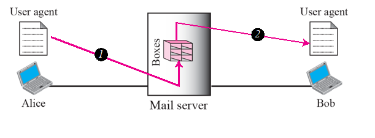
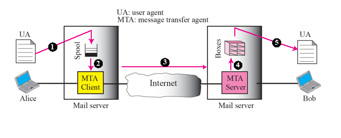
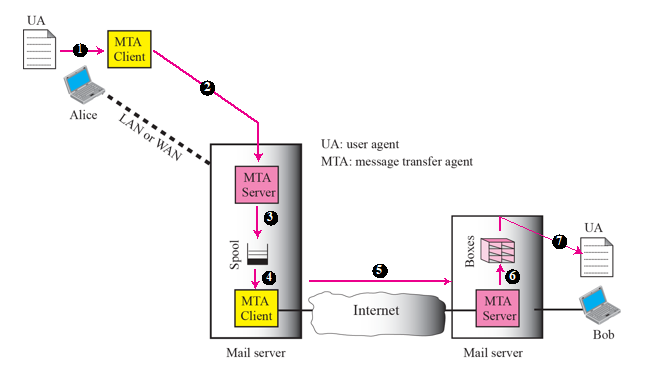
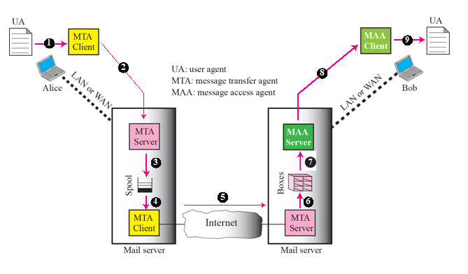

# Chapter 23. Electronic Mail : SMTP, POP, IMAP, and MIME

+ 이메일 관련 내용이다. 
+ 이메일에서 SMTP만 사용하는 것이 아닌, POP도 사용하고, IMAP 도 사용함.

### ARCHITECTURE

+ 이메일 주고받는 시나리오 4가지가 있다.

1. 메일 서버가 학교 안에 있는 경우.

    - 원격 터미널 사용해서 보냄.
    - 같은 LAN에 물려 있는 경우.
    - 메일 박스에 자기 ID로 오는 것이 있으면, 누군가 읽어가는 식임.
    - Sender/Receiver 가 같은 서버에 있으므로, 그냥 두 User Agent만 있으면 된다. 
  

2. 메일 서버가 인터넷을 두고서 양쪽에 있는 경우

    - User Agent가 2개 있고, 메일을 보내기 위해 MTA Client라는 것이 존재한다. 
      - MTA : Mail Transfer Agent
    
    - 보내고 받는 것이 있고 중간에 네트워크가 존재함. 
    - 계정에 로그인하면, MTA 가 인터넷을 통해서 받는 쪽에 보내놓으면, 받는 쪽이 자신의 계정에 접속해 확인한다. 
    - 다른 메일 서버를 사용하는 경우, UA(User Agent) 2개, MTA(Mail Transfer Agent) 2개가 필요하다!

3. 보내는 쪽의 MTA 와 User Agent 사이에 네트워크가 있는 경우

    - Sender 가 메일 서버를 웹(LAN이나 WAN)을 통해서 접속함
    - 당연히 보내는사람/받는사람 User Agent가 2개 필요하고, MTA가 2쌍 필요하다. 
    

4. 보내는 쪽/받는 쪽이 모두 네트워크로 소통하는 경우
    
    - 가장 일반적인 경우
    - 보낼 때는 MTA(Mail Transfer Agent), 받을 때는 MAA(Mail Access Agent)
    - POP와 IMAP은 당겨 올때의 Protocol 이다
    - 보낼 때는 MTA(SMTP 사용), 당겨올 때는 MAA(POP, IMAP 사용)
    - 보낼 때는 일반적으로 쭉 보내어서, 받는 쪽의 Box에 도착함.
    - 받는 쪽 사람이 Box 에 있는 메일을 확인해 볼때 MAA가 동작해서, 자신의 메일을 당겨 가는 것.
    - 보내는 것, 받는 것이 모두 WAN이나 LAN 에 연결되어 있고, User Agent 2개, MTA 2 쌍, 1쌍의 MAA가 필요함.
    
    
