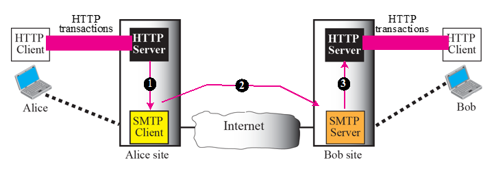

# Chapter 23. Electronic Mail : SMTP, POP, IMAP, and MIME

+ 이메일 관련 내용이다. 
+ 이메일에서 SMTP만 사용하는 것이 아닌, POP도 사용하고, IMAP 도 사용함.

### ARCHITECTURE

+ 이메일 주고받는 시나리오 4가지가 있다.

1. 메일 서버가 학교 안에 있는 경우.

    - 원격 터미널 사용해서 보냄.
    - 같은 LAN에 물려 있는 경우.
    - 메일 박스에 자기 ID로 오는 것이 있으면, 누군가 읽어가는 식임.
    - Sender/Receiver 가 같은 서버에 있으므로, 그냥 두 User Agent만 있으면 된다. 
  

2. 메일 서버가 인터넷을 두고서 양쪽에 있는 경우

    - User Agent가 2개 있고, 메일을 보내기 위해 MTA Client라는 것이 존재한다. 
      - MTA : Mail Transfer Agent
    
    - 보내고 받는 것이 있고 중간에 네트워크가 존재함. 
    - 계정에 로그인하면, MTA 가 인터넷을 통해서 받는 쪽에 보내놓으면, 받는 쪽이 자신의 계정에 접속해 확인한다. 
    - 다른 메일 서버를 사용하는 경우, UA(User Agent) 2개, MTA(Mail Transfer Agent) 2개가 필요하다!

3. 보내는 쪽의 MTA 와 User Agent 사이에 네트워크가 있는 경우

    - Sender 가 메일 서버를 웹(LAN이나 WAN)을 통해서 접속함
    - 당연히 보내는사람/받는사람 User Agent가 2개 필요하고, MTA가 2쌍 필요하다. 
    

4. 보내는 쪽/받는 쪽이 모두 네트워크로 소통하는 경우
    
    - 가장 일반적인 경우
    - 보낼 때는 MTA(Mail Transfer Agent), 받을 때는 MAA(Mail Access Agent)
    - POP와 IMAP은 당겨 올때의 Protocol 이다
    - 보낼 때는 MTA(SMTP 사용), 당겨올 때는 MAA(POP, IMAP 사용)
    - 보낼 때는 일반적으로 쭉 보내어서, 받는 쪽의 Box에 도착함.
    - 받는 쪽 사람이 Box 에 있는 메일을 확인해 볼때 MAA가 동작해서, 자신의 메일을 당겨 가는 것.
    - 보내는 것, 받는 것이 모두 WAN이나 LAN 에 연결되어 있고, User Agent 2개, MTA 2 쌍, 1쌍의 MAA가 필요함.
    
    
+ Push vs Pull

  - MTA : 메일을 일방적으로 보내는 것(Send Mail, Push)
    - SMTP 사용
  - MAA : 받는 사람의 메일에 들어갔으면, 그때 Pull(당겨 오는 것)
    - POP, IMAP 사용
    - POP : 메일이 남아 있는 경우.
        - 보안때문에 그렇게 선호되지 않음.
    - IMAP : 동기화해서 읽어들이는 경우
   
### User Agent

+ 사람에 대응되는 것. 
   - 메일을 읽고 쓰고, 편집하는 기능을 Software Tool로 개발한 것.
   - 요즘은 거의 사용하지 않음. 
   - Mail, Pine, ELM(옛날에 이런것들이 있었다~)
   - Command-Driven 방식이고, GUI 방식으로 나온 User Agent 에 Outlook, Netscape 등이 있다.
   
   
   
+ Mail Format
    - Mail form (보내는사람)
    - RCPT To(받는사람)
    
+ User Agent 정리
    - Outlook이 대표적인 User Agent 방식
    - MTA는 눈에 잘 안보임. 자기알아서 보내는애
        - MTA Client, MTA Server가 있음
        - 보낼 때 관할하는 Protocol 은 SMTP(MTA는 SMTP를 구현한 것)

    - 사서함에 있는 것을 읽을 때 사용하는 것은 MAA(POP, IMAP)
        - Access Agent를 읽어갈 때는 Protocol 이 다르다. 
    
    - SMTP Port는 25번, POP는 110번
    - Client Server 기반으로 모두 작동한다. 
    
   
### MESSAGE TRANSFER AGENT(MTA)

+ MTA 사이에도 Command가 있고, Response가 있다. 
    - Client가 Command를 보내고, Server가 Response를 보내줌(잘 받았는지, 문제 있는지 등)
    - Commands
        - HELLO, MAIL FROM 등 보냄.
    
    - Respose 
        - 똑같이 숫자 3개로 보낸다. 
        - 200번대 : 성공
        - 300번대 : 중간 경과로 보냄
        - 400번대 : 임시 negative completion reply
        - 500번대 : 완전 에러
        
          
        
+ Connection Establishment        
    - 한번씩만 Command Response를 주고받는 것이 아니라, 여러 번 주고 받는다. 

+ SMTP의 underline은 TCP이다. 

  

+ Message Transfer
    - ID, PW, Text Format, Encoding 방식 등 주고받는다.
    - 상대방의 메일 계정으로 위의 그림 방식을 통해서 보낸다. 
    - 여러 번 주고받고, 상대방 메일 계정으로 안전하게 주는 것이 목적이다. 

### MESSAGE ACCESS AGENT

+ 메일이 뭐가 있는지 확인하는 Agent

+ POP3, IMAP
    - 역시 여러번 메세지를 주고받으며 처리한다.

### MIME(Multi-purpose Internet Mail Extension)

+ 국가별 format, Multimedia Type등을 알려줘야 함. 
+ 이런 것들을 모아놓은 것이 MIME이다.
    - 다목적으로 메일을 주고받다 보니 확장정보가 필요한데, 이것을 표준으로 묶어놓음.
    - 앞에 S 가 붙기도함. Security 가 보완된 것임.
    
      

+ 메일을 보낼 때 MIME을 한번 거쳐서 가고, 받는 쪽도 MIME에 대한 해석을 함. 
    - 당연히 중간에 지나갈 때는 NVT Format에 맞춰서 지나감.

+ MIME Header
    - Email Header와 Email Body 사이에 MIME Header가 붙는다. 
    - MIME 정보가 당연히 안에 들어간다. 
    - 이 헤더 정보를 해석할 때 참고한다. 
   
   
### WEB-BASED MAIL

+ 웹메일 케이스에는 2가지가 있다.

 

1. 메일을 확인할 때 HTTP(web)을 사용하는 경우
    - POP 안쓰고, 웹으로 직접 확인하는 경우
    - Agent 쓰는 것보다 Web으로 직접 확인하는 것이 편하다.
    - 당겨 가는 것만 웹으로 하는 경우
      
      

2. 메일을 보낼 때도 HTTP를 사용하는 경우 
    - 보낼 때도 웹메일으로 할 수 있다. 
    - 메일 서버 끼리는 SMTP를 사용함. 
    - 양 끝단은 HTTP로 통신.
    - 가장 일반적이다 
