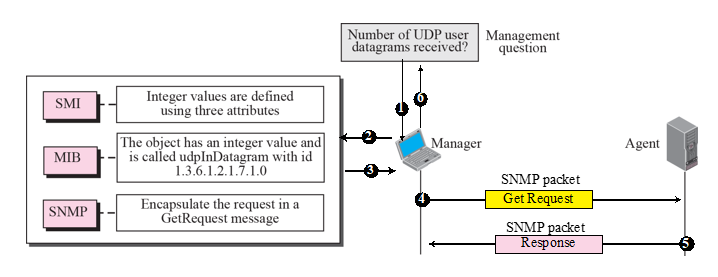
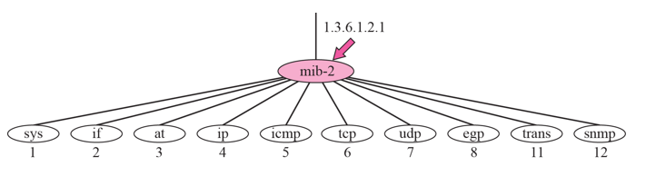
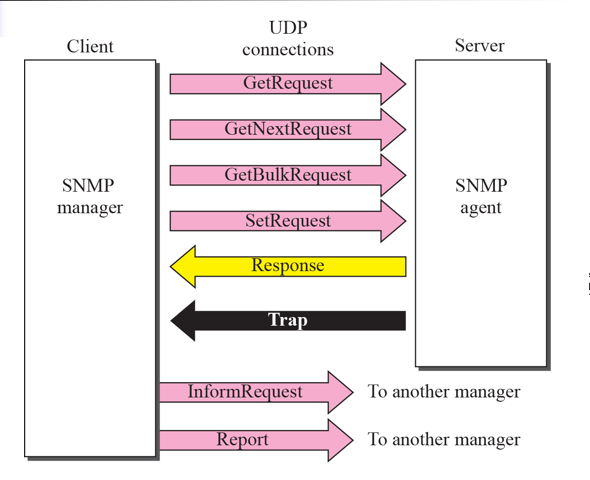
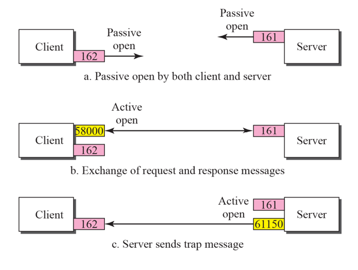

# Chapter 24. Network Management: SNMP

+ 망 관리하는 내용
+ 경북대 망 관리자 등 "망 관리자"가 사용하는 것임.

+ SNMP(Simple Network Management Protocol)
  - 망 관리용도로 Protocol 을 개발함.
  
### CONCEPT

+ 용어가 2개 나온다
  - Manager : 망 관리자(사람 쪽)를 지칭함.
  - Agent : 관리하려고 하는 장비를 지칭함(Router, Switch 등)
  - Manager가 Agent(관할에 있는 여러 Agent, Router 등)의 상태를 감시함.
    - 동작은 잘 하는지, Packet은 몇 개나 주고받는 지 등
    
### MANAGEMENT CONPONENTS

+ 무엇을 관리하느냐에 관한 이야기
+ 용어 3가지
  - SNMP : Manager와 Agent 사이에 주고 받는 Protocol
    - Packet의 format을 정의함.
    
  - SMI(Structured Management Information) : DB의 형식
    - Object(이 패킷을 몇개 받았는지 등의 정보) 의 이름 짓는 Rule을 SMI가 정한다. 
    - 형식, Rule에 대한 것
    
  - MIB(Management Information Base) : 관리 대상이 되는 DB
    - 거의 다 데이터이다. (데이터 모음이다)
    
  - SMI, MIB는 관리 대상이 되는 표현방식 / SNMP는 Protocol
  - SNMP Packet 안에 필요한 정보(SMI,MIB 정보) 에 따라 패킷을 만든다. 

+ Management Overview
  - Manager가 Agent의 상태를 감시함
  - ex) 수신된 UDP Packet의 갯수가 몇 개인가?
    - SMI, MIB를 통해 필요한 Msg를 만들어 보낸다. 
    - 그렇게 Agent에 보내서, SNMP Packet으로 지금껏 받은 UDP Packet의 갯수가 몇개인지 응답한다.
    - 이렇게 응답된 Packet들이 Manager의 Terminal 에 다 모인다. 
    
### SMI & MIB

+ Rule. 
+ Object Identifier
  - 나름대로 다 표준이 있다. 
  - hierachy 에 따라서 이름붙는다. 
  - 이런 것들을 다 숫자화 시켜놓았다.
    - 1.3.6.1.2.1 이라고 표준으로 정해놔버렸다.
  
  - SNMP에 의해 관리되는 모든 Object 들은 모두 1.3.6.1.2.1 으로 시작한다. 
  - 물론 그 뒤에 어떤것이 오냐에 따라 다르겠지만, 맨 위는 무조건 같아야 함(1.3.6.1.2.1)
  - 1.3.6.1.2.1 아래에도 Protocol 에 따라 더 갈린다. 
  - 이런 Rule에 따라 Packet을 맞춰서 던지면, 응답을 받을 수 있고, 내용을 알 수 있다. (표준에 정의되어 있음)

### SNMP

+ SNMP는 SMI 와 MIB를 통해 저장된 정보를 manager가 읽어올 때 사용함.
  - Manager : Client / Agent : Server
  - Agent와 메세지를 주고받을 수도 있고, 다른 망 관리자와도 메세지를 주고받을 수 있다. 
  - Msg를 주고 받는 내용들은 SNMP Spec 에 정의되어 있다.(어떻게 꾸미고, 어떻게 응답하는지)
  
+ SNMP PDU(Protocol Data Unit)
  - 패킷이라고 생각하면 쉽다. 
  - Packet format이 있는데, 메세지를 보낼 때 패킷 format 따라서 보낸다. 
  - 각 type 별로 tag를 붙여 놓았다(Binary 숫자로)
  
### UDP Ports

+ SNMP는 Underline으로 UDP를 사용한다. 

+ Well-Known Port 번호는 161,162번을 사용한다(2개)
  - 161번은 Agent가 사용함
  - 162번은 Manager가 사용한다.
  - 아무거나 쓰면 안되고, Well-known Port 번호가 다 정해져 있다.

+ Passive Open 
  - 열어놓고 기다리고 있다는 의미. (받을 준비를 하고있다)

+ 이후 Client에 보낼 때 Active Open 하면, 임의의 숫자(58000,61150 등 temporal number)를 보냄.
  - Channel 두개를 Client나 Server가 메세지 보낼 때 하는 셈. 
  - Trap은 Problem 생겼을 때 보냄. (Agent가 먼저 알려주는 경우)
  - 그래서 둘다 받을 준비를 하고 있어야 함. 매니저도 먼저 받을 수 있다. 그래서 Port 2개를 사용해야 함. 
  - 두 쪽 다, 보낼 때는 새로 임의의 Port를 파서 보내는 것이다. 
  
### SECURITY 

+ SNMPv3 까지 나왔고, SNMPv3는 Security 가미된 버전이다. 

  
  
  

  

