# Chapter 25. Multimedia

+ 인터넷에서 동영상 볼때 등 사용함
+ 멀티미디어 : 여러 개의 미디어.
  - 한 개의 media인데 섞여 있다. 
  - ex) 동영상 : 영상, 텍스트 등이 섞여 있을 수 있다. 

+ 인터넷 상에서 주고받는 것은 크게 3가지 type으로 구별할 수 있다. 
  - Streaming Stored Audio/Video(녹화방송, VOD)
    - 그냥 TCP로 안전하게 주고받아도 된다.
    - On-Demand Request : 압축된 Audio/Video 파일을 다운받는다. 
    
  - Streaming Live Audio/Video(생방송, 생중계)
    - 안전하게 주고받는것도 중요하지만, Real-Time 이 되어야 하는 것도 중요하다.
    - 안전하게 해도, 10분 뒤에 오면 의미가 없다. 
    - Broadcast 라고도 한다. 
    
  - Interactive Audio/Video(대화형, 양쪽으로 주고받음, 게임형)
    - Conference 라고도 함(Zoom, 전화 등)
  
  - 아래로 내려올 수록 난이도가 높아진다. 올라갈수록 쉽다. 
  
### DIGITIZING AUDIO AND VIDEO

+ 이런걸 할려면, 인터넷 상에서 디지털 정보를 주고받는 것인데, 그럴려면 모든 아날로그 정보를 0과 1로 다 바꿔야 한다. 
  - 이런 과정을 보고 Digitizing 이라고 한다. 
  - Digitizing Audio(오디오를 디지털화)
  - Digitizing Video(비디오를 디지털화)

+ 바꾸면서 압축도 된다
  - 압축을 얼마나 세게 하냐에 따라 효율성이 좋은지 나쁜지 결정되기도 한다. 
  - 압축 하지 않고 그냥 원본 데이터를 보내면, 용량이 대단히 크고, 실시간 통신이 불가능하다. 
  - 그러므로 압축은 꼭 필요하다!

+ 오디오 & 비디오 압축기술
  - Video 압축 : JPEG(image 압축) / MPEG(video 압축)
  
  - 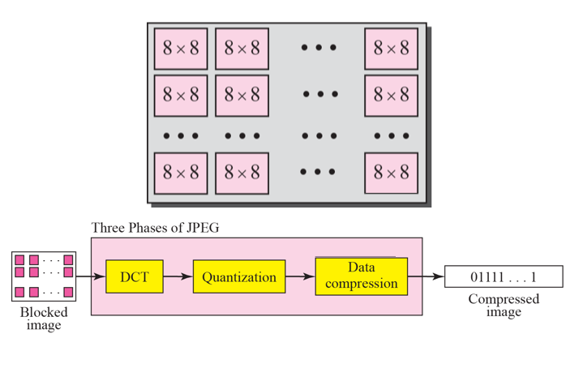
  
  - JPEG(Joint Photograph Expert Group) : 사진 압축 전문가 그룹
    - 사진을 8 byte pixel 로 쪼개 놓고, block 화를 시킴. 
    - 8 by 8 matrix가 기본 단위이다. 
    - 이런 block들을 어떻게든 압축시켜서, 여러 과정들을 거친다.
      - DCT
      - QUantization : 우리가 알아 볼 수 있는 레벨로 양자화(계량화)시킨다
      - Data compression : 필요 없는 애들이나 중복적인 애들을 줄이거나 빼서 압축한다. 
    
    - 받는 애들도, 똑같은 과정을 거꾸로 해서 복원시키는 것이다. 
    
  - 사진 압축 예시
  
  - 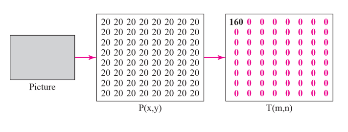
  
    - 사진 내용이 별거없고 다 내용이 똑같음
    - 다 20(같은 숫자)는 압축하기 편하다. 
    - 변화가 많을 수록 압축이 복잡해짐.
    - 중복되거나 불필요한 것들은 뺀다. 
  
  - 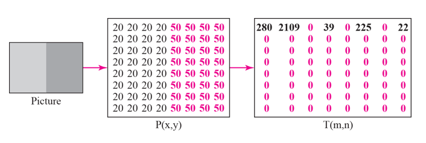
    
    - 이것은 위의 사진보다는 약간 복잡한 애다.
    - 완전 color 면 압축해도 어느 정도 용량이 필요함.
    - 변화가 심할수록 용량이 많이 필요하다. 
    
  - 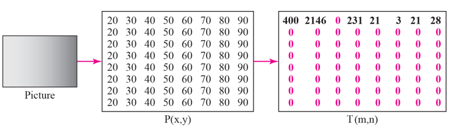
    
    - 오른쪽으로 갈수록 점점 검정색이 되는 사진

  - 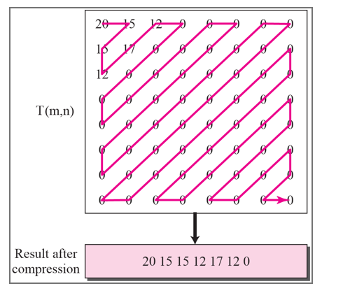
  
    - 읽을 때는 지그재그로 읽어 나간다.
    - 숫자를 다시 원본으로 보여 주는데, 이런 작업을 양 끝단에서 한다고 한다. 
  
  - JPEG 정리
    - 사진 하나를 어떻게 압축해서 보내는가
    
  - MPEG(Moving Picture Expert Group) 
    - 동영상 압축. 기본단위 : image
    - image를 1초에 24~30개를 play 시키면 그것이 동영상이 되는 것이다. 
    - 동영상도 결국 이미지 압축이다!
    - 이미지 압축은 JPEG 사용하면 되고, MPEC은 거기서 뭔가를 더한다. 
    - JPEG을 압축한 것을 iframe 이라고 함.
    
    - 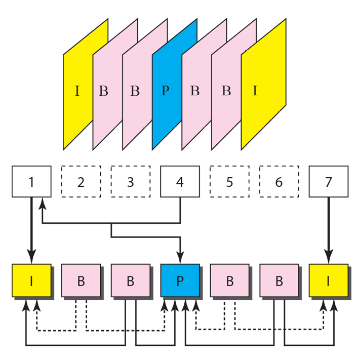
    
      - 이미지끼리의 압축은 시간차들을 비교해서 압축한다. 
      - I frame : 그대로 JPEG 으로 압축함
      - B frame : Bidirection. 양쪽의 frame을 보고 차이를 보고 넣는 것. 
      - P frame : Predictive frame(예측 프레임). 예측해서 집어넣을 수 있다. 
      - 이런 식으로 줄여서, 최대한 같은 것들을 안쓰면서 압축함. 
      - 프레임 간, 이미지 간의 압축을 더한 것이 MPEG 이다.
    

### STREAMING STORED AUDIO/VIDEO

+ 드라마 다운받을 때 어떤 방식으로 하나?
  - Web Server를 이용한 다운로드 
  - Web Server에 Metafile을 별도로 다운로드
  - Media Server를 별도로 구축하고, 그것을 이용한 다운로드 
  
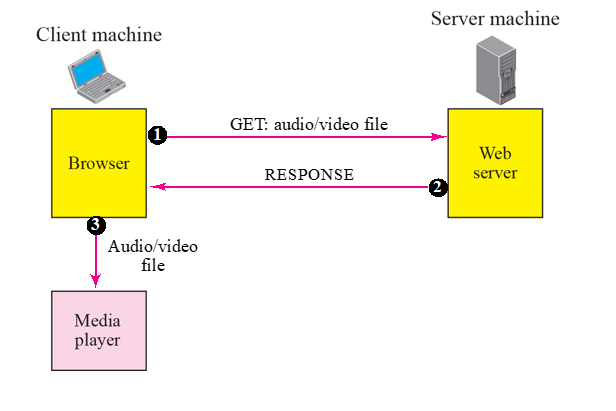  
  
+ Web Server를 이용한 다운로드 
  - 홈페이지에 접속하면, 응답에다가 비디오 파일을 통째로 던져준다. 
  - 그것을 갖고 와서 Media Player에다가 플레이시킨다. 
  - 홈페이지에 미디어가 통째로 포함되어 있다 보니, 홈페이지 로딩이 상당히 늦어진다. 
    - 1GB 짜리를 다운받으면 그것때문에 홈페이지가 통째로 느려진다는 단점이 있다. 
  
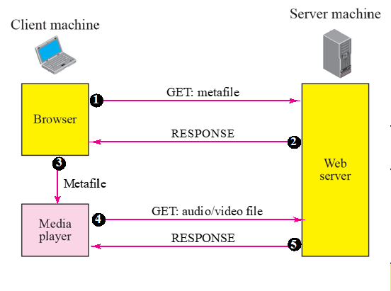  

+ Web Server + Metafile 을 이용한 다운로드 
  - 단순히 서버에서 Metafile(이름 + 목록) 만 다운로드 받아서 처리함. 
  - 해당 부분을 누르면, 그때 audio/video file 이 다운로드 받아 진다. 
  - web 과 media가 분리되었음.
  
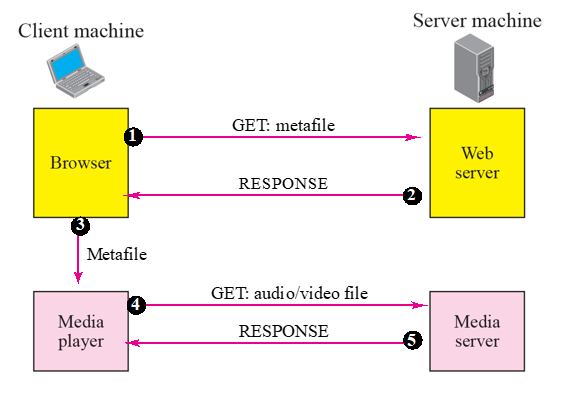    

+ Web Server와 Media Server를 분리
  - 홈페이지와 미디어 주는 애들을 따로 분리하자!

+ Media Server에 RTSP(Real Time Streaming Protocol) 을 사용하는 방법
  - Streaming 전용으로 Protocol 이 표준화되어 나왔다. 
  - RTSP를 사용해 효율적으로 할 수 있다.

### STREAMING LIVE AUDIO/VIDEO

+ 여기서부터는 TCP가 잘 먹혀들지 않는다. (시간 내에 와야 한다)

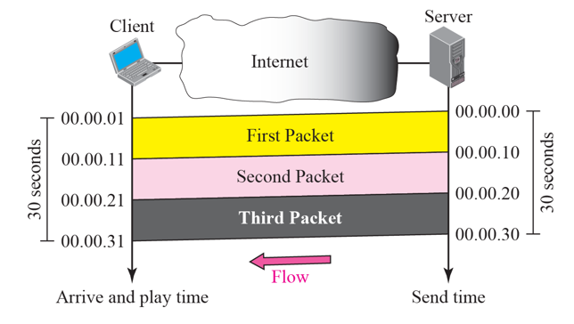 

+ Real Time Interactive Audio/Video
  - 스포츠 중계나 줌 같은 서비스들에 이용된다.
  - Transmitter Delay : 얼마나 딜레이되는가?
    - 보낸 시간과 받은 시간이 일정하게 같으면 다행인데, 문제는 아래 그림과 같이 보낸 시간과 받는 시간의 딜레이가 일정치 않고 틀어지면 문제가 생긴다. 
    
  - 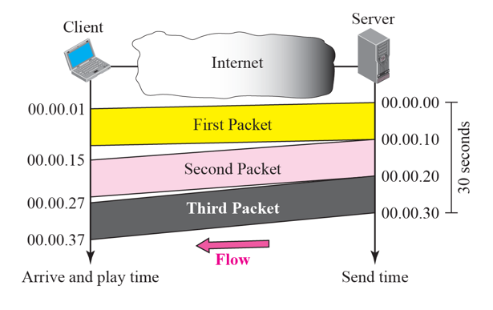 
    
  - Delay Variation : 어떤건 빨리 가고, 어떤것은 늦게 오는 것을 말함. 
  - Delay Variation 을 보고 Jitter 라고 부른다(Delay 간의 편차)
    - Jitter : Packet 사이의 Delay 때문에 발생함. 
    - 그대로 계속 보면 끊기게 사용자가 보게 됨. 
    - 이것을 해결하기 위해 버퍼링이라는 시스템이 생겼다. 미리 저장해 놓으면 끊김없이 볼 수 있다. 
    - 버퍼링을 어느 정도(30초) 시켜놓고 플레이를 하면, 끊기지 않고 본다. 
    - Playback(사용자에게 보여줄때의) Buffer는 real-time traffic에 꼭 필요하다!
    
  - Jitter를 예방하는 다른 방법 : Timestamp
    - 이 패킷이 언제 보내진 것인지 다 알려줘서, 플레이어가 참고할 수 있도록 만든 것.

  - Sequence Number도 real-time traffic에 필요하다
    - 패킷들이 도착했을 때 Sequence 정보, Timing 정보가 들어가서, 얘는 언제 보는 것이며 몇 번째로 보는 것인지 등의 정보가 필요하다. 
 
  - 멀티캐스팅이 real-time에 필요하다.  
  - Audio/Video 를 합치는 것을 Mixing 이라고 하는데, 이런 기술들도 필요하다. 
  - TCP는 이런 곳에서 맞지 않기는 함. (실시간에서 에러복구 해봤자 필요없다)
    - 이런 경우 UDP가 TCP보다 낫다!
    - 하지만, Sequence, Timing을 붙여줄 필요가 있는데, 이런 것들을 지원하려고 나온 것이 RTP(Real Time Protocol) 이다. 
    
### RTP

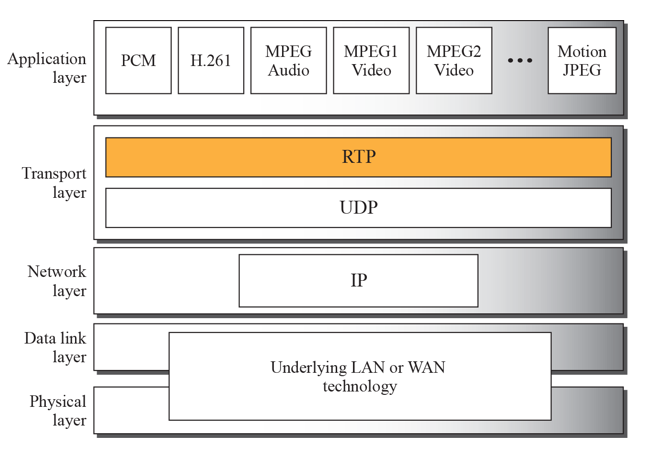

+ RTP는 UDP 위에 올라가는데, Transport 목적이라고 함. 
  - 계층으로 치면 UDP 위에 들어간다. 
  - RTP 위에 올라오는 응용 타입들을 코드와시켜서 Type 별로 구분함. 

+ RTP는 Well-Known Port를 사용하는 것은 아니고, 보통 Local Port를 사용하는데, 짝수 번호를 사용함. 
  - 홀수 번호는 RTCP에서 사용된다. 
  
### RTCP

+ RTP만 사용하기에는 불안하다. 
  - 잘 가는 것 같은데, 확인할 수가 없었다. 
  - 그래서 나온 것이 RTCP 이다. (Control 기능을 보완함)
  - RTP는 보내는 정보를 주로 담당하고, RTCP는 Control 정보(잘 가고있는지 Feedback 정보) 를 주로 담당함.

+ RTCP Message Types
  - 마치 ICMP와 비슷함
  - Sender Report : 200
  - Receiver Report : 201
  - Source Description Message : 202
  - Bye Message : 203
  - Application Specifit Message : 204

+ RTCP는 RTP 다음 Port 번호인 홀수 번호를 사용한다. (RTP Port 번호 + 1)
  - RTP / RTCP는 쌍으로 움직인다

### VOICE OVER IP

+ RTP/RTCP의 대표적인 예시이다. 
+ 이런 인터넷전화에 이용되는 것이 SIP, H.323 이 있다.

+ SIP
  - 2000년 초반에 개발됨
  - INVITE, ACK, BYE 등 메세지가 잇다. 
  - 인터넷 전화 할 때 signal 로 둘 사이의 길을 뚧는 역할을 했다. 
  - 실제 데이터 전송을 UTP, RTP를 사용했다. SIP는 전 단계

+ H.323 
  - SIP와 거의 유사하게 나왔는데, 각각 다른 곳에서 표준으로 사용된다. 
  
### QUALITY OF SERVICE

+ 줄여서 QoS라고 많이 부른다. 
+ 인터넷이 ATM 에 비해 안좋은 점이 몇개 있음
  - 인터넷이 더 좋았던 점 : 개방성
  - 인터넷이 더 나빴던 점 : 보안, 퀄리티(지금은 추월함)
  - 그래서 QoS(서비스 품질)라는 것이 추가로 나왔다. 

+ QoS를 어떻게 하면 높일까 하여, 2000년 초반부터 10년 동안 한참 연구대상이었고, 관련된 표준이 개발됨.

### INTERGRATED SERVICES

+ Intergrated Service 는 flow-based QoS 모델
  - 보내는 컴퓨터와 받는 컴퓨터 사이에 Path가 가면서 길을 뚫어놓는 방식
    - Router 들이 해당 메세지를 받으면 길을 터주라는 방식
    - 이렇게 자원을 확보하는 것(Signaling 과 비슷)
    
+ 너무 많이 허용해 줄 수 없음
  - Backbone 망 가면 못쓴다. 작은 단위로 할 때만 할 수 있다. 
  
### DIFFERENTIATED SERVICES

+ Backbone 망에서는 자원 예약은 어림도 없고, Class 정보만 구별해주자! 해서 나오는 것.
  - 프리미엄, 그냥 클래스 이런식
  - 중요한 것은 마크 한번 찍어준다는 식.
      
