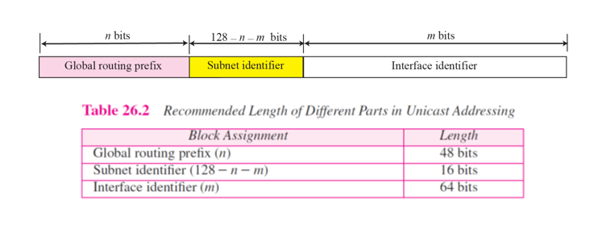

# Chapter 26. IPv6 Addressing

+ IPv6 Address는 32 bit가 아닌 128bit 짜리 Address이다.
+ 32 bit로 하면 다 해봐야 48억개인데, 인구는 지금 70억 가까이 된다. 
  - 문제를 해결하려고 나온 것이 IPv6 이다. 

+ Colon Hexadecimal Notation 
  - 16진수로, 4bit 씩 4개씩 자르고, Colon 붙여서 구별함

+ Zero Compression 
  - 0 부분을 다 Compression 해서 압축한다 
  - ex) FDEC:0:0:0:0:BBFF:0:FFFF -> FDEC::BBFF:0:FFFF
    - 0 부분이 :: 로 다 압축되었다. 
    - :: 사이에 0이 다 있다는 것. 
  - 연달아 있는 colon은 반드시 한 쪽만 있으면 안된다. 
    - 연달아 있는 colon 이 두개 있으면 어디에 다 128bit 에 맞게 채울 수 없다. 
    - 0 은 가급적 안쓰는 것으로 해서, 효율적으로 표기할 수 있다.
    
+ CIDR Address
  - ex) FDEC::BBFF:0:FFFF/60
  - 앞부분 60bit가 Network Prefix 라는 의미(슬래시 뒤 60)
    - Routing 할때 앞 60bit만 보면 되는 의미
    
  - 당연히 prefix length는 128bit 까지 가능하다. 
  
+ 압축 예시
  - 0000:0000:0000:0000:FFFF:FFFF:FFFF:FFFF -> ::FFFF:FFFF:FFFF:FFFF
  - 0000:0000:0000:0000:0000:0000:0000:0000 -> ::
  - FFFF:FFFF:FFFF:FFFF:FFFF:FFFF:FFFF:FFFF -> 압축해도 똑같다 
  - AAAA:AAAA:AAAA:AAAA:AAAA:AAAA:AAAA:AAAA -> 압축해도 똑같다. 

+ 맨 끝부분에 Version 4 Address가 오기도 한다
  - Version 6와 Version 4가 혼재되어 있기 때문에, 맨 끝부분에 Version 4가 오기도 하게 만들었다.

+ 푸는 예시
  - 1111::2222 -> 1111:0000:0000:0000:0000:0000:0000:2222
  - :: -> 0000:0000:0000:0000:0000:0000:0000:0000
  - 0:1:: -> 0000:0001:0000:0000:0000:0000:0000:0000
    - 1이라고 그냥 되어있으면 0001 이다
  - AAAA:A:AA::1234 -> AAAA:000A:00AA:0000:0000:0000:0000:1234  
  
### ADDRESS SPACE ALLOCATION

+ 128bit를 8분의 1씩 쪼개어 보는 것
+ 왼쪽 오른쪽은 Reserved 나 특별 Address
+ 2번째 block이 Global Unicast 이다. 
+ 나머지는 안쓰고 있다. 안써도 충분히 남아돈다. 
  - 주소 Range가 엄청나고, 이중에 일부만 할당을 해 놓았다. 
  
  

+ 앞의 1/8
  - A 부분 : Version 4와 혼재된 망에 쓸 때 사용
+ Link Local, Unique Local, Multicast 등 특수한 목적으로 사용하는 Address 도 존재한다. 
+ 2번째 block 에서 001 (16진수 환산시 2 이상) 로 시작하는 것이 Global Unicast
  - 0011 이었다면 3, 그래서 앞 숫자가 2나 3으로 시작하면, 현재 할당된 Global Unicast Address라는 의미.

+ 나머지 주소들은 모두 Reserved(남겨짐, 다 쓸데가 없음)
+ 위쪽 아래쪽이 Special Address로 남겨짐

+ Unspecified Address(All 0)
  - 버전 4에서도 0.0.0.0 이면 주소가 없는 것이었음.
  - All 0을 표시하려고 하면, prefix 8자리가 0, Suffix 120bit 가 다 0으로 표시된다. 
    - ::/128 이라고도 표시함. 
    - 뒤에 /128 이 있다는 것은, 128bit가 다 의미가 있다는 의미이다. (전체가 다 Network ID이다)
    
+ Loopback Address
  - Version 4의 Loopback은 127.~~~ 였다. 
  - Version 6는, 그냥 127. 이렇게 시작한 block 주는 것이 아까워서, 딱 하나의 숫자만 소비했다. 
    - 앞에 다 0이고 뒤에 하나만 1이다. 
  
  - ::1/128 으로 표기할 수 있다. 절대 도착지 Address로 사용되지 않는다(Loopback 이라서)

+ Compatible Address

  - 버전 4와 함께 통신할 때, 버전 4 Address를 버전 6에 집어넣는 방식.
  - 맨 앞 96bit는 다 0으로 채우고, 뒤 32bit를 IPv4 Address로 채워넣는 방식
  - Version 4 Compatible Address 라고 한다. 
  
+ Mapped Address
  - Compatible Address 와 비슷함
  - Version 4 Mapped 인데, 맨 뒤에 있는 것이 V4와 비슷하지만, 그 앞에 필요에 따라 16bit가 1로 오는 경우가 있다.
  - 통신 방식에 따라 조금씩 다름. 
    - 어떤 경우에는 Mapped 쓰고 어떤 경우에는 Compatlble 사용함
    
     
    
+ Unique Local Unicast Address(Site Local)
  - 만약에 경북대 도메인 사이트라면, 그 안(경북대) 에서만 사용하겠다는 의미.
  - 경북대 바깥으로 안나가고, local(지역 내) 에서만 마음대로 쓰겠다!
  - Site Local 이나 Unique Local 이라고 불림. 
  - Prefix가 위 그림처럼 세팅되어 있다면, Site Local 이라고 볼 수 있다. 
  - 바로 뒷부분에 Random Number가 들어가고, Subnet ID(16bit), Interface ID(64bit) 가 들어간다.
    - Interface ID는 MAC Address 를 토대로 집어넣게 된다. 
    - Subnet ID : IPv4와 같은 Subnet 개념
    
       
    
+ Link Local Address
  - 특정 Ethernet 안에서만 사용하는 Local Address
  - Site Local은 경북대 내부(example) 에서 사용하는 것이다 보니 Router를 몇개 지나가지만, Link Local은 Router를 지나지 않는다. 
  - Router 안에 있는 애들에서만 도는 것이다. 
    - Link가 Ethernet Cable 임. 
    - Prefix가 정해져 있음(16진수로 변환하면 F280)
      - F280 으로 시작하는 주소로, LAN 안에 있는 애들끼리 통신할 수 있다. 
    
    - 맨 뒤 Interface ID가 들어가고, MAC 주소를 포함하고 있다. 
      - Version 6에는 MAC 주소를 포함하고 있어서, MAC 주소로 식별할 수 있다.(Interface ID에)
      
+ Multicast Address
  - Version 4에서는 Class D 였는데, Version 6에서는 맨 앞이 다 1인것(FF로 시작하는 것) 으로 시작한다. FF로 시작하면 다 Multicast 주소임.
  - 주소 갯수는 나머지가 15byte(120bit) 가 남는다. 2^120 개 만큼의 IP 주소가 있는 것임. 
  
### GLOBAL UNICAST ADDRESSES

 

+ 2번째 block에 할당된 부분
+ 보통 미국 인터넷 기구가 할당해 두었다. 
  - 16진수가 2나 3인 것이 Global Addresses
  - 앞에 Prefix가 정해져 있다. 
  - Interface ID는 할당하지 않는다(MAC 주소를 끌어온다)
  - 앞에 24bit를 주소 할당함. 
  - 보통은 앞 48bit를 network 할당하고, Subnet ID는 그 안에서 쪼개지는 것이다. 
  - 보통 표준적으로 48bit 단위로 각 기관에 할당해 주고, 맨 뒤 24bit는 MAC 주소 집어넣고, 중간 16bit는 기관 내에서 알아서 Subnet ID로 사용함
  - 이렇게 하면, 지구상 network block을 할당받을 수 있는 기관의 숫자만 2^48 개이다. 
  
  
+ Interface ID

    
