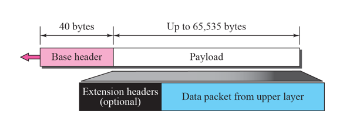
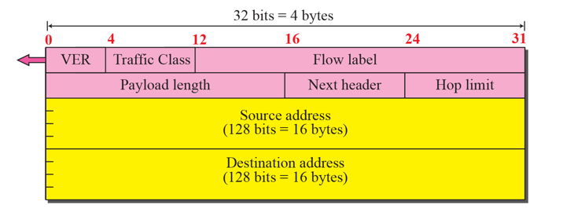
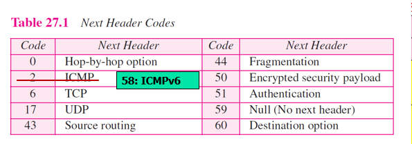
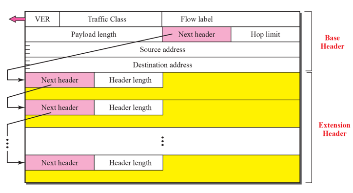

# Chapter 27. IPv6 Protocol

### PACKET FORMAT

+ IPv6 Datagram
  - Base Header Size : 40byte
    - V4는 20byte 에 옵션이 있어서 60byte까지 늘어날 수 있었음
    - v6에서는 40byte 고정. 하지만, Payload 에 Extension Header가 존재한다. 
    - Extension Header가 v4 에서의 Option 과 같은 비슷한 역할을 한다. 
  
  - Extension Header 뒤에는 Data가 온다. 

+ Format of the Base Header
  - 한 줄의 크기가 4byte(32bit)
  - VER(4bit) : 4라고 적혀 있으면 V4, 6이라고 적혀 있으면 V6
    - 버전정보가 15까지 올 수 있다. 
    
  - Traffic Class(8bit) : V4의 Type of Service 와 같은 개념
    - Type of Class가 V6에서는 이름으로 바뀌었다. 
    - 일반 사람들이 Traffic Class에 관해 쓸일은 거의 없고, Backbone 망에서 Deep Server 다룰 때 들어감. 
  
  - Flow Label(20bit) : 
    - 의도 : Flow가 Socket 과 비슷해서, 송수신자 간의 Port 로 정의되기도 함
    - Rule : 이 컴퓨터와, 멀리 있는 어떤 컴퓨터가 Flow가 연결되어 Flow-Control 하기 위해서 만들어짐.
    - Traffic Class는 Flow Label은 아니다. 그냥 Packet 단위로 중요한 패킷인지 아닌지 정도 판단할 수 있음
    - Flow Label 은 Backbone 망 뿐 아니라, End to End Control 해보려고 했지만 별로 잘 안쓰이고 있음

  - Payload Length(16bit) : Version 4에서의 Total Length
    - V4와의 차이점 : Header는 빼고 Data 부분의 Length를 표기한 것
    - 어차피 40byte로 base header 길이가 정해져 있으니 빼도 된다. 
    - 어디까지 읽어들일지 감을 잡게 해주는 애.
  
  - Next Header(8bit) : Base Header 뒤에 Next Header가 올 수 있는데, 그 Extension Header의 번호가 들어간다. 
    - 뒤에 Next Header가 오지 않으면 바로 TCP가 오든 뭘 오든 할 것이다.
    - 원래 V4에서는 Protocol ID가 이 자리에 들어왔었다.(대응된다)
    
  - Hop Limit(8bit)
    - V4 Header의 TTL 
    - 정확하게 Hop Limit라고 이름을 바꾼 모습이다. 
    - 패킷이 살아서 건너갈 수 있는 router 갯수
    
  - Source Address/Destination Address(16bytes, 128bit)
  
  - v6로 넘어오면서 없어진 것 : Checksum 등
  - 안쓰는 것을 없애버리고, 진짜 많이 쓸 것 같은 것들을 넣어 두었다. (40byte 내에)
  
  
  
+ Next Header Codes
  - v4의 Protocol + Option 일부를 넣어 두었다. 
  - Fragmentation 도 Extension Header 내에 넣어 두었다. 
  - 보안 관련된 Protocol 이 Extension Header 으로 낮춰서 넣어졌다. 별도의 TCP처럼 Protocol Level은 아니라고 판단되었다고 한다. 
  - 0번, 60번은 v4에서 없던 것이고, 나머지는 기존 v4에서 당겨온것.
    - Hop by Hop Option(0번) : 패킷 보낼 때, router마다 처리해 달라는 Option
    - Destination(60번) : Router 마다 처리하지 말고, 목적지에 도달해서 마지막 수신 Host(목적지 Host)가 이 작업을 처리하라는 의미
    
     
    
+ Extension Header Format
  - Next Header 오고, Payload가 쭉 오는 식
