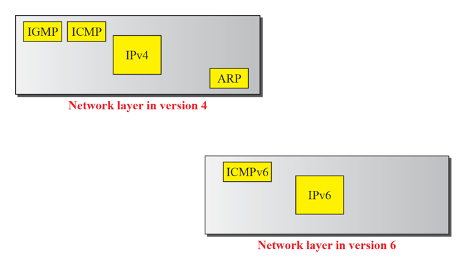

# Chapter 28. ICMPv6

+ ICMPv4 에서는 IP 위에 IGMP, ICMP, 아래에 ARP 가 있었는데, version 6로 넘어오면서 IGMP, ICMP, ARP를 하나로 합침.
+ ICMPv6 = IGMP + ICMP + ARP

+ ICMPv6 Msg의 종류
  - Error Message
  - Informational Message(v4에서의 Query)
  - Neighbor discovery Message(ND Protocol)(v4에서의 ARP)
    - ARP라는 것은 해당 IP 쓰는 애의 MAC주소가 무엇인지 팡가하는 것이었다.
    - Neighbor Discovery Protocol 도 마찬가지고, 주변에 있는 애들이 무엇인지 파악하는 Protocol 이다.(굳이 Address 따질 것 없이)
  - Group Membership Message(MLD Protocol)(v4에서의 IGMP)
    - IGMP : Multicast 할 때, Multicast Router로 하여금 해당 사실을 인지시킨 것 
    - 이름이 MLD(Multicast Listener Discovery) 로 바뀌었다. (Multicast 듣고 있는 애를 파악하겠다는 의미)

### ERROR MESSAGE

+ Error-reporting Message
  - Destination Unreachable
  - Time Exceeded
  - Parameter Problems
  - Packet Too Big(새로 들어온애)
  
### INFORMATIONAL MESSAGE

+ Query에 해당되는 것
  - Echo Request
  - Echo Reply

### NEIGHBOR-DISCOVERY MESSAGE(ND)

+ ARP 에 해당하는 애
+ LAN 안에서 MAC, IP를 얻어오는 것이었음
+ ND : IP 주소를 던져서 MAC을 얻어오는 작업( ARP 와 같음 )
+ Reverse ND : 거꾸로 MAC 주소를 던져서 IP를 얻어오는 작업 ( Reverse ARP와 같음)

+ Router Solicitation Msg, Router Advertisement Msg 가 ICMPv6에 나오는데, 이미 v4에 다 있는 내용
  - Router와 Host끼리 주소 갈구하고 가르쳐주는 것. 
  - 서로 주기적으로 주소를 주고받는다.
  
+ Neighbor Solicitation Msg, Neighbor Advertisement Msg
  - Router-Host 사이에만 주고받는 것이 아닌, Host 끼리도 주고받을 수 있다. 

+ Redirection Msg
