# Chapter 29. Cryptography and Network Security

+ 정보는 공격응로부터 보호받아야 함
  - 인증되지 않은 접근으로부터 숨겨져야 함. 
  - 인증받지 않는 변경으로부터 보호받아야 함
  - 필요할 경우 사용자 인증을 받아야 함

+ Availability  : 이용가능성 
  - 얼마나 이용 가능한가?
  - 24시간 중에 안되는 시간은 몇시간정도인가?

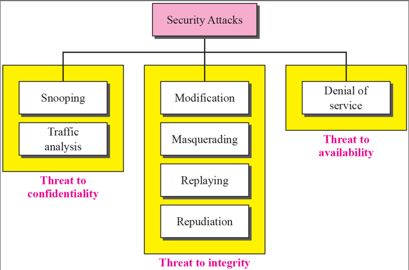

+ Security Attacks

  - 3가지 유형이 있다. 

  - Snooping : 네트워크 상에서 남의 정보를 염탐하여 가로채는 것
  - Traffic Analysis : 트래픽 흐름을 관찰하여 정보를 추측하는 것

  - Modification : 변조
  - Masquerading : 위조
  - Replaying : 다시보기?
  - Repudiation : 부인(받았는데 안 받았다고 발뺌하는 것)

  - Denial of Service(DoS) : 서버 다운시키는 것(해커들이 주로 이용)

 ### TRADITIONAL CIPHERS(암호기법)
 
 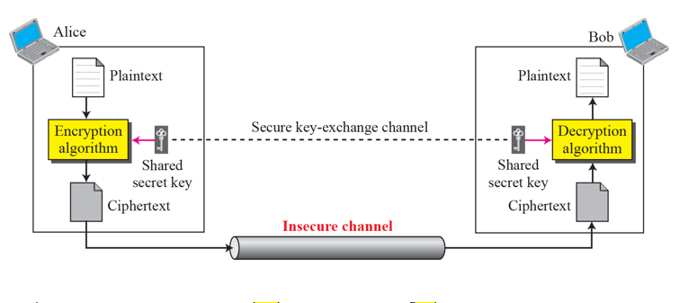
 
 + 일반적인 원리 
  - 암호화/복호화
  - secure key를 공유하여, 암호화와 복호화한다. 
  - Ciphertext : 암호문
  - PlainText : 평문
  - 암호화시켜서 보내면, 중간에 봐도 무슨 말인지 모른다.

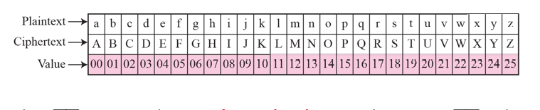

+ Substitution Cipher (문자 대체)는 한 글자를 다른 식으로 바꿔주는 것을 말한다
+ 위 그림에서 key는 modulo는 26이다. 

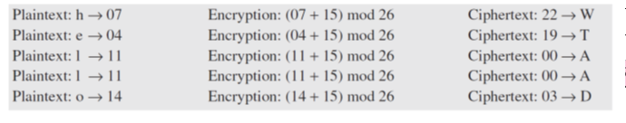

+ "hello"를 key 15로 additive cipher 해보자
+ 온 "WTAAD"를 복원 해보자. key = 15

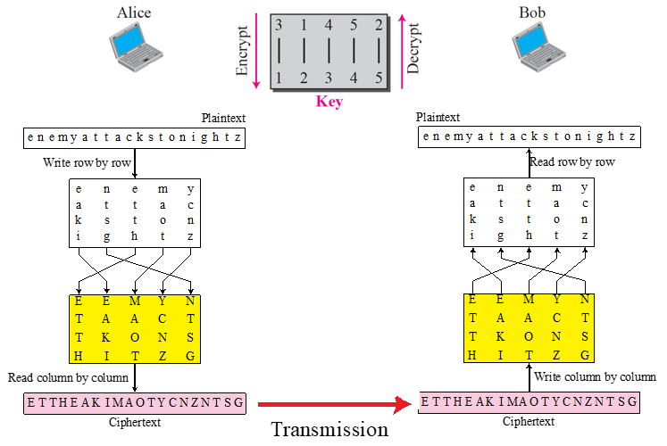

+ Transposition Cipher(위치를 바꾸는 암호)

### MODERN CIPHERS

+ 어지간한 컴퓨터로 복원시키려고 해도 안되는 암호들이 나온다. 

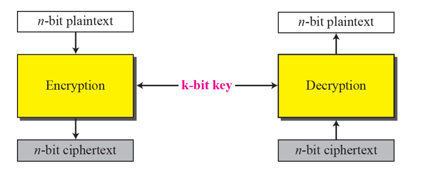

+ Modern Block Cipher
  - 문자 단위로 하는 것이 아니라, block 단위로 한다. 
  - 값도 k-bit 단위로 되어 있음. 
  - 돌리면, 완전히 알아볼 수도 없는 애로 나온다. 
  - 옛날 것과 원리는 같지만, 기본 단위가 달라졌다. 

+ 이래저래 꼬아서, 100년 안에 안풀리는 암호를 만든다

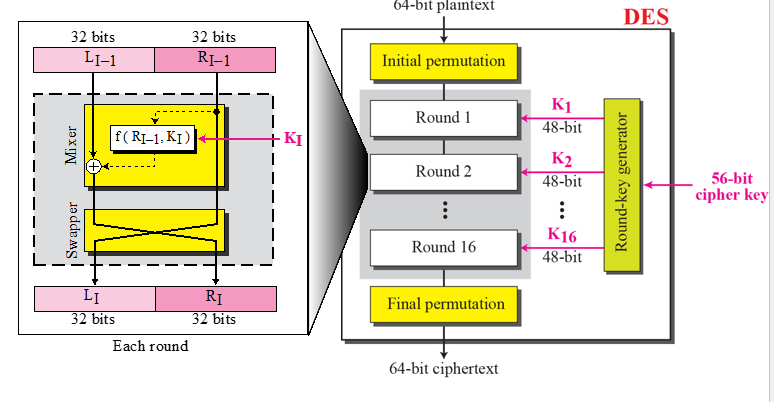

+ DES(Data Encryption Standard)
  - 왼쪽 오른쪽 64 bit 가 있고, 섞을 함수가 존재함. 
  - input 이 들어가면, 작업을 하고, 결과를 swapping 하게 됨. 
  - 이런 작업을 한번만 하는것이 아니라 몇번씩 돌려서 추론 불가능하게 한다. 
  - key 값도 48bit가 고정된 것이 아니라, 56bit에서 48bit를 뽑아내는 방식으로 진행한다.
  - 이런것도 못 해킹한다. 
  - 키를 봐도 추론 불가능함.

  - key가 하나만 바뀌어도 암호문이 확 바뀐다. 

### ASYMMETRIC-KEY CIPHERS

+ 지금까지는 Symmetric-key(대칭키)로 암호화를 진행했다면, 이 파트부터는 비대칭 키를 사용하여 암호화를 진행한다. 
  - 대칭키 암호화를 보고 "Sharing Secrecy"(공유하는 암호화) 라고 함
  - 비대칭키 암호화를 보고 "Personal Secrecy"(개인적인 암호화) 라고 함. 
  - 대칭키 암호화에서는, 글자들이 재배치되거나 교체되는 식이었다면, 비대칭키 암호화에서는 숫자를 가지고 문자를 조작함

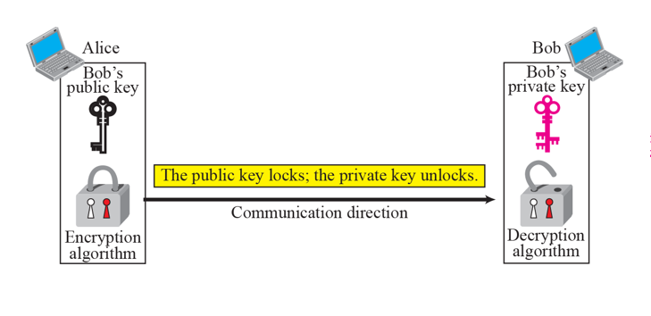

+ key가 public/private 두개로 나뉘어 진행된다. 
  - private 키는 주인만 갖고 있고, public key는 공개된다. 
  - 공개키로 암호화하고 개인키로 복호화 해도 원본이 나온다. 
  - public key 방식의 특성이기도 하다. 

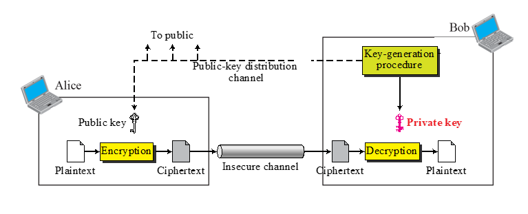

+ Asymmetric Key의 일반적인 아이디어
  - Bob이 public key를 공개하면, Alice가 public key로 암호화함.
  - 풀 때는 private key로 복호화하면, 원본이 나온다. 
  - 대표적인 방식이 RSA 암호화
  
    - 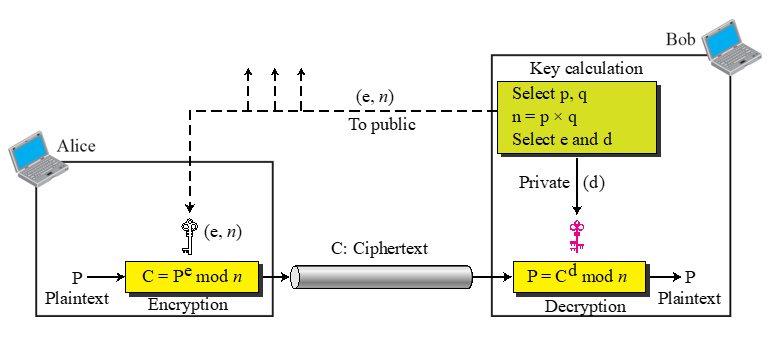
    
    - 큰 숫자인 소수 p,q를 고른 다음, 곱함
    - e 와 d를 고름. 그리고 n을 고른 다음 public key로 뿌린다. 
    - 그다음에 연산을 통해서 Plain Text P 에다 e 제곱 이후 n으로 modular 연산 한다. 
    - 그 결과인 C가 넘어와서 d 제곱을 하고 n 으로 나눠주면 P가 다시 나온다. 
    - 이것이 기본적인 비대칭 키 방식이다 .

+ RSA 키를 이용한 암호화 복호화 예시

  - 평문이 5/ 7,11이 p,q, 그래서 n은 p*q = 77 / e는 13, 그래서 d는 37
  - 풀면은 원본이 나오는 식이라고 한다
  - 실제는 대단히 숫자가 크다. 

+ 정리 
  - 대칭키는 키는 같고, 알고리즘만 방법에 따라 조금씩 다르다 
  - 암호화/복호화가 거꾸로 간다. 대신 둘만 알아야 함. 
  - 비대칭키는 공용키,개인키 가 있고, 공용키는 그냥 인터넷에 뿌리고, 개인키는 나만 가지고 있음.
  - 비대칭키 방식은 컴퓨터가 돌리는 방식이다 .

### MESSAGE INTEGRITY

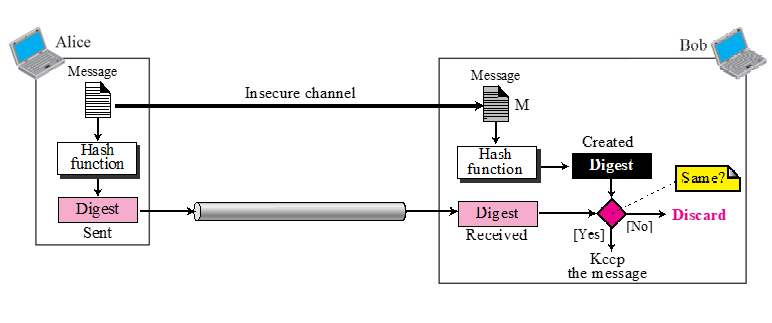

+ 메세지가 오다가 변동될 수 있다. 만약에 메세지가 바뀌지 않았다는 것을 증명하려면 어떻게 해야 하는가?
  - Message Digest(Change로 부터 안전성을 보장한다)(무결성)
  - Alice가 Text file 이 있어 보내려고 하는데, 중간에 안바뀌었다는 것을 증명해야  함. 
  - 1. Hash 함수를 사용해서 Digest(요약본)를 뽑아낸다
  - 2. 보낼 때 메세지도 보내고, 요약본도 보낸다. 
  - 3. 받는 애는, 거꾸로 받은 메세지에 똑같은 Hash 함수를 역순으로 써서 복호화하고 요약본과 비교한다. 
  - 이런식으로 Message Integrity를 보증한다(바뀐 애가 없는지)

### MESSAGE AUTHENTICATION

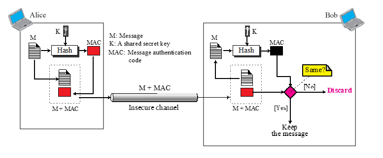

+ Authentication(인증) : 본인이 맞는지 인증하는 것
  - 원래 메세지가 있었고, key를 적용해서 hash function을 돌린다. 
  - 무결성도 검증하면서, key가 있기 때문에 암호화도 있고, integrity도 있는 식이다. 
  - 이런 과정을 거쳐서 나온 code를, 원래 메세지와 MAC 코드를 함께 비교한다. 
  - 차이점 : key 값이 들어가는 것.

  
  
  
