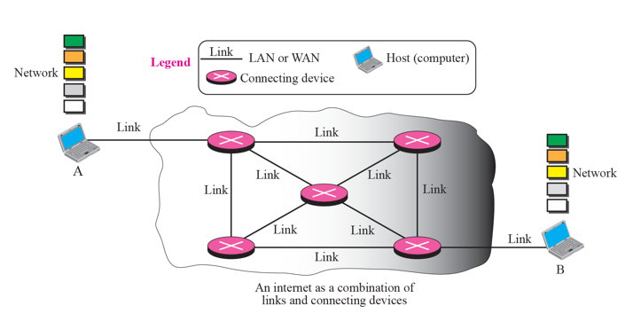

# Chapter 4. Introduction to Network Layer

### 들어가기에 앞서

#### TCP-IP vs OSI 7 Layer

+ TCP-IP 에서는, 응용 프로그램 Layer가 OSI 7 Layer에서 L5~57 이 합쳐져 있는 것이다.
+ 내부적인 일 자체는 OSI 7 Layer 가 하는 방식을 따른다.

#### Layer 1 & Layer 2

+ 내부 기술이 다 있다 
  - 이동통신망(LAN, 무선 LAN, 블루투스 등)
  - Network Type 별로 Layer 1,2 에 들어가는 기술이 다르다. 
  - 데이터 통신 시간에 주로 나오는 이야기이다. (다양한 망에 대해서 어떻게 하는지)
  - 컴퓨터망에서는 주로 Layer 3 이상을 주로 이야기한다고 한다.
    - Network Layer(IP Layer)(L3)
    - Layer 1,2가 무엇이든지 간에 인터넷 상에서 두 컴퓨터가 통신할 수 있어야 함. 

#### Layer 3

+ A, B가 Packet 을 주고받는 것이다.
  - 메세지를 쏘면, encapsulation 되어 컴퓨터를 떠나, 인터넷망에 들어감. 
  - 인터넷망에서는, 여러 개의 router를 거쳐서 목적지에 도착함.
  - 목적지에 도착하면, 올라가면서 decapsulation 되어 다시 Application Layer(L7) 까지 올라간다.

+ Layer 3가 하는 일(L3 의 Role)
  - 내가 쏜 packet 이 상대방 컴퓨터에 잘 가도록 하는 역할을 한다. 
  - 이때 쓰이는 Protocol 이 Internet Protocol(IP) 라고

#### 계속 나오는 이야기

+ IP Address 보고, 목적지가 어딘지 파악해서 보내주는 일
+ Router를 거쳐서, 도착하면 L3의 역할은 끝난다. 

### 4-1 Introduction 

+ 개념적 차원에서 글로벌 인터넷은 전 세계 수백만대(수십억대까지는 아니더라도)의 컴퓨터를 하나로 연결하는 블랙박스 네트워크라고 생각할 수 있다. 
+ 이 수준에서는 한 컴퓨터의 응용 프로그램 계층에서 보낸 메시지가 다른 컴퓨터의 응용 프로그램 계층에 도달하는 것만 신경쓴다.

+ Layer 별로 무엇을 해야 하는지를 정의해 둔 Chapter이다! 

### 4-2 Switching

+ Routing vs Switching
  - Routing은, Router를 거쳐가는 것.
  - Switching 자체는 L2 Level에서 한다. 
  - Switching : 교환
  - 가는(통행하는) 길을 바꿔준다는 의미로다가 사용된다.
  - 중간중간에 길을 바꿔줘야 한다고 하는데, 일단 뒤에서 쭉 봅시다.

+ Circuit Switching vs Packet Switching
  - 현대의 인터넷은 Packet Switching을 많이 사용한다.
  - Packet을 여러 개의 router로, 경로를 통해서 목적지까지 전달한다.
  - Packet Switching은, Packet 단위로 전달한다는 것임.
  - Circuit : 회로, 회선
  - Circuit Switching 쓰는 대표적인 사례 : 일반전화(인터넷 전화 아닌 집전화)
    - 집전화에서의 전화음이 Signal 경로설정해주는 소리라고 함.(Signaling)
    - 통신하기 전에 준비하는 단계라고 한다. 
    - 일반 전화 통신은 Circuit Switching이다. 
  
  - 이동하는 Path를 확보해 두고, 통신을 하는 것이다. 
  - 일반전화망을 전문적으로 PSTN(Public Switch Telephone Network)이라고 한다!(Circuit Switching의 대표적인 예시다.)

+ Circuit Switching 
