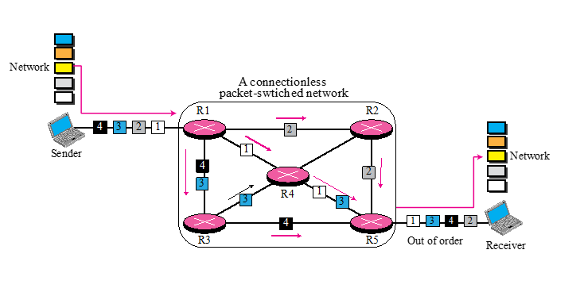
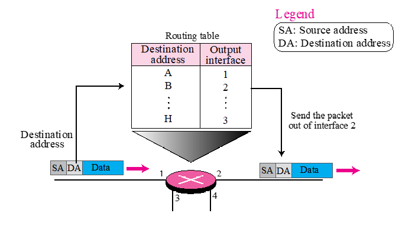
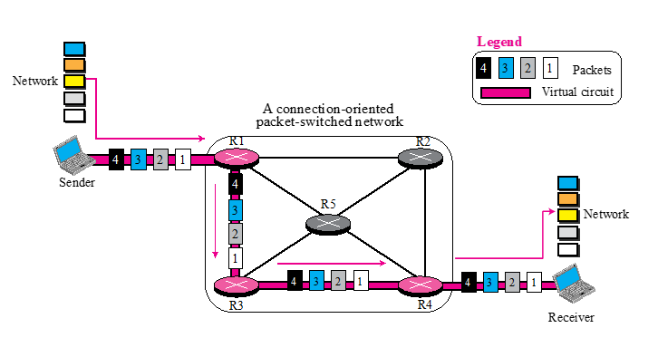
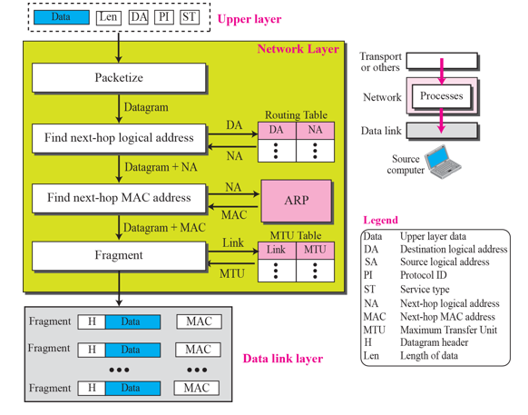

# Chapter 4. Introduction to Network Layer

### 들어가기에 앞서

#### TCP-IP vs OSI 7 Layer

+ TCP-IP 에서는, 응용 프로그램 Layer가 OSI 7 Layer에서 L5~57 이 합쳐져 있는 것이다.
+ 내부적인 일 자체는 OSI 7 Layer 가 하는 방식을 따른다.

#### Layer 1 & Layer 2

+ 내부 기술이 다 있다 
  - 이동통신망(LAN, 무선 LAN, 블루투스 등)
  - Network Type 별로 Layer 1,2 에 들어가는 기술이 다르다. 
  - 데이터 통신 시간에 주로 나오는 이야기이다. (다양한 망에 대해서 어떻게 하는지)
  - 컴퓨터망에서는 주로 Layer 3 이상을 주로 이야기한다고 한다.
    - Network Layer(IP Layer)(L3)
    - Layer 1,2가 무엇이든지 간에 인터넷 상에서 두 컴퓨터가 통신할 수 있어야 함. 

#### Layer 3

+ A, B가 Packet 을 주고받는 것이다.
  - 메세지를 쏘면, encapsulation 되어 컴퓨터를 떠나, 인터넷망에 들어감. 
  - 인터넷망에서는, 여러 개의 router를 거쳐서 목적지에 도착함.
  - 목적지에 도착하면, 올라가면서 decapsulation 되어 다시 Application Layer(L7) 까지 올라간다.

+ Layer 3가 하는 일(L3 의 Role)
  - 내가 쏜 packet 이 상대방 컴퓨터에 잘 가도록 하는 역할을 한다. 
  - 이때 쓰이는 Protocol 이 Internet Protocol(IP) 라고

#### 계속 나오는 이야기

+ IP Address 보고, 목적지가 어딘지 파악해서 보내주는 일
+ Router를 거쳐서, 도착하면 L3의 역할은 끝난다. 

### 4-1 Introduction 

+ 개념적 차원에서 글로벌 인터넷은 전 세계 수백만대(수십억대까지는 아니더라도)의 컴퓨터를 하나로 연결하는 블랙박스 네트워크라고 생각할 수 있다. 
+ 이 수준에서는 한 컴퓨터의 응용 프로그램 계층에서 보낸 메시지가 다른 컴퓨터의 응용 프로그램 계층에 도달하는 것만 신경쓴다.

+ Layer 별로 무엇을 해야 하는지를 정의해 둔 Chapter이다! 

### 4-2 Switching

+ Routing vs Switching
  - Routing은, Router를 거쳐가는 것.
  - Switching 자체는 L2 Level에서 한다. 
  - Switching : 교환
  - 가는(통행하는) 길을 바꿔준다는 의미로다가 사용된다.
  - 중간중간에 길을 바꿔줘야 한다고 하는데, 일단 뒤에서 쭉 봅시다.

+ Circuit Switching vs Packet Switching
  - 현대의 인터넷은 Packet Switching을 많이 사용한다.
  - Packet을 여러 개의 router로, 경로를 통해서 목적지까지 전달한다.
  - Packet Switching은, Packet 단위로 전달한다는 것임.
  - Circuit : 회로, 회선
  - Circuit Switching 쓰는 대표적인 사례 : 일반전화(인터넷 전화 아닌 집전화)
    - 집전화에서의 전화음이 Signal 경로설정해주는 소리라고 함.(Signaling)
    - 통신하기 전에 준비하는 단계라고 한다. 
    - 일반 전화 통신은 Circuit Switching이다. 
  
  - 이동하는 Path를 확보해 두고, 통신을 하는 것이다. 

+ Circuit Switching 
  - 전체 메세지가 시작점(source) 에서 목적지까지 쪼개지지 않고, 그대로 전달되는 기술.
  - 한 경로를 다 차지하고, 그대로 그 경로대로 전달된다.
  - ex) 일반전화망을 전문적으로 PSTN(Public Switch Telephone Network)이라고 한다!(Circuit Switching의 대표적인 예시다.)
  
+ Packet Switching
  - Packet Switching 은 쪼개진다!
  - Packet Switching에서 메세지가 처음에 쪼개져서, Packet 단위로 Shooting하는데, 목적지에 도착해서는 원본 순서대로 복구되는 식이다.
  
  - 
  
    - Packet을 쏘면, router를 지나면서 각각 Packet이 쪼개진다.
    - 그래서 위의 사진에 보이는 것처럼 order가 다르게 전달될 수 있다.
    - 각 Router에서는 Routing Table을 보고(ex : R1에서 해당 패킷을 R2로 보낼지, R3로 보낼지 등) 어느 Router로 패킷을 보낼지 결정한다(물론 거의 최단경로로 간다)
    - 물론 Routing Table에 따라 다른 곳으로 갈 수도 있다.(거의 이럴 일이 없지만, 가끔씩 중간에 Routing Table이 바뀌기도 한다)
    - Router에서는 목적지의 주소를 보고 처리하는 것은 맞다. 하지만 이론적으로는 최단경로가 아닌 다른 길로 갈 수는 있다. 
    - 어쨌든 도착하면 거의 out of order 될 각오를 해야 한다. 
    - 이때 순서를 다시 정렬해서 위쪽 layer로 올리는 일은 TCP가 함!
    - Internet Protocol(IP)는 전달하는 역할을 함!
    
   - 
   
      - 각 Router 마다 Routing Table과 목적지를 보고 어디로 보내야 할지 알 수 있는 table
   
   - Packet-Switched Network 에서, Forwarding(다음 라우터로 전달하는 것) decision은 패킷의 목적지 address를 보고 결정하는 것이다!
    - 목적지 주소를 보고, 다음 Router로 전달하다 보면, 어느 순간에 도착해 있을 것이다.
    - source address는 의외로 별로 많이 쓰이지는 않는다. 보안체크할때 정도 쓰임.

+ Virtual Circuit 
  - ATM(Asynchronous Transfer Mode) : Virtual Circuit을 사용함.
  - 완전한 Circuit은 아니고, Packet 단위로 이동하지만, 경로는 하나로 미리 지정해 통일했다.
  - 길을 미리 뚫어 놓고, 보낼때는 Packet 단위로 보낸다. 
  - Packet Switching과 Circuit Switching이 섞여 있다고 할 수 있다.
  - Circuit Switching이 한길로만 가는 Concept이고, Packet으로 쪼개는 것이니, 두 가지를 다 따온 것이라 볼 수 있다.
  - 직접 ATM 기술을 쓸 일은 없다고 한다.(KT 같은 backbone 망에서만 쓰인다.)
  - Circuit Switching과 Packet Switching의 장점을 따 온 방법이다.
  
  
### Network Layer Services

+ IP Address 를 보고 Routing 해주는 Service

    

+ 과정
  - 맨 위에 Upper Layer(Transport Layer)에서 
 

  
