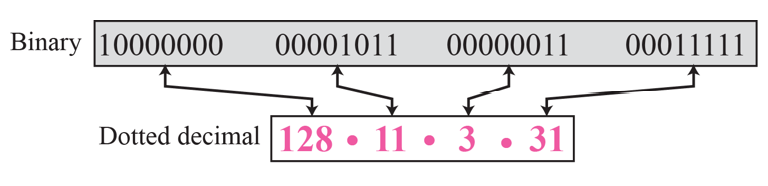
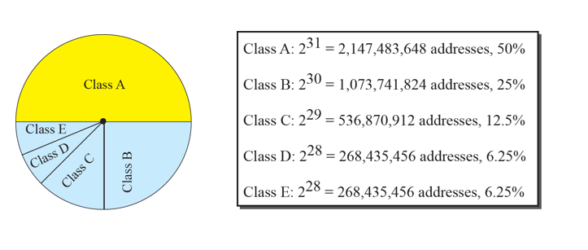
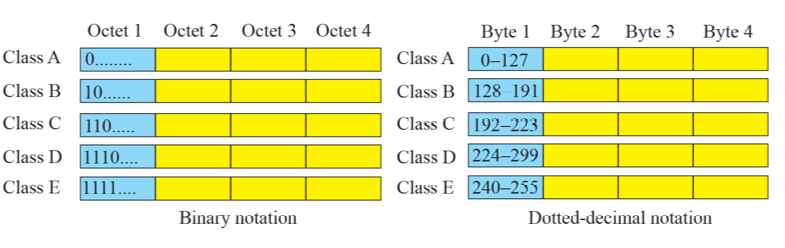
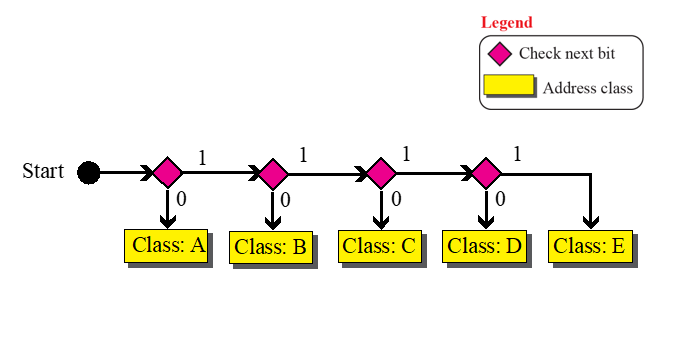

# Chapter 5. IPv4 Addresses

### Introduction

+ IP Address는 모든 컴퓨터에서 Unique하게 다 얻을 수 있어야 한다. 그래야 Global 하게 어떤 것이 어떤 컴퓨터인지 파악할 수 있다.
+ IPv4 Address는 32bit 길이의 IP 주소이다.
+ 지구상에서 IPv4로 가져갈 수 있는 IP 주소의 갯수는 대충 42억개이다.
  - 지구상의 인구는 7~80 억인데 비해, 42억개의 주소는 모자란다.

+ 1byte 하나가 10진수로 대응이 된다!(4byte의 주소에서)
  - 숫자 하나당 8 bit이다!
  - 0~255 사이의 숫자가 올 수 있다.
  - 틀린 주소 잡아낼 수 있어야 함!

### Classful Addressing

+ 지구 상의 IP 주소들을 Class A,B,C,D로 쪼개 놓았다.

+ Class A : 0으로 시작함(50%)
  - 0~127 사이의 첫 숫자
+ Class B : 10으로 시작함(25%)
  - 128~191 사이의 첫 숫자
+ Class C : 110으로 시작함(12.5%)
  - 192~223 사이의 첫 숫자
+ Class D : 1110으로 시작함(6.25%)
  - 224~299 사이의 첫 숫자
+ Class E : 1111로 시작함.(6.25%)
  - 240~255 사이의 첫 숫자
  
+ 첫 번째 숫자를 보면 어떤 Class에 속해 있는지 알 수 있다.
  

