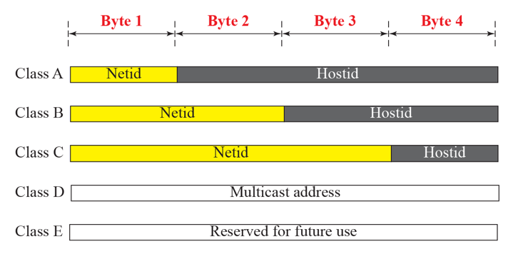
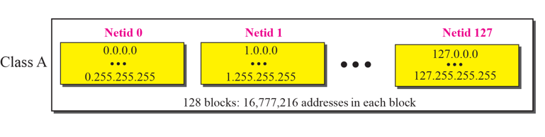
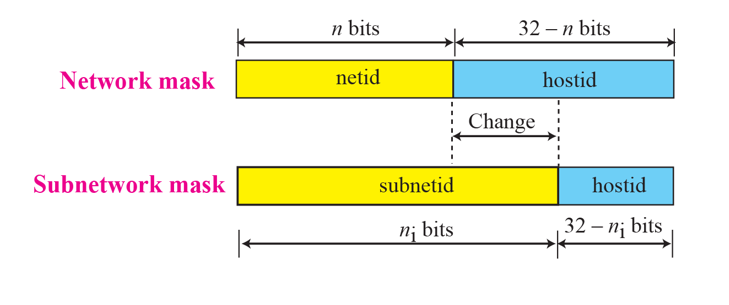
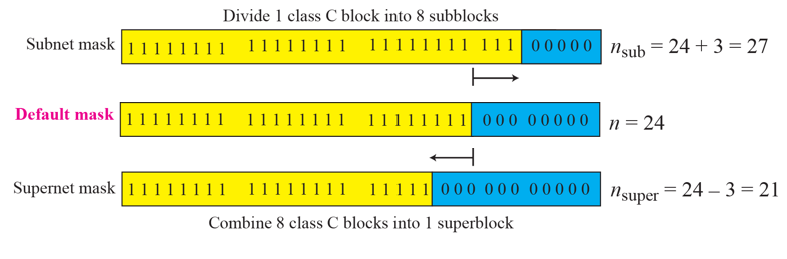
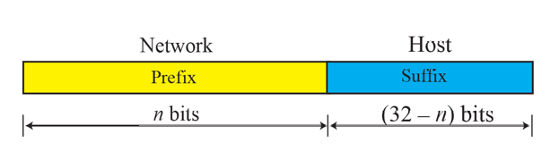
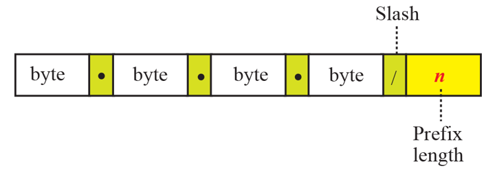
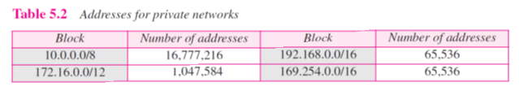

# Chapter 5. IPv4 Addresses

### Introduction

+ IP Address는 모든 컴퓨터에서 Unique하게 다 얻을 수 있어야 한다. 그래야 Global 하게 어떤 것이 어떤 컴퓨터인지 파악할 수 있다.
+ IPv4 Address는 32bit 길이의 IP 주소이다.
+ 지구상에서 IPv4로 가져갈 수 있는 IP 주소의 갯수는 대충 42억개이다.
  - 지구상의 인구는 7~80 억인데 비해, 42억개의 주소는 모자란다.

+ 1byte 하나가 10진수로 대응이 된다!(4byte의 주소에서)
  - 숫자 하나당 8 bit이다!
  - 0~255 사이의 숫자가 올 수 있다.
  - 틀린 주소 잡아낼 수 있어야 함!

### Classful Addressing

+ 지구 상의 IP 주소들을 Class A,B,C,D로 쪼개 놓았다.

+ Class A : 0으로 시작함(50%)
  - 0~127 사이의 첫 숫자
+ Class B : 10으로 시작함(25%)
  - 128~191 사이의 첫 숫자
+ Class C : 110으로 시작함(12.5%)
  - 192~223 사이의 첫 숫자
+ Class D : 1110으로 시작함(6.25%)
  - 224~299 사이의 첫 숫자
+ Class E : 1111로 시작함.(6.25%)
  - 240~255 사이의 첫 숫자
  
+ 첫 번째 숫자를 보면 어떤 Class에 속해 있는지 알 수 있다.
  

#### NetID and HostID

+ Class를 할당해 주는 곳은 인터넷 기구에서 해 준다.

+ Class A에서는, 1 byte만 net id로 고정되어 있고 나머지 3 byte는 host id
  - Class A를 할당받은 기관에서 사용할 수 있는 IP는 2^24 개이다.
  - 
  - Network ID 0번부터 127번 중 하나를 할당받아 사용한다
  - 전 세계에서 Class A를 할당받을 수 있는 기관은 120개 정도밖에 없다.  
  - 한번 Class A 대의 Network를 할당받으면, 대단히 풍성하다. 
  - Class A를 사용하는 기관들은 다 미국에 있다. 
  - Class A를 다 쓰지 못하고 있는 상태이고, 대부분의 IP 주소가 남아도는 상태이다.

+ Class B에서는, 2 byte를 ned id로 고정하고, 나머지 2 byte(16bit)를 host id로 사용한다.
  - 경북대가 Class B를 할당받아 사용중이다. (국립대라 그렇다고 한다)
  - 2^16 개(65536 개) 를 host id로 사용할 수 있다.
  - 아직까지는 대단히 풍부한 IP 갯수를 할당받은 것이다.
  - Class B 역시, 다 쓰지 못하고 남아도는 상황이다.(경북대 인원 해봐야 2만명임)

+ Class C에서는, 3 byte를 ned id로 고정하고, 나머지 1byte를 host id로 사용한다.
  - 256개 정도의 IP밖에 사용하지 못한다. 
  - Class C를 할당받을 때는, Block으로 Class C를 여러 개 할당받아 사용한다.(SuperNetting)
  - Class C부터는, IP가 대단히 부족한 상황이다.
  
+ Class D에서는, Multicast Address로, 컴퓨터에 할당하는 것이 아닌 임시적으로 Group 간의 통신에 할당받아 사용하고 반환하는 클래스이다.

+ Class E는 백업용으로 사용한다.

+ Classless Addressing : Class 별로 나누는 것이 안좋은거 알아서, 2000년대부터는 Classless로 사용했다. (뒤에 다시 나옴)

+ Network ID, Host ID
  - Network ID : Network Address 부분을 이야기함. 네트워크 식별자 역할을 함.
  - 경북대 IP 주소가 155.230으로 시작하는데, 해당 두 숫자가 경북대 IP Address라는 것을 전 세계가 다 알고 있다.
  - 일단 155.230 자체를 경북대 Router로 보내는 것이 중요하고, 다른 곳에서는 그 뒤의 숫자에 관심가질 필요 없다. 다른 Router들은, 네트워크 ID에만 관심 가져서 경북대 Router에 보내는 것만 중요한 것이다.
  - 다른 Router들은, 그래서 뒤에 것을 보지 않고 Network ID만 본다.
  - 경북대까지 오면, 경북대 Router에게서는 드디어 그 뒤에 것이 의미가 있는 것이다.

+ Network Mask
  - 위의 사례처럼, 단순히 Network ID만 처리하면 되는 경우 사용할 수 있는 것이 Network Mask이다.
  - Network ID 부분만 1로 세팅하고, 나머지 Host ID를 모두 0으로 세팅해서 0과 1의 논리곱(AND)을 해주면, 실제 IP에서 Network 파트만 남고, 나머지는 0으로 가려버릴 수 있다.
  - Router들은, Network Mask를 통해 Network ID만 보고 나머지 부분은 신경쓰지 않는다.

+ Subnet Mask
  - Network 를 더 쪼개어, 경북대 Router에서 어느 과, 어느 단대로 보낼지 알아내는데 사용하는 Mask.
  - 해당 부분까지 가면, 어느 단대의 Router로 보내는지 알 수 있는 정보가 된다.
  
 

+ Supernet Mask
  - Subnet Mask의 반대 개념
  - Class C의 경우, Block을 만들어 기관에 전달했기 때문에, 해당 기관으로 패킷을 보내려면 Supernet Mask를 사용해 Router로 보낼 수 있다.

### Classless Addressing

+ Class A,B,C 가 좋은 것이 아님을 깨닫고, 2000년대부터 Classless Addressing이 나왔다.
+ 할당을 더이상 Class 별로 하지 않고, 그 이후로부터 Class에 상관없이 할당한다.
+ 임의적으로 쪼개어 나누어주는 것이 Classless인데, 이때부터는 Network HostID 의 Class 별 제한이 사라져버렸다.

 

+ Network ID, Host ID라는 표현을 쓰지 않고, Prefix, Suffix라는 표현으로 바꾸어 사용한다.
  - 기존에는 n 값이 8,16 이었지만, 이제는 1~32 사이 어떤 숫자가 와도 된다!

 

+ 숫자 쓰고 '/'(슬래시) 이후 n을쓰면, 어디까지가 prefix 인지 알수 있게 해 준다.
  - prefix 숫자만 보고 routing을 할 수 있을 것이다. (뒤에는 신경안써도된다)
  - 고정된 숫자가 다 풀려버린 것이다!

+ classful 에서 prefix length 
  - A : 8
  - B : 16
  - C : 24
  - D,E : 4
  
### Special Addresses

+ 특수한 용도의 address들!

1. Address : 0.0.0.0 
    * "지금 내가 주소가 없다" 는 것을 나타냄.
    * 지금 할당된 주소가 없으니, 주소를 줄 것을 요청하는 것.
    * 보통 DHCP 쓰기 전에 이런 것으로 패킷을 보낸다. 
    
2. Limited Broadcast Address : 255.255.255.255
    * Limited Broadcast 는, 해당 SubNetwork 안에 있는 모든 것들에게 보내는 것.
    * 0.0.0.0 과는 반대이다. 
    * 255.255.255.255 는 Broadcast Address 라서, 이 주소로 패킷을 쏘면, 해당 network 안에 있는 모든 컴퓨터에 패킷이 전송된다. 
    * 이 주소는 보통 Subnet 안에서만 전송된다. 정말 온 지구상에 다 퍼지면, 문제가 될 수 있기 때문에, router들은 해당 주소를 block 한다. 
    
3. Loopback Address : 127.x.y.z     
    * 컴퓨터 한대 안에서, 네트워크 바깥으로 나가지 않고, L1에서 다시 올라오는 것. 
    * Client도 해당 컴퓨터, 서버도 해당 컴퓨터로, 주로 개발자가 테스트용으로 잘 사용할 수 있다.
    * 127 도 A 안에 남겨놓고, 누구한테 안 준 것 중 하나이다. 
    
4. Private Network

 
