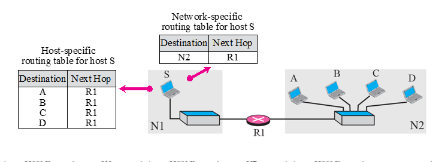
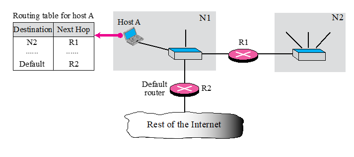

# Chapter 6. Delivery and Forwarding of IP Packets

+ IP 고유의 기능(Delivery & Forwarding) 에 대한 내용이 나온다.
+ 어떤 원칙으로 Router들은 Delivery를 하고, Routing Table을 어떻게 관리하는지 나온다.

### Delivery

+ Direct Delivery
  - A 가 B로 바로 보내는 것.(router 경유 안하고) 
  - ex : LAN 안에서 통신할 때, router 안 거쳐도 된다. 

+ Indirect Delivery 
  - 반드시 Router를 경유해서 보내는 것. 
  - "간접적" Delivery.
  - ex : 보내려고 하는 것이 router 바깥에 있으면, router 를 경유할 수 밖에 없다. 

### Forwarding(전달)

+ next hop 으로 전달하는 것.
+ hop : 출발지와 도착지 사이에 있는 network 장비를 총칭.
+ 3가지 원칙이 존재한다
+ Routing Table entry를 어떻게 꾸미는지에 관한 내용이다. 

+ 1번째 원칙 : Next Hop Method (Next Hop Routing)
  - A에서 B로 보내려고 하는데 router가 두개 존재한다. 
  - 위의 각 Routing Table에서는, 가야 할 Route가 다 적혀 있는데 반해, 아래의 Routing Table 에서는 그냥 다음 가야할 Hop만 적혀 있다. 
  - 아래의 Routing Table 대로 적는 것이 좋다! 만약에 중간에 거쳐가야 할 Hop이 10개라면, 10개 다 적어버리면 메모리의 낭비가 발생할 것이다. 
  - 다음 Hop 정보만 들고 있으면, table size가 확 줄어들 것이다.
  - 그냥 다른거 다 필요 없고, 다음 Hop 정보만 갖고 있자! Full route는 필요 없다!
  
  
  
+ 2번째 원칙 : Network-Specific Method
  - 보내려고 하는 도착지 A,B,C,D가 다 같은 LAN에 존재한다. 
  - Host Address를 다 쓰지 말고, Network 단위로 관리하면 한방에 쓸 수 있을 것이다. 
  - 위의 사례의 경우, 그냥 N2라는 Network이 있으면, 다 R1으로 보내라고 하면 된다.
  - 그다음 것은, N2가 고민할 문제로 바꿔버리면 되는 것이다.
  - Routing Table의 Entry에는, Host Level 로 하지말고 Network Level로만 관리해 쓰자!
  
+ Host Specific Routing(Optional)
  - 가끔씩 Host-Specific 하게 Routing 하기도 한다. 
  - 특정 DNS가 있는, 특정 서버에 보내는 경우가 이에 해당한다. 
  - Network 레벨이 아닌, 매우 중요한 Host 특징이 있을 때는 Optional 하게 사용하는 것이다. 
  - 그래도 기본적으로는 Network-Specific 한 방법대로 간다!
  
   
  
+ 3번째 원칙 : Default Routing  
  - Default : 나머지
  - 위의 그림에서 Host A Table에서, N2로 가는 애는 R1으로 가면 된다. 
  - 나머지 필요한 것들 다 쓰고, 여기 없는 경우, 모두 Default Router(Default Gateway 라고도 부름)인 R2로 보내라고 쓰면 된다. 
  - 그냥 여기 적혀 있는 애들은 다 알겠고, 나머지는 Default Router(Gateway) 가 알아서 하라고 던지는 격.
  - 이렇게 하면, 해당 컴퓨터에 있는 routing table의 Entry 갯수가 확 줄어들 수 있다. 
    - 기본을 다 Default Gateway에 보내고, LAN으로 묶여 있는 애들만 특징지어서 Routing Table 안에 적어 주면 된다. 
    - ex) 단대에 있는 애들은, 그 안에 LAN으로 같이 묶여 있는 애들의 entry만 갖고 있으면 되고, 다 나머지는 경북대 router(default router)(상위 router, 큰 router) 로 떠넘기면 된다.
  - 이렇게 하면, entry가 당연히 팍팍 줄게 된다. 
  
+ 이렇게 하면 전반적인 router table 이 확 줄어들 수 밖에 없다. 
+ router table을 줄이는 이유
  - 계속 router가 lookup을 해야 한다!
  - entry가 줄어들면, lookup 하는데 걸리는 시간이 당연히 확 줄어든다. 그러면 delay도 당연히 줄어들 것이다.
